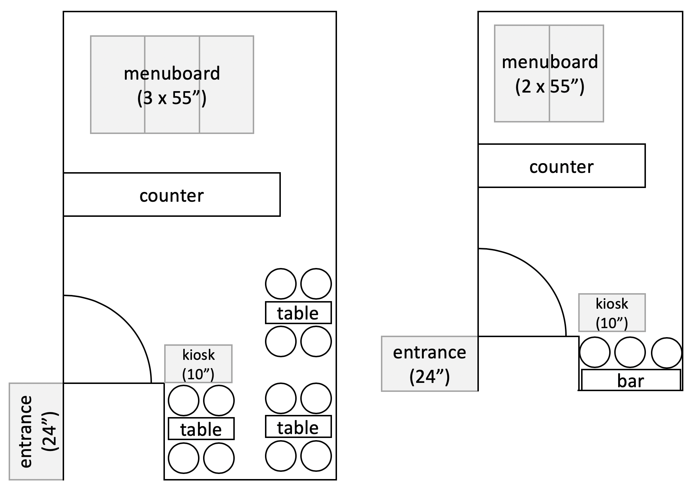
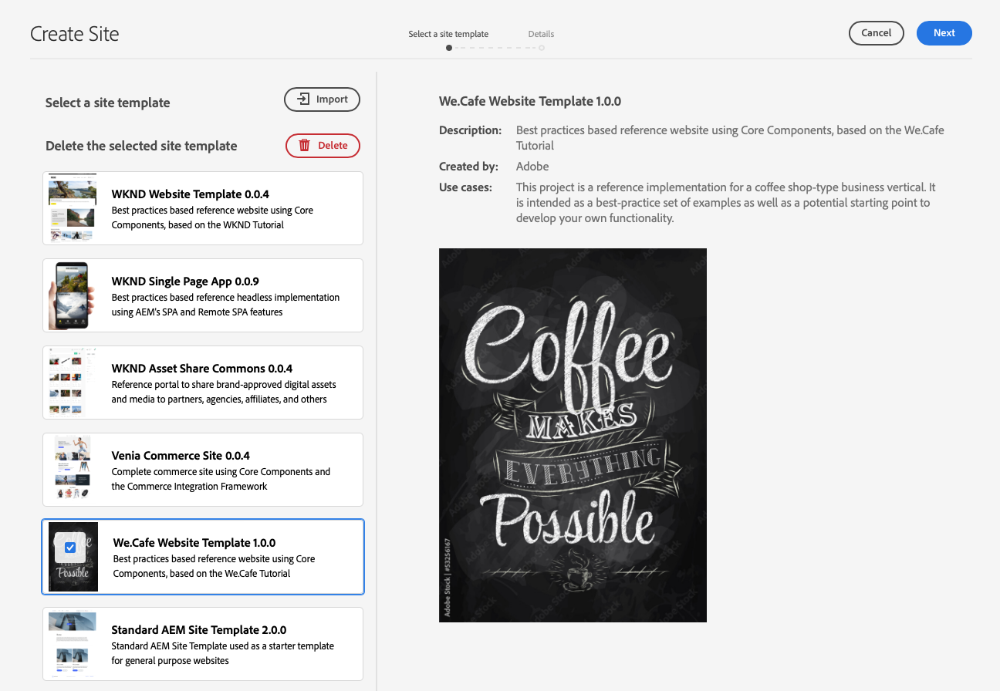
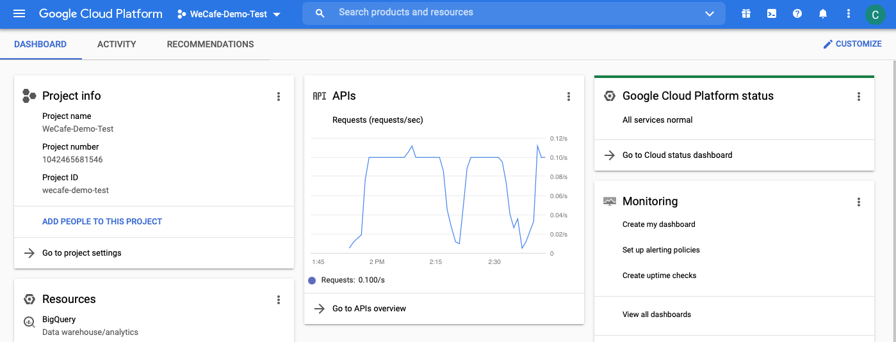
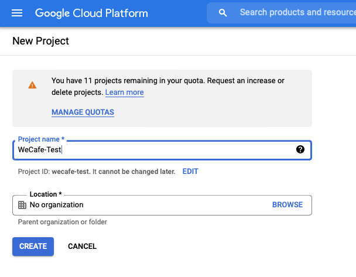
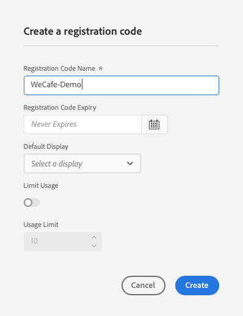
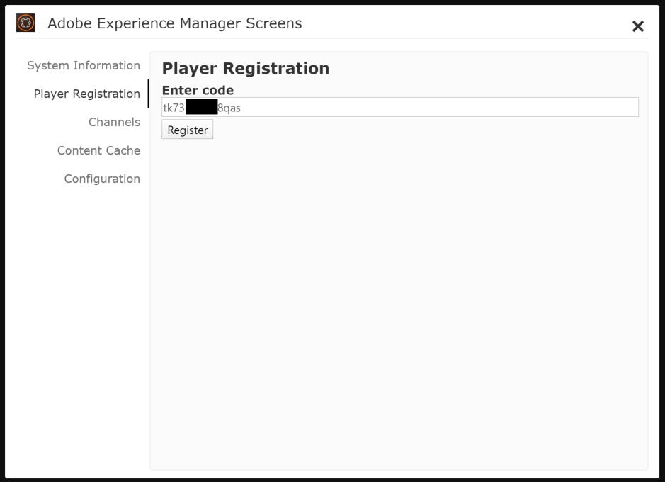

# Aktivera AEM Screens för din demowebbplats {#enable-screens}

Lär dig hur du aktiverar den fullständiga as a Cloud Service AEM Screens-upplevelsen på din demowebbplats.

>[!NOTE]
>
>AEM Screens Demo kräver att skärmtillägget läggs till i Cloud Manager-programmet. Lär dig [här](https://experienceleague.adobe.com/docs/experience-manager-cloud-service/content/screens-as-cloud-service/onboarding-screens-cloud/adding-screens-addon/add-on-new-program-screens-cloud.html) hur du lägger till det.

## Story hittills {#story-so-far}

I det föregående dokumentet om AEM Reference Demos Add-On-resan, [Skapa demowebbplats,](create-site.md) du har skapat en ny demowebbplats baserad på mallarna för tillägget Referensdemo. Nu bör du:

* Lär dig hur du kommer åt AEM.
* Lär dig hur du skapar en webbplats baserad på en mall.
* Förstå grunderna för navigering i webbplatsstrukturen och redigering av en sida.

Nu när du har en egen demosajt där du kan utforska och förstå vilka verktyg som finns för att hantera dina demosajter kan du nu aktivera den fullständiga as a Cloud Service AEM Screens-upplevelsen för dina demosajter.

## Syfte {#objective}

Tillägget AEM Reference Demos innehåller AEM Screens-innehåll för We.Cafe, ett kaféföretag. Det här dokumentet hjälper dig att förstå hur du kör demokonfigurationen We.Cafe i AEM Screens. När du har läst bör du:

* Lär dig grunderna i AEM Screens.
* Förstå demoinnehållet för We.Cafe.
* Lär dig hur du konfigurerar AEM Screens för We.Cafe.
   * Lär dig skapa ett skärmsprojekt för We.Cafe.
   * Kan konfigurera en simulerad vädertjänst med Google Sheets och API:er.
   * Simulera dynamiskt föränderligt skärminnehåll baserat på din&quot;vädertjänst&quot;.
   * Installera och använd skärmspelaren.

## Skärmar {#understand-screens}

AEM Screens as a Cloud Service är en digital signeringslösning som gör att marknadsförare kan skapa och hantera dynamiska digitala upplevelser i stor skala. Med AEM Screens as a Cloud Service kan ni skapa engagerande och dynamiska digitala signeringsupplevelser som ska användas på offentliga platser.

>[!TIP]
>
>Mer information om AEM Screens as a Cloud Service finns i [Ytterligare resurser](#additional-resources) i slutet av det här dokumentet.

Genom att installera tillägget AEM referensdemonstrationer får du automatiskt tillgång till Web.Cafe-innehåll för AEM Screens i din demoredigeringsmiljö. Stegen som beskrivs i [Distribuera ett projekt för demonstrationsskärmar](#deploy-project) gör att du kan ge AEM Screens en komplett upplevelse genom att publicera materialet och distribuera det till mediespelare osv.

## Förstå demoinnehållet {#demo-content}

Kaféet We.Cafe består av tre butiker på tre platser i USA. Alla tre butikerna har tre liknande upplevelser:

* Ett menybord ovanför räknaren med två eller tre vertikala paneler
* En entréskärm med en horisontell eller vertikal panel som bjuder in kunder till butiken
* En snabb självbeställande kiosk-buske för att kringgå kön med en vertikal surfplatta

>[!NOTE]
>
>Det är bara entréskärmen som kan testas i den aktuella versionen av demonstrationen. Andra bildskärmar följer i en framtida version.
>
>Kiosken ingår inte i den aktuella versionen av demon. Den kommer att ingå i en framtida version.

New-York-platsen antas befinna sig i en mindre butik som inte har mycket utrymme, och som sådan:

* Menypanelen har bara två vertikala paneler i stället för tre för San Francisco och San Jose
* Ingångsvyn placeras lodrätt i stället för vågrätt

>[!NOTE]
>
>Om du bestämmer dig för att ansluta till Cloud Servicen Skärmar i dialogrutan [Anslut skärmar as a Cloud Service](#connect-screens) skapar du platserna som mappar under skärmar. Se [Ytterligare resurser](#additional-resources) i slutet av det här dokumentet om du vill ha mer information om hur det visas.

### Cafélayouter {#care-layouts}

Platserna We.Cafe har följande layouter.



>[!NOTE]
>
>Mätningarna för skärmarna är i tum.

### Ingång {#entrance}

Ingången är uppdelad på dagen och den första bilden ändras från morgon till eftermiddag. På varje omgång i sekvensen annonserar den också en särskild kaffepreparation med hjälp av en inbäddad sekvens med datapriser för att spela upp olika objekt varje gång.

Den sista bilden på ingångskanalerna är också riktad (dvs. dynamiskt ändrad) baserat på den yttre temperaturen, som kan simuleras enligt beskrivningen i [Skapa simulerad datakälla](#data-source) -avsnitt.

## Distribuera ett projekt för demonstrationsskärmar {#deploy-project}

Så här använder du demoinnehåll i sandlådan som du skapade i [Skapa program](create-program.md) måste en plats skapas baserat på en mall.

Om du inte redan har skapat en demowebbplats för We.Cafe följer du bara samma steg som i [Skapa demowebbplats](create-site.md) -avsnitt. När du väljer en mall väljer du bara **Webbplatsmall för We.Cafe**.



När guiden är klar hittar du innehållet som är distribuerat under Webbplatser och du kan navigera och utforska precis som annat innehåll.


Nu när du har demoinnehåll från We.Cafe kan du välja hur du vill testa AEM Screens:

* Om du bara vill utforska innehållet i AEM Sites Console kan du börja utforska och upptäcka mer i [Ytterligare resurser](#additional-resources) sektion! ingen mer åtgärd krävs.
* Om du vill använda alla dynamiska funktioner i AEM Screens fortsätter du till nästa avsnitt, [Ändra skärminnehåll dynamiskt.](#dynamically-change)

## Ändra skärminnehåll dynamiskt {#dynamically-change}

På samma sätt som AEM Sites kan AEM Screens ändra innehåll dynamiskt baserat på sammanhang. Demon We.Cafe har kanaler som är konfigurerade att visa olika innehåll beroende på aktuell temperatur. För att simulera detta måste vi skapa en egen enkel vädertjänst.

### Skapa simulerad datakälla {#data-source}

Eftersom det är mycket svårt att ändra vädret under en demonstration eller under testningen måste temperaturförändringarna simuleras. Vi simulerar en vädertjänst genom att lagra ett temperaturvärde i ett Google Sheet-kalkylblad som AEM ContextHub anropar för att hämta temperaturen.

#### Skapa Google API-nyckel {#create-api-key}

Först måste vi skapa en Google API-nyckel för att underlätta datautbyte.

1. Logga in på ett Google-konto.
1. Öppna molnkonsolen med den här länken `https://console.cloud.google.com`.
1. Skapa ett nytt projekt genom att klicka på det aktuella projektnamnet längst upp till vänster i verktygsfältet efter **Google Cloud Platform** label.

   

1. Klicka på **NYTT PROJEKT**.

   

1. Ge projektet ett namn och klicka på **SKAPA**.

   

1. Kontrollera att ditt nya projekt är markerat och välj sedan hamburger-menyn på kontrollpanelen i molnkonsolen **API:er och tjänster**.

   

1. Klicka på i den vänstra panelen i fönstret API:er och tjänster **Autentiseringsuppgifter** längst upp i fönstret och klicka sedan på **SKAPA AUTENTISERINGSUPPGIFTER** och **API-nyckel**.

   

1. I dialogrutan kopierar du den nya API-nyckeln och sparar den för senare bruk. Klicka **STÄNG** för att stänga dialogrutan.

#### Aktivera Google Sheets API {#enable-sheets}

Om du vill tillåta utbyte av Google Sheets-data med API-nyckeln måste du aktivera Google Sheets API.

1. Återgå till Google Cloud Console på `https://console.cloud.google.com` för ditt projekt och använd sedan hamburger-menyn för att välja **API:er och tjänster -> Bibliotek**.

   

1. Bläddra till API-biblioteksskärmen för att hitta vår sökning efter **Google Sheets API**. Klicka på den.

   

1. I **Google Sheets API** fönsterklicka **AKTIVERA**.

   

#### Skapa Google-kalkylblad {#create-spreadsheet}

Nu kan du skapa ett Google-kalkylblad för att lagra dina väderdata.

1. Gå till `https://docs.google.com` och skapa ett nytt Google Sheets-kalkylblad.
1. Definiera temperaturen genom att ange `32` i cell A2.
1. Dela dokumentet genom att klicka på **Dela** längst upp till höger i fönstret och under **Hämta länk** klicka **Ändra**.

   

1. Kopiera länken till nästa steg.

   

1. Leta reda på blads-ID:t.

   * Blad-ID är den slumpmässiga teckensträngen i bladet som du kopierade efter `d/` och före `/edit`.
   * Till exempel:
      * Om URL:en är `https://docs.google.com/spreadsheets/d/1cNM7j1B52HgMdsjf8frCQrXpnypIb8NkJ98YcxqaEP30/edit#gid=0`
      * Kalkylblads-ID är `1cNM7j1B52HgMdsjf8frCQrXpnypIb8NkJ98YcxqaEP30`.

1. Kopiera kalkylblads-ID:t för framtida bruk.

#### Testa vädertjänsten {#test-weather-service}

Nu när du har skapat datakällan som ett Google-kalkylblad och aktiverat åtkomst via API testar du det för att se till att vädertjänsten är tillgänglig.

1. Öppna en webbläsare.

1. Ange följande begäran och ersätt de tabell-ID och API-nyckelvärden som du sparade tidigare.

   ```
   https://sheets.googleapis.com/v4/spreadsheets/<yourSheetID>/values/Sheet1?key=<yourAPIKey>
   ```

1. Om du tar emot JSON-data som liknar följande, konfigureras de korrekt.

   ```json
   {
     "range": "Sheet1!A1:Z1000",
     "majorDimension": "ROWS",
     "values": [
       [],
       [
         "32"
       ]
     ]
   }
   ```

AEM Screens kan använda samma tjänst för att komma åt simulerade väderdata som konfigureras i nästa steg.

### Konfigurera ContextHub {#configure-contexthub}

AEM Screens kan ändra innehåll dynamiskt baserat på sammanhang. Demon We.Cafe har kanaler som är konfigurerade att visa olika innehåll beroende på aktuell temperatur genom att utnyttja AEM ContextHub.

>[!TIP]
>
>Mer information om ContextHub finns i [Ytterligare resurser](#additional-resources) i slutet av det här dokumentet.

När skärminnehållet visas anropar ContextHub vädertjänsten för att hitta den aktuella temperaturen för att avgöra vilket innehåll som ska visas.

I demosyfte kan du ändra värdena i bladet. ContextHub känner igen detta och innehållet justeras i kanalen enligt den uppdaterade temperaturen.

1. På AEMaaCS-författarinstansen går du till **Global navigering -> Verktyg -> Webbplatser -> ContextHub**.
1. Välj den konfigurationsbehållare som har samma namn som det du gav projektet när du skapade Skärmar-projektet från **Webbplatsmall för We.Cafe**.
1. Välj **Configuration -> ContextHub Configuration -> Google Sheets** sedan klicka **Nästa** överst till höger.
1. Konfigurationen bör redan ha förkonfigurerade JSON-data. Det finns två värden som behöver ändras:
   1. Ersätt `[your Google Sheets id]` med kalkylblads-ID [du har sparat tidigare.](#create-spreadsheet)
   1. Ersätt `[your Google API Key]` med API-nyckeln [du har sparat tidigare.](#create-api-key)
1. Klicka **Spara**.

Nu kan du ändra temperaturvärdet i Google Sheet-kalkylbladet så uppdaterar ContextHub skärmarna dynamiskt när det ser väderändringen.

### Testa dynamiska data {#test-dynamic}

Nu när AEM Screens och ContextHub är anslutna till din vädertjänst kan du testa den för att se hur skärmar kan uppdatera innehåll dynamiskt.

1. Få åtkomst till din författarinstans för sandlådan.
1. Navigera till webbplatskonsolen via **Global navigering -> Webbplatser** och välj följande sida **Skärmar -> &lt;project-name> -> Kanaler -> Ingångsmorgon (stående)**.

   

1. Klicka på Redigera i verktygsfältet eller skriv kortkommandot `e` för att redigera sidan.

1. I redigeraren kan du se innehållet. Observera att en bild är i blått med en målikon i hörnet.

   

1. Ändra temperaturen i kalkylbladet från 32 till 70 och se hur innehållet ändras.

   

Den aktuella bilden har ändrats från en varmt kopp te till ett kallt kaffe, baserat på att temperaturen har ändrats från en fryst 32°F (0°C) till en bekväm 21°C (70°F).

>[!IMPORTANT]
>
>Använd endast den beskrivna Google Sheets-lösningen för demoändamål. Adobe stöder inte användning av Google Sheets för produktionsmiljöer.

## Anslut skärmar as a Cloud Service {#connect-screens}

Om du även vill skapa en riktig digital signeringsupplevelse, inklusive en spelare som körs på en digital signeringsenhet eller på datorn, följer du de här stegen.

Du kan också förhandsgranska demon i kanalredigeraren i AEMaaCS.

>[!TIP]
>
>Mer information om kanalredigeraren finns i [Ytterligare resurser](#additional-resources) i slutet av det här dokumentet.

### Konfigurera AEM Screens as a Cloud Service {#configure-screens}

Först måste du publicera ditt demoinnehåll för skärmar på AEM Screens as a Cloud Service och konfigurera tjänsten.

1. Publicera innehållet i ditt demoskärmsprojekt.
1. Navigera till as a Cloud Service skärmar på `https://experience.adobe.com/screens` och logga in.
1. Kontrollera att du är i rätt ordning i skärmens övre högra hörn.

   

1. Längst upp till vänster klickar du på **Redigera inställningar** -ikonen, formad som ett kugghjul.

   

1. Ange URL:erna till AEMaaCS-författaren och publicera de förekomster där du skapade demowebbplatsen och klicka på **Spara**.

   

1. När du väl är ansluten till dina demoinstanser kommer skärmar att dra in kanalinnehållet. Klicka på **Kanaler** i den vänstra panelen för att se de publicerade kanalerna. Det kan ta en stund innan informationen har fyllts i. Du kan klicka på den blå **Synkronisera** längst upp till höger på skärmen för att uppdatera informationen.

   

1. Klicka på **Visar** i den vänstra panelen. Du har ännu inte skapat något för din demo. Vi simulerar platsen för We.Cafe genom att skapa mappar för varje. Klicka på **Skapa** längst upp till höger på skärmen och välj **Mapp**.

   

1. Ange ett mappnamn, till exempel **San Jose** och klicka **Skapa**.

1. Öppna mappen genom att klicka på den och sedan på **Skapa** längst upp till höger och välj **Visa**.

1. Ange ett visningsnamn och klicka på **Skapa**.

   

1. När visningen har skapats klickar du på visningsnamnet för att öppna skärmen med visningsinformation. Visningen måste tilldelas en kanal som har synkroniserats från din demowebbplats. Klicka på **Tilldela kanal** längst upp till höger på skärmen.

   

1. Markera kanalen i dialogrutan och klicka på **Tilldela**.

   

Du kan upprepa de här stegen för ytterligare platser och visningar. När du är klar har du länkat din demowebbplats till AEM Screens och slutfört den nödvändiga konfigurationen.

Du kan enkelt förhandsgranska filmen i kanalredigeraren i AEMaaCS.

### Använda skärmuppspelaren {#screens-player}

Om du vill visa innehållet som på en riktig skärm kan du hämta spelaren och konfigurera den lokalt. AEM Screens as a Cloud Service levererar sedan materialet till spelaren

#### Generera en registreringskod {#registration-code}

Först måste du skapa en registreringskod för att säkert ansluta en spelare till AEM Screens as a Cloud Service.

1. Navigera till as a Cloud Service skärmar på `https://experience.adobe.com/screens` och logga in.
1. Kontrollera att du är i rätt ordning i skärmens övre högra hörn.

   

1. Klicka på **Spelarhantering -> Registreringskoder** och sedan klicka **Skapa kod** längst upp till höger på skärmen.


1. Ange ett namn för koden och klicka på **Skapa**.

   

1. När koden har skapats visas den i listan. Klicka för att kopiera koden.

   

#### Installera och konfigurera spelare {#install-player}

1. Hämta spelaren för din plattform från `https://download.macromedia.com/screens/` och installera det.
1. Kör spelaren och växla till **Konfiguration** bläddra längst ned för att klicka och bekräfta båda **Återställ till fabrik** och sedan **Ändra till molnläge**.

   

1. Spelaren ändras automatiskt till **Spelarregistrering** -fliken. Ange koden som du skapade tidigare och klicka på **Registrera**.

   

1. Växla till **Systeminformation** för att bekräfta att spelaren har registrerats.

   

#### Tilldela spelare till en bildskärm {#assign-player}

1. Navigera till as a Cloud Service skärmar på `https://experience.adobe.com/screens` och logga in.
1. Kontrollera att du är i rätt ordning i skärmens övre högra hörn.

   

1. Klicka på **Spelarhantering -> Spelare** och du ser den spelare som du har installerat och registrerat tidigare.

   

1. Klicka på spelarnamnet för att öppna informationen och klicka sedan på **Tilldela för visning** i skärmens övre högra hörn.

   

1. I dialogrutan väljer du den visning som du skapade tidigare och klickar sedan på **Välj**.

   

#### Uppspelning! {#playback}

När du har tilldelat en skärm till en spelare skickar AEM Screens as a Cloud Service innehållet till spelaren där det är synligt.


## What&#39;s Next {#what-is-next}

Nu när du har slutfört den här delen av AEM Reference Demo Add-On-resan bör du:

* Lär dig grunderna i AEM Screens.
* Förstå demoinnehållet för We.Cafe.
* Lär dig hur du konfigurerar AEM Screens för We.Cafe.

Nu är du redo att utforska möjligheterna i AEM Screens med dina egna demosajter. Fortsätt till nästa avsnitt av resan, [Hantera dina demosajter,](manage.md) där du får lära dig mer om de verktyg som finns för att hantera dina demowebbplatser och hur du tar bort dem.

Du kan även ta en titt på några av de tillgängliga resurserna i [Avsnittet Ytterligare resurser](#additional-resources) om du vill veta mer om de funktioner du såg under den här resan.

## Ytterligare resurser {#additional-resources}

* [ContextHub-dokumentation](/help/sites-cloud/authoring/personalization/contexthub.md) - Lär dig hur ContextHub kan användas för att anpassa innehåll baserat på användarsammanhang utöver väderförhållanden.
* [Använda API-nycklar - Google-dokumentation](https://developers.google.com/maps/documentation/javascript/get-api-key) - En praktisk referens om hur du använder Google API-nycklar.
* [Visar](/help/screens-cloud/creating-content/creating-displays-screens-cloud.md) - Läs mer om vad en skärm är i AEM Screens och vad den kan göra.
* [Ladda ned Player](/help/screens-cloud/managing-players-registration/installing-screens-cloud-player.md) - Lär dig hur du kommer åt skärmspelaren och hur du installerar.
* [Registrera spelare](/help/screens-cloud/managing-players-registration/registering-players-screens-cloud.md) - Lär dig hur du konfigurerar och registrerar en spelare i ditt AEM Screens-projekt.
* [Tilldela spelare till en bildskärm](/help/screens-cloud/managing-players-registration/assigning-player-display.md) - Konfigurera en spelare för att visa ditt innehåll.
