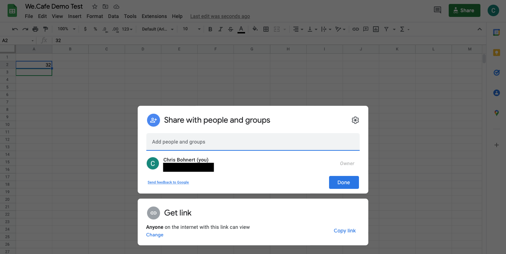
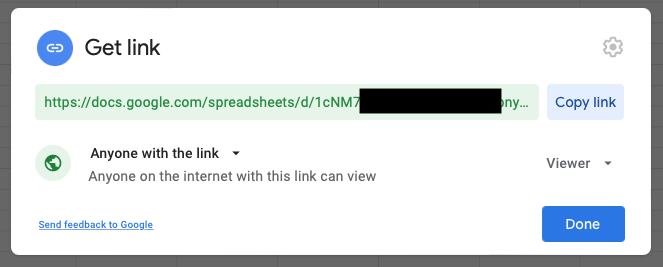

# Aktivera AEM Screens för din demowebbplats {#enable-screens}

Lär dig de steg som möjliggör AEM Screens fullständiga as a Cloud Service upplevelse på din demosajt.

>[!NOTE]
>
>AEM Screens Demo kräver att Screens Add-on läggs till i Cloud Manager Program. Lär dig hur du lägger till Screens som ett tillägg till ett nytt program i Cloud Manager[&#128279;](/help/screens-cloud/onboarding-screens-cloud/add-on-new-program-screens-cloud.md) med Lägga till det.

## Story hittills {#story-so-far}

I det föregående dokumentet för AEM Reference Demos Add-on, [Create Demo Site](create-site.md), skapade du en demowebbplats baserat på mallarna för Reference Demo Add-on. Nu bör du:

* Lär dig hur du kommer åt AEM.
* Lär dig hur du skapar en webbplats baserad på en mall.
* Förstå grunderna för navigering i webbplatsstrukturen och redigering av en sida.

Nu när du har en egen demosajt att utforska och förstår verktygen som hjälper dig att hantera dina demosajter kan du aktivera AEM Screens as a Cloud Service upplevelse för dina demosajter.

## Syfte {#objective}

Tillägget AEM Reference Demos innehåller AEM Screens-innehåll för We.Cafe, ett kaféföretag. Det här dokumentet hjälper dig att förstå hur du kör demokonfigurationen We.Cafe i AEM Screens. När du har läst bör du:

* Lär dig grunderna i AEM Screens.
* Förstå demoinnehållet för We.Cafe.
* Lär dig konfigurera AEM Screens för We.Cafe.
   * Lär dig skapa ett Screens-projekt för We.Cafe.
   * Kan konfigurera en simulerad vädertjänst med Google Sheets och API:er.
   * Simulera dynamiskt föränderligt Screens-innehåll baserat på din&quot;vädertjänst&quot;.
   * Installera och använd skärmspelaren.

## Förstå Screens {#understand-screens}

AEM Screens as a Cloud Service är en digital signeringslösning som gör att marknadsförare kan skapa och hantera dynamiska digitala upplevelser i stor skala. Med AEM Screens as a Cloud Service kan ni skapa engagerande och dynamiska digitala signeringsupplevelser som ska användas på offentliga platser.

>[!TIP]
>
>Mer information om AEM Screens as a Cloud Service finns i avsnittet [Ytterligare resurser](#additional-resources) i slutet av det här dokumentet.

Genom att installera tillägget AEM Reference Demos får du automatiskt tillgång till Web.Cafe-innehåll för AEM Screens i din demoredigeringsmiljö. Med stegen som beskrivs i [Distribuera ett Screens-projekt för demo](#deploy-project) kan du aktivera hela AEM Screens genom att publicera det innehållet och distribuera det till mediespelare, och så vidare.

## Förstå demoinnehållet {#demo-content}

Kaféet We.Cafe består av tre butiker på tre platser i USA. Alla tre butikerna har tre liknande upplevelser:

* Ett menybord ovanför räknaren med två eller tre vertikala paneler
* En entréskärm med en horisontell eller vertikal panel som bjuder in kunder till butiken
* En snabb självbeställande kiosk-buske för att kringgå kön med en vertikal surfplatta

>[!NOTE]
>
>Det är bara entréskärmen som kan testas i den aktuella versionen av demonstrationen. Andra bildskärmar följer i en framtida version.
>
>Kiosken ingår inte i den aktuella versionen av demon. Den kommer att ingå i en framtida version.

Platsen New York antas befinna sig i en mindre butik som inte har så mycket utrymme, och som sådan:

* Menypanelen har bara två vertikala paneler i stället för tre för San Francisco och San Jose
* Ingångsvyn placeras lodrätt i stället för vågrätt

>[!NOTE]
>
>Om du bestämmer dig för att ansluta till Screens-Cloud Service i avsnittet [Anslut till Screens as a Cloud Service](#connect-screens) skapar du platserna som mappar under visas. Mer information om hur du visar finns i avsnittet [Ytterligare resurser](#additional-resources) i slutet av det här dokumentet.

### Cafélayouter {#care-layouts}

Platserna We.Cafe har följande layouter.


>[!NOTE]
>
>Mätningarna för skärmarna är i tum.

### Ingång {#entrance}

Ingångspresentationen är dagsdelad och ändrar bara den första bilden från morgon till eftermiddag. På varje omgång i sekvensen annonserar den även olika kaffepreparationer med hjälp av en inbäddad sekvens med datapriser för att spela upp olika objekt varje gång.

Den sista bilden i ingångskanalerna är också riktad (d.v.s. dynamiskt ändrad) baserat på den yttre temperaturen, som kan simuleras enligt beskrivningen i avsnittet [Skapa simulerade data Source](#data-source) .

## Distribuera ett Screens-projekt för demo {#deploy-project}

Om du vill använda demoinnehållet i sandlådan som du skapade i steget [Skapa program](create-program.md) måste en webbplats skapas baserat på en mall.

Om du inte redan har skapat en demowebbplats för We.Cafe följer du bara samma steg som i avsnittet [Skapa demowebbplats](create-site.md). När du väljer mallen väljer du bara webbplatsmallen **We.Cafe**.


När guiden har slutförts hittar du innehållet som har distribuerats under Webbplatser och du kan navigera och utforska precis som annat innehåll.


Nu när du har demoinnehåll från We.Cafe kan du välja hur du vill testa AEM Screens:

* Om du bara vill utforska innehållet i AEM Sites-konsolen kan du börja utforska och upptäcka mer i avsnittet [Ytterligare resurser](#additional-resources) - ingen mer åtgärd krävs.
* Om du vill använda de fullständiga dynamiska funktionerna i AEM Screens fortsätter du till nästa avsnitt, [Ändra Screens-innehåll dynamiskt](#dynamically-change).

## Ändra Screens-innehåll dynamiskt {#dynamically-change}

På samma sätt som AEM Sites kan AEM Screens ändra innehåll dynamiskt baserat på sammanhang. Demon We.Cafe har kanaler som är konfigurerade att visa olika innehåll beroende på aktuell temperatur. Om du vill simulera den här upplevelsen måste du skapa en egen enkel vädertjänst.

### Skapa simulerade data i Source {#data-source}

Eftersom det är svårt att ändra vädret under en demonstration eller under testningen måste temperaturförändringarna simuleras. En vädertjänst simuleras genom att ett temperaturvärde lagras i ett Google Sheet-kalkylblad som AEM ContextHub anropar för att hämta temperaturen.

#### Skapa Google API-nyckel {#create-api-key}

Först måste du skapa en Google API-nyckel för att underlätta datautbyte.

1. Logga in på ett Google-konto.
1. Öppna molnkonsolen med den här länken `https://console.cloud.google.com`.
1. Skapa ett projekt genom att klicka på det aktuella projektnamnet högst upp till vänster i verktygsfältet efter etiketten **Google Cloud Platform** .

   

1. Klicka på **NYTT PROJEKT** i projektväljardialogrutan.

   

1. Ge projektet ett namn och klicka på **SKAPA**.

   

1. Kontrollera att ditt nya projekt är markerat och välj sedan **API:er och tjänster** på hamburgermenyn på kontrollpanelen i molnkonsolen.

   

1. Klicka på **Autentiseringsuppgifter** längst upp i fönstret i den vänstra panelen i fönstret och klicka sedan på **SKAPA AUTENTISERINGSUPPGIFTER** och **API-nyckel**.

   

1. Kopiera den nya API-nyckeln i dialogrutan och spara den för senare bruk. Klicka på **STÄNG** så att du kan stänga dialogrutan.

#### Aktivera Google Sheets API {#enable-sheets}

Om du vill tillåta utbyte av Google Sheets-data med API-nyckeln måste du aktivera Google Sheets API.

1. Gå tillbaka till Google Cloud Console på `https://console.cloud.google.com` för ditt projekt och använd sedan hamburger-menyn för att välja **API:er och tjänster > Bibliotek**.

   

1. Bläddra till API-biblioteksskärmen för att hitta din sökning efter **Google Sheets API** och klicka sedan på den.

   

1. Klicka på **AKTIVERA** i fönstret **Google Sheets API**.

   

#### Skapa Google-kalkylblad {#create-spreadsheet}

Nu kan du skapa ett Google-kalkylblad för att lagra dina väderdata.

1. Gå till `https://docs.google.com` och skapa ett Google-kalkylblad.
1. Definiera temperaturen genom att ange `32` i cell A2.
1. Dela dokumentet genom att klicka på **Dela** längst upp till höger i fönstret och under **Hämta länk** klickar du på **Ändra**.

   

1. Kopiera länken till nästa steg.

   

1. Leta reda på blads-ID:t.

   * Kalkylblads-ID är den slumpmässiga teckensträngen i bladlänken som du kopierade efter `d/` och före `/edit`.
   * Till exempel:
      * Om din URL är `https://docs.google.com/spreadsheets/d/1cNM7j1B52HgMdsjf8frCQrXpnypIb8NkJ98YcxqaEP30/edit#gid=0`
      * Kalkylblads-ID är `1cNM7j1B52HgMdsjf8frCQrXpnypIb8NkJ98YcxqaEP30`.

1. Kopiera kalkylblads-ID:t för framtida bruk.

#### Testa vädertjänsten {#test-weather-service}

Nu när du har skapat datakällan som ett Google-kalkylblad och aktiverat åtkomst via API testar du det för att se till att vädertjänsten är tillgänglig.

1. Öppna en webbläsare.

1. Ange följande begäran och ersätt de tabell-ID och API-nyckelvärden som du sparade tidigare.

   ```
   https://sheets.googleapis.com/v4/spreadsheets/<yourSheetID>/values/Sheet1?key=<yourAPIKey>
   ```

1. Om du tar emot JSON-data som liknar följande, konfigureras de korrekt.

   ```json
   {
     "range": "Sheet1!A1:Z1000",
     "majorDimension": "ROWS",
     "values": [
       [],
       [
         "32"
       ]
     ]
   }
   ```

AEM Screens kan använda samma tjänst för att komma åt simulerade väderdata som konfigureras i nästa steg.

### Konfigurera ContextHub {#configure-contexthub}

AEM Screens kan ändra innehåll dynamiskt baserat på sammanhang. Demon We.Cafe har kanaler konfigurerade att visa olika innehåll beroende på aktuell temperatur genom att använda AEM ContextHub.

>[!TIP]
>
>Mer information om ContextHub finns i avsnittet [Ytterligare resurser](#additional-resources) i slutet av det här dokumentet.

När skärminnehållet visas anropar ContextHub vädertjänsten för att hitta den aktuella temperaturen för att avgöra vilket innehåll som ska visas.

I demosyfte kan du ändra värdena i bladet. ContextHub känner igen detta och innehållet justeras i kanalen enligt den uppdaterade temperaturen.

1. Gå till **Global Navigation > Tools > Sites > ContextHub** på AEMaaCS-författarinstansen.
1. Välj den konfigurationsbehållare som har samma namn som det du gav projektet när du skapade Screens-projektet från webbplatsmallen **We.Cafe**.
1. Välj **Configuration > ContextHub Configuration > Google Sheets** och klicka sedan på **Next** överst till höger.
1. Konfigurationen bör redan ha förkonfigurerade JSON-data. Det finns två värden som måste ändras:
   1. Ersätt `[your Google Sheets id]` med det blad-ID som [du sparade tidigare](#create-spreadsheet).
   1. Ersätt `[your Google API Key]` med API-nyckeln som [du sparade tidigare](#create-api-key).
1. Klicka på **Spara**.

Nu kan du ändra temperaturvärdet i Google Sheet-kalkylbladet och ContextHub uppdaterar Screens dynamiskt när det&quot;ser väderändringen&quot;.

### Testa dynamiska data {#test-dynamic}

Nu när AEM Screens och ContextHub är anslutna till din vädertjänst kan du testa den för att se hur skärmar kan uppdatera innehåll dynamiskt.

1. Få åtkomst till din författarinstans för sandlådan.
1. Navigera till webbplatskonsolen via **Global navigering > Platser** och välj följande sida **Screens > &lt;projektnamn> > Kanaler > Introduktionsmorgen (stående)**.

   

1. Klicka på **Redigera** i verktygsfältet eller skriv kortkommandot `e` så att du kan redigera sidan.

1. I redigeraren kan du se innehållet. En bild markeras i blått med en målikon i hörnet.

   

1. Ändra temperaturen som du angett i kalkylbladet från 32 till 70 och se hur innehållet ändras.

   

Den aktuella bilden har ändrats från en varmt kopp te till ett kallt kaffe, baserat på att temperaturen har ändrats från en fryst 32°F (0°C) till en bekväm 21°C (70°F).

>[!IMPORTANT]
>
>Använd endast den beskrivna Google Sheets-lösningen för demoändamål. Adobe stöder inte användning av Google Sheets för produktionsmiljöer.

## Connect Screens as a Cloud Service {#connect-screens}

Om du även vill skapa en riktig digital signeringsupplevelse, inklusive en spelare som körs på en digital signeringsenhet eller på datorn, följer du de här stegen.

Du kan också förhandsgranska demon i kanalredigeraren i AEMaaCS.

>[!TIP]
>
>Mer information om kanalredigeraren finns i avsnittet [Ytterligare resurser](#additional-resources) i slutet av det här dokumentet.

### Konfigurera AEM Screens as a Cloud Service {#configure-screens}

Först måste du publicera ditt Screens-demoinnehåll på AEM Screens as a Cloud Service och konfigurera tjänsten.

1. Publish innehållet i ditt demoskärmsprojekt.
1. Navigera till Screens as a Cloud Service `https://experience.adobe.com/screens` och logga in.
1. Kontrollera att du är i rätt ordning i skärmens övre högra hörn.

   

1. I närheten av det övre vänstra hörnet klickar du på ikonen **Redigera inställningar** , formad som ett kugghjul.

   

1. Ange URL:erna till AEMaaCS-författaren och publicera de förekomster där du skapade demowebbplatsen och klicka på **Spara**.

   

1. När Screens väl är uppkopplat till dina demoförekomster hämtas kanalinnehållet. Klicka på **Kanaler** i den vänstra panelen så att du kan se dina publicerade kanaler. Det kan ta en stund innan informationen har fyllts i. Du kan klicka på den blå knappen **Synkronisera** längst upp till höger på skärmen för att uppdatera informationen.

   

1. Klicka på **Visar** i den vänstra panelen. Du har ännu inte skapat något för din demo. Du kan simulera platsen för We.Cafe genom att skapa mappar för varje. Klicka på **Skapa** längst upp till höger på skärmen och välj **Mapp**.

   

1. Ange ett mappnamn, till exempel **San Jose**, i dialogrutan och klicka på **Skapa**.

1. Öppna mappen genom att klicka på den och klicka sedan på **Skapa** längst upp till höger och välj **Visa**.

1. Ange ett visningsnamn och klicka på **Skapa**.

   

1. När visningen har skapats klickar du på visningsnamnet för att öppna skärmen med visningsinformation. Visningen måste tilldelas en kanal som har synkroniserats från din demowebbplats. Klicka på **Tilldela kanal** längst upp till höger på skärmen.

   

1. Markera kanalen i dialogrutan och klicka på **Tilldela**.

   

Du kan upprepa de här stegen för ytterligare platser och visningar. När du är klar har du länkat din demowebbplats till AEM Screens och slutfört den nödvändiga konfigurationen.

Du kan enkelt förhandsgranska filmen i kanalredigeraren i AEMaaCS.

### Använda Screens Player {#screens-player}

Om du vill visa innehållet som på en riktig skärm kan du hämta spelaren och konfigurera den lokalt. AEM Screens as a Cloud Service levererar innehållet till din spelare

#### Generera en registreringskod {#registration-code}

Först måste du skapa en registreringskod för att säkert ansluta en spelare till AEM Screens as a Cloud Service.

1. Navigera till Screens as a Cloud Service `https://experience.adobe.com/screens` och logga in.
1. Kontrollera att du är i rätt ordning i skärmens övre högra hörn.

   

1. Klicka på **Spelarhantering > Registreringskoder** i den vänstra panelen och klicka sedan på **Skapa kod** längst upp till höger på skärmen.


1. Ange ett namn för koden och klicka på **Skapa**.

   

1. När koden har skapats visas den i listan. Klicka för att kopiera koden.

   

#### Installera och konfigurera spelare {#install-player}

1. Hämta spelaren för din plattform från `https://download.macromedia.com/screens/` och installera den.
1. Kör spelaren och växla sedan till fliken **Konfiguration**.
1. Rulla längst ned och klicka sedan på och bekräfta alternativen **Återställ till fabrik** och **Ändra till molnläge**.

   

1. Spelaren ändras automatiskt till fliken **Spelarregistrering** . Ange koden som du skapade tidigare och klicka på **Registrera**.

   

1. Växla till fliken **Systeminformation** för att bekräfta att spelaren har registrerats.

   

#### Tilldela spelare till en bildskärm {#assign-player}

1. Navigera till Screens as a Cloud Service `https://experience.adobe.com/screens` och logga in.
1. Kontrollera att du är i rätt ordning i skärmens övre högra hörn.

   

1. Klicka på **Spelarhantering > Spelare** i den vänstra panelen så visas spelaren som du tidigare har installerat och registrerat.

   

1. Klicka på spelarens namn så att du kan öppna informationen om den. Klicka på **Tilldela för att visa** i skärmens övre högra hörn.

   

1. I dialogrutan markerar du den visning som du skapade tidigare och klickar sedan på **Markera**.

   

#### Uppspelning! {#playback}

När du har tilldelat en skärm till en spelare skickar AEM Screens as a Cloud Service innehållet till spelaren där det är synligt.


## What&#39;s Next {#what-is-next}

Nu när du har slutfört den här delen av AEM Reference Demo Add-on ska du:

* Lär dig grunderna i AEM Screens.
* Förstå demoinnehållet för We.Cafe.
* Lär dig konfigurera AEM Screens för We.Cafe.

Nu är du redo att utforska möjligheterna i AEM Screens med dina egna demosajter. Fortsätt till nästa avsnitt av resan, [Hantera dina demowebbplatser](manage.md), där du får lära dig mer om de verktyg som finns för att hantera dina demowebbplatser och hur du tar bort dem.

Du kan även ta en titt på några av de ytterligare resurser som är tillgängliga i avsnittet [Ytterligare resurser](#additional-resources) om du vill veta mer om de funktioner du såg under den här resan.

## Ytterligare resurser {#additional-resources}

* [ContextHub-dokumentation](/help/sites-cloud/authoring/personalization/contexthub.md) - Lär dig hur ContextHub kan användas för att anpassa innehåll baserat på användarkontext utöver väderförhållanden.
* [Använda API-nycklar - Google-dokumentation](https://developers.google.com/maps/documentation/javascript/get-api-key) - En praktisk referens för information om hur du använder Google API-nycklar.
* [Visar](/help/screens-cloud/creating-content/creating-displays-screens-cloud.md) - Läs mer om vad en skärm är i AEM Screens och vad den kan göra.
* [Ladda ned Player](/help/screens-cloud/managing-players-registration/installing-screens-cloud-player.md) - Lär dig hur du kommer åt Screens Player och hur du installerar.
* [Registrera spelare](/help/screens-cloud/managing-players-registration/registering-players-screens-cloud.md) - Lär dig hur du konfigurerar och registrerar en spelare i ditt AEM Screens-projekt.
* [Tilldela spelare till en bildskärm](/help/screens-cloud/managing-players-registration/assigning-player-display.md) - Konfigurera en spelare för att visa ditt innehåll.
