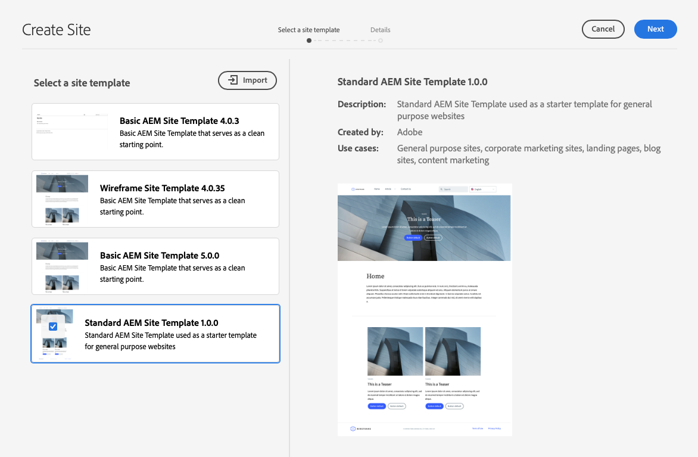

# Skapa webbplats från mall {#create-site-from-template}

{{traditional-aem}}

Lär dig hur du snabbt skapar en AEM-webbplats med hjälp av en webbplatsmall.

## Story hittills {#story-so-far}

I det föregående dokumentet på AEM-snabbwebbplatsresa [Förstå Cloud Manager och arbetsflödet för att skapa snabbwebbplatser](cloud-manager.md) fick du veta mer om Cloud Manager och hur det knyter ihop den nya processen för att skapa snabbwebbplatser. Nu bör du:

* Förstå hur AEM Sites och Cloud Manager samarbetar för att underlätta framtagningen
* Se hur anpassningssteget är helt fristående från AEM och kräver ingen AEM-kunskap.

Den här artikeln bygger på dessa grundläggande funktioner så att du kan ta det första konfigurationssteget och skapa en webbplats för en mall som du sedan kan anpassa med hjälp av verktygen i gränssnittet.

## Syfte {#objective}

Det här dokumentet hjälper dig att förstå hur du snabbt kan skapa en AEM-webbplats med hjälp av en webbplatsmall. När du har läst bör du:

* Lär dig hur du får tillgång till mallar för AEM Site.
* Lär dig hur du skapar en plats med hjälp av en mall.
* Se hur du laddar ned mallen från din nya webbplats och kan ge den till frontutvecklaren.

## Ansvarig roll {#responsible-role}

Den här delen av resan gäller AEM-administratören.

## Webbplatsmallar {#site-templates}

Webbplatsmallar är ett sätt att kombinera grundläggande webbplatsinnehåll i ett bekvämt och återanvändbart paket. Webbplatsmallar innehåller i allmänhet information om baswebbplatsinnehåll och struktur- och webbplatsformatering så att du snabbt kommer igång med den nya webbplatsen. Den faktiska strukturen är följande:

* `files`: Mapp med UI-kit, XD-fil och eventuellt andra filer
* `previews`: Mapp med skärmbilder av platsmallen
* `site`: Innehållspaket för innehållet som kopieras för varje plats som skapas från den här mallen, till exempel sidmallar, sidor och så vidare.
* `theme`: Källor till malltemat för att ändra hur webbplatsen ser ut inklusive CSS, JavaScript och så vidare.

Mallar är kraftfulla eftersom de kan återanvändas så att skribenterna snabbt kan skapa en webbplats. Och eftersom du kan ha flera mallar tillgängliga i din AEM-installation kan du tillgodose olika affärsbehov.

>[!NOTE]
>
>Webbplatsmallen ska inte blandas ihop med sidmallar. Platsmallar som beskrivs här definierar den övergripande strukturen för en plats. En sidmall definierar strukturen och det ursprungliga innehållet för en enskild sida.

## Hämta en webbplatsmall {#obtaining-template}

Det enklaste sättet att komma igång är att [hämta den senaste versionen av AEM Standard Site Template från dess GitHub-databas](https://github.com/adobe/aem-site-template-standard/releases).

När du har laddat ned den kan du ladda upp den till din AEM-miljö precis som andra paket. Mer information om hur du arbetar med paket finns i avsnittet [Ytterligare resurser](#additional-resources) om du behöver mer information om det här avsnittet.

>[!TIP]
>
>AEM standardmall för webbplatser kan anpassas efter dina behov och kan eliminera behovet av ytterligare anpassningar. Det här ämnet ligger dock utanför den här kundresan. Mer information finns i GitHub-dokumentationen för standardplatsmallen.

>[!TIP]
>
>Du kan också välja att skapa mallen från källan som en del av ditt projektarbetsflöde. Det här ämnet ligger dock utanför den här kundresan. Mer information finns i GitHub-dokumentationen för standardplatsmallen.

## Installera en platsmall {#installing-template}

Det är enkelt att använda en mall för att skapa en plats.

1. Logga in i din AEM-redigeringsmiljö och navigera till webbplatskonsolen

   * `https://<your-author-environment>.adobeaemcloud.com/sites.html/content`

1. Välj **Skapa** längst upp till höger på skärmen och välj **Plats från mall** på den nedrullningsbara menyn.

   

1. I guiden Skapa plats väljer du **Importera** längst upp i den vänstra kolumnen.

   

1. Leta reda på mallen [du hämtade tidigare](#obtaining-template) i filläsaren och välj **Överför**.

1. När den har överförts visas den i listan med tillgängliga mallar. Markera den för att markera den (vilket också visar information om mallen i den högra kolumnen) och välj sedan **Nästa**.

   

1. Ange en titel för din webbplats. Om det utelämnas kan du ange eller generera ett platsnamn från titeln.

   * Platsens titel visas i webbläsarens namnlist.
   * Webbplatsnamnet blir en del av webbadressen.

1. Välj **Skapa** så skapas den nya webbplatsen från webbplatsmallen.

   

1. Välj **Klar** i bekräftelsedialogrutan som visas.

   

1. På webbplatskonsolen är de nya platserna synliga och kan navigeras för att utforska den grundläggande strukturen som definieras av mallen.

   

Innehållsförfattare kan nu börja skriva.

## Krävs ytterligare anpassning? {#customization-required}

Webbplatsmallar är mycket kraftfulla och flexibla och alla nummer kan skapas för ett projekt, vilket gör det enkelt att skapa olika webbplatsvarianter. Beroende på den nivå av anpassning som redan har gjorts för den webbplatsmall som du använder kanske du inte ens behöver anpassa gränssnittet ytterligare.

* Om sajten inte kräver någon ytterligare anpassning, grattis! Din resa tar slut här!
* Om du fortfarande behöver anpassa gränssnittet ytterligare, eller om du bara vill förstå hela processen om du behöver anpassa dig i framtiden, kan du fortsätta läsa.

## Exempelsida {#example-page}

Om du behöver anpassa gränssnittet ytterligare bör du tänka på att den som utvecklar gränssnittet kanske inte känner till detaljerna i materialet. Därför är det en bra idé att ge utvecklaren en väg till typiskt innehåll som kan användas som referensbas när temat anpassas. Ett typiskt exempel är startsidan för webbplatsens huvudspråk.

1. Navigera till startsidan för webbplatsens huvudspråk i webbläsaren och markera sedan sidan för att markera den. Välj sedan **Redigera** i menyraden.

   

1. Gå till redigeraren, välj knappen **Sidinformation** i verktygsfältet och sedan **Visa som publicerad**.

   

1. Kopiera sökvägen till innehållet från adressfältet på fliken som öppnas. Det ser ut ungefär som `/content/<your-site>/en/home.html?wcmmode=disabled`.

   

1. Spara sökvägen som senare kan skickas till den som utvecklar gränssnittet.

## Ladda ned temat {#download-theme}

Nu när webbplatsen har skapats kan temat för webbplatsen som genererats av mallen hämtas och skickas till gränssnittsutvecklaren för anpassning.

1. Visa **Site**-listen på webbplatskonsolen.

   

1. Välj roten för den nya webbplatsen och välj sedan **Hämta temakällor** i webbplatsfältet.

   

Du har nu en kopia av temakällfilerna i dina nedladdningsfiler.

## Konfigurera proxyanvändare {#proxy-user}

För att frontendutvecklaren ska kunna förhandsgranska anpassningarna med verkligt AEM-innehåll från din webbplats måste du skapa en proxyanvändare.

1. I AEM går du till **Verktyg** > **Säkerhet** > **Användare**.
1. Välj **Skapa** i användarhanteringskonsolen.

   
1. I fönstret **Skapa ny användare** måste du åtminstone ange:
   * **ID** - Observera det här värdet eftersom du måste skicka det till den som utvecklar gränssnittet.
   * **Lösenord** - Spara det här värdet säkert i ett lösenordsvalv eftersom du måste ange det för klientutvecklaren.

   

1. Lägg till proxyanvändaren i gruppen `contributors` på fliken **Grupper**.
   * Om du skriver in termen `contributors` aktiveras AEM funktion för automatisk komplettering så att du enkelt kan markera gruppen.

   

1. Välj **Spara och stäng**.

Du har nu slutfört konfigurationen. Innehållsförfattare kan nu börja skapa innehåll på webbplatsen och börja förbereda framsidan i nästa steg av kundresan.

## What&#39;s Next {#what-is-next}

Nu när du är klar med den här delen av AEM snabbwebbplats bör du:

* Lär dig hur du får tillgång till mallar för AEM Site.
* Lär dig hur du skapar en plats med hjälp av en mall.
* Se hur du laddar ned mallen från din nya webbplats och kan ge den till frontutvecklaren.

Bygg vidare på den här kunskapen och fortsätt din resa till AEM Quick Site Creation genom att gå igenom dokumentet [Konfigurera din pipeline](pipeline-setup.md), där du skapar en frontpipeline för att hantera anpassningen av webbplatsens tema.

## Ytterligare resurser {#additional-resources}

Vi rekommenderar att du går vidare till nästa del av processen för att skapa snabbwebbplats genom att granska dokumentet [Konfigurera din pipeline](pipeline-setup.md), men följande är ytterligare, valfria resurser som gör en djupdykning i vissa koncept som nämns i det här dokumentet, men de behöver inte fortsätta på resan.

* [AEM standardwebbplatsmall](https://github.com/adobe/aem-site-template-standard) - Detta är GitHub-databasen för AEM standardwebbplatsmall.
* [Organisera sidor](/help/sites-cloud/authoring/sites-console/organizing-pages.md) - Den här guiden beskriver hur du ordnar sidorna på din AEM-webbplats.
* [Skapar sidor](/help/sites-cloud/authoring/sites-console/creating-pages.md) - Den här guiden beskriver hur du lägger till nya sidor på webbplatsen.
* [Hantera sidor](/help/sites-cloud/authoring/sites-console/managing-pages.md) - Den här guiden beskriver hur du hanterar sidorna på din webbplats, inklusive flyttning, kopiering och borttagning.
* [Så här arbetar du med paket](/help/implementing/developing/tools/package-manager.md) - Med paket kan du importera och exportera databasinnehåll. I det här dokumentet beskrivs hur du arbetar med paket i AEM 6.5, som även gäller för AEMaaCS.
* [Dokumentation för webbplatsadministration](/help/sites-cloud/administering/site-creation/create-site.md) - Mer information om funktionerna i verktyget Skapa snabbwebbplats finns i de tekniska dokumenten för att skapa webbplatser.
* [Skapa eller lägg till formulär på en AEM Sites-sida](/help/forms/create-or-add-an-adaptive-form-to-aem-sites-page.md) - Lär dig stegvisa tekniker och metodtips för att integrera formulär på din webbplats och optimera dina digitala upplevelser för maximal effekt.
