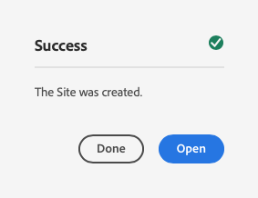

# Skapa webbplats från mall {#create-site-from-template}

Lär dig hur du snabbt skapar en ny AEM med hjälp av en webbplatsmall.

>[!CAUTION]
>
>Verktyget Skapa snabbwebbplats är för närvarande en förhandsgranskning av teknik. Den tillhandahålls för testning och utvärdering och är inte avsedd för användning i produktionen om inte Adobe Support har kommit överens om det.

## Story hittills {#story-so-far}

I det föregående dokumentet från den AEM snabbplatsgenereringsresan [Förstå Cloud Manager och arbetsflödet för att skapa snabbwebbplatser](cloud-manager.md) du har lärt dig om Cloud Manager och hur det knyter ihop den nya processen för att skapa snabbwebbplatser, och du bör nu:

* Förstå hur AEM Sites och Cloud Manager samarbetar för att underlätta utvecklingen på frontend
* Se hur anpassningssteget i gränssnittet är helt fristående från AEM och kräver ingen AEM kunskap.

Den här artikeln bygger på dessa grundläggande funktioner så att du kan ta det första konfigurationssteget och skapa en ny webbplats som du sedan kan anpassa med hjälp av verktygen i gränssnittet.

## Syfte {#objective}

Det här dokumentet hjälper dig att förstå hur du snabbt kan skapa en ny AEM med hjälp av en platsmall. När du har läst bör du:

* Lär dig hur du hämtar AEM webbplatsmallar.
* Lär dig hur du skapar en ny plats med hjälp av en mall.
* Se hur du laddar ned mallen från din nya webbplats och kan ge den till frontutvecklaren.

## Ansvarig roll {#responsible-role}

Den här delen av resan gäller AEM.

## Webbplatsmallar {#site-templates}

Webbplatsmallar är ett sätt att kombinera grundläggande webbplatsinnehåll i ett bekvämt och återanvändbart paket. Webbplatsmallar innehåller i allmänhet baswebbplatsinnehåll och -struktur samt information om webbplatsens format så att du snabbt kan komma igång med den nya webbplatsen. Den faktiska strukturen är följande:

* `files`: Mapp med UI-kit, XD och eventuellt andra filer
* `previews`: Mapp med skärmbilder av platsmallen
* `site`: Innehållspaket med innehåll som kopieras för varje plats som skapas från den här mallen, t.ex. sidmallar, sidor osv.
* `theme`: Källor till malltemat för att ändra hur webbplatsen ser ut, t.ex. CSS, JavaScript osv.

Mallar är kraftfulla eftersom de kan återanvändas så att skribenterna snabbt kan skapa en webbplats. Och eftersom du kan ha flera mallar tillgängliga i AEM kan du tillgodose olika affärsbehov.

>[!NOTE]
>
>Webbplatsmallen ska inte blandas ihop med sidmallar. Platsmallar som beskrivs här definierar den övergripande strukturen för en plats. En sidmall definierar strukturen och det ursprungliga innehållet för en enskild sida.

## Hämta en webbplatsmall {#obtaining-template}

Det enklaste sättet att komma igång är att [hämta den senaste versionen av AEM Standard Site Template från GitHub-databasen.](https://github.com/adobe/aem-site-template-standard/releases)

När du har laddat ned den kan du ladda upp den till AEM på samma sätt som andra paket. Se [Avsnittet Ytterligare resurser](#additional-resources) om du vill ha mer information om hur du arbetar med paket.

>[!TIP]
>
>AEM standardmall kan anpassas efter ditt projekts behov och kan eliminera behovet av ytterligare anpassning. Det här ämnet ligger dock utanför den här kundresan. Mer information finns i GitHub-dokumentationen för standardplatsmallen.

>[!TIP]
>
>Du kan också välja att skapa mallen från källan som en del av ditt projektarbetsflöde. Det här ämnet ligger dock utanför den här kundresan. Mer information finns i GitHub-dokumentationen för standardplatsmallen.

## Installera en platsmall {#installing-template}

Det är mycket enkelt att använda en mall för att skapa en ny webbplats.

1. Logga in i AEM redigeringsmiljö och navigera till webbplatskonsolen

   * `https://<your-author-environment>.adobeaemcloud.com/sites.html/content`

1. Tryck eller klicka **Skapa** längst upp till höger på skärmen och i listrutan väljer **Plats från mall**.

   

1. Tryck eller klicka på **Importera** överst i den vänstra kolumnen.

   

1. Leta reda på mallen i filläsaren [du laddat ned tidigare](#obtaining-template) och klicka **Överför**.

1. När den har överförts visas den i listan med tillgängliga mallar. Tryck eller klicka på den för att markera den (vilket även visar information om mallen i den högra kolumnen) och tryck eller klicka sedan på den **Nästa**.

   

1. Ange en titel för din webbplats. Ett platsnamn kan anges eller genereras från titeln om det utelämnas.

   * Platsens titel visas i webbläsarens namnlist.
   * Webbplatsnamnet blir en del av webbadressen.

1. Tryck eller klicka **Skapa** och den nya platsen skapas från webbplatsmallen.

   

1. I bekräftelsedialogrutan som visas trycker du på eller klickar på **Klar**.

   

1. På webbplatskonsolen är de nya platserna synliga och kan navigeras för att utforska den grundläggande strukturen enligt mallen.

   

Innehållsförfattare kan nu börja skriva.

## Krävs ytterligare anpassning? {#customization-required}

Webbplatsmallar är mycket kraftfulla och flexibla och alla nummer kan skapas för ett projekt, vilket gör det enkelt att skapa olika webbplatsvarianter. Beroende på den nivå av anpassning som redan har gjorts för den webbplatsmall som du använder kanske du inte ens behöver anpassa gränssnittet ytterligare.

* Om sajten inte kräver någon ytterligare anpassning, grattis! Din resa tar slut här!
* Om du fortfarande behöver anpassa gränssnittet, eller om du bara vill förstå hela processen om du behöver anpassa dig i framtiden, kan du fortsätta läsa.

## Exempelsida {#example-page}

Om du behöver ytterligare anpassning av gränssnittet bör du komma ihåg att den som utvecklar gränssnittet kanske inte känner till informationen om ditt innehåll. Därför är det en bra idé att ge utvecklaren en väg till typiskt innehåll som kan användas som referensbas när temat anpassas. Ett typiskt exempel är hemsidan för webbplatsens överordnad språk.

1. Navigera till startsidan för webbplatsens överordnad språk i webbläsaren och tryck eller klicka på sidan för att markera den och sedan på eller klicka på **Redigera** på menyraden.

   

1. I redigeraren väljer du **Sidinformation** i verktygsfältet och sedan **Visa som publicerad**.

   

1. Kopiera sökvägen till innehållet från adressfältet på fliken som öppnas. Det ser ut som `/content/<your-site>/en/home.html?wcmmode=disabled`.

   

1. Spara sökvägen som senare kan skickas till den som utvecklar gränssnittet.

## Ladda ned temat {#download-theme}

Nu när webbplatsen har skapats kan temat för webbplatsen som genererats av mallen hämtas och skickas till gränssnittsutvecklaren för anpassning.

1. På webbplatskonsolen visar du **Plats** järnväg.

   

1. Tryck eller klicka på roten för den nya platsen och tryck eller klicka sedan på **Hämta temakällor** på platsjärnvägen.

   

Du har nu en kopia av temats källfiler i dina nedladdningsfiler.

## Konfigurera proxyanvändare {#proxy-user}

För att frontendutvecklaren ska kunna förhandsgranska anpassningarna med verkligt AEM innehåll från webbplatsen måste du konfigurera en proxyanvändare.

1. I AEM från huvudnavigeringen går du till **verktyg** -> **Säkerhet** -> **Användare**.
1. Tryck eller klicka på i användarhanteringskonsolen **Skapa**.

   
1. I **Skapa ny användare** fönster måste du åtminstone ange:
   * **ID** - Observera detta värde eftersom du måste ge det till den som utvecklar gränssnittet.
   * **Lösenord** - Spara det här värdet säkert i ett lösenordsvalv eftersom du måste skicka det till klientutvecklaren.

   

1. På **Grupper** lägger du till proxyanvändaren i `contributors` grupp.
   * Typning i termen `contributors` utlösare AEM funktionen för automatisk komplettering så att gruppen enkelt kan markeras.

   

1. Tryck eller klicka **Spara och stäng**.

Du har nu slutfört konfigurationen. Innehållsförfattare kan nu börja skapa innehåll på webbplatsen och börja förbereda framsidan i nästa steg av kundresan.

## What&#39;s Next {#what-is-next}

Nu när du är klar med den här delen av AEM snabbwebbplats:

* Lär dig hur du hämtar AEM webbplatsmallar.
* Lär dig hur du skapar en ny plats med hjälp av en mall.
* Se hur du laddar ned mallen från din nya webbplats och kan ge den till frontutvecklaren.

Bygg vidare på den här kunskapen och fortsätt din AEM snabbwebbplats genom att nästa gång du granskar dokumentet [Konfigurera din pipeline,](pipeline-setup.md) där du skapar en pipeline för frontend för att hantera anpassningen av webbplatsens tema.

## Ytterligare resurser {#additional-resources}

Vi rekommenderar att du går vidare till nästa del av processen Skapa snabbwebbplats genom att granska dokumentet [Konfigurera din pipeline,](pipeline-setup.md) Nedan följer ytterligare, valfria resurser som fördjupar sig i några koncept som nämns i det här dokumentet, men som inte behöver fortsätta på resan.

* [AEM standardmall för webbplats](https://github.com/adobe/aem-site-template-standard) - Detta är GitHub-databasen för AEM standardplatsmall.
* [Skapa och ordna sidor](/help/sites-cloud/authoring/fundamentals/organizing-pages.md) - Den här guiden beskriver hur du hanterar sidor på din AEM webbplats om du vill anpassa den ytterligare efter att du har skapat den från mallen.
* [Så här arbetar du med paket](/help/implementing/developing/tools/package-manager.md) - Med paket kan du importera och exportera databasinnehåll. I det här dokumentet förklaras hur du arbetar med paket i AEM 6.5, som även gäller för AEMaaCS.
* [Dokumentation för webbplatsadministration](/help/sites-cloud/administering/site-creation/create-site.md) - Läs de tekniska dokumenten om hur du skapar webbplatser för mer information om funktionerna i verktyget Skapa snabbwebbplats.
