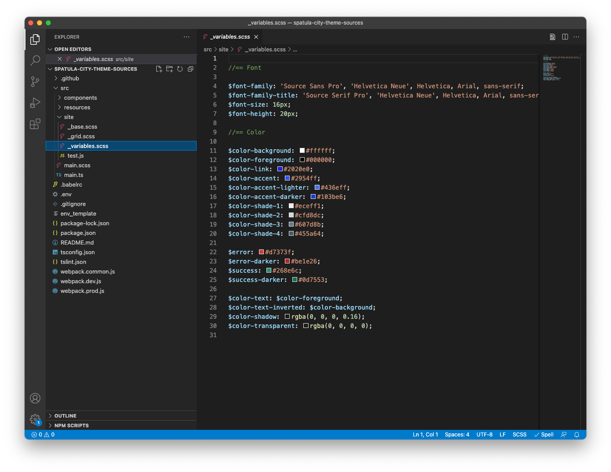
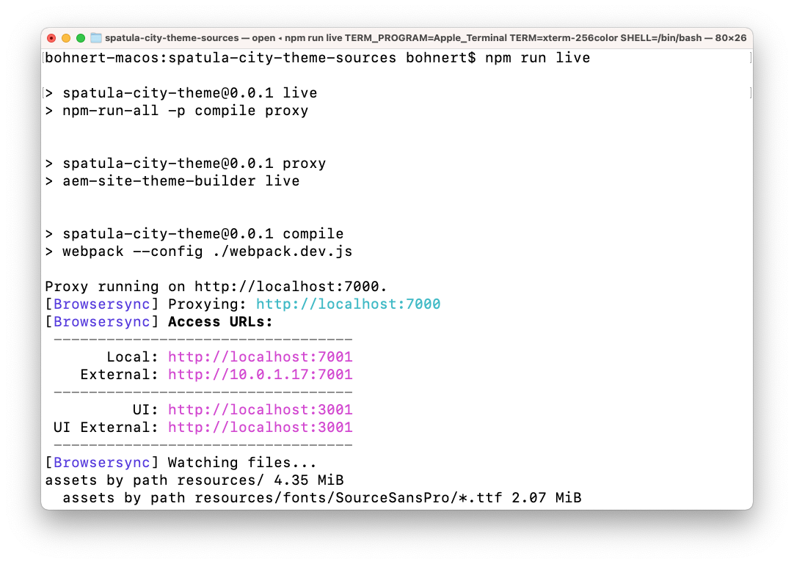
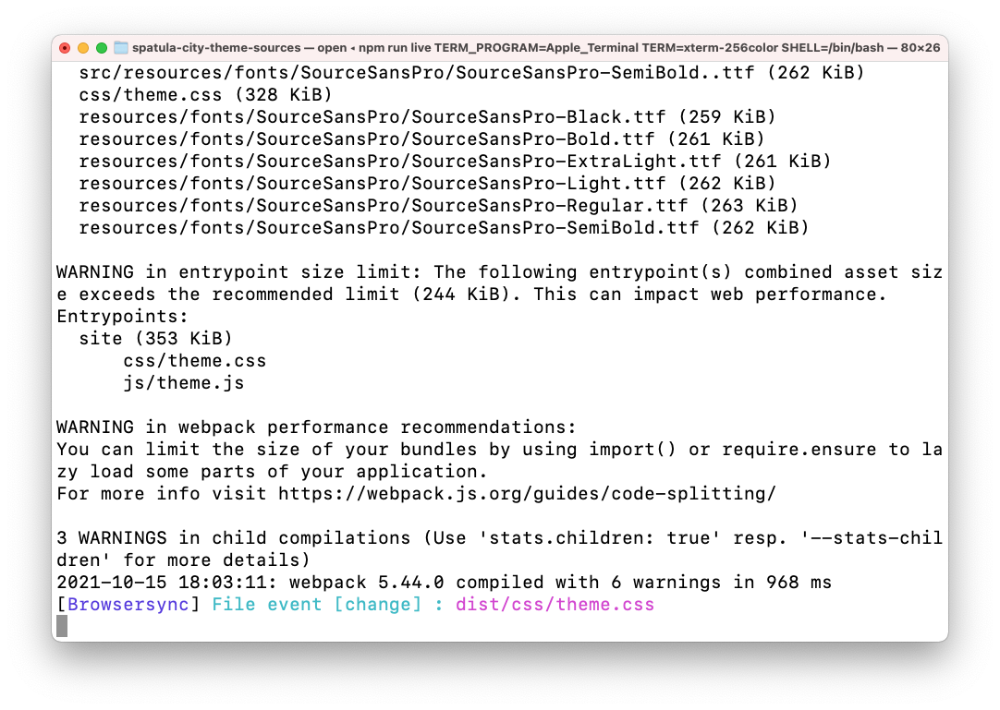

# Anpassa webbplatstemat {#customize-the-site-theme}

Lär dig hur webbplatstemat byggs, hur du anpassar och hur du testar med AEM.

## Story hittills {#story-so-far}

I det föregående dokumentet från den AEM snabbplatsgenereringsresan [Hämta information om Git-databasåtkomst,](retrieve-access.md) du har lärt dig hur gränssnittsutvecklarna använder Cloud Manager för att få åtkomst till Git-databasinformation, och du bör nu:

* Förstå vad Cloud Manager är på en hög nivå.
* Har hämtat dina autentiseringsuppgifter för att få åtkomst till AEM Git så att du kan genomföra dina anpassningar.

Den här delen av resan tar nästa steg och går in i webbplatstemat och visar hur du anpassar det och sedan implementerar anpassningarna med de åtkomstautentiseringsuppgifter som du hämtade.

## Syfte {#objective}

I det här dokumentet förklaras hur det AEM webbplatstemat byggs, hur det anpassas och hur du testar det med AEM. När du har läst bör du:

* Förstå webbplatsens grundläggande struktur och hur du redigerar den.
* Se hur du testar dina temaanpassningar med verkligt AEM innehåll via lokala utkast.
* Lär dig hur du implementerar dina ändringar i AEM Git-databasen.

## Ansvarig roll {#responsible-role}

Den här delen av resan gäller för den som utvecklar gränssnittet.

## Förstå temastrukturen {#understand-theme}

Extrahera temat från AEM administratör till den plats där du vill redigera temat och öppna det i den redigerare du vill använda.



Du ser att temat är ett typiskt frontprojekt. De viktigaste delarna i strukturen är:

* `src/main.ts`: Huvudstartpunkten för JS- och CSS-temat
* `src/site`: JS- och CSS-filer som gäller för hela platsen
* `src/components`: JS- och CSS-filer som är specifika för AEM komponenter
* `src/resources`: Statiska filer som ikoner, logotyper och teckensnitt

>[!TIP]
>
>Om du vill veta mer om det AEM vanliga webbplatstemat kan du läsa GitHub-länken i [Ytterligare resurser](#additional-resources) i slutet av dokumentet.

När du känner dig trygg med temaprojektets struktur kan du starta den lokala proxyn så att du kan se alla temaanpassningar i realtid baserat på det faktiska AEM innehållet.

## Starta den lokala proxyn {#starting-proxy}

1. Navigera från kommandoraden till temats rot på din lokala dator.
1. Kör `npm install` och npm hämtar beroenden och installerar projektet.

   

1. Kör `npm run live` och proxyservern startas.

   

1. När proxyservern startas öppnas en webbläsare automatiskt för att `http://localhost:7001/`. Välj **LOGGA IN LOKALT (ENDAST ADMINISTRATÖRSÅTGÄRDER)** och logga in med de autentiseringsuppgifter för proxyanvändare som du har fått från AEM.

   

   >[!TIP]
   >
   >Om du inte har dessa autentiseringsuppgifter kan du kontakta administratören och hänvisa till [Konfigurera avsnittet Proxyanvändare i artikeln Skapa webbplats från mall](/help/journey-sites/quick-site/create-site.md#proxy-user) på den här resan.

1. När du är inloggad ändrar du URL:en i webbläsaren så att den pekar på sökvägen till exempelinnehållet som AEM har gett dig.

   * Om den angivna sökvägen till exempel `/content/<your-site>/en/home.html?wcmmode=disabled`
   * Du ändrar URL:en till `http://localhost:7001/content/<your-site>/en/home.html?wcmmode=disabled`

   

Du kan navigera på webbplatsen för att utforska innehållet. Webbplatsen hämtas direkt från live-AEM så att du kan anpassa temat efter det verkliga innehållet.

## Anpassa temat {#customize-theme}

Nu kan du börja anpassa temat. Följande är ett enkelt exempel som illustrerar hur du kan se ändringarna direkt via utkastet.

1. Öppna filen i redigeraren `<your-theme-sources>/src/site/_variables.scss`

   

1. Redigera variabeln `$color-background` och ange ett annat värde än vitt. I detta exempel `orange` används.

   

1. När du sparar filen ser du att proxyservern känner igen ändringen via raden `[Browsersync] File event [change]`.

   

1. När du växlar tillbaka till webbläsaren på proxyservern visas ändringen omedelbart.

   

Du kan fortsätta att anpassa temat baserat på de krav som du har fått från AEM.

## Genomför ändringarna {#committing-changes}

När anpassningarna är klara kan du implementera dem i AEM Git-databasen. Först måste du klona databasen till din lokala dator.

1. Navigera från kommandoraden till den plats där du vill klona svaret.
1. Kör kommandot som du [som tidigare hämtats från Cloud Manager.](retrieve-access.md) Det bör likna `git clone https://git.cloudmanager.adobe.com/<my-org>/<my-program>/`. Använd Git-användarnamnet och -lösenordet som [du hämtade under den tidigare delen av den här resan.](retrieve-access.md)

   

1. Flytta temaprojektet som du redigerade till det klonade svaret med ett kommando som liknar `mv <site-theme-sources> <cloned-repo>`
1. I katalogen för den klonade kopian implementerar du de temafiler som du just har flyttat till med följande kommandon.

   ```text
   git add .
   git commit -m "Adding theme sources"
   git push
   ```

1. Anpassningarna överförs till databasen för AEM Git.

   

Dina anpassningar lagras nu säkert i AEM Git-databasen.

## What&#39;s Next {#what-is-next}

Nu när du är klar med den här delen av AEM snabbwebbplats:

* Förstå webbplatsens grundläggande struktur och hur du redigerar den.
* Se hur du testar dina temaanpassningar med verkligt AEM innehåll via lokala utkast.
* Lär dig hur du implementerar dina ändringar i AEM Git-databasen.

Bygg vidare på den här kunskapen och fortsätt din AEM snabbwebbplats genom att granska dokumentet nästa gång [Använd ditt anpassade tema,](deploy-theme.md) där du lär dig hur du distribuerar temat med hjälp av frontendriet.

## Ytterligare resurser {#additional-resources}

Vi rekommenderar att du går vidare till nästa del av processen Skapa snabbwebbplats genom att granska dokumentet [Använd ditt anpassade tema,](deploy-theme.md) Nedan följer ytterligare, valfria resurser som fördjupar sig i några koncept som nämns i det här dokumentet, men som inte behöver fortsätta på resan.

* [AEM webbplatstema](https://github.com/adobe/aem-site-template-standard-theme-e2e) - Detta är GitHub-databasen för AEM webbplatstema.
* [npm](https://www.npmjs.com) - AEM teman som används för att snabbt skapa webbplatser baseras på npm.
* [webbpaket](https://webpack.js.org) - AEM teman som används för att snabbt bygga sajter bygger på webbpaket.
