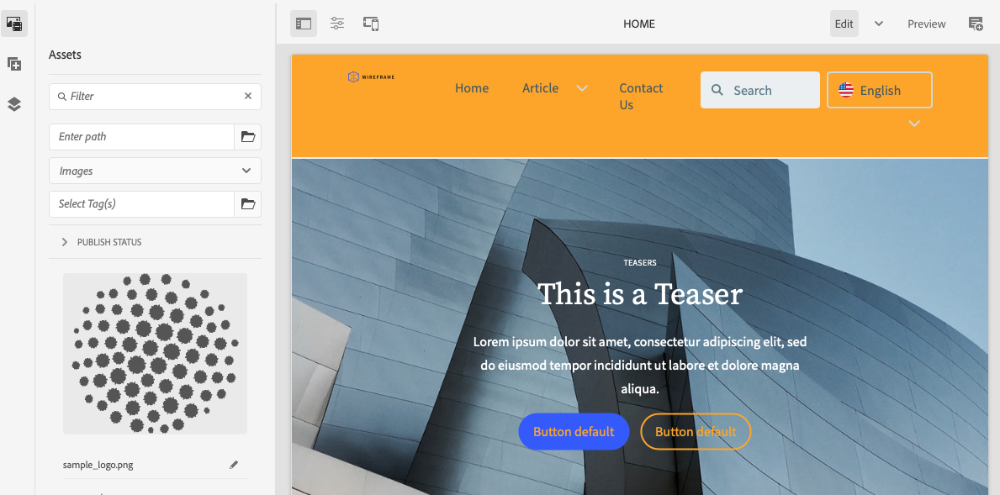

# Driftsätt ditt anpassade tema {#deploy-your-customized-theme}

Lär dig hur du distribuerar webbplatstemat med hjälp av pipeline.

## Story hittills {#story-so-far}

I det föregående dokumentet från den AEM snabbplatsgenereringsresan [Anpassa webbplatstemat,](customize-theme.md) du har lärt dig hur temat byggs, hur det anpassas och hur du testar det med hjälp av AEM innehåll, och du bör nu:

* Förstå webbplatsens grundläggande struktur och hur du redigerar den.
* Se hur du testar dina temaanpassningar med verkligt AEM innehåll via lokal proxy.
* Lär dig hur du implementerar dina ändringar i AEM Git-databasen.

Du kan nu ta det sista steget och använda pipeline för att distribuera dem.

## Syfte {#objective}

I det här dokumentet förklaras hur du distribuerar temat med hjälp av pipeline. När du har läst bör du:

* Ta reda på hur ni kan utlösa en pipeline-distribution.
* Se hur du kontrollerar distributionsstatusen.

## Ansvarig roll {#responsible-role}

Den här delen av resan gäller för den som utvecklar gränssnittet.

## Starta pipeline {#start-pipeline}

När du har implementerat ändringarna av temaanpassningen i AEM Git-databasen kan du köra [den pipeline som administratören skapade](pipeline-setup.md) för att distribuera ändringarna.

1. Logga in i Cloud Manager [som du gjorde för att hämta Git-åtkomstinformation](retrieve-access.md) Och få tillgång till programmet. På **Översikt** en flik där du kan se ett kort för **Pipelines**.

   

1. Tryck eller klicka på ellipsen bredvid den pipeline du vill starta. Välj **Kör**.

   

1. I **Kör pipeline** bekräftelsedialogruta: tryck eller klicka **Ja**.

   

1. Statuskolumnen i listan över pipelines anger att din pipeline nu körs.

   

## Kontrollera pipeline-status {#pipeline-status}

Du kan när som helst kontrollera status för pipeline för att se hur långt förloppet har kommit.

1. Tryck eller klicka på ellipsen bredvid din pipeline.

   

1. I informationsfönstret för pipeline visas en beskrivning av förloppet för pipeline.

   

>[!TIP]
>
>I informationsfönstret för pipeline kan du trycka eller klicka **Hämtningslogg** för alla steg i pipeline för felsökning om något steg skulle misslyckas. Felsökning av pipeline ligger utanför den här kundresan. Läs de tekniska dokumenten för Cloud Manager i [Ytterligare resurser](#additional-resources) på den här sidan.

## Validera distribuerade anpassningar {#view-customizations}

När pipeline är klar kan du informera administratören om att validera ändringarna. Administratören kommer då att

1. Öppna AEM.
1. Navigera till [webbplatsen som administratören skapade tidigare.](create-site.md)
1. Redigera en av innehållssidorna.
1. Se ändringarna.

## Slut på resan? {#end-of-journey}

Grattis! Du har slutfört AEM snabbwebbplats! Nu bör du:

* Få insikt i hur Cloud Manager och frontend fungerar för att hantera och driftsätta gränssnittsanpassningar.
* Lär dig hur du skapar en AEM webbplats baserat på en mall och hur du hämtar webbplatstemat.
* Anlita en frontendutvecklare så att de kan komma åt AEM Git-databasen.
* Hur du anpassar och testar ett tema med hjälp av proxiderat AEM och implementerar dessa ändringar i AEM Git.
* Så här distribuerar du gränssnittsanpassning med pipeline.

Nu kan du anpassa temana för din egen AEM. Innan du börjar skapa olika arbetsflöden med flera rörledningar bör du dock granska dokumentet [Utveckla sajter med frontlinjen.](/help/implementing/developing/introduction/developing-with-front-end-pipelines.md) Det hjälper er att få ut så mycket som möjligt av er frontendutveckling genom att:

* Bevara en enda sanningskälla.
* Upprätthålla ett åtskilt engagemang.

AEM är ett kraftfullt verktyg och det finns många andra alternativ. Se vilka ytterligare resurser som finns i [Avsnittet Ytterligare resurser](#additional-resources) om du vill veta mer om de funktioner du såg under den här resan.

## Ytterligare resurser {#additional-resources}

Nedan följer ytterligare resurser som ger en djupdykning i några koncept som nämns i det här dokumentet.

* [AEM as a Cloud Service teknisk dokumentation](https://experienceleague.adobe.com/docs/experience-manager-cloud-service.html) - Om du redan har en god förståelse för AEM kan du behöva läsa de detaljerade tekniska dokumenten direkt.
* [Dokumentation för Cloud Manager](https://experienceleague.adobe.com/docs/experience-manager-cloud-service/onboarding/onboarding-concepts/cloud-manager-introduction.html) - Om du vill ha mer information om funktionerna i Cloud Manager kan du läsa de detaljerade tekniska dokumenten direkt.
* [Rollbaserade behörigheter](https://experienceleague.adobe.com/docs/experience-manager-cloud-manager/using/requirements/role-based-permissions.html) - Molnhanteraren har förkonfigurerade roller med lämplig behörighet. Mer information om rollerna och hur du administrerar dem finns i det här dokumentet.
* [Cloud Manager-databaser](/help/implementing/cloud-manager/managing-code/cloud-manager-repositories.md) - Om du vill ha mer information om hur du konfigurerar och hanterar Git-databaser för ditt AEMaaCS-projekt kan du läsa det här dokumentet.
* [Konfigurera CI/CD-pipeline - Cloud Services](/help/implementing/cloud-manager/configuring-pipelines/introduction-ci-cd-pipelines.md) - Läs mer om hur du ställer in rörledningar, både i full hög och i framände, i det här dokumentet.
* [AEM standardmall för webbplats](https://github.com/adobe/aem-site-template-standard) - Detta är GitHub-databasen för AEM standardplatsmall.
* [AEM](https://github.com/adobe/aem-site-template-standard-theme-e2e) - Detta är GitHub-databasen för AEM webbplatstema.
* [npm](https://www.npmjs.com) - AEM teman som används för att snabbt skapa webbplatser baseras på npm.
* [webbpaket](https://webpack.js.org) - AEM teman som används för att snabbt bygga sajter bygger på webbpaket.
* [Skapa och ordna sidor](/help/sites-cloud/authoring/fundamentals/organizing-pages.md) - Den här guiden beskriver hur du hanterar sidor på din AEM webbplats om du vill anpassa den ytterligare efter att du har skapat den från mallen.
* [Så här arbetar du med paket](/help/implementing/developing/tools/package-manager.md) - Med paket kan du importera och exportera databasinnehåll. I det här dokumentet förklaras hur du arbetar med paket i AEM 6.5, som även gäller för AEMaaCS.
* [Onboarding Journey](/help/journey-onboarding/home.md) - Den här guiden fungerar som en startpunkt för att säkerställa att era team är konfigurerade och har tillgång till AEM as a Cloud Service.
* [Dokumentation för Adobe Experience Manager Cloud Manager](https://experienceleague.adobe.com/docs/experience-manager-cloud-manager/using/introduction-to-cloud-manager.html) - Utforska Cloud Manager-dokumentationen för att få fullständig information om dess funktioner.
* [Dokumentation för webbplatsadministration](/help/sites-cloud/administering/site-creation/create-site.md) - Läs de tekniska dokumenten om hur du skapar webbplatser för mer information om funktionerna i verktyget Skapa snabbwebbplats.
* [Developing Sites with the Front-End Pipeline](/help/implementing/developing/introduction/developing-with-front-end-pipelines.md) - I det här dokumentet beskrivs några överväganden som du bör vara medveten om för att få ut mesta möjliga av utvecklingsprocessen med hjälp av frontförsäljningsförloppet.
