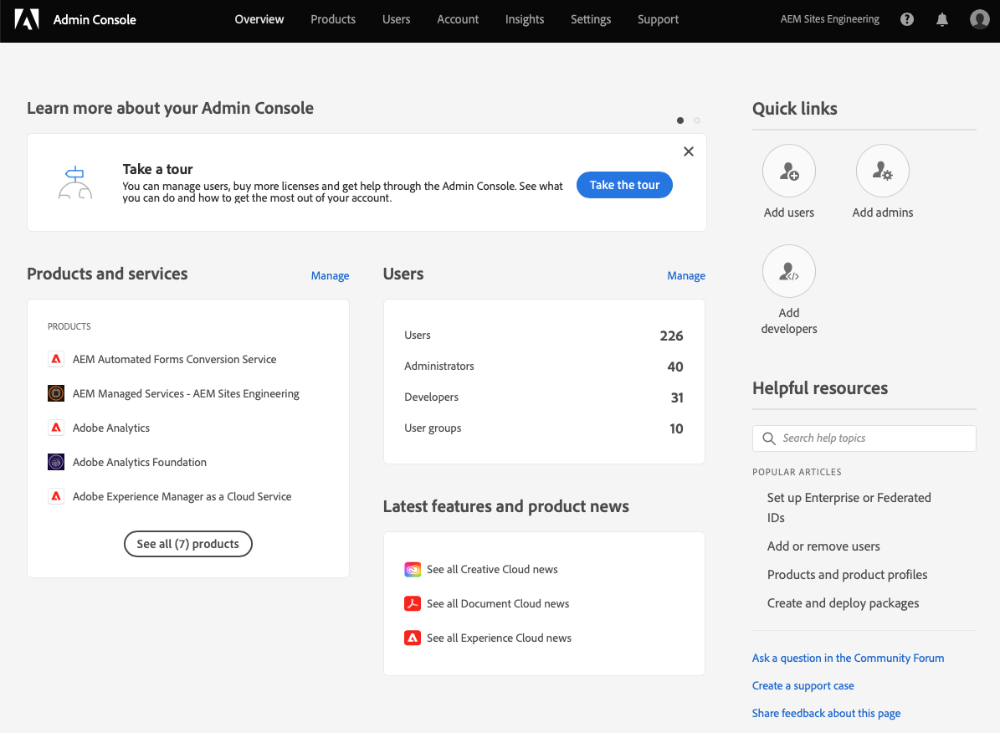

# Bevilja åtkomst till klientutvecklaren {#grant-fed-access}

Anlita gränssnittsutvecklare i Cloud Manager så att de får tillgång till era AEM och er pipeline.

## Story hittills {#story-so-far}

I det föregående dokumentet från den AEM snabbplatsgenereringsresan [Konfigurera din pipeline,](pipeline-setup.md) du lärde dig att skapa en pipeline för att hantera anpassningen av webbplatsens tema, och du bör nu:

* Förstå vad en rörledning är.
* Lär dig hur du konfigurerar en frontendpipeline i Cloud Manager.

Nu måste du ge din frontendutvecklare åtkomst till Cloud Manager via introduktionsprocessen så att frontendutvecklaren kan komma åt AEM Git-databasen och den pipeline du har skapat.

## Syfte {#objective}

Processen att bevilja åtkomst till Cloud Manager och tilldela användarroller till dina användare kallas för introduktion. Det här dokumentet ger en översikt över de viktigaste stegen för att introducera en frontendutvecklare och när du har läst det kommer du att få veta:

* Så här lägger du till en frontendutvecklare som användare.
* Så här tilldelar du de roller som krävs till frontendutvecklaren.

>[!TIP]
>
>Det finns en hel dokumentationsresa som är inriktad på att komma igång med ditt team via AEM som en molntjänst, som är länkad till i [Avsnittet Ytterligare resurser](#additional-resources) om du behöver mer information om processen.

## Ansvarig roll {#responsible-role}

Den här delen av resan gäller för administratören av Cloud Manager.

## Krav {#requirements}

* Du måste vara medlem i **Företagsägare** roll i Cloud Manager.
* Du måste vara en **Sys Admin** i Cloud Manager.
* Du måste ha tillgång till Admin Console.

## Lägg till frontendutvecklaren som användare {#add-fed-user}

Först måste du lägga till frontutvecklaren som användare med Admin Console.

1. Logga in i Admin Console på [https://adminconsole.adobe.com/](https://adminconsole.adobe.com/).

1. När du har loggat in visas en översiktssida som liknar följande bild.

   

1. Kontrollera att du är i rätt organisation genom att kontrollera organisationsnamnet i skärmens övre högra hörn.

   

1. Välj **Adobe Experience Manager as a Cloud Service** från **Produkter och tjänster** kort.

   

1. Du ser en lista över förkonfigurerade Cloud Manager-produktprofiler. Om du inte ser de här profilerna kontaktar du administratören för Cloud Manager eftersom du kanske inte har rätt behörigheter i din organisation.

   

1. Om du vill tilldela frontend-utvecklaren till rätt profiler trycker eller klickar du på **Användare** och sedan **Lägg till användare** -knappen.

   

1. I **Lägg till användare i ditt team** skriver du e-post-ID:t för den användare som du vill lägga till. För ID-typ väljer du Adobe ID om Federated ID för dina teammedlemmar inte har konfigurerats ännu.

   

1. I **Produkt** markerar, trycker eller klickar på plustecknet och väljer **Adobe Experience Manager as a Cloud Service** och tilldela **Distributionshanteraren** och **Utvecklare** produktprofiler till användaren.

   

1. Tryck eller klicka **Spara** och ett välkomstmeddelande skickas till den frontendutvecklare som du har lagt till som användare.

Den inbjudna frontendutvecklaren kan komma åt Cloud Manager genom att klicka på länken i välkomstmeddelandet och logga in med sin Adobe ID.

## Lämna över till frontendutvecklare {#handover}

Med en e-postinbjudan till Cloud Manager på vägen till den som utvecklar gränssnittet kan du och AEM nu ge den som utvecklar gränssnittet den återstående information som behövs för att börja anpassa produkten.

* A [sökväg till typiskt innehåll](#example-page)
* Temakällan som [du hämtade](#download-theme)
* The [autentiseringsuppgifter för proxyanvändare](#proxy-user)
* Namnet på programmet eller URL:en till det [kopierat från Cloud Manager](pipeline-setup.md#login)
* Designkrav för framsidan

## What&#39;s Next {#what-is-next}

Nu när du har slutfört den här delen av AEM snabbwebbplats bör du känna till:

* Så här lägger du till en frontendutvecklare som användare.
* Så här tilldelar du de roller som krävs till frontendutvecklaren.

Bygg vidare på den här kunskapen och fortsätt din AEM snabbwebbplats genom att nästa gång du granskar dokumentet [Hämta information om Git-databasåtkomst,](retrieve-access.md) som endast växlar perspektiv till frontendutvecklaren och förklarar hur gränssnittsutvecklarna använder Cloud Manager för att få åtkomst till Git-databasinformation.

## Ytterligare resurser {#additional-resources}

Vi rekommenderar att du går vidare till nästa del av processen Skapa snabbwebbplats genom att granska dokumentet [Hämta användaruppgifter för frontendutvecklare,](retrieve-access.md) Nedan följer ytterligare, valfria resurser som fördjupar sig i några koncept som nämns i det här dokumentet, men som inte behöver fortsätta på resan.

* [Onboarding Journey](/help/journey-onboarding/overview.md) - Den här guiden fungerar som en startpunkt för att säkerställa att era team är konfigurerade och har tillgång till AEM as a Cloud Service.
