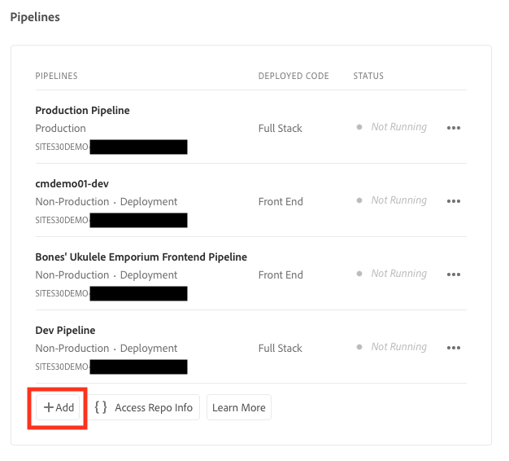

# Konfigurera din pipeline {#set-up-your-pipeline}

Skapa en pipeline för frontend för att hantera anpassningen av webbplatsens tema.

>[!CAUTION]
>
>Verktyget Skapa snabbwebbplats är för närvarande en förhandsgranskning av teknik. Den tillhandahålls för testning och utvärdering och är inte avsedd för användning i produktionen om inte Adobe Support har kommit överens om det.

## Story hittills {#story-so-far}

I det föregående dokumentet från den AEM snabbplatsgenereringsresan [Skapa webbplats från mall,](create-site.md) du lärde dig att använda en webbplatsmall för att snabbt skapa en AEM webbplats som kan anpassas ytterligare med hjälp av front-end-verktygen, och nu bör du:

* Lär dig hur du hämtar AEM webbplatsmallar.
* Lär dig hur du skapar en ny plats med hjälp av en mall.
* Se hur du laddar ned mallen från din nya webbplats och kan ge den till frontutvecklaren.

Den här artikeln bygger på dessa grundläggande funktioner så att ni kan skapa en frontpipeline, som utvecklaren senare kommer att använda för att driftsätta gränssnittsanpassningar.

## Syfte {#objective}

Det här dokumentet hjälper dig att förstå rörledningar och hur du skapar en för att hantera distributionen av webbplatsens anpassade tema. När du har läst bör du:

* Förstå vad en rörledning är.
* Lär dig hur du konfigurerar en frontendpipeline i Cloud Manager.

## Ansvarig roll {#responsible-role}

Den här delen av resan gäller för administratören av Cloud Manager.

## Krav {#requirements}

* Du måste ha tillgång till Cloud Manager.
* Du måste vara medlem i **Distributionshanteraren** roll i Cloud Manager.
* En Git-repo för AEM måste konfigureras i Cloud Manager.
   * Detta är vanligtvis redan fallet för alla aktiva projekt. Om så inte är fallet, se dokumentationen för Cloud Manager-databaser som finns på [Ytterligare resurser](#additional-resources) -avsnitt.

## Vad är en frontpipeline? {#front-end-pipeline}

Utvecklingar i gränssnittet innebär anpassning av JavaScript-, CSS- och statiska resurser som definierar hur din AEM ska formateras. Utvecklaren kommer att arbeta i sina egna lokala miljöer för att göra dessa anpassningar. När de är klara implementeras ändringarna i databasen för AEM Git. Men de är bara kopplade till källkoden. De lever ännu inte.

I frontproduktionsflödet används dessa implementerade anpassningar och distribueras till en AEM miljö, vanligtvis i produktions- eller icke-produktionsmiljöer.

På så sätt kan front end-utveckling fungera separat från och parallellt med all backend-utveckling i full stack på AEM, som har sina egna driftsättningspipelines.

>[!NOTE]
>
>I frontledningarna kan du bara distribuera JavaScript-, CSS- och statiska resurser för att utforma din AEM. Webbplatsinnehåll som sidor eller resurser kan inte distribueras i en pipeline.

## Access Cloud Manager {#login}

1. Logga in på Adobe Cloud Manager på [my.cloudmanager.adobe.com](https://my.cloudmanager.adobe.com/).

1. Cloud Manager visar de olika tillgängliga programmen. Tryck eller klicka på den du vill hantera. Om du just har börjat med AEM as a Cloud Service har du antagligen bara ett program tillgängligt.

   

Nu visas en översikt över programmet. Sidan ser annorlunda ut men liknar det här exemplet.

Observera namnet på programmet som du har öppnat eller kopierat URL:en. Du måste skicka detta till den som utvecklar dokumentet senare.

## Skapa en frontpipeline {#create-front-end-pipeline}

Nu när du har öppnat Cloud Manager kan du skapa en pipeline för distribution direkt.

1. I **Pipelines** på Cloud Manager-sidan trycker eller klickar du på **Lägg till** -knappen.

   

1. På snabbmenyn som visas under **Lägg till** knappval **Lägg till icke-produktionsförlopp** för denna resa.

1. På **Konfiguration** -fliken i **Lägg till icke-produktionsförlopp** som öppnas:
   * Välj **Distributionsförlopp**.
   * Ange ett namn för pipelinen i **Namn på icke-produktionsförlopp** fält.

   

1. Tryck eller klicka **Fortsätt**.

1. På **Källkod** tab:
   * Välj **Front End-kod** som den typ av kod som ska distribueras.
   * Kontrollera att rätt miljö är vald under **Berättigade driftsättningsmiljöer**.
   * Välj rätt **Databas**.
   * Definiera vilken **Git-gren** rörledningen bör kopplas till.
   * Definiera **Kodplats** om frontendutvecklingen finns under en viss sökväg i den valda databasen. Standardvärdet är databasens rot, men ofta är front end-utveckling och back end-objekt under olika sökvägar.

   

1. Tryck eller klicka **Spara**.

Den nya pipeline skapas och visas i **Pipelines** i Cloud Manager-fönstret. Om du trycker på ellipsen efter pipelinenamnet visas alternativ för ytterligare redigering eller visning av detaljer efter behov.

>[!TIP]
>
>Om du redan känner till rörledningar i AEMaaCS och vill veta mer om skillnaderna mellan de olika typerna av rörledningar, inklusive mer information om frontendledningen, kan du läsa mer om Konfigurera CI/CD Pipeline - Cloud Services i [Ytterligare resurser](#additional-resources) nedan.

## What&#39;s Next {#what-is-next}

Nu när du är klar med den här delen av AEM snabbwebbplats:

* Förstå vad en rörledning är.
* Lär dig hur du konfigurerar en frontendpipeline i Cloud Manager.

Bygg vidare på den här kunskapen och fortsätt din AEM snabbwebbplats genom att nästa gång du granskar dokumentet [Bevilja åtkomst till klientutvecklaren,](grant-access.md) där du kommer att introducera gränssnittsutvecklarna i Cloud Manager så att de har tillgång till din databas och pipeline för AEM.

## Ytterligare resurser {#additional-resources}

Vi rekommenderar att du går vidare till nästa del av processen Skapa snabbwebbplats genom att granska dokumentet [Anpassa webbplatstemat,](customize-theme.md) Nedan följer ytterligare, valfria resurser som fördjupar sig i några koncept som nämns i det här dokumentet, men som inte behöver fortsätta på resan.

* [Dokumentation för Cloud Manager](https://experienceleague.adobe.com/docs/experience-manager-cloud-service/onboarding/onboarding-concepts/cloud-manager-introduction.html) - Om du vill ha mer information om funktionerna i Cloud Manager kan du läsa de detaljerade tekniska dokumenten direkt.
* [Cloud Manager-databaser](/help/implementing/cloud-manager/managing-code/cloud-manager-repositories.md) - Om du vill ha mer information om hur du konfigurerar och hanterar Git-databaser för ditt AEMaaCS-projekt kan du läsa det här dokumentet.
* [Konfigurera CI/CD-pipeline - Cloud Services](/help/implementing/cloud-manager/configuring-pipelines/introduction-ci-cd-pipelines.md) - Läs mer om hur du ställer in rörledningar, både i full hög och i framände, i det här dokumentet.