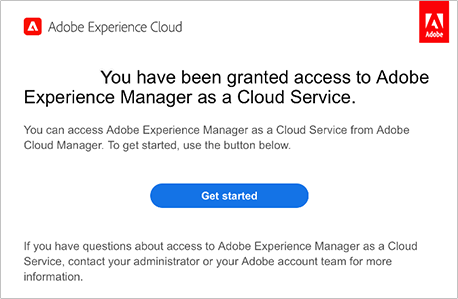

# Hämta Git-databasåtkomstinformation {#retrieve-access}

Läs om hur frontendutvecklaren använder Cloud Manager för att få åtkomst till Git-databasinformation.

## Story hittills {#story-so-far}

Om du är en frontendutvecklare som bara ansvarar för att anpassa webbplatstemat behöver du inte veta hur AEM konfigurerades och kan hoppa till [Syfte](#objective) i det här dokumentet.

Om du också är Cloud Managers eller AEM administratörs och front end-utvecklare lärde du dig i det tidigare dokumentet av den AEM snabbplatsgenereringsresan, [Bevilja åtkomst till klientutvecklaren,](grant-access.md) Anlita en utvecklare så att han/hon får tillgång till Git-databasen, och du bör nu veta:

* Så här lägger du till en frontendutvecklare som användare.
* Så här tilldelar du de roller som krävs till frontendutvecklaren.

I den här artikeln beskrivs hur frontendutvecklaren använder Cloud Manager-åtkomst för att hämta inloggningsuppgifter för att få åtkomst till databasen för AEM Git.

Nu när det finns en webbplats som är baserad på en mall, där det finns en pipeline-konfiguration, där frontendutvecklaren är inbäddad och har all information de behöver, skiftar den här artikeln perspektiv från administratörer och enbart till frontendutvecklarrollen.

## Syfte {#objective}

I det här dokumentet beskrivs hur du, i rollen som frontendutvecklare, kan komma åt Cloud Manager och hämta inloggningsuppgifter till databasen för AEM Git. När du har läst

* Förstå vad Cloud Manager är på en hög nivå.
* Har hämtat dina autentiseringsuppgifter för att få åtkomst till AEM Git så att du kan genomföra dina anpassningar.

## Ansvarig roll {#responsible-role}

Den här delen av resan gäller för den som utvecklar gränssnittet.

## Krav {#requirements}

Med verktyget för att skapa snabbwebbplatser kan gränssnittsutvecklare arbeta självständigt utan kunskaper om AEM eller hur de är konfigurerade. Molnhanterarens administratör måste dock ta in frontendutvecklaren i projektteamet och AEM måste ge dig viss obligatorisk information. Kontrollera att du har följande information innan du fortsätter.

* Från AEM:
   * Temakällfiler som ska anpassas
   * Sökväg till en exempelsida som ska användas som referensbas
   * Proxy user credentials to test your customization to live AEM content
   * Krav på utformning av gränssnittet
* Från Cloud Manager-administratören:
   * Ett välkomstmeddelande från Cloud Manager som informerar dig om åtkomst
   * Namnet på programmet eller URL:en till det i Cloud Manager

Om du saknar något av dessa objekt kontaktar du AEM eller Cloud Manager-administratören.

Man utgår ifrån att den som utvecklar främst har stor erfarenhet av utvecklingsarbetsflöden och gemensamma verktyg som installeras:

* git
* npm
* webbpaket
* En önskad redigerare

## Om Cloud Manager {#understanding-cloud-manager}

Med Cloud Manager kan organisationer själva hantera AEM i molnet. Det innehåller ett ramverk för kontinuerlig integrering och kontinuerligt leverans (CI/CD) som gör att IT-team och implementeringspartners kan snabba upp leveransen av anpassningar eller uppdateringar utan att kompromissa med prestanda eller säkerhet.

För frontutvecklaren är det själva gatewayen att

* Få åtkomst AEM Git-databasinformation så att ni kan implementera era era frontendanpassningar.
* Starta distributionsflödet för att distribuera dina anpassningar.

Cloud Manager-administratören kommer att ha anslutit dig som Cloud Manager-användare. Du bör ha fått ett välkomstmeddelande som liknar det här.

Om du inte har fått det här e-postmeddelandet kontaktar du Cloud Manager-administratören.

## Access Cloud Manager {#access-cloud-manager}

1. Logga in på Adobe Experience Cloud på [my.cloudmanager.adobe.com](https://my.cloudmanager.adobe.com/) eller klicka på länken i välkomstmeddelandet.

1. Cloud Manager visar de olika tillgängliga programmen. Tryck eller klicka på den som du behöver ha åtkomst till enligt vad som angetts av Cloud Manager-administratören. Om detta är ditt första front end-projekt för AEMaaCS har du troligen bara ett program tillgängligt.

   

Nu visas en översikt över programmet. Sidan ser annorlunda ut men liknar det här exemplet.

## Hämta information om databasåtkomst {#repo-access}

1. I **Pipelines** på Cloud Manager-sidan trycker eller klickar du på **Åtkomst till svarsinformation** -knappen.

   

1. The **Databasinformation** öppnas.

   

1. Tryck eller klicka på **Generera lösenord** för att skapa ett lösenord för dig själv.

1. Spara lösenordet som genererats i en säker lösenordshanterare. Lösenordet visas aldrig igen.

1. Kopiera även **användarnamn** och **Git-kommandorad** fält. Du kommer att använda den här informationen senare för att komma åt rapporten.

1. Tryck eller klicka **Stäng**.

## What&#39;s Next {#what-is-next}

Nu när du är klar med den här delen av AEM snabbwebbplats:

* Förstå vad Cloud Manager är på en hög nivå.
* Har hämtat dina autentiseringsuppgifter för att få åtkomst till AEM Git så att du kan genomföra dina anpassningar.

Bygg vidare på den här kunskapen och fortsätt din AEM snabbwebbplats genom att nästa gång du granskar dokumentet [Anpassa webbplatstemat,](customize-theme.md) där du får lära dig hur webbplatstemat byggs, hur du anpassar och hur du testar med hjälp av live-AEM.

## Ytterligare resurser {#additional-resources}

Vi rekommenderar att du går vidare till nästa del av processen Skapa snabbwebbplats genom att granska dokumentet [Anpassa webbplatstemat,](customize-theme.md) Nedan följer ytterligare, valfria resurser som fördjupar sig i några koncept som nämns i det här dokumentet, men som inte behöver fortsätta på resan.

* [Dokumentation för Adobe Experience Manager Cloud Manager](https://experienceleague.adobe.com/docs/experience-manager-cloud-manager/using/introduction-to-cloud-manager.html) - Utforska Cloud Manager-dokumentationen för att få fullständig information om dess funktioner.
