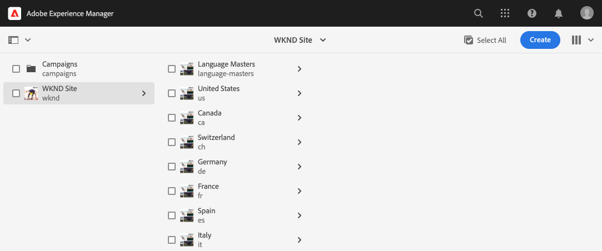
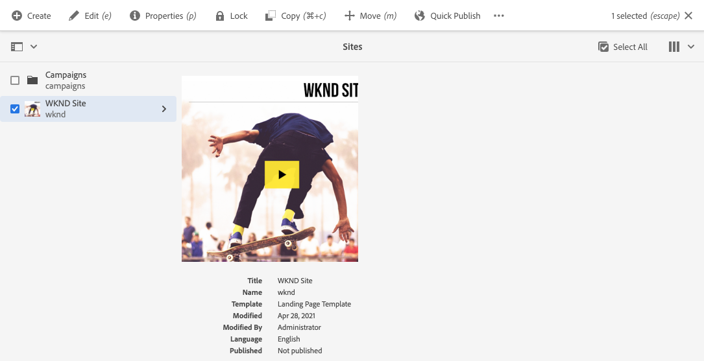
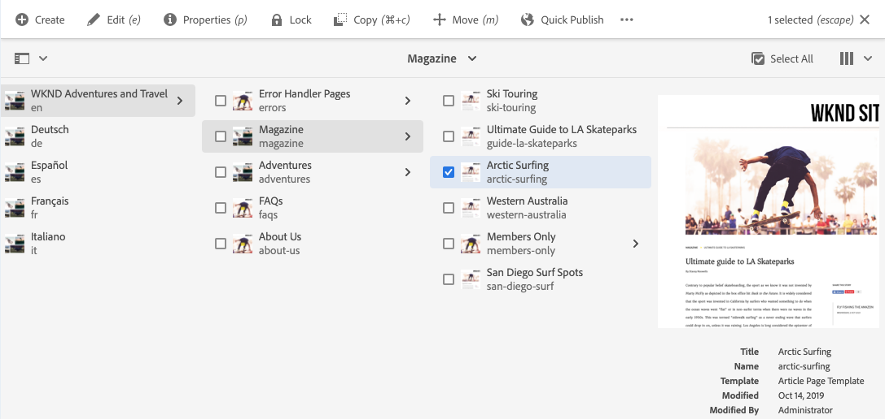

# Kom igång med AEM Sites Translation {#getting-started}

Lär dig hur du ordnar ditt AEM Sites-innehåll och hur AEM översättningsverktyg fungerar.

## Story hittills {#story-so-far}

I det föregående dokumentet om AEM Sites översättningsresa [Läs om AEM Sites innehåll och hur du översätter i AEM](learn-about.md) du lärde dig grunderna i AEM Sites och nu bör du:

* Lär dig grunderna i AEM Sites framtagning av innehåll.
* Läs om hur AEM stöder översättning.

Den här artikeln bygger vidare på dessa grunder så att du förstår hur AEM lagrar och hanterar innehåll och hur du kan använda AEM översättningsverktyg för att översätta det innehållet.

## Syfte {#objective}

Det här dokumentet hjälper dig att förstå hur du kommer igång med att översätta webbplatsinnehåll i AEM. När du har läst bör du:

* Förstå hur viktig innehållsstrukturen är för översättning.
* Förstå hur AEM lagrar innehåll.
* Bekanta dig med AEM översättningsverktyg.

## Krav och krav {#requirements-prerequisites}

Det finns ett antal krav innan du börjar översätta AEM innehåll.

### Kunskap {#knowledge}

* Upplev hur man översätter innehåll i ett CMS-system
* Upplev de grundläggande funktionerna i ett storskaligt CMS-system
* Kunskap AEM grundläggande hantering
* Förståelse för översättningstjänsten som du använder
* Ha en grundläggande förståelse för innehållet som du översätter

>[!TIP]
>
>Om du inte är van vid att använda ett stort CMS-system som AEM kan du titta i [Grundläggande hantering](/help/sites-cloud/authoring/getting-started/basic-handling.md) dokumentation innan du fortsätter. Dokumentationen för grundläggande hantering ingår inte i resan. Gå tillbaka till den här sidan när du är klar.

### verktyg {#tools}

* Tillgång till sandlådor för att testa översättning av ditt innehåll
* Autentiseringsuppgifter för att ansluta till den översättningstjänst du föredrar
* Bli medlem i `project-administrators` grupp i AEM

## Så här lagrar AEM innehåll {#content-in-aem}

För översättningsspecialisten är det inte viktigt att förstå hur AEM hanterar innehåll i detalj. Att känna till grundläggande begrepp och terminologi är dock användbart eftersom du senare använder AEM översättningsverktyg. Viktigast av allt är att ni måste förstå ert eget innehåll och hur det är strukturerat för att effektivt kunna översätta det.

### Webbplatskonsol {#sites-console}

Webbplatskonsolen ger en översikt över innehållets struktur, vilket gör det enkelt att navigera i innehållet och hantera det genom att skapa nya sidor, flytta och kopiera sidor samt publicera innehåll.

Så här kommer du åt webbplatskonsolen:

1. Klicka eller tryck på den globala navigeringsmenyn **Navigering** -> **Webbplatser**.
1. Webbplatskonsolen öppnas på den översta nivån i ditt innehåll.
1. Se till att **Kolumnvy** markeras med vyväljaren längst upp till höger i fönstret.

   

1. Genom att trycka på eller klicka på ett objekt i en kolumn, visas innehållet under det i hierarkin i kolumnen till höger.

   

1. Genom att trycka eller klicka på kryssrutan för ett objekt i en kolumn, markeras objektet och det markerade objektets information visas i kolumnen till höger. Ett antal åtgärder som är tillgängliga för det markerade objektet visas i verktygsfältet ovan.

   

1. Genom att trycka eller klicka på järnvägsväljaren längst upp till vänster kan du även visa **Innehållsträd** om du vill se en trädöversikt över ditt innehåll.

   

Med dessa enkla verktyg kan du navigera i innehållsstrukturen på ett intuitivt sätt.

>[!NOTE]
>
>Innehållsarkitekten definierar vanligtvis innehållsstrukturen medan innehållsförfattarna skapar innehållet i den strukturen.
>
>Som översättningsspecialist är det viktigt att du bara förstår hur du navigerar i strukturen och förstår var innehållet finns.

### Page Editor {#page-editor}

På webbplatskonsolen kan du navigera i ditt innehåll och få en översikt över dess struktur. Om du vill visa information om en enskild sida måste du använda webbplatsredigeraren.

Så här redigerar du en sida:

1. Använd platskonsolen för att hitta och välja en sida. Kom ihåg att du måste trycka på eller klicka i kryssrutan för en enskild sida för att markera den.

   

1. Tryck på **Redigera** i verktygsfältet.
1. Webbplatsredigeraren öppnas med den valda sidan inläst för redigering på en ny flik i webbläsaren.
1. När du för musen över eller knackar på innehåll visas väljare för enskilda komponenter. Komponenter är de dra och släpp-byggstenar som utgör sidan.

   

Du kan när som helst återgå till webbplatskonsolen genom att växla tillbaka till den fliken i webbläsaren. Med hjälp av webbplatsredigeraren kan du snabbt visa innehållet på sidan så som innehållsförfattarna och målgruppen ser det.

>[!NOTE]
>
>Innehållsförfattarna skapar ditt webbplatsinnehåll med hjälp av webbplatsredigeraren.
>
>Som översättningsspecialist är det viktigt att du förstår hur du visar detaljerna i innehållet med hjälp av sajtredigeraren.

## Strukturen är nyckeln {#content-structure}

AEM innehåll styrs av sin struktur. AEM ställer få krav på innehållsstrukturen, men om du tar hänsyn till innehållshierarkin som en del av projektplaneringen blir översättningen mycket enklare.

>[!TIP]
>
>Planera för översättning i början av AEM. Arbeta nära med projektledaren och innehållsarkitekterna tidigt.
>
>En projektledare för internationalisering kan krävas som en separat person vars ansvar är att definiera vilket innehåll som ska översättas och vad som inte ska översättas, och vilket översatt innehåll som kan ändras av regionala eller lokala innehållsproducenter.

## Rekommenderad innehållsstruktur {#recommended-structure}

Som vi tidigare har rekommenderat arbetar du med din innehållsarkitekt för att fastställa lämplig innehållsstruktur för ditt eget projekt. Följande är dock en beprövad, enkel och intuitiv struktur som är mycket effektiv.

Definiera en basmapp för ditt projekt under `/content`.

```text
/content/<your-project>
```

Språket som ditt innehåll skrivs på kallas för språkrot. I vårt exempel är det engelska och det bör vara under den här vägen.

```text
/content/<your-project>/en
```

Allt projektinnehåll som kan behöva lokaliseras ska placeras under språkroten.

```text
/content/<your-project>/en/<your-project-content>
```

Översättningar ska skapas som jämställda mappar tillsammans med språkroten och deras mappnamn representerar språkets ISO-2-språkkod. Tyska skulle till exempel ha följande sökväg.

```text
/content/<your-project>/de
```

>[!NOTE]
>
>Innehållsarkitekten ansvarar vanligtvis för att skapa dessa språkmappar. Om de inte skapas kan AEM inte skapa översättningsjobb senare.

Den slutliga strukturen kan se ut ungefär så här.

```text
/content
    |- your-project
        |- en
            |- some
            |- exciting
            |- sites
            |- content
        |- de
        |- fr
        |- it
        |- ...
    |- another-project
    |- ...
```

Du bör tänka på den specifika sökvägen för ditt innehåll eftersom det krävs senare för att konfigurera översättningen.

>[!NOTE]
>
>Innehållsarkitekten har i allmänhet ansvaret för att definiera innehållsstrukturen, ofta i samarbete med översättningsspecialisten.
>
>Den beskrivs här för fullständighetens skull.

## AEM översättningsverktyg {#translation-tools}

Nu när du förstår webbplatskonsolen och redigeraren och vikten av innehållsstrukturen kan vi titta på hur du översätter innehåll. Översättningsverktygen i AEM är mycket kraftfulla, men enkla att förstå på en hög nivå.

* **Translation Connector** - Kopplingen är länken mellan AEM och översättningstjänsten som du använder.
* **Översättningsregler** - Reglerna definierar vilket innehåll under särskilda sökvägar som ska översättas.
* **Översättningsprojekt** - Översättningsprojekt samlar in innehåll som ska hanteras som en enda översättningsåtgärd och spårar översättningens förlopp, interagerar med kopplingen för att överföra innehållet som ska översättas och tar emot det tillbaka från översättningstjänsten.

Vanligtvis konfigurerar du bara anslutningen en gång för din instans och regler per projekt. Sedan använder ni översättningsprojekt för att översätta innehållet och hålla översättningarna uppdaterade kontinuerligt.

## What&#39;s Next {#what-is-next}

Nu när du är klar med den här delen av AEM Sites översättningsresa ska du:

* Förstå hur viktig innehållsstrukturen är för översättning.
* Förstå hur AEM lagrar innehåll.
* Bekanta dig med AEM översättningsverktyg.

Bygg vidare på den här kunskapen och fortsätt din översättning till AEM Sites genom att nästa gång du granskar dokumentet [Konfigurera översättningskopplingen](configure-connector.md) där du får lära dig att ansluta AEM till en översättningstjänst.|

## Ytterligare resurser {#additional-resources}

Vi rekommenderar att du går vidare till nästa del av översättningsresan genom att granska dokumentet [Konfigurera översättningskopplingen](configure-connector.md) Nedan följer ytterligare, valfria resurser som fördjupar sig i några koncept som nämns i det här dokumentet, men som inte behöver fortsätta på resan.

* [AEM grundläggande hantering](/help/sites-cloud/authoring/getting-started/basic-handling.md) - Lär dig grunderna i det AEM användargränssnittet så att du enkelt kan navigera och utföra viktiga uppgifter som att hitta ditt innehåll.
* [Identifiera innehåll som ska översättas](/help/sites-cloud/administering/translation/rules.md) - Lär dig hur översättningsregler identifierar innehåll som behöver översättas.
* [Konfigurera översättningsintegreringsramverket](/help/sites-cloud/administering/translation/integration-framework.md) - Lär dig hur du konfigurerar TLF (Translation Integration Framework) för integrering med översättningstjänster från tredje part.
* [Hantera översättningsprojekt](/help/sites-cloud/administering/translation/managing-projects.md) - Lär dig att skapa och hantera både maskinöversättning och mänsklig översättning i AEM.
