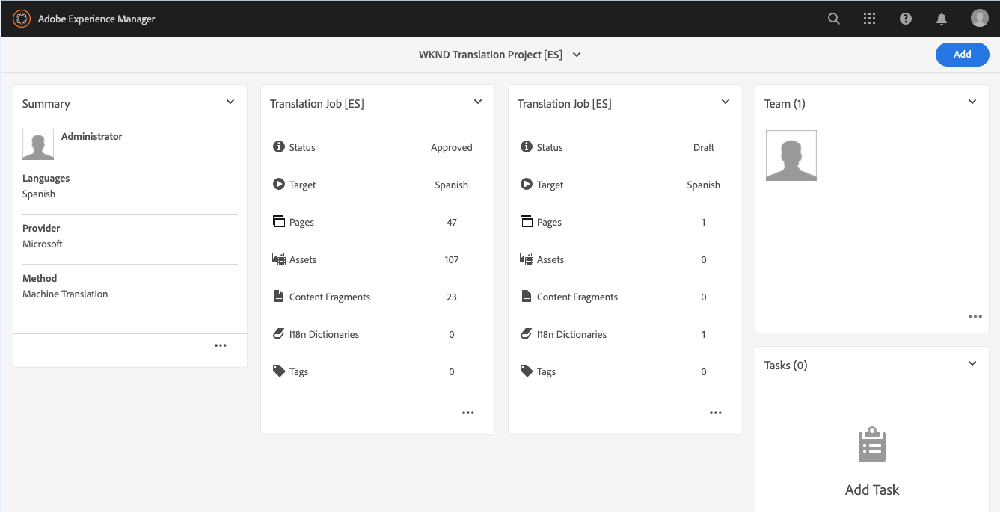
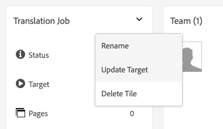

# Publicera översatt innehåll {#publish-content}

Lär dig hur du publicerar översatt innehåll och uppdaterar översättningarna när innehållet uppdateras.

## Story hittills {#story-so-far}

I det föregående dokumentet om AEM Sites översättningsresa [Översätta innehåll,](configure-connector.md) du lärde dig att använda AEM översättningsprojekt för att översätta ditt innehåll. Nu bör du:

* Förstå vad ett översättningsprojekt är.
* Skapa nya översättningsprojekt.
* Använd översättningsprojekt för att översätta innehållet.

Nu när den första översättningen är klar går den här artikeln igenom nästa steg i publiceringen av det innehållet och vad du ska göra för att uppdatera översättningarna när det underliggande innehållet i språkroten ändras.

## Syfte {#objective}

Det här dokumentet hjälper dig att förstå hur du publicerar innehåll i AEM och hur du skapar ett kontinuerligt arbetsflöde för att hålla översättningarna uppdaterade. När du har läst det här dokumentet bör du:

* Förstå AEM författarpubliceringsmodell.
* Lär dig hur du publicerar översatt innehåll.
* Kan implementera en kontinuerlig uppdateringsmodell för ditt översatta innehåll.

## AEM Author-Publish Model {#author-publish}

Innan du publicerar ditt innehåll är det en bra idé att förstå AEM författarpubliceringsmodell. I förenklad form delar AEM in användare i två grupper.

1. De som skapar och hanterar innehållet och systemet
1. De som konsumerar innehållet från systemet

AEM separeras därför fysiskt i två instanser.

1. The **författare** -instans är det system där innehållsförfattare och -administratörer arbetar med att skapa och hantera innehåll.
1. The **publicera** -instans är det system som levererar innehållet till konsumenterna.

När innehållet har skapats på författarinstansen måste det överföras till publiceringsinstansen för att det ska vara tillgängligt för konsumtion. Processen att överföra från författare till publicering anropas **publikation**.

## Publicera översatt innehåll {#publishing}

När du är nöjd med hur det översatta innehållet ser ut måste det publiceras så att det kan läsas och användas. Den här uppgiften är vanligtvis inte översättningsspecialistens ansvar, men beskrivs här för att illustrera hela arbetsflödet.

>[!NOTE]
>
>När översättningen är klar informerar översättningsexperten i allmänhet innehållsägarna om att översättningarna är klara för publicering. Innehållsägarna publicerar dem sedan.
>
>Följande steg är fullständiga.

Det enklaste sättet att publicera översättningarna är att navigera till projektmappen.

```text
/content/<your-project>/
```

Under den här sökvägen har du undermappar för varje översättningsspråk och kan välja vilka som ska publiceras.

1. Gå till **Navigering** -> **Webbplatser** -> **Filer** och öppna projektmappen.
1. Här visas språkrotmappen och alla andra språkmappar. Välj det eller de lokaliserade språk som du vill publicera.
   
1. Tryck eller klicka **Hantera publikation**.
1. I **Hantera publikation** se till att **Publicera** markeras automatiskt under **Åtgärd** och **Nu** är markerat under **Schemaläggning**. Tryck eller klicka **Nästa**.
   
1. I nästa **Hantera publikation** bekräftar du att rätt sökväg är markerad. Tryck eller klicka **Publicera**.
   
1. AEM bekräftar publiceringsåtgärden med ett popup-meddelande längst ned på skärmen.
   

Ditt översatta innehåll publiceras nu! Den kan nu nås och konsumeras.

>[!TIP]
>
>Du kan markera flera objekt (d.v.s. flera språkmappar) när du publicerar för att publicera flera översättningar samtidigt.

Det finns ytterligare alternativ när du publicerar innehåll, till exempel schemaläggning av en publiceringstid, som ligger utanför den här kundresan. Se [Ytterligare resurser](#additional-resources) finns i slutet av dokumentet.

## Uppdatera ditt översatta innehåll {#updating-translations}

Översättning är sällan en engångsåtgärd. Vanligtvis fortsätter innehållsförfattarna att lägga till och ändra ditt innehåll i språkroten när den inledande översättningen är klar. Det innebär att du även måste uppdatera det översatta innehållet.

Specifika projektkrav definierar hur ofta du behöver uppdatera översättningarna och vilken beslutsprocess som ska följas innan du utför en uppdatering. När du väl har bestämt dig för att uppdatera dina översättningar är processen i AEM mycket enkel. När den inledande översättningen baserades på ett översättningsprojekt så gör även alla uppdateringar det.

Som tidigare skiljer sig dock processen något om du väljer att automatiskt skapa ett översättningsprojekt eller manuellt skapa ett översättningsprojekt.

### Uppdatera ett automatiskt skapat översättningsprojekt {#updating-automatic-project}

1. Navigera till **Navigering** -> **Resurser** -> **Filer**. Kom ihåg att innehåll i AEM lagras under `/content`.
1. Välj språkroten för projektet. I det här fallet har vi valt `/content/wknd/en`.
1. Tryck eller klicka på rälsväljaren och visa **Referenser** -panelen.
1. Tryck eller klicka **Språkkopior**.
1. Kontrollera **Språkkopior** kryssrutan.
1. Expandera avsnittet **Uppdatera språkkopior** längst ned på referenspanelen.
1. I **Projekt** listruta, välja **Lägg till i ett befintligt översättningsprojekt**.
1. I **Befintligt översättningsprojekt** väljer du det projekt som skapats för den inledande översättningen.
1. Tryck eller klicka **Uppdatera**.


Innehållet läggs till i det befintliga översättningsprojektet. Så här visar du översättningsprojektet:

1. Navigera till **Navigering** -> **Projekt**.
1. Tryck eller klicka på det projekt som du just har uppdaterat.
1. Tryck eller klicka på språket eller något av språken som du uppdaterade.

Ett nytt jobbkort har lagts till i projektet. I det här exemplet har en annan spanska översättning lagts till.



Du kan lägga märke till att statistiken på det nya kortet är annorlunda. Det beror på att AEM känner igen vad som har ändrats sedan den senaste översättningen och bara inkluderar det innehåll som behöver översättas. Detta inkluderar omöversättning av uppdaterat innehåll och förstagångsöversättning av nytt innehåll.

Från och med nu [starta och hantera översättningsjobbet på samma sätt som du gjorde originalet.](translate-content.md#using-translation-project)

### Uppdatera ett manuellt skapat översättningsprojekt {#updating-manual-project}

Om du vill uppdatera en översättning kan du lägga till ett nytt jobb i ditt befintliga projekt som ansvarar för översättning av det uppdaterade innehållet.

1. Navigera till **Navigering** -> **Projekt**.
1. Tryck eller klicka på det projekt som du vill uppdatera.
1. Tryck eller klicka på **Lägg till** längst upp i fönstret.
1. I **Lägg till platta** fönster, trycka eller klicka **Översättningsjobb** och sedan **Skicka**.

   

1. På kortet för det nya översättningsjobbet trycker eller klickar du på knappen för att markera och väljer **Uppdatera mål** för att definiera målspråket för det nya jobbet.

   

1. I **Välj målspråk** väljer du språk i listrutan och trycker på eller klickar på **Klar**.

   

1. När det nya översättningsjobbets målspråk är inställt trycker eller klickar du på ellipsknappen längst ned på jobbkortet för att visa information om jobbet.
1. Jobbet är tomt när det skapas. Lägg till innehåll i jobbet genom att trycka på eller klicka på **Lägg till** och använda sökvägsläsaren [som du gjorde tidigare när du ursprungligen skapade översättningsprojektet.](translate-content.md##manually-creating)

>[!TIP]
>
>Banwebbläsarens kraftfulla filter kan vara användbara för att hitta just det innehåll som har uppdaterats.
>
>Du kan läsa mer om sökvägsläsaren i [ytterligare resursavsnitt.](#additional-resources)

Från och med nu [starta och hantera översättningsjobbet på samma sätt som du gjorde originalet.](translate-content.md#using-translation-project)

## Slut på resan? {#end-of-journey}

Grattis! Du har slutfört AEM Sites översättningsresa! Nu bör du:

* Lär dig grundläggande kunskaper AEM innehållshanteringsfunktioner.
* Förstå AEM översättningsfunktioner och hur de relaterar till webbplatsens innehåll.
* Ha möjlighet att börja översätta eget innehåll.

Nu kan du översätta ditt eget innehåll i AEM. AEM är dock ett kraftfullt verktyg och det finns många andra alternativ. Se vilka ytterligare resurser som finns i [Avsnittet Ytterligare resurser](#additional-resources) om du vill veta mer om de funktioner du såg under den här resan.

## Ytterligare resurser {#additional-resources}

* [Hantera översättningsprojekt](/help/sites-cloud/administering/translation/managing-projects.md) - Läs mer om översättningsprojekt och andra funktioner som arbetsflöden för översättning och flerspråkiga projekt.
* [Skapa koncept](/help/sites-cloud/authoring/getting-started/concepts.md) - Läs mer om författaren och publicera AEM i detalj. Det här dokumentet fokuserar på att skapa sidor i stället för på innehållsfragment, men teorin gäller fortfarande.
* [Publicera sidor](/help/sites-cloud/authoring/fundamentals/publishing-pages.md) - Läs mer om de ytterligare funktioner som är tillgängliga vid publicering av innehåll. Det här dokumentet fokuserar på att skapa sidor i stället för på innehållsfragment, men teorin gäller fortfarande.
* [Redigeringsmiljö och -verktyg](/help/sites-cloud/authoring/fundamentals/environment-tools.md##path-selection) - AEM innehåller olika sätt att ordna och redigera ditt innehåll, bland annat en robust sökvägsläsare.
