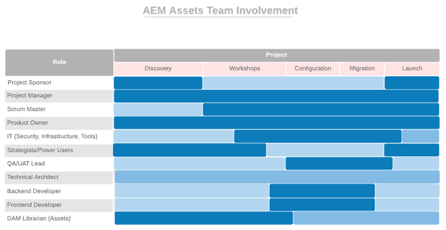

# **Börja med att skaffa rätt personer i rätt roller**

Det finns en chans att olika avdelningar inom organisationen har olika aspekter av den digitala upplevelsen. Utan styre är steget klart för en oändlig debatt, konflikter och förvirring.

Digital styrning börjar med att ta reda på vem som har ansvaret för vad och vem som gör vilket digitalt fokuserat jobb. Du kan behöva göra en del strategiska rekryteringar för att lägga till nödvändiga kunskaper. En ännu större utmaning är att driva på en kulturförändring - att bygga upp ett brett stöd för den nya tekniken och hjälpa människor att vänja sig vid nya sätt att göra saker och ting. En viktig del av denna satsning är att skapa en digital community där människor kan lära sig av och stödja varandra.

För närvarande fokuserar vi på att sätta rätt personer i rätt jobb för att driva driftsättningen av Adobe Experience Manager. För varje kärnprodukt - Experience Manager Sites och Experience Manager Assets - har vi tagit fram en lista över de roller du behöver fylla, tillsammans med de färdigheter, den expertis och de attribut som gör att människor kan arbeta effektivt i de olika rollerna.

Din uppgift den här veckan är att granska båda listorna med ditt implementeringsteam och se till att du har personer med relevanta kvalifikationer i varje roll.

## **Viktiga roller för webbplatser AEM Experience Manager**

Ett vinnande team behöver nio personer i rätt platser, precis som ert driftsättningsteam. Hur framgångsrik du är med Adobe Experience Manager Sites beror på styrkan hos era teammedlemmar och hur väl de arbetar tillsammans. Se till att du har tilldelats de här nio rollerna
till personer med de föreslagna kvalifikationerna.

| Roll | Kompetens | Kapacitetsnivå | Kvaliteter |
|--- |--- |--- |--- |
| Projektledare | PMP-certifiering, Agile-certifiering, erfarenhet av riskhantering | Expert | Rättsligt, konsekvent, ansvarsfullt, organiserat, positivt, lättillgängligt, villigt att anamma förändring |
| Scrum Överordnad | ScrumMaster-certifiering, Agile-certifiering, förenklingsupplevelse | Expert | Enhetlig, kreativ |
| Produktägare | Agile-certifiering, god förståelse för företagets behov | Expert | Balanserad, säker |
| IT-ansvariga för säkerhet, infrastruktur, verktyg | CISM-certifiering, Adobe Experience Manager Component Developer-certifiering | Expert | Detaljorienterad |
| Strategister/Power Users | Kunskap i Adobe Experience Manager Sites | Till expert | Tensiöst, nyfiken, grundligt, öppet sinne, villig att omfamna förändring, samarbete |
| QA/UAT Lead | Smidig certifiering, förståelse för SDLC | Meddelande till Mellanhand | Detaljorienterad, processenhet, konsekvent |
| Teknisk arkitekt | IT-infrastruktur | Expert | Detaljorienterad, processdriven, konsekvent |
| Back-end Developer | Agile-certifiering, erfarenhet av datorprogrammering och datavetenskap | Meddelande till Mellanhand | Detaljorienterad, processdriven, konsekvent |
| Front-end Developer | Smidig certifiering, insikt i HTML, CSS och JavaScript | Meddelande till Mellanhand | Detaljorienterad, processdriven, konsekvent |

Nu när du vet vilka roller som krävs kan du titta på tabellen nedan för att se när varje roll spelar i implementeringsprocessen.

 

**Granska den här listan med ditt implementeringsteam** och se till att du har personer med relevanta kvalifikationer i varje roll. Teammedlemmar som är mindre bekanta med Adobe Experience Cloud kan använda [Experience League](https://experienceleague.adobe.com/#recommended/solutions/experience-manager) utbildningsresurser för att bli certifierade via [Adobe Digital Learning](https://learning.adobe.com/certification.html).

## **Viktiga roller för AEM Experience Manager Assets**

Från Architect till ScrumMaster är alla roller i teamet oumbärliga - inklusive DAM-biblioteket.

Du kanske redan har de flesta personer som behövs för att köra en lyckad implementering av Adobe Experience Manager Assets. Listan liknar den för Adobe Experience Manager Sites, med ett viktigt tillägg: behöver ni en bibliotekarier för att era digitala resurser ska vara ordnade och märkta på ett sätt som gör dem enkla att hitta.

| Roll | Kompetens | Kapacitetsnivå | Kvaliteter |
|--- |--- |--- |--- |
| Projektledare | PMP-certifiering, Agile-certifiering, erfarenhet av riskhantering | Expert | Rättsligt, konsekvent, ansvarsfullt, organiserat, positivt, lättillgängligt, villigt att anamma förändring |
| Scrum Överordnad | ScrumMaster-certifiering, Agile-certifiering, förenklingsupplevelse | Expert | Enhetlig, kreativ |
| Produktägare | Agile-certifiering, god förståelse för företagets behov | Expert | Balanserad, säker |
| IT-ansvariga för säkerhet, infrastruktur, verktyg | CISM-certifiering, Adobe Experience Manager Component Developer-certifiering | Expert | Detaljorienterad |
| Strategister/Power Users | Kunskap i Adobe Experience Manager Sites | Till expert | Tensiöst, nyfiken, grundligt, öppet sinne, villig att omfamna förändring, samarbete |
| QA/UAT Lead | Smidig certifiering, förståelse för SDLC | Meddelande till Mellanhand | Detaljorienterad, processenhet, konsekvent |
| Teknisk arkitekt | IT-infrastruktur | Expert | Detaljorienterad, processdriven, konsekvent |
| Back-end Developer | Agile-certifiering, erfarenhet av datorprogrammering och datavetenskap | Meddelande till Mellanhand | Detaljorienterad, processdriven, konsekvent |
| Front-end Developer | Smidig certifiering, insikt i HTML, CSS och JavaScript | Meddelande till Mellanhand | Detaljorienterad, processdriven, konsekvent |
| DAM-bibliotek | Bibliotekets vetenskapliga bakgrund och examen | Expert | Detaljorienterad, processdriven, organiserad |

Nu när du vet vilka roller som krävs kan du titta på tabellen nedan för att se när varje roll spelar i implementeringsprocessen.

 

>[!TIP]
>
> Läs mer om Adobe Experience Cloud och utnyttja resurser på [Experience League](https://experienceleague.adobe.com/#recommended/solutions/experience-manager) och bli certifierad via [Adobe Digital Learning](https://learning.adobe.com/certification.html).