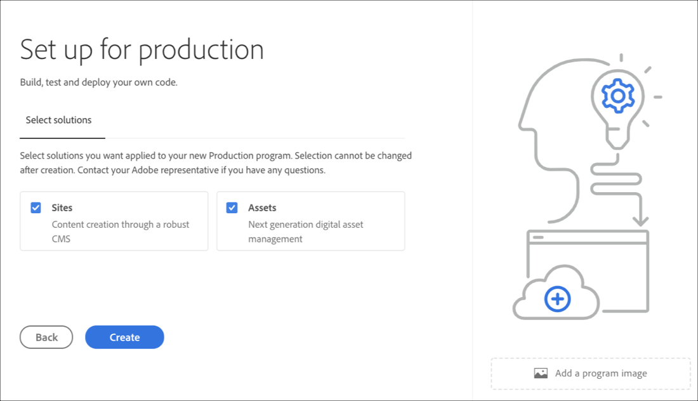

# Skapa ett program {#create-a-program}

Den molnbaserade lösningen ger användaren de behörigheter som krävs och möjlighet att skapa ett program på en självbetjäningsmodell.

Guiden för att skapa ett program ber användaren att skicka in information beroende på vad användaren vill göra för att skapa programmet inom gränserna för vad som är tillgängligt för kunden eller organisationen.

Om det är första gången du får tillgång till Cloud Manager eller om det inte finns några program i klienten visas **Skapa ditt första program** -fönster. Om användaren väljer *Esc* eller klickar utanför dialogrutan visas följande skärm:

## Använda guiden Skapa program {#using-create-program-wizard}

Beroende på vad användaren har för avsikt att skapa programmet inom gränserna för vad som är tillgängligt för den specifika kunden/organisationen, uppmanas användaren att skicka in en eller flera uppgifter.

>[!NOTE]
>If a program already exists, then you will see **Add Program** on the top right of the landing page, as shown in the figure below.

## Skapa ett sandlådeprogram {#create-sandbox-program}

Följ stegen nedan för att skapa ett sandlådeprogram:

1. Välj **Konfigurera en sandlåda** i guiden Skapa program. Användaren skickar programnamnet innan han/hon väljer **Skapa**.

   

1. Användaren ser det nya sandlådeprogramkortet på landningssidan och kan hovra över det för att välja molnhanterarikonen för att navigera till översiktssidan för Cloud Manager. Kortet informerar användaren om status för automatisk installation av det nyskapade sandlådeprogrammet. Användaren ser förloppet.

   

1. När programmet har konfigurerats och projektskapandet är klart kan användaren få åtkomst till **länken Hantera Git** , vilket visas i bilden nedan:

   

   >[!NOTE]
   >
   >Mer information om hur du får åtkomst till och hanterar Git-databasen med hjälp av Git-kontohantering för självbetjäning från användargränssnittet i Cloud Manager finns i [Åtkomst till Git](/help/implementing/cloud-manager/accessing-git.md).

1. När utvecklingsmiljön har skapats kan användaren **komma åt AEM** -länken, vilket visas i bilden nedan:

   

1. När icke-produktionsflödet som distribueras till utveckling är klart vägleder guiden användaren till antingen åtkomst AEM (under utveckling) eller distribution av kod till utvecklingsmiljön:

   

   >[!NOTE]
   >Du kan också redigera, byta eller lägga till ett program från sidan Översikt över Cloud Manager, enligt nedan:

   

## Ta bort ett sandlådeprogram {#delete-sandbox-program}

En sandlådeprogramanvändare i *Business Owner* eller *Deployment Manager* -rollen i Cloud Manager kan ta bort sin produktions- och scenmiljö som angetts via användargränssnittet i Cloud Manager.

>[!NOTE]
>Om du väljer borttagningsalternativet för antingen produktion eller scen tas även det andra bort i uppsättningen.

Borttagningsalternativet är tillgängligt från landningssidan enligt nedan:

Eller

Välj **Ta bort program** på sidan **Programöversikt** för att ta bort ditt sandlådeprogram.

## Skapa ett vanligt program {#create-regular-program}

Ett *Regelbundet* program är avsett för användare som är bekanta med AEM och Cloud Manager och som är redo att börja skriva, bygga och testa kod i syfte att distribuera den till Production.

Följ stegen nedan för att skapa ett vanligt program:

1. Välj **Konfigurera för produktion** i guiden Skapa program för att skapa ett vanligt program. Användaren kan godkänna standardprogramnamnet eller redigera det innan du väljer **Fortsätt**.

   

1. Användaren väljer lösningar som ska inkluderas i programmet på skärmen som visas efter skärmen ovan.

   >[!NOTE]
   >
   >Skärmen nedan visas endast för de kunder som har köpt mer än en lösning. För kunder som bara köpt en lösning visas inte skärmen för val av lösning nedan.

   

1. När du har valt lösningarna klickar du på **Skapa**.

   

1. När du ser ditt programkort på landningssidan för du pekaren över det och väljer ikonen Cloud Manager för att navigera till **översiktssidan** för Cloud Manager.

   

1. Det huvudsakliga anropskortet leder användaren till att skapa en miljö, skapa ett icke-produktionsflöde och slutligen till en produktionsprocess.
   

   >[!NOTE]
   >
   >A regular program does not have **Auto-setup** feature.

