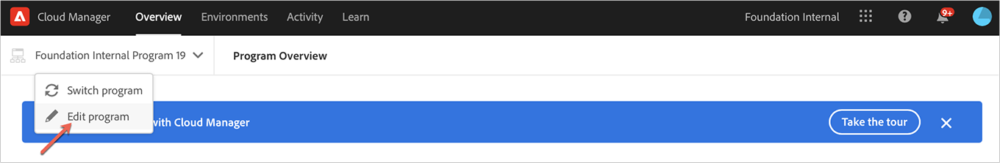

# Redigera ett sandlådeprogram {#create-sandbox-program}

Användare med nödvändig behörighet kan nu redigera ett produktionsprogram och göra följande på ett självbetjäningssätt:

* Lägg till Sites-lösning i ett befintligt program med Assets (eller vice versa).
* Ta bort platser (eller resurser) från ett befintligt program med både platser och resurser.
* Lägg till andra, outnyttjade lösningsberättigande antingen till ett befintligt program eller som ett nytt program.

   >[!NOTE]
   >En användare i rollen Business Owner måste vara inloggad för att programmet ska kunna redigeras.

Följ stegen nedan för att redigera ett sandlådeprogram:

1. Klicka på alternativet **Redigera program** på sidan *Översikt* i Cloud Manager

   

1. På sidan **Redigera program** visas två flikar **Allmänt** och **Lösningar och tillägg**.

   Navigera till fliken **Allmänt** för att redigera programbeskrivningen.

   

   På fliken **Lösningar och tillägg** visas två alternativ, till exempel **Platser** och **Resurser** för både produktions- och sandlådeprogram. Du kan också välja alternativet **Commerce**, som är tillgängligt under **Platser**, vilket visas i bilden nedan.

   

   >[!NOTE]
   >Minst en lösning måste väljas för ett program, det vill säga användaren får inte avmarkera alla lösningar under redigeringsprogrammets arbetsflöde.

1. Klicka på **Uppdatera** för att slutföra redigeringsprogrammet.

## Att tänka på när du redigerar ett program {#considerations-editing}

Tänk på följande när du redigerar ett program:

* Minst en lösning måste väljas för ett program, det vill säga användaren får inte avmarkera alla lösningar under redigeringsprogrammets arbetsflöde.

* Om du klickar på knappen **Spara** och de valda lösningarna har ändrats kommer lösningsuppdateringar i miljöer att börja gälla efter nästa distribution.
