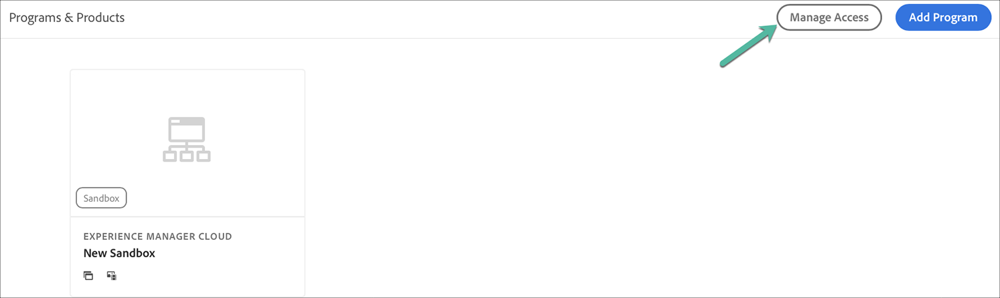

# Få tillgång till Experience Manager as a Cloud Service {#navigation}

När din systemadministratör har gett dig åtkomst till Cloud Manager får du ett e-postmeddelande som tar dig till inloggningssidan för Cloud Manager som också är tillgänglig via [Adobe Experience Cloud](https://my.cloudmanager.adobe.com/).

När inloggningen är klar dirigeras du till landningssidan för Cloud Manager enligt nedan.

## SysAdmin-uppgifter {#sysadmin-tasks}

En användare med rollen SysAdmin kan nu få direkt åtkomst till Admin Console för att hantera roller och behörigheter och få åtkomst till AEM instanser.

### Hantera roller {#manage-roles}

Som användare i rollen SysAdmin har du tillgång till platsen i **Admin Console** där användarroller eller behörigheter till Cloud Manager hanteras med ett enda klick.

Mer information om hur du lägger till användare i en profil finns i [Åtkomst till Cloud Manager](https://docs.adobe.com/content/help/en/experience-manager-cloud-service/security/ims-support.html#accessing-cloud-manager).

>[!NOTE]
>För vissa organisationer som fick åtkomst till AEM som Cloud Service före januari 2020 kommer dessa att hämtas till Adobe Admin Console och produkt- och miljöproduktprofilen måste väljas.

1. Navigera till startsidan för Cloud Manager och klicka på **Hantera åtkomst**.

   

1. När du klickar på **Hantera åtkomst** navigeras du till **Admin Console** där du kan hantera användarroller och behörigheter för Cloud Manager.

   

### Hantera åtkomst till författarinstansen {#manage-access-aem}

Som användare i rollen SysAdmin har du tillgång till **Admin Console** med ett klick, där du kan navigera direkt till författarinstansen och hantera åtkomsten.

>[!NOTE]
>För vissa organisationer som fick åtkomst till AEM som Cloud Service före januari 2020 kommer dessa att hämtas till Adobe Admin Console och produkt- och miljöproduktprofilen måste väljas.

Mer information finns i [Åtkomst till en instans i AEM som en Cloud Service](https://docs.adobe.com/content/help/en/experience-manager-cloud-service/security/ims-support.html#accessing-instance-cloud-service).

1. Navigera till **Miljökort** från sidan **Programöversikt** och klicka på **Hantera åtkomst**.

   

   Eller

   **Hantera** åtkomst är även tillgängligt från knappen  **** Hantera om du klickar på  **** Detaljer i  **** miljökortet.

   

1. När du klickar på **Hantera åtkomst** navigeras du till **Admin Console** där du har åtkomst till författarinstansen av miljön.

   

## För befintliga AMS-kunder {#existing-aem}

Om du är en befintlig AMS-kund (Adobe Managed Services) och har tillgång till Cloud Service, visas dina befintliga program och knappen **Lägg till program** längst upp till höger på landningssidan.

Om du inte ser knappen **Lägg till program** och har frågor om åtkomst till Cloud Service kontaktar du Adobe.

Mer information finns i [Lägga till ett nytt program i Cloud Service med befintliga program](/help/onboarding/getting-access-to-aem-in-cloud/first-time-login.md#existing-program).

## För nya Cloud Service {#new-cloud-services}

Om du är ny Cloud Service-kund kommer du att se knappen **Lägg till program** längst upp till höger på en tom landningssida. Du vill lägga till ett nytt program i Cloud Servicen.

Mer information finns i [Lägga till ett nytt program i Cloud Service utan befintliga program](/help/onboarding/getting-access-to-aem-in-cloud/first-time-login.md#no-program).

