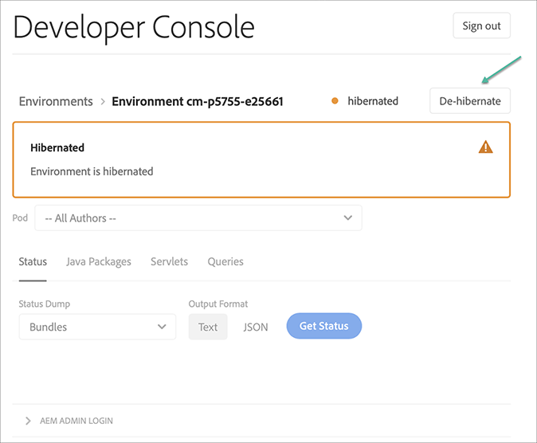

# Sandlådeprogram {#sandbox-programs}

## Introduktion {#introduction}

Ett sandlådeprogram är en av de två typer av program som finns i AEM Cloud Service, och det andra är ett vanligt program.

En sandlåda skapas vanligtvis för utbildning, löpande demonstrationer, aktivering eller korrektur av begrepp (POC). De är inte avsedda att bära livstrafik. De omfattas inte av [AEM som en Cloud Service](https://www.adobe.com/legal/service-commitments.html).

Miljöerna som skapas i en sandlåda är inte konfigurerade för automatisk skalning. Därför är de inte lämpliga för prestanda- eller belastningstestning.

Sandlådeprogram innehåller Sites and Assets och är automatiskt ifyllda med en Git-databas, en utvecklingsmiljö och en icke-produktionsprocess.  Git-databasen innehåller ett exempelprojekt baserat på AEM projekttyp.

Mer information om programtyperna finns i [Förstå program och programtyper](/help/onboarding/getting-access-to-aem-in-cloud/understand-program-types.md).

### Attribut för sandlådeprogram {#attributes-sandbox}

Sandlådeprogram har följande attribut:

1. **Skapa program:** I sandlådeprogrammet skapas automatiskt:
   * konfiguration av projekt med exempelkod och innehåll
   * utvecklingsmiljö
   * skapande av icke-produktionsförlopp för distribution till utvecklingsmiljö (överordnad filial distribuering till utvecklingsmiljö)

1. **Lösningar:** Sandlådeprogram innehåller AEM Sites och Assets.

1. **AEM:** AEM uppdateringar kan användas manuellt i miljöer i sandlådeprogram och skickas inte automatiskt.

1. **Viloläge:** miljöer i ett sandlådeprogram försätts automatiskt i viloläge om ingen aktivitet identifieras under en viss tid. Vilolägen miljöer kan avaktiveras manuellt.

### Skapa ett sandlådeprogram {#creating-sandbox-program}

Med en guide kan du skapa ett sandlådeprogram.

Mer information om hur du skapar ett sandlådeprogram finns i [Skapa ett sandlådeprogram](/help/onboarding/getting-access-to-aem-in-cloud/creating-a-program.md#create-sandbox-program).

### Skapar sandlådemiljöer {#creating-sandbox-environments}

Sandlådeprogram levereras till en utvecklingsmiljö när programmet skapas automatiskt. Utvecklingsmiljön innehåller som standard en författare och en publiceringsnivå.

Miljöuppsättningen för produktionsscenen kan läggas till manuellt i sandlådeprogrammet när användaren är redo att ställa in en produktionspipeline.

Mer information om hur du skapar en miljö manuellt finns i [Lägga till miljö](/help/implementing/cloud-manager/manage-environments.md).

### Tar bort sandlådemiljöer {#deleting-sandbox-environments}

Användare med nödvändig behörighet kan ta bort en utvecklings- eller produktions-/scenmiljö eller uppsättningar.

Mer information om hur du tar bort en miljö finns i [Ta bort miljö](/help/implementing/cloud-manager/manage-environments.md#deleting-environment).

## Viloläge och avvänjning av sandlådemiljöer {#hibernating-introduction}

Sandbox Program-miljöer anger ett *viloläge* om ingen aktivitet identifieras under en viss tid.

>[!NOTE]
>Viloläge är unikt för sandlådeprogrammiljöer. Vanliga programmiljöer går inte i viloläge.

### Viloläge {#hibernation-introduction}

Viloläge kan antingen inträffa automatiskt eller manuellt. Det kan ta upp till några minuter för Sandbox-programmiljöer att gå in i viloläget *a1/>.* Data bevaras under viloläge.

Viloläge kategoriseras som:

* **Miljöerna i**  programmet AutomaticSandbox försätts i viloläge automatiskt efter åtta timmars inaktivitet, vilket innebär att varken författaren eller publiceringstjänsten får begäranden.

* **Manuell**: Som användare kan du förvara en sandlådeprogrammiljö manuellt, men du behöver inte göra det eftersom viloläget inträffar automatiskt efter en viss inaktivitetsperiod (åtta timmar).

>[!CAUTION]
>I den senaste versionen, som du länkar till utvecklarkonsolen direkt från Cloud Manager, kan du inte förlägga en sandlådeprogrammiljö i viloläge. Du kan lösa problemet en gång på Developer Console. Lägg till följande mönster i slutet av URL:en `#release-cm-p1234-e5678 where 1234` 1234 som *program-ID* och 5678 är ditt *miljö-ID*.

#### Använda manuell viloläge {#using-manual-hibernation}

Du kan manuellt förvara ditt sandlådeprogram från utvecklarkonsolen på två olika sätt:

* Skärm för miljödetaljer
* Miljölistskärm

>[!NOTE]
>Alla användare av Cloud Manager har tillgång till Developer Console för ett sandlådeprogram.

Följ stegen nedan om du vill förvara sandlådeprogrammiljöer manuellt:

1. Gå till **Developer Console**.
Läs [Använda Developer Console](/help/implementing/cloud-manager/manage-environments.md#accessing-developer-console) om du vill veta hur du kommer åt **Developer Console** från **Miljökortet**.
   >[!IMPORTANT]
   >Om du länkar till **utvecklarkonsolen** direkt från Cloud Manager kan du inte förvara en sandlådeprogrammiljö. Du kan lösa problemet en gång på Developer Console. Lägg till följande mönster i slutet av URL:en `#release-cm-p1234-e5678 where 1234` 1234 som *program-ID* och 5678 är ditt *miljö-ID*.

1. Klicka på **Viloläge**, så som visas i figuren nedan:

   

   Eller

   Klicka på länken **Miljöer** längst upp till vänster för att visa miljölistan och klicka sedan på **Viloläge**, vilket visas i figuren nedan:

   

1. Bekräfta steget genom att klicka på **Hibernate**.

   

1. När viloläget är slutfört visas ett meddelande om detta i **Developer Console**.

   

### Avviloläge {#de-hibernation-introduction}

1. Gå till **Developer Console**.
Läs [Använda Developer Console](/help/implementing/cloud-manager/manage-environments.md#accessing-developer-console) om du vill veta hur du kommer åt **Developer Console** från **Miljökortet**.

   >[!IMPORTANT]
   >Om du länkar till **utvecklarkonsolen** direkt från Cloud Manager kan du inte avplacera en sandlådeprogrammiljö. Du kan lösa problemet en gång på Developer Console. Lägg till följande mönster i slutet av URL:en `#release-cm-p1234-e5678 where 1234` 1234 som *program-ID* och 5678 är ditt *miljö-ID*.

   >[!NOTE]
   >Du kan också navigera till **Developer Console** för att avaktivera viloläget genom att försöka komma åt författaren eller publiceringstjänsten för en miljö som redan är i viloläge. I så fall visas en landningssida med en länk till Developer Console. Se avsnittet Accessing a Hibernated Environment nedan.

   >[!IMPORTANT]
   >Åtkomst till Developer Console definieras av **molnhanteraren - utvecklarrollen** i **Admin Console**. En användare med en utvecklarrollbehörighet kan avplacera en sandlådeprogrammiljö.

1. Klicka på **Avviloläge**, vilket visas i figuren nedan:

   

   Eller

   Klicka på länken **Miljöer** längst upp till vänster för att visa miljölistan och klicka sedan på **Ta bort viloläge**, vilket visas i figuren nedan

   

1. Klicka på **Föregående** för att bekräfta steget.

   

1. Du får ett meddelande om att avvänjningsprocessen har startat och att du kommer att uppdateras med förloppet.

   

1. När processen är klar är sandlådeprogrammiljön aktiv igen.

   

#### Behörigheter att ta bort från viloläget {#permissions-de-hibernate}

Alla användare med en produktprofil som ger dem åtkomst till AEM som Cloud Service bör ha tillgång till **Developer Console**, vilket gör att de kan avplacera miljön i viloläge.

#### Åtkomst till en viloläge {#accessing-hibernated-environment}

När användaren gör en webbläsarbegäran mot antingen författaren eller publiceringsnivån i en miljö i viloläge, kommer användaren att få en landningssida som beskriver miljöns viloläge, vilket visas i bilden nedan:

### Viktiga överväganden {#important-considerations}

Några viktiga saker att tänka på när det gäller miljöer med viloläge och viloläge är:

* En användare kan använda en pipeline för att distribuera anpassad kod till miljöer med viloläge. Miljön förblir i viloläge och den nya koden visas i miljön när den har tagits bort från viloläget.

* AEM uppgraderingar kan användas i miljöer i viloläge, som kunderna manuellt kan aktivera via Cloud Manager. Miljön förblir i viloläge och den nya versionen visas i miljön när den har tagits bort från viloläget.

>[!NOTE]
>För närvarande anges det inte om en miljö är i viloläge i molnhanteraren.

## AEM till sandlådemiljöer {#aem-updates-sandbox}

Mer information finns i [AEM versionsuppdateringar](/help/implementing/deploying/aem-version-updates.md).

Användaren kan manuellt uppdatera miljöerna AEM sandlådeprogrammet.

Mer information om hur du uppdaterar en miljö finns i [Uppdateringsmiljö](/help/implementing/cloud-manager/manage-environments.md#updating-dev-environment).

>[!NOTE]
>* En manuell uppdatering kan bara köras när målmiljön har en korrekt konfigurerad pipeline.
>* En manuell uppdatering av antingen *Production* eller *Stage*-miljön uppdateras automatiskt. Miljöuppsättningen Production+Stage måste finnas i samma AEM.

