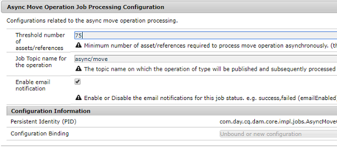

# Asynkrona åtgärder {#asynchronous-operations}

För att reducera negativ inverkan på prestandan bearbetar Adobe Experience Manager vissa långvariga och resurskrävande åtgärder asynkront. Asynkron bearbetning innebär att flera olika jobb ställs på kö och att de sedan körs seriellt beroende på om det finns systemresurser tillgängliga.

Dessa åtgärder omfattar:

* Att ta bort många resurser.
* Att flytta många resurser eller resurser med många referenser.
* Att exportera/importera metadata för resurser i grupp.
* Att hämta resurser som ligger över det angivna gränsvärdet från en fjärrdistribution av Experience Manager.
* Att flytta sidor.
* Att öppna Live-kopior.

Du kan se statusen för asynkrona jobb på **[!UICONTROL Async Job Status]** instrumentpanelen via **Global Navigation** -> **Tools** -> **Operations** -> **Jobs**.

>[!NOTE]
>
>Som standard körs asynkrona jobb parallellt. Om *`n`* är antalet processorkärnor kan *`n/2`* jobb köras parallellt som standard. Modifiera **[!UICONTROL Async Operation Default Queue Config]** och **Async Operation Page Move and Rollout Config** från webbkonsolen för att använda anpassade inställningar för jobbkön.
>
>Mer information finns i [konfigurationer av kön](https://sling.apache.org/documentation/bundles/apache-sling-eventing-and-job-handling.html#queue-configurations).

## Övervaka statusen för asynkrona åtgärder {#monitor-the-status-of-asynchronous-operations}

När AEM bearbetar en åtgärd asynkront får du ett meddelande i din [inkorg](/help/sites-cloud/authoring/getting-started/inbox.md) och via e-post (om den är aktiverad).

Gå till sidan **[!UICONTROL Async Job Status]** för att se detaljerad status gällande asynkrona åtgärder.

1. Klicka på **[!UICONTROL Operations]** > **[!UICONTROL Jobs]** i Experience Managers gränssnitt.

1. Granska informationen om åtgärderna på sidan **[!UICONTROL Async Job Status]**.

   

   Värdet i kolumnen **[!UICONTROL Status]** ger information om förloppet för en viss åtgärd. Beroende på förloppet visas ett av följande statusvärden:

   * **[!UICONTROL Active]**: åtgärden bearbetas

   * **[!UICONTROL Success]**: åtgärden har slutförts

   * **[!UICONTROL Fail]** eller **[!UICONTROL Error]**: det gick inte att bearbeta åtgärden

   * **[!UICONTROL Scheduled]**: åtgärden är schemalagd för bearbetning vid ett senare tillfälle

1. Du kan avbryta en aktiv åtgärd genom att välja den i listan och klicka på **[!UICONTROL Stop]** i verktygsfältet.

   

1. Välj åtgärden och klicka på **[!UICONTROL Open]** i verktygsfältet för att se ytterligare information såsom beskrivning och loggar.

   

   Sidan med jobbinformation visas.

   

1. Välj **[!UICONTROL Delete]** i verktygsfältet för att ta bort åtgärden från listan. Klicka på **[!UICONTROL Download]** för att ladda ned informationen i en CSV-fil.

   >[!NOTE]
   >
   >Om ett jobbs status är **Active** eller **Queued** kan det inte tas bort.

## Rensa slutförda jobb {#purging-completed-jobs}

AEM utför en rensning varje dag klockan 01:00 för att ta bort slutförda asynkrona jobb som är mer än en dag gamla.

Du kan ändra schemat för rensningen och hur länge information om slutförda jobb behålls innan den tas bort. Du kan också konfigurera det maximala antalet slutförda jobb för vilka information sparas vid någon tidpunkt.

1. Klicka på **[!UICONTROL Tools]** > **[!UICONTROL Operations]** > **[!UICONTROL Web Console]** i Global Navigation.
1. Öppna jobbet **[!UICONTROL Adobe Granite Async Jobs Purge Scheduled Job]**.
1. Ange:
   * Gränsvärdet för antal dagar efter vilka slutförda jobb tas bort.
   * Det maximala antalet jobb för vilka information sparas i historiken.
   * Cron-uttrycket för när rensningen ska köras.

   

1. Spara ändringarna.

## Konfigurera asynkron bearbetning {#configuring-asynchronous-processing}

Du kan konfigurera gränsvärdet för antal resurser, sidor eller referenser vilket låter AEM bearbeta en viss åtgärd asynkront samt skicka e-postmeddelanden när jobben bearbetas.

### Konfigurera asynkrona åtgärder för att ta bort resurser {#configuring-synchronous-delete-operations}

Om antalet resurser eller mappar som ska tas bort överstiger gränsvärdet utförs borttagningen asynkront.

1. Klicka på **[!UICONTROL Tools]** > **[!UICONTROL Operations]** > **[!UICONTROL Web Console]** i Global Navigation.
1. Öppna **[!UICONTROL Async Process Default Queue Configuration.]** via webbkonsolen
1. I rutan **[!UICONTROL Threshold number of assets]** ska du ange gränsvärdet för antal resurser/mappar gällande asynkron bearbetning av borttagningar.

   

1. Markera alternativet **Enable email notification** för att få e-postmeddelanden för den här jobbstatusen. Exempel: lyckades eller misslyckades.
1. Spara ändringarna.

### Konfigurera asynkrona åtgärder för att flytta resurser {#configuring-asynchronous-move-operations}

Om antalet resurser/mappar eller referenser som ska flyttas överstiger gränsvärdet utförs flytten asynkront.

1. Klicka på **[!UICONTROL Tools]** > **[!UICONTROL Operations]** > **[!UICONTROL Web Console]** i Global Navigation.
1. Öppna **[!UICONTROL Async Move Operation Job Processing Configuration.]** via webbkonsolen
1. I rutan **[!UICONTROL Threshold number of assets/references]** ska du ange gränsvärdet för antal resurser/mappar eller referenser gällande asynkron bearbetning av flyttningar.

   

1. Markera alternativet **Enable email notification** för att få e-postmeddelanden för den här jobbstatusen. Exempel: lyckades eller misslyckades.
1. Spara ändringarna.

### Konfigurera asynkrona åtgärder för att flytta sidor {#configuring-asynchronous-page-move-operations}

Om antalet referenser till de sidor som ska flyttas överstiger gränsvärdet utförs flytten asynkront.

1. Klicka på **[!UICONTROL Tools]** > **[!UICONTROL Operations]** > **[!UICONTROL Web Console]** i Global Navigation.
1. Öppna **[!UICONTROL Async Page Move Operation Job Processing Configuration.]** via webbkonsolen
1. I fältet **[!UICONTROL Threshold number of references]** ska du ange gränsvärdet för antal referenser gällande asynkron bearbetning för att flytta sidor.

   

1. Markera alternativet **Enable email notification** för att få e-postmeddelanden för den här jobbstatusen. Exempel: lyckades eller misslyckades.
1. Spara ändringarna.

### Konfigurera asynkrona MSM-åtgärder {#configuring-asynchronous-msm-operations}

1. Klicka på **[!UICONTROL Tools]** > **[!UICONTROL Operations]** > **[!UICONTROL Web Console]** i Global Navigation.
1. Öppna **[!UICONTROL Async Page Move Operation Job Processing Configuration.]** via webbkonsolen
1. Markera alternativet **Enable email notification** för att få e-postmeddelanden för den här jobbstatusen. Exempel: lyckades eller misslyckades.

   

1. Spara ändringarna.

>[!MORELIKETHIS]
>
>* [Skapa och ordna sidor](/help/sites-cloud/authoring/fundamentals/organizing-pages.md)
>* [Importera och exportera resursers metadata gruppvis](/help/assets/metadata-import-export.md).
>* [Använd länkade resurser för att dela DAM-resurser från fjärrdistributioner](/help/assets/use-assets-across-connected-assets-instances.md).

