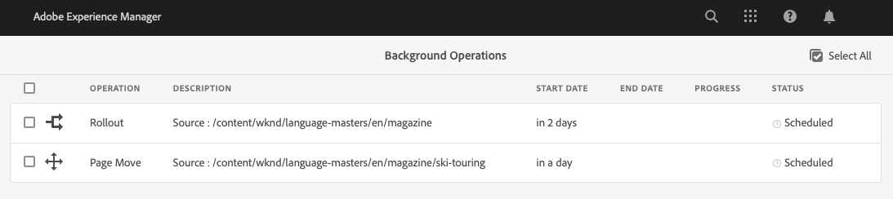
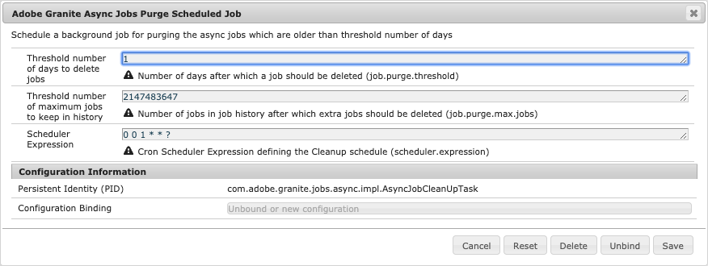

# Asynkrona åtgärder {#asynchronous-operations}

För att minska den negativa inverkan på prestandan bearbetar Adobe Experience Manager vissa långvariga och resurskrävande åtgärder asynkront. Asynkron bearbetning innebär att du måste köa flera jobb och köra dem på ett seriellt sätt beroende på om det finns systemresurser tillgängliga.

Dessa åtgärder omfattar:

* Tar bort många resurser
* Flytta många resurser eller resurser med många referenser
* Exportera/importera metadata för resurser i grupp
* Hämtar resurser, som ligger över den angivna tröskelgränsen, från en Experience Manager-fjärrdistribution
* Flytta sidor
* Öppnar Live-kopior

Du kan visa status för asynkrona jobb från **[!UICONTROL Async Job Status]** instrumentpanelen på **Global Navigation** -> **Tools** -> **Operations** -> **Jobs**.

>[!NOTE]
>
>Som standard körs asynkrona jobb parallellt. Om *`n`* är antalet processorkärnor kan *`n/2`* jobb köras parallellt som standard. Om du vill använda anpassade inställningar för jobbkön ändrar du **[!UICONTROL Async Operation Default Queue Config]** och **Async Operation Page Move and Rollout Config** från webbkonsolen.
>
>Mer information finns i [Kökonfigurationer](https://sling.apache.org/documentation/bundles/apache-sling-eventing-and-job-handling.html#queue-configurations).

## Övervaka status för asynkrona åtgärder {#monitor-the-status-of-asynchronous-operations}

När AEM bearbetar en åtgärd asynkront får du ett meddelande i din [inkorg](/help/sites-cloud/authoring/getting-started/inbox.md) och via e-post (om den är aktiverad).

Om du vill visa status för asynkrona åtgärder i detalj går du till **[!UICONTROL Async Job Status]** sidan.

1. I gränssnittet Experience Manager klickar du **[!UICONTROL Operations]** > **[!UICONTROL Jobs]**.

1. Granska informationen om åtgärderna på **[!UICONTROL Async Job Status]** sidan.

   

   Information om förloppet för en viss åtgärd finns i värdet i **[!UICONTROL Status]** kolumnen. Beroende på förloppet visas ett av följande statusvärden:

   * **[!UICONTROL Active]**: Åtgärden bearbetas

   * **[!UICONTROL Success]**: Åtgärden har slutförts

   * **[!UICONTROL Fail]** eller **[!UICONTROL Error]**: Det gick inte att bearbeta åtgärden

   * **[!UICONTROL Scheduled]**: Åtgärden är schemalagd för bearbetning vid ett senare tillfälle

1. Om du vill avbryta en aktiv åtgärd markerar du den i listan och klickar på **[!UICONTROL Stop]** i verktygsfältet.

   

1. Om du vill visa extra information, till exempel beskrivning och loggar, väljer du åtgärden och klickar på **[!UICONTROL Open]** i verktygsfältet.

   

   Sidan med jobbinformation visas.

   

1. Om du vill ta bort åtgärden från listan väljer du **[!UICONTROL Delete]** den i verktygsfältet. Om du vill hämta information i en CSV-fil klickar du på **[!UICONTROL Download]**.

   >[!NOTE]
   >
   >Du kan inte ta bort ett jobb om dess status är **Aktiv** eller **Köad**.

## Töm slutförda jobb {#purging-completed-jobs}

AEM kör ett rensningsjobb varje dag klockan 01:00 för att ta bort slutförda asynkrona jobb som är mer än en dag gamla.

Du kan ändra schemat för rensningsjobbet och hur länge detaljer om slutförda jobb behålls innan de tas bort. Du kan också konfigurera det maximala antalet slutförda jobb för vilka information sparas när som helst.

1. I Global Navigation klickar du **[!UICONTROL Tools]** > **[!UICONTROL Operations]** > **[!UICONTROL Web Console]**.
1. Öppna **[!UICONTROL Adobe Granite Async Jobs Purge Scheduled Job]** jobbet.
1. Ange:
   * Tröskelvärdet för antal dagar efter vilka slutförda jobb tas bort.
   * Det maximala antalet jobb för vilka information sparas i historiken.
   * Kronuttrycket för när tömningen ska köras.

   

1. Spara ändringarna.

## Konfigurera asynkron bearbetning {#configuring-asynchronous-processing}

Du kan konfigurera tröskelvärdet för antal resurser, sidor eller referenser för AEM så att en viss åtgärd bearbetas asynkront samt växla e-postmeddelanden för när jobben bearbetas.

### Konfigurera asynkrona åtgärder för att ta bort resurser {#configuring-synchronous-delete-operations}

Om antalet resurser eller mappar som ska tas bort överstiger tröskelvärdet, utförs borttagningsåtgärden asynkront.

1. I Global Navigation klickar du **[!UICONTROL Tools]** > **[!UICONTROL Operations]** > **[!UICONTROL Web Console]**.
1. Öppna webbkonsolen **[!UICONTROL Async Process Default Queue Configuration.]**
1. I **[!UICONTROL Threshold number of assets]** rutan anger du tröskelvärdet för antal resurser/mappar för asynkron bearbetning av borttagningsåtgärder.

   

1. Markera alternativet **Aktivera e-postmeddelanden** för att ta emot e-postmeddelanden för den här jobbstatusen. Exempel: framgång, misslyckades.
1. Spara ändringarna.

### Konfigurera asynkrona åtgärder för flyttning av tillgångar {#configuring-asynchronous-move-operations}

Om antalet resurser/mappar eller referenser som ska flyttas överstiger tröskelvärdet, utförs flyttåtgärden asynkront.

1. I Global Navigation klickar du **[!UICONTROL Tools]** > **[!UICONTROL Operations]** > **[!UICONTROL Web Console]**.
1. Öppna webbkonsolen **[!UICONTROL Async Move Operation Job Processing Configuration.]**
1. I **[!UICONTROL Threshold number of assets/references]** rutan anger du tröskelvärdet för antal resurser/mappar eller referenser för asynkron bearbetning av flyttningsåtgärder.

   

1. Markera alternativet **Aktivera e-postmeddelanden** för att ta emot e-postmeddelanden för den här jobbstatusen. Exempel: framgång, misslyckades.
1. Spara ändringarna.

### Konfigurera asynkrona åtgärder för sidflyttning {#configuring-asynchronous-page-move-operations}

Om antalet referenser till de sidor som ska flyttas överstiger tröskelvärdet, utförs flyttåtgärden asynkront.

1. I Global Navigation klickar du **[!UICONTROL Tools]** > **[!UICONTROL Operations]** > **[!UICONTROL Web Console]**.
1. Öppna webbkonsolen **[!UICONTROL Async Page Move Operation Job Processing Configuration.]**
1. I **[!UICONTROL Threshold number of references]** fältet anger du tröskelvärdet för antal referenser för asynkron bearbetning av åtgärder för att flytta sidor.

   

1. Markera alternativet **Aktivera e-postmeddelanden** för att ta emot e-postmeddelanden för den här jobbstatusen. Exempel: framgång, misslyckades.
1. Spara ändringarna.

### Konfigurera asynkrona MSM-åtgärder {#configuring-asynchronous-msm-operations}

1. I Global Navigation klickar du **[!UICONTROL Tools]** > **[!UICONTROL Operations]** > **[!UICONTROL Web Console]**.
1. Öppna webbkonsolen **[!UICONTROL Async Page Move Operation Job Processing Configuration.]**
1. Markera alternativet **Aktivera e-postmeddelanden** för att ta emot e-postmeddelanden för den här jobbstatusen. Exempel: framgång, misslyckades.

   

1. Spara ändringarna.

>[!MORELIKETHIS]
>
>* [Skapa och ordna sidor](/help/sites-cloud/authoring/fundamentals/organizing-pages.md)
>* [Importera och exportera resursmetadata gruppvis](/help/assets/metadata-import-export.md).
>* [Använd anslutna resurser för att dela DAM-resurser från fjärrdistributioner](/help/assets/use-assets-across-connected-assets-instances.md).

