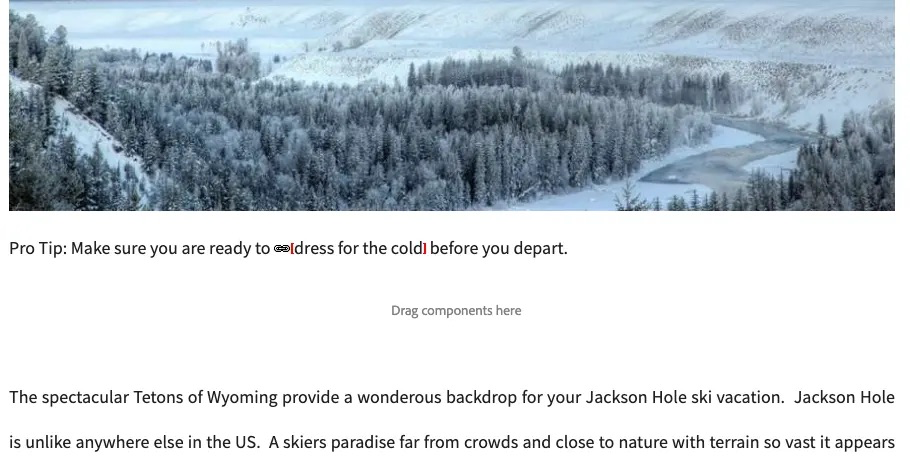

# Länkkontroll {#link-checker}

Lär dig hur funktionen Länkkontroll hjälper författare genom att validera länkar när de läggs till i innehåll och vilka konfigurationsalternativ den erbjuder.

## Ökning {#overview}

Innehållsförfattare behöver inte bekymra sig om att validera alla länkar som de inkluderar i sitt innehåll. Länkkontrollen körs automatiskt så att skribenterna kan få hjälp med sina länkar:

* Validera länkar när de läggs till i innehållet
* Visar en lista över alla externa länkar i innehållet
* Utföra länktomformningar

Länkkontrollen innehåller flera [konfigurationsalternativ](#configuring), t.ex. att definiera valideringen av interna länkar, tillåta att vissa länkar eller länkmönster utelämnas från verifieringen och definiera regler för omskrivning av länkar.

Länkkontrollen verifierar både [interna länkar](#internal) och [externa länkar.](#external)

>[!NOTE]
>
>Eftersom länkkontrollen används för att kontrollera länkarna på alla innehållssidor kan länkkontrollen påverka prestanda för stora databaser. I sådana fall kan du behöva [konfigurera hur ofta Länkkontrollen körs](#configuring) eller [inaktivera den.](#disabling)

## Intern länkkontroll {#internal}

Interna länkar är länkar till annat innehåll i din AEM-databas. Du kan lägga till interna länkar med hjälp av sökvägsväljaren, textredigeraren eller en anpassad komponent. Till exempel:

* Du skapar sidan `/content/wknd/us/en/adventures/ski-touring`
* Den sidan innehåller en länk till `/content/wknd/us/en/adventures/extreme-ironing` i en [textkomponent.](https://experienceleague.adobe.com/sv/docs/experience-manager-core-components/using/wcm-components/text)

Interna länkar valideras så snart innehållsförfattaren lägger till en sådan länk på en sida. Om länken blir ogiltig:

* Den tas bort från utgivaren.
   * Själva länken tas bort.
   * Länktexten finns kvar.
* Den visas som en bruten länk i redigeringsgränssnittet.

## Kontroll av extern länk {#external}

Externa länkar är länkar till innehåll utanför din AEM-databas. Externa länkar kan läggas till med RTF-redigeraren eller med en anpassad komponent. Till exempel:

* Du skapar sidan `/content/wknd/us/en/adventures/ski-touring`
* Den sidan innehåller en länk till `https://bunwarmerthermalunderwear.com` i en [textkomponent.](https://experienceleague.adobe.com/sv/docs/experience-manager-core-components/using/wcm-components/text)

Externa länkar valideras för syntax och genom att deras tillgänglighet kontrolleras. Den här kontrollen utförs asynkront med ett konfigurerbart intervall. Om länkkontrollen hittar en ogiltig extern länk:

* Den tas bort från utgivaren.
   * Själva länken tas bort.
   * Länktexten finns kvar.
* Den visas som en bruten länk i redigeringsgränssnittet.

### Så här fungerar den externa länkkontrollen {#external-details}

Extern länkkontroll använder flera tjänster och om du förstår hur de fungerar blir det lättare att förstå hur du [konfigurerar länkkontrollen efter dina behov.](#configuring)

1. När en innehållsförfattare sparar en länk till en sida aktiveras en händelsehanterare.
1. Händelsehanteraren går igenom allt innehåll under `/content` och söker efter nya eller uppdaterade länkar och lägger till dem i ett cacheminne för länkkontrollen.
1. CQ Link Checker-tjänsten **för** dagen körs sedan regelbundet för att kontrollera om posterna i cachen har giltig syntax.
1. Syntaxvaliderade länkar visas sedan i fönstret [External Link Checker.](#external-using) Men de kommer att vara i läget **Väntande**.
1. CQ Link Checker-aktiviteten **Day** körs sedan regelbundet för att validera länkarna genom att ringa ett GET-samtal.
1. CQ Link Checker-aktiviteten **Day CQ** uppdaterar sedan posterna i fönstret [External Link Checker](#external-using) med resultatet av GET-anropen.

### Använda extern länkkontroll {#external-using}

External Link Checker är en konsol som ger en översikt över alla externa länkar i ditt AEM-innehåll. Så här använder du den externa länkkontrollen:

1. Välj **Verktyg** -> **Webbplatser** i Global Navigation.
1. Välj **Extern länkkontroll** så visas en lista med alla externa länkar.

Varje post i tabellen representerar en extern länk som identifieras av tjänsten Länkkontroll. Följande kolumner visas:

* **Status** - Verifieringsstatusen för länken kan vara något av följande:
   * **Giltig** - Den externa länken kan nås av länkkontrollen.
   * **Väntande** - Den externa länken lades till i webbplatsinnehållet, men har ännu inte validerats av Länkkontrollen.
   * **Ogiltig** - den externa länken kan inte nås av länkkontrollen.
* **URL** - Den externa länken
* **Referent** - Innehållssidan som innehåller den externa länken
   * Detta fylls bara i [om det är konfigurerat.](#configuring)
* **Senast kontrollerad** - Senaste gången länkkontrollen verifierar den externa länken
   * Hur ofta länkar kontrolleras [kan konfigureras.](#configuring)
* **Senaste status** - Den senaste HTML-statuskoden som returnerades när länken Markerades senast kontrollerade den externa länken
* **Senast tillgänglig** - Tid sedan länken senast var tillgänglig för länkkontrollen
* **Senast använd** - Tid sedan sidan med den externa länken senast öppnades i redigeringsgränssnittet

Du kan ändra innehållet i fönstret med hjälp av de två knapparna högst upp i länklistan:

* **Uppdatera** - Uppdatera innehållet i listan
* **Kontrollera** - Om du vill kontrollera en enskild extern länk som är markerad i listan

Alla andra ikoner i fönstret External Link Checker är inaktiva.

## Konfigurera länkkontrollen {#configuring}

Länkkontrollen är automatiskt tillgänglig i körklart läge i AEM. Det finns dock flera OSGi-konfigurationer som kan ändras för att ändra dess beteende:

* **Dag CQ Link Checker Info Storage Service** - Den här tjänsten definierar storleken på cache-minnet för Länkkontroll i databasen.
* **Dagens CQ Link Checker-tjänst** - Den här tjänsten utför asynkron kontroll av syntaxen för externa länkar.
   * Du kan bland annat definiera kontrollperioden och vilka typer av länkar som ignoreras av kontrollfunktionen.
* **Day CQ Link Checker Task** - Den här tjänsten utför GET-validering av externa länkar.
   * Det gör att olika definitioner av intervall kan kontrollera dåliga och bra länkar bland andra alternativ.
* **Dag CQ Link Checker Transformer** - Den här tjänsten konverterar länkar baserat på en användardefinierad regeluppsättning.

Mer information om hur du ändrar OSGi-inställningar finns i dokumentet [Konfigurera OSGi](/help/implementing/deploying/configuring-osgi.md).

## Inaktivera länkkontrollen {#disabling}

Du kan välja att inaktivera länkkontrollen helt. Så här gör du:

1. Öppna OSGi-konsolen.
1. Redigera **dagars CQ Link Checker-transformator**
1. Markera de alternativ som du vill inaktivera:
   * **Inaktivera kontroll** - för att inaktivera validering av länkar
   * **Inaktivera omskrivning** - för att inaktivera länktomformningar
