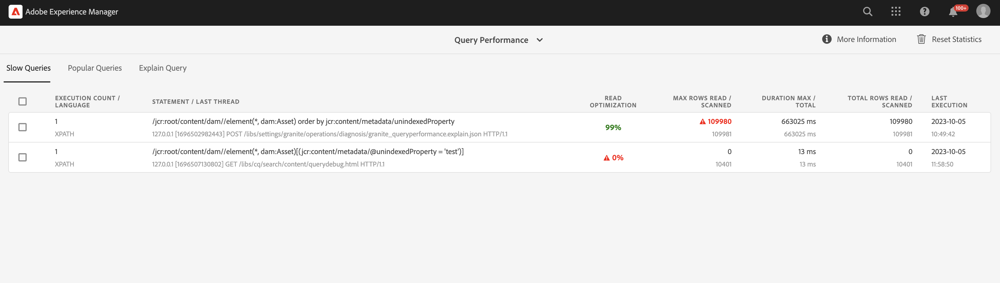

# Bästa praxis för frågor och indexering {#query-and-indexing-best-practices}

På AEM as a Cloud Service är alla operativa aspekter av indexering automatiserade. Detta gör att utvecklare kan fokusera på att skapa effektiva frågor och motsvarande indexdefinitioner.

## När frågor ska användas {#when-to-use-queries}

Frågor är ett sätt att komma åt innehåll, men är inte den enda möjligheten. I många situationer kan innehåll i databasen nås mer effektivt på andra sätt. Du bör tänka på om frågor är det bästa och mest effektiva sättet att komma åt innehåll för ditt användningssätt.

### Databas- och taxonomidesign {#repository-and-taxonomy-design}

När du utformar taxonomin för en databas måste flera faktorer beaktas. Dessa omfattar åtkomstkontroller, lokalisering, komponent- och sidegenskapsarv med mera.

När du utformar en taxonomi som tar upp dessa problem är det också viktigt att tänka på hur&quot;genomskinlighet&quot; är i indexdesignen. I det här sammanhanget är möjligheten att gå igenom en taxonomi att göra det möjligt för innehåll att nås på ett förutsägbart sätt baserat på dess sökväg. Detta gör att du får ett mer effektivt system som är enklare att underhålla än ett som kräver att flera frågor ska köras.

När du utformar en taxonomi är det dessutom viktigt att tänka på om det är viktigt att beställa. Om explicit ordning inte krävs och ett stort antal noder på samma nivå förväntas, är det bättre att använda en oordnad nodtyp, som `sling:Folder` eller `oak:Unstructured`. Om det krävs en beställning `nt:unstructured` och `sling:OrderedFolder` skulle vara lämpligare.

### Frågor i komponenter {#queries-in-components}

Eftersom frågor kan vara en av de mer beskattningsbara åtgärder som utförs i ett AEM är det en bra idé att undvika dem i dina komponenter. Om flera frågor körs varje gång en sida återges kan det ofta försämra systemets prestanda. Det finns två strategier som du kan använda för att undvika att köra frågor när du återger komponenter: **[gå igenom noder](#traversing-nodes)** och **[förhämtningsresultat.](#prefetching-results)**

### Går igenom noder {#traversing-nodes}

Om databasen är utformad på ett sätt som möjliggör tidigare kunskap om platsen för de data som krävs, kan kod som hämtar dessa data från de nödvändiga sökvägarna distribueras utan att behöva köra frågor för att hitta dem.

Ett exempel på detta är att återge innehåll som passar inom en viss kategori. Ett sätt är att ordna innehållet med en kategoriegenskap som kan efterfrågas för att fylla i en komponent som visar objekt i en kategori.

Ett bättre sätt är att strukturera innehållet i en taxonomi efter kategori så att det kan hämtas manuellt.

Om innehållet till exempel lagras i en taxonomi som liknar:

```xml
/content/myUnstructuredContent/parentCategory/childCategory/contentPiece
```

den `/content/myUnstructuredContent/parentCategory/childCategory` noden kan bara hämtas, dess underordnade noder kan tolkas och användas för att återge komponenten.

När du har att göra med en liten eller homogen resultatmängd kan det dessutom vara snabbare att gå igenom databasen och samla ihop de noder som behövs, i stället för att skapa en fråga som returnerar samma resultatmängd. Generellt sett bör frågor undvikas där det är möjligt att göra detta.

### Förhämtningsresultat {#prefetching-results}

Ibland tillåter inte innehållet eller kraven runt komponenten att nodgenomgång används som ett sätt att hämta nödvändiga data. I sådana fall måste de nödvändiga frågorna köras innan komponenten återges, så att optimala prestanda säkerställs.

Om de resultat som krävs för komponenten kan beräknas när den redigeras och det inte finns någon förväntad tid för att innehållet ska ändras, kan frågan köras när en ändring har gjorts.

Om data eller innehåll ändras regelbundet, kan frågan köras enligt ett schema eller via en avlyssnare för uppdateringar av underliggande data. Sedan kan resultaten skrivas till en delad plats i databasen. Alla komponenter som behöver dessa data kan sedan hämta värden från den här noden utan att behöva köra en fråga vid körning.

En liknande strategi kan användas för att behålla resultatet i en minnescache, som fylls i vid start och uppdateras när ändringar görs (med en JCR `ObservationListener` eller en Sling `ResourceChangeListener`).

## Optimera frågor {#optimizing-queries}

Oak-dokumentationen innehåller en [överblick över hur frågor utförs.](https://jackrabbit.apache.org/oak/docs/query/query-engine.html#query-processing) Detta utgör grunden för alla optimeringsaktiviteter som beskrivs i det här dokumentet.

AEM as a Cloud Service tillhandahåller [Prestandaverktyg för fråga](#query-performance-tool), som är utformat för att ge stöd åt implementering av effektiva frågor.

* Här visas redan utförda frågor med relevanta prestandaegenskaper och frågeplanen.
* Det gör det möjligt att utföra ad hoc-frågor på olika nivåer, från att bara visa frågeplanen tills den fullständiga frågan körs.

Det går att nå frågeprestandaverktyget via [Developer Console i Cloud Manager.](https://experienceleague.adobe.com/docs/experience-manager-learn/cloud-service/debugging/debugging-aem-as-a-cloud-service/developer-console.html#queries) AEM as a Cloud Service Query Performance Tool innehåller mer information om hur frågan körs jämfört med AEM 6.x-versionen.

I det här diagrammet visas det allmänna flödet för att använda verktyget Frågeprestanda för att optimera frågor.


### Använd ett index {#use-an-index}

Alla frågor bör använda ett index för att ge optimala prestanda. I de flesta fall bör befintliga färdiga index vara tillräckliga för att hantera frågor.

Ibland måste anpassade egenskaper läggas till i ett befintligt index, så att ytterligare begränsningar kan efterfrågas med hjälp av indexet. Se dokumentet [Innehållssökning och indexering](/help/operations/indexing.md#changing-an-index) för mer information. The [JCR-frågekarta](#jcr-query-cheatsheet) i det här dokumentet beskriver hur en egenskapsdefinition i ett index måste se ut för att stödja en viss frågetyp.

### Använd rätt villkor {#use-the-right-criteria}

Den primära begränsningen för en fråga bör vara en egenskapsmatchning, eftersom detta är den mest effektiva typen. Om du lägger till fler egenskapsbegränsningar begränsas resultatet ytterligare.

Frågemotorn hanterar bara ett enda index. Det innebär att ett befintligt index kan och bör anpassas genom att fler anpassade indexegenskaper läggs till i det.

The [JCR-frågekarta](#jcr-query-cheatsheet) i det här dokumentet listas de tillgängliga begränsningarna och visar även hur en indexdefinition måste se ut så att den plockas upp. Använd [Prestandaverktyg för fråga](#query-performance-tool) för att testa frågan och för att se till att rätt index används och att frågemotorn inte behöver utvärdera begränsningar utanför indexet.

### Beställning {#ordering}

Om en viss resultatordning begärs, finns det två sätt för frågemotorn att uppnå detta:

1. Indexet kan leverera resultatet helt och i rätt ordning.
   * Detta fungerar om de egenskaper som används för beställning kommenteras med `ordered=true` i indexdefinitionen.
1. Frågemotorn utför beställningsprocessen.
   * Detta kan inträffa när frågemotorn utför filtrering utanför indexet eller när egenskapen order inte kommenteras med `ordered=true` -egenskap.
   * Detta kräver att hela resultatuppsättningen läses in i minnet för sortering, vilket är mycket långsammare än det första alternativet.

### Begränsa resultatstorleken {#restrict-result-size}

Den hämtade storleken på frågeresultatet är en viktig faktor för frågeprestanda. Eftersom resultatet hämtas på ett lat sätt är det skillnad på att bara hämta de första 20 resultaten jämfört med att hämta 10 000 resultat, både i körtid och minnesanvändning.

Det innebär också att storleken på resultatmängden bara kan bestämmas korrekt om alla resultat hämtas. Därför bör den hämtade resultatmängden alltid begränsas, antingen genom att frågan utökas (se [JCR-frågekarta](#jcr-query-cheatsheet) för mer information) eller genom att begränsa resultatens läsningar.

En sådan gräns förhindrar även att frågemotorn hissar på **traversal limit** av 100 000 noder, vilket leder till att frågan måste stoppas.

Se avsnittet [Frågor med stora resultatuppsättningar](#queries-with-large-result-sets) av det här dokumentet om en potentiellt stor resultatmängd måste bearbetas fullständigt.

## Prestandaverktyg för fråga {#query-performance-tool}

Prestandaverktyget för frågan (finns på `/libs/granite/operations/content/diagnosistools/queryPerformance.html` och kan nås via [Developer Console i Cloud Manager](https://experienceleague.adobe.com/docs/experience-manager-learn/cloud-service/debugging/debugging-aem-as-a-cloud-service/developer-console.html#queries)) innehåller -
* En lista med alla&quot;långsamma frågor&quot;, som för närvarande definieras som de som läser/skannar mer än 5 000 rader.
* En lista med populära frågor
* Verktyget Förklara fråga för att förstå hur en viss fråga kommer att köras av Oak.



Tabellerna&quot;Långsvisa frågor&quot; och&quot;Populära frågor&quot; innehåller -
* Frågesatsen själv.
* Information om den senaste tråd som utförde frågan, vilket gör att sidan eller programfunktionen som kör frågan kan identifieras.
* Poäng för&quot;Läsoptimering&quot; för frågan.
   * Detta beräknas som förhållandet mellan antalet rader/noder som har skannats för att köra frågan och antalet matchande resultat som har lästs.
   * En fråga där varje begränsning (och eventuell ordning) kan hanteras vid indexvärdet får normalt 90 % eller högre.
* Information om maximalt antal rader -
   * Läs - vilket anger att en rad inkluderades som en del av en resultatuppsättning.
   * Skannad - anger att en rad inkluderades i resultatet från den underliggande indexfrågan (i fallet med en indexerad fråga) eller lästes från nodestore (i fallet med en databasgenomgång).

Tabellerna hjälper dig att identifiera frågor som inte är helt indexerade (se [Använd ett index](#use-an-index) eller läser för många noder (se även [Databasgenomgång](#repository-traversal) och [Indexgenomgång](#index-traversal)). Sådana frågor kommer att markeras med rött.

The `Reset Statistics` finns ett alternativ för att ta bort all befintlig statistik som samlats in i tabellerna. Detta gör att en viss fråga kan köras (antingen via själva programmet eller verktyget Förklara fråga) och att körningsstatistiken analyseras.

### Förklara fråga

Med verktyget Förklara fråga kan utvecklare förstå frågekörningsplanen (se [Läsa frågekörningsplanen](#reading-query-execution-plan)), inklusive information om eventuella index som används när frågan körs. Detta kan användas för att förstå hur effektivt en fråga indexeras för att förutsäga eller retroaktivt analysera dess prestanda.

#### Förklara en fråga

Så här förklarar du en fråga:

* Välj lämpligt frågespråk med `Language` nedrullningsbar meny.
* Ange frågesatsen i dialogrutan `Query` fält.
* Om det behövs väljer du hur frågan ska köras med de angivna kryssrutorna.
   * Som standard behöver JCR-frågor inte köras för att identifiera frågekörningsplanen (detta gäller inte för QueryBuilder-frågor).
   * Det finns tre alternativ för att köra frågan -
      * `Include Execution Time` - kör frågan men försöker inte läsa några resultat.
      * `Read first page of results` - kör frågan och läs den första&quot;sidan&quot; av 20 resultat (som är den bästa metoden för att köra frågor).
      * `Include Node Count` - kör frågan och läser hela resultatuppsättningen (vanligtvis rekommenderas inte detta - se [Indexgenomgång](#index-traversal)).

#### Popup för frågeförklaring {#query-explanation-popup}


Efter markering `Explain`, visas ett popup-fönster som beskriver resultatet av frågan (och körningen, om detta är markerat).
Det här popup-fönstret innehåller information om
* De index som används vid körning av frågan (eller inget index om frågan skulle köras med [Databasgenomgång](#repository-traversal)).
* Körningstid (om `Include Execution Time` kryssrutan har markerats) och antalet lästa resultat (om `Read first page of results` eller `Include Node Count` kryssrutor har markerats).
* Körningsplanen, som innehåller detaljerad analys av hur frågan körs - se [Läsa frågekörningsplanen](#reading-query-execution-plan) för hur detta ska tolkas.
* Sökvägarna för de första 20 frågeresultaten (om `Read first page of results` kryssrutan har markerats)
* De fullständiga loggarna för frågeplaneringen, som visar de relativa kostnaderna för de index som har beaktats vid körningen av frågan (det index som har lägst kostnad blir det som väljs).

#### Läsa frågekörningsplanen {#reading-query-execution-plan}

Frågekörningsplanen innehåller allt som krävs för att förutsäga (eller förklara) prestanda för en viss fråga. Förstå hur effektivt frågan kommer att köras genom att jämföra begränsningarna och ordningen i den ursprungliga JCR-frågan (eller Query Builder) med frågan som körs i det underliggande indexet (Lucene, Elastic eller Property).

Tänk på följande fråga -

```
/jcr:root/content/dam//element(*, dam:Asset) [jcr:content/metadata/dc:title = "My Title"] order by jcr:created
```

...som innehåller -
* 3 begränsningar
   * Nodetype (`dam:Asset`)
   * Sökväg (underordnade till `/content/dam`)
   * Egenskap (`jcr:content/metadata/dc:title = "My Title"`)
* Beställning efter `jcr:created` property

Förklaring av frågeresultatet i följande plan -

```
[dam:Asset] as [a] /* lucene:damAssetLucene-9(/oak:index/damAssetLucene-9) +:ancestors:/content/dam +jcr:content/metadata/dc:title:My Title ordering:[{ propertyName : jcr:created, propertyType : UNDEFINED, order : ASCENDING }] where ([a].[jcr:content/metadata/dc:title] = 'My Title') and (isdescendantnode([a], [/content/dam])) */
```

I den här planen är avsnittet som beskriver frågan som körs i det underliggande indexet -

```
lucene:damAssetLucene-9(/oak:index/damAssetLucene-9) +:ancestors:/content/dam +jcr:content/metadata/dc:title:My Title ordering:[{ propertyName : jcr:created, propertyType : UNDEFINED, order : ASCENDING }]
```

I det här avsnittet av planen anges att
* Ett index används för att köra frågan -
   * I det här fallet Lucene-indexet `/oak:index/damAssetLucene-9` kommer att användas, så den återstående informationen finns i Lucene-frågesyntaxen.
* Alla tre begränsningarna hanteras av indexet -
   * Nodetype-begränsning
      * implicit, eftersom `damAssetLucene-9` indexerar bara noder av typen dam:Asset.
   * Sökvägsbegränsningen
      * därför `+:ancestors:/content/dam` visas i Lucene-frågan.
   * Egenskapsbegränsningen
      * därför `+jcr:content/metadata/dc:title:My Title` visas i Lucene-frågan.
* Ordningen hanteras av indexet
   * därför `ordering:[{ propertyName : jcr:created, propertyType : UNDEFINED, order : ASCENDING }]`  visas i Lucene-frågan.

En sådan fråga kommer förmodligen att fungera bra, eftersom resultaten som returneras från indexfrågan inte kommer att filtreras ytterligare i frågemotorn (utöver åtkomstkontrollsfiltrering). Det är dock fortfarande möjligt att en sådan fråga körs långsamt om bästa praxis inte följs - se [Indexgenomgång](#index-traversal) nedan.

En annan fråga övervägs -

```
/jcr:root/content/dam//element(*, dam:Asset) [jcr:content/metadata/myProperty = "My Property Value"] order by jcr:created
```

...som innehåller -
* 3 begränsningar
   * Nodetype (`dam:Asset`)
   * Sökväg (underordnade till `/content/dam`)
   * Egenskap (`jcr:content/metadata/myProperty = "My Property Value"`)
* Beställning efter `jcr:created` egenskap**

Förklaring av frågeresultatet i följande plan -

```
[dam:Asset] as [a] /* lucene:damAssetLucene-9-custom-1(/oak:index/damAssetLucene-9-custom-1) :ancestors:/content/dam ordering:[{ propertyName : jcr:created, propertyType : UNDEFINED, order : ASCENDING }] where ([a].[jcr:content/metadata/myProperty] = 'My Property Value') and (isdescendantnode([a], [/content/dam])) */
```

I den här planen är avsnittet som beskriver frågan som körs i det underliggande indexet -

```
lucene:damAssetLucene-9(/oak:index/damAssetLucene-9) :ancestors:/content/dam ordering:[{ propertyName : jcr:created, propertyType : UNDEFINED, order : ASCENDING }]
```

I det här avsnittet av planen anges att
* Endast 2 (av 3) begränsningar hanteras av indexet -
   * Nodetype-begränsning
      * implicit, eftersom `damAssetLucene-9` indexerar bara noder av typen dam:Asset.
   * Sökvägsbegränsningen
      * därför `+:ancestors:/content/dam` visas i Lucene-frågan.
* Egenskapsbegränsningen `jcr:content/metadata/myProperty = "My Property Value"` körs inte vid indexet, utan används som frågemotorfiltrering på resultatet av den underliggande Lucene-frågan.
   * Det beror på att `+jcr:content/metadata/myProperty:My Property Value` visas inte i Lucene-frågan eftersom den här egenskapen inte är indexerad i `damAssetLucene-9` index som används för den här frågan.

Frågekörningsplanen resulterar i alla resurser under `/content/dam` som läses från indexet och sedan filtreras ytterligare av frågemotorn (som bara inkluderar de som matchar den icke-indexerade egenskapsbegränsningen i resultatuppsättningen).

Även om bara en liten andel av resurserna matchar begränsningen `jcr:content/metadata/myProperty = "My Property Value"`behöver frågan läsa ett stort antal noder för att fylla i den begärda sidan med resultat. Detta kan resultera i en fråga som inte fungerar som den ska och som visas som låg `Read Optimization` poäng i verktyget Query Performance) och kan leda till WARN-meddelanden som anger att ett stort antal noder gås igenom (se [Indexgenomgång](#index-traversal)).

Om du vill optimera prestandan för den andra frågan skapar du en anpassad version av `damAssetLucene-9` index (`damAssetLucene-9-custom-1`) och lägga till följande egenskapsdefinition -

```
"myProperty": {
  "jcr:primaryType": "nt:unstructured",
  "propertyIndex": true,
  "name": "jcr:content/metadata/myProperty"
}
```

## JCR Query Cheat Sheet {#jcr-query-cheatsheet}

För att skapa effektiva JCR-frågor och indexdefinitioner har [JCR Query Cheat Sheet](https://experienceleague.adobe.com/docs/experience-manager-65/deploying/practices/best-practices-for-queries-and-indexing.html#jcrquerycheatsheet) finns att hämta och använda som referens under utvecklingen.

Den innehåller exempelfrågor för QueryBuilder, XPath och SQL-2, som omfattar flera scenarier som beter sig på olika sätt när det gäller frågeprestanda. Här finns också rekommendationer för hur du skapar eller anpassar ekindexeringar. Innehållet i detta värmeblad gäller AEM as a Cloud Service och AEM 6.5.

## Metodtips för indexdefinitioner {#index-definition-best-practices}

Nedan följer några tips som du bör tänka på när du definierar eller utökar index.

* För nodtyper som har befintliga index (till exempel `dam:Asset` eller `cq:Page`) föredrar du att utöka OTB-index till att lägga till nya index.
   * Lägga till nya index - särskilt fulltextindex - på `dam:Asset` nodetype rekommenderas inte (se [den här anteckningen](/help/operations/indexing.md##index-names-index-names)).
* När nya index läggs till
   * Definiera alltid index av typen &#39;lucene&#39;.
   * Använd en indextagg i indexdefinitionen (och tillhörande fråga) och `selectionPolicy = tag` för att säkerställa att indexet bara används för de avsedda frågorna.
   * Säkerställ `queryPaths` och `includedPaths` båda anges (vanligtvis med samma värden).
   * Använd `excludedPaths` om du vill exkludera sökvägar som inte innehåller användbara resultat.
   * Använd `analyzed` egenskaper endast när det behövs, till exempel när du behöver använda en fulltextfrågebegränsning mot bara den egenskapen.
   * Ange alltid `async = [ async, nrt ] `, `compatVersion = 2` och `evaluatePathRestrictions = true`.
   * Ange endast `nodeScopeIndex = true` om du behöver ett fulltextindex för nodescope.

>[!NOTE]
>
>Mer information finns i [Dokumentation för Oak Lucene-index](https://jackrabbit.apache.org/oak/docs/query/lucene.html).

Automatiserade molnhanterares pipeline-kontroller kommer att tillämpa några av de bästa metoderna som beskrivs ovan.

## Frågor med stora resultatuppsättningar {#queries-with-large-result-sets}

Du bör undvika frågor med stora resultatuppsättningar, men det finns giltiga fall där stora resultatuppsättningar måste bearbetas. Resultatstorleken är ofta inte känd framifrån, och därför bör vissa försiktighetsåtgärder vidtas för att göra bearbetningen tillförlitlig.

* Frågan ska inte köras i en begäran. I stället ska frågan köras som en del av ett Sling-jobb eller ett AEM arbetsflöde. Dessa har inga begränsningar i den totala körtiden och startas om om instansen skulle gå ned under bearbetningen av frågan och dess resultat.
* Om du vill undvika frågegränsen på 100 000 noder bör du överväga att använda [Sidnumrering av nyckeluppsättning](https://jackrabbit.apache.org/oak/docs/query/query-engine.html#Keyset_Pagination) och dela frågan i flera underfrågor.

## Databasgenomgång {#repository-traversal}

Frågor som går igenom databasen använder inget index och loggar med ett meddelande som liknar det nedan.

```text
28.06.2022 13:32:52.804 *WARN* [127.0.0.1 [1656415972414] POST /libs/settings/granite/operations/diagnosis/granite_queryperformance.explain.json HTTP/1.1] org.apache.jackrabbit.oak.plugins.index.Cursors$TraversingCursor Traversed 98000 nodes with filter Filter(query=select [jcr:path], [jcr:score], * from [nt:base] as a /* xpath: //* */, path=*) called by com.adobe.granite.queries.impl.explain.query.ExplainQueryServlet.getHeuristics; consider creating an index or changing the query
```

Med det här loggfragmentet kan du bestämma:

* Frågan: `//*`
* Den Java-kod som utförde frågan: `com.adobe.granite.queries.impl.explain.query.ExplainQueryServlet::getHeuristics` för att identifiera vem som skapat frågan.

Med den här informationen kan du optimera frågan med hjälp av metoderna som beskrivs i [Optimera frågor](#optimizing-queries) i det här dokumentet.

### Indexgenomgång {#index-traversal}

Frågor som använder ett index, men ändå läser stora antal noder, loggas med ett meddelande som liknar följande (observera termen `Index-Traversed` i stället för `Traversed`).

```text
05.10.2023 10:56:10.498 *WARN* [127.0.0.1 [1696502982443] POST /libs/settings/granite/operations/diagnosis/granite_queryperformance.explain.json HTTP/1.1] org.apache.jackrabbit.oak.plugins.index.search.spi.query.FulltextIndex$FulltextPathCursor Index-Traversed 60000 nodes with filter Filter(query=select [jcr:path], [jcr:score], * from [dam:Asset] as a where isdescendantnode(a, '/content/dam') order by [jcr:content/metadata/unindexedProperty] /* xpath: /jcr:root/content/dam//element(*, dam:Asset) order by jcr:content/metadata/unindexedProperty */, path=/content/dam//*)
```

Detta kan inträffa av flera orsaker -
1. Alla begränsningar i frågan kan inte hanteras vid indexvärdet.
   * I det här fallet läses en överordnad uppsättning av den slutliga resultatuppsättningen från indexet och filtreras därefter i frågemotorn.
   * Detta är många gånger långsammare än om du tillämpar begränsningar i den underliggande indexfrågan.
1. Frågan sorteras efter en egenskap som inte är markerad som&quot;ordnad&quot; i indexet.
   * I det här fallet måste alla resultat som returneras av indexet läsas av frågemotorn och sorteras i minnet.
   * Detta är många gånger långsammare än att tillämpa sortering i den underliggande indexfrågan.
1. Frågeutföraren försöker iterera igenom en stor resultatuppsättning.
   * Denna situation kan inträffa av en rad orsaker, som anges nedan:

| Orsak | Minska |
|----------|--------------|
| Kommissionen för `p.guessTotal` (eller användningen av en mycket stor gissningssumma) som gör att QueryBuilder itererar fram ett stort antal resultat från resultaträkning | Ange `p.guessTotal` med ett lämpligt värde |
| Användningen av en stor eller obegränsad gräns i Query Builder (dvs. `p.limit=-1`) | Använd ett lämpligt värde för `p.limit` (helst 1000 eller lägre) |
| Användning av ett filterpredikat i Query Builder som filtrerar stora mängder resultat från den underliggande JCR-frågan | Ersätt filtreringspredikat med begränsningar som kan tillämpas i den underliggande JCR-frågan |
| Användning av en jämförelsebaserad sortering i QueryBuilder | Ersätt med egenskapsbaserad ordning i den underliggande JCR-frågan (med egenskaper som indexerats som ordnade) |
| Filtrering av ett stort antal resultat på grund av åtkomstkontroll | Använd ytterligare indexerad egenskap eller sökvägsbegränsning för frågan för att spegla åtkomstkontrollen |
| Användning av&quot;offsetnumrering&quot; med stor förskjutning | Överväg att använda [Sidnumrering av nyckeluppsättning](https://jackrabbit.apache.org/oak/docs/query/query-engine.html#Keyset_Pagination) |
| Iteration av stora eller obegränsade resultatvärden | Överväg att använda [Sidnumrering av nyckeluppsättning](https://jackrabbit.apache.org/oak/docs/query/query-engine.html#Keyset_Pagination) |
| Felaktigt index valt | Använd taggar i fråga och indexdefinition för att säkerställa att det förväntade indexet används |
