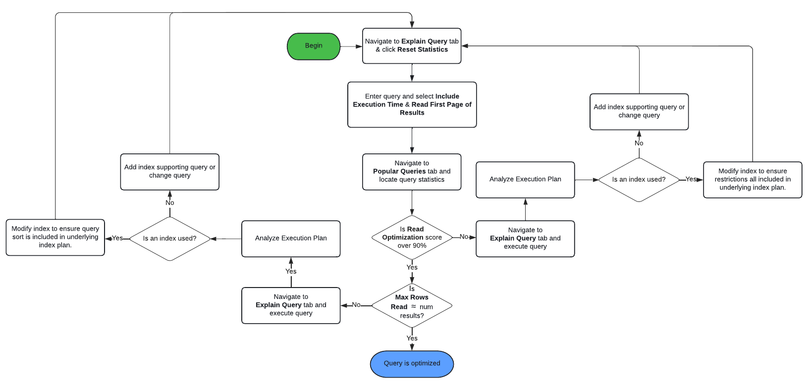

# Bästa praxis för frågor och indexering {#query-and-indexing-best-practices}

På AEM as a Cloud Service är alla operativa aspekter av indexering automatiserade. Detta gör att utvecklare kan fokusera på att skapa effektiva frågor och motsvarande indexdefinitioner.

## När frågor ska användas {#when-to-use-queries}

Frågor är ett sätt att komma åt innehåll, men är inte den enda möjligheten. I många situationer kan innehåll i databasen nås mer effektivt på andra sätt. Du bör tänka på om frågor är det bästa och mest effektiva sättet att komma åt innehåll för ditt användningssätt.

### Databas- och taxonomidesign {#repository-and-taxonomy-design}

När du utformar taxonomin för en databas måste flera faktorer beaktas. Dessa omfattar åtkomstkontroller, lokalisering, komponent- och sidegenskapsarv med mera.

När du utformar en taxonomi som tar upp dessa problem är det också viktigt att tänka på hur&quot;genomskinlighet&quot; är i indexdesignen. I det här sammanhanget är möjligheten att gå igenom en taxonomi att göra det möjligt för innehåll att nås på ett förutsägbart sätt baserat på dess sökväg. Detta gör att du får ett mer effektivt system som är enklare att underhålla än ett som kräver att flera frågor körs.

När du utformar en taxonomi är det dessutom viktigt att tänka på om det är viktigt att beställa. I de fall där explicit ordning inte krävs och ett stort antal noder på samma nivå förväntas, är det att föredra att använda en oordnad nodtyp som `sling:Folder` eller `oak:Unstructured`. Om det krävs en beställning `nt:unstructured` och `sling:OrderedFolder` skulle vara lämpligare.

### Frågor i komponenter {#queries-in-components}

Eftersom frågor kan vara en av de mer beskattningsbara åtgärder som utförs i ett AEM är det bra att undvika dem i dina komponenter. Om flera frågor körs varje gång en sida återges kan det ofta försämra systemets prestanda. Det finns två strategier som du kan använda för att undvika att köra frågor när du återger komponenter: **[gå igenom noder](#traversing-nodes)** och **[förhämtningsresultat.](#prefetching-results)**

### Går igenom noder {#traversing-nodes}

Om databasen är utformad på ett sådant sätt att det går att på förhand känna till platsen för de data som krävs, kan kod som hämtar dessa data från de nödvändiga sökvägarna distribueras utan att behöva köra frågor för att hitta dem.

Ett exempel på detta är att återge innehåll som passar inom en viss kategori. Ett sätt är att ordna innehållet med en kategoriegenskap som kan efterfrågas för att fylla i en komponent som visar objekt i en kategori.

Ett bättre sätt är att strukturera innehållet i en taxonomi efter kategori så att det kan hämtas manuellt.

Om innehållet till exempel lagras i en taxonomi som liknar:

```xml
/content/myUnstructuredContent/parentCategory/childCategory/contentPiece
```

den `/content/myUnstructuredContent/parentCategory/childCategory` noden kan bara hämtas, dess underordnade noder kan tolkas och användas för att återge komponenten.

När du har att göra med en liten eller homogen resultatmängd kan det dessutom vara snabbare att gå igenom databasen och samla ihop de noder som behövs, i stället för att skapa en fråga som returnerar samma resultatmängd. Generellt sett bör frågor undvikas där det är möjligt att göra detta.

### Förhämtningsresultat {#prefetching-results}

Ibland tillåter inte innehållet eller kraven runt komponenten att nodgenomgång används som ett sätt att hämta nödvändiga data. I sådana fall måste de nödvändiga frågorna köras innan komponenten återges, så att optimala prestanda säkerställs.

Om de resultat som krävs för komponenten kan beräknas när den redigeras och det inte finns någon förväntad tid för att innehållet ska ändras, kan frågan köras när en ändring har gjorts.

Om data eller innehåll ändras regelbundet, kan frågan köras enligt ett schema eller via en avlyssnare för uppdateringar av underliggande data. Sedan kan resultaten skrivas till en delad plats i databasen. Alla komponenter som behöver dessa data kan sedan hämta värden från den här noden utan att behöva köra en fråga vid körning.

En liknande strategi kan användas för att behålla resultatet i en minnescache, som fylls i vid start och uppdateras när ändringar görs (med en JCR `ObservationListener` eller en Sling `ResourceChangeListener`).

## Optimera frågor {#optimizing-queries}

Oak-dokumentationen innehåller en [överblick över hur frågor utförs.](https://jackrabbit.apache.org/oak/docs/query/query-engine.html#query-processing) Detta utgör grunden för alla optimeringsaktiviteter som beskrivs i det här dokumentet.

AEM as a Cloud Service har verktyget Query Performance, som är utformat för att ge stöd åt implementering av effektiva frågor.

* Här visas redan utförda frågor med relevanta prestandaegenskaper och frågeplanen.
* Det gör det möjligt att utföra ad hoc-frågor på olika nivåer, från att bara visa frågeplanen tills den fullständiga frågan körs.

Det går att nå frågeprestandaverktyget via [Developer Console i Cloud Manager.](https://experienceleague.adobe.com/docs/experience-manager-learn/cloud-service/debugging/debugging-aem-as-a-cloud-service/developer-console.html#queries) AEM as a Cloud Service Query Performance Tool innehåller mer information om hur frågan körs jämfört med AEM 6.x-versionen.

I det här diagrammet visas det allmänna flödet för att använda verktyget Frågeprestanda för att optimera frågor.



### Använd ett index {#use-an-index}

Alla frågor bör använda ett index för att ge optimala prestanda. I de flesta fall bör befintliga färdiga index vara tillräckliga för att hantera frågor.

Ibland måste anpassade egenskaper läggas till i ett befintligt index, så att ytterligare begränsningar kan efterfrågas med hjälp av indexet. Se dokumentet [Innehållssökning och indexering](/help/operations/indexing.md#changing-an-index) för mer information. The [JCR-frågekarta](#jcr-query-cheatsheet) i det här dokumentet beskriver hur en egenskapsdefinition för ett index måste se ut för att stödja en viss frågetyp.

### Använd rätt villkor {#use-the-right-criteria}

Den primära begränsningen för en fråga bör vara en egenskapsmatchning, eftersom detta är den mest effektiva typen. Om du lägger till fler egenskapsbegränsningar begränsas resultatet ytterligare.

Frågemotorn hanterar bara ett enda index. Det innebär att ett befintligt index kan och bör anpassas genom att fler anpassade indexegenskaper läggs till i det.

The [JCR-frågekarta](#jcr-query-cheatsheet) i det här dokumentet listas de tillgängliga begränsningarna och visar även hur en indexdefinition måste se ut så att den plockas upp. Använd [Prestandaverktyg för fråga](#query-performance-tool) för att testa frågan och för att se till att rätt index används och att frågemotorn inte behöver utvärdera begränsningar utanför indexet.

### Beställning {#ordering}

Om en viss resultatordning begärs, finns det två sätt för frågemotorn att uppnå detta:

1. Indexet kan leverera resultatet helt och i rätt ordning.
   * Detta fungerar om de egenskaper som används för beställning kommenteras med `ordered=true` i indexdefinitionen.
1. Frågemotorn utför beställningsprocessen.
   * Detta kan inträffa när frågemotorn utför filtrering utanför indexet eller när egenskapen order inte kommenteras med `ordered=true` -egenskap.
   * Detta kräver att hela resultatuppsättningen läses in i minnet för sortering, vilket är mycket långsammare än det första alternativet.

### Begränsa resultatstorleken {#restrict-result-size}

Den hämtade storleken på frågeresultatet är en viktig faktor för frågeprestanda. Eftersom resultatet hämtas på ett lat sätt är det skillnad på att bara hämta de första 20 resultaten jämfört med att hämta 10 000 resultat, både i körtid och minnesanvändning.

Det innebär också att storleken på resultatmängden bara kan bestämmas korrekt om alla resultat hämtas. Därför bör den hämtade resultatmängden alltid begränsas, antingen genom att frågan utökas (se [JCR-frågekarta](#jcr-query-cheatsheet) för mer information) eller genom att begränsa resultatens läsningar.

En sådan gräns förhindrar även att frågemotorn hissar på **traversal limit** av 100 000 noder, vilket leder till att frågan måste stoppas.

Se avsnittet [Frågor med stora resultat](#queries-with-large-result-sets) av det här dokumentet om en potentiellt stor resultatmängd måste bearbetas fullständigt.

## JCR-frågekarta {#jcr-query-cheatsheet}

För att skapa effektiva JCR-frågor och indexdefinitioner har [JCR Query Cheat Sheet](https://experienceleague.adobe.com/docs/experience-manager-65/deploying/practices/best-practices-for-queries-and-indexing.html#jcrquerycheatsheet) finns att hämta och använda som referens under utvecklingen.

Den innehåller exempelfrågor för QueryBuilder, XPath och SQL-2, som omfattar flera scenarier som beter sig på olika sätt när det gäller frågeprestanda. Här finns också rekommendationer för hur du skapar eller anpassar ekindexeringar. Innehållet i detta värmeblad gäller både AEM as a Cloud Service och AEM 6.5.

## Frågor med stora resultatuppsättningar {#queries-with-large-result-sets}

Du bör undvika frågor med stora resultatuppsättningar, men det finns giltiga fall där stora resultatuppsättningar måste bearbetas. Resultatstorleken är ofta inte känd framifrån, och därför bör vissa försiktighetsåtgärder vidtas för att göra bearbetningen tillförlitlig.

* Frågan ska inte köras i en begäran. I stället ska frågan köras som en del av ett Sling-jobb eller ett AEM arbetsflöde. Dessa har inga begränsningar i den totala körtiden och startas om om instansen skulle gå ned under bearbetningen av frågan och dess resultat.
* För att undvika frågegränsen på 100 000 noder bör du överväga att använda [Sidnumrering av nyckeluppsättning](https://jackrabbit.apache.org/oak/docs/query/query-engine.html#Keyset_Pagination) och dela frågan i flera underfrågor.

## Databasgenomgång {#repository-traversal}

Frågor som går igenom databasen använder inget index och loggar med ett meddelande som liknar det nedan.

```text
28.06.2022 13:32:52.804 *WARN* [127.0.0.1 [1656415972414] POST /libs/settings/granite/operations/diagnosis/granite_queryperformance.explain.json HTTP/1.1] org.apache.jackrabbit.oak.plugins.index.Cursors$TraversingCursor Traversed 98000 nodes with filter Filter(query=select [jcr:path], [jcr:score], * from [nt:base] as a /* xpath: //* */, path=*) called by com.adobe.granite.queries.impl.explain.query.ExplainQueryServlet.getHeuristics; consider creating an index or changing the query
```

Med det här loggfragmentet kan du bestämma:

* Själva frågan: `//*`
* Den Java-kod som utförde frågan: `com.adobe.granite.queries.impl.explain.query.ExplainQueryServlet::getHeuristics` för att identifiera vem som skapat frågan.

Med den här informationen kan du optimera frågan med hjälp av metoderna som beskrivs i [Optimera frågor](#optimizing-queries) i det här dokumentet.
