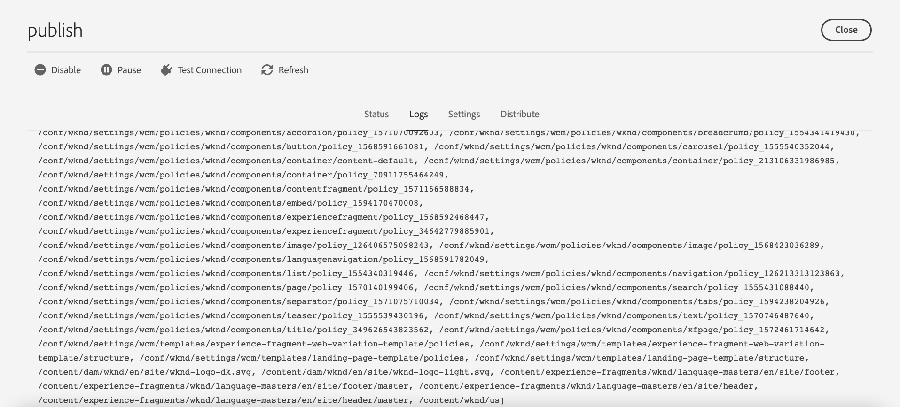

# Replikering {#replication}

Adobe Experience Manager as a Cloud Service använder [Distribution av säljinnehåll](https://sling.apache.org/documentation/bundles/content-distribution.html) möjlighet att flytta det innehåll som ska replikeras till en pipeline-tjänst som körs på Adobe I/O som ligger utanför AEM.

>[!NOTE]
>
>Läs [Distribution](/help/overview/architecture.md#content-distribution) för mer information.

## Metoder för publicering av innehåll {#methods-of-publishing-content}

### Snabb borttagning/publicering - planerad avstängning/publicering {#publish-unpublish}

På så sätt kan du publicera de markerade sidorna direkt, utan de ytterligare alternativ som är möjliga via Hantera publikation.

Mer information finns i [Hantera publikation](/help/sites-cloud/authoring/fundamentals/publishing-pages.md#manage-publication).

### På- och avaktiveringstider - utlösarkonfiguration {#on-and-off-times-trigger-configuration}

Ytterligare möjligheter **I tid** och **Fråntid** är tillgängliga från [Fliken Grundläggande i Sidegenskaper](/help/sites-cloud/authoring/fundamentals/page-properties.md#basic).

Om du vill genomföra den automatiska replikeringen måste du aktivera **Automatisk replikering** i [OSGi-konfiguration](/help/implementing/deploying/configuring-osgi.md) **Konfiguration av utlösare vid avstängning**:


### Hantera publikation {#manage-publication}

Med Hantera publikation får du fler alternativ än Snabbpublicering, så att du kan inkludera underordnade sidor, anpassa referenserna och starta tillämpliga arbetsflöden samt erbjuda möjlighet att publicera vid ett senare tillfälle.

Om du tar med en mapps underordnade objekt för alternativet Publicera senare, aktiveras arbetsflödet Publicera innehållsträd, som beskrivs i den här artikeln.

Mer information om Hantera publikation finns i [Dokumentation för Publishing Fundamentals](/help/sites-cloud/authoring/fundamentals/publishing-pages.md#manage-publication).

### Publicera arbetsflöde för innehållsträd {#publish-content-tree-workflow}

Du kan aktivera en trädreplikering genom att välja **Verktyg - Arbetsflöde - Modeller** och kopiera **Publicera innehållsträd** körklar arbetsflödesmodell, enligt nedan:


Ändra inte och anropa inte den ursprungliga modellen. I stället måste du först kopiera modellen och sedan ändra eller anropa kopian.

Precis som med alla arbetsflöden kan den också anropas via API. Mer information finns i [Interagera med arbetsflöden programmatiskt](https://experienceleague.adobe.com/docs/experience-manager-65/developing/extending-aem/extending-workflows/workflows-program-interaction.html?lang=en#extending-aem).

Du kan även uppnå detta genom att skapa en arbetsflödesmodell som använder `Publish Content Tree` processteg:

1. Från den AEM as a Cloud Service hemsidan går du till **Verktyg - Arbetsflöde - Modeller**
1. På sidan Arbetsflödesmodeller trycker du på **Skapa** i skärmens övre högra hörn
1. Lägg till en titel och ett namn i modellen. Mer information finns i [Skapa arbetsflödesmodeller](https://experienceleague.adobe.com/docs/experience-manager-65/developing/extending-aem/extending-workflows/workflows-models.html)
1. Markera den nya modellen i listan och tryck på **Redigera**
1. I följande fönster drar och släpper du Processsteg till det aktuella modellflödet:

   

1. Klicka på steget Process i flödet och välj **Konfigurera** genom att trycka på skiftnyckelsikonen
1. Klicka på **Process** och markera `Publish Content Tree` från listrutan

   

1. Ange eventuella ytterligare parametrar i dialogrutan **Argument** fält. Flera kommaavgränsade argument kan vara sammanfogade. Till exempel:

   `enableVersion=true,agentId=publish,includeChildren=true`


   >[!NOTE]
   >
   >En lista med parametrar finns i **Parametrar** nedan.

1. Tryck **Klar** för att spara arbetsflödesmodellen.

**Parametrar**

* `includeChildren` (booleskt värde, standard: `false`). false betyder att bara sökvägen publiceras. true betyder att barn också publiceras.
* `replicateAsParticipant` (booleskt värde, standard: `false`). Om konfigurerad som `true`används `userid` av huvudmannen som utförde deltagarsteget.
* `enableVersion` (booleskt värde, standard: `true`). Den här parametern avgör om en ny version skapas vid replikering.
* `agentId` (strängvärde, standard betyder att endast agenter för publicering används). Vi rekommenderar att du uttryckligen anger agentId; Om du till exempel anger värdet: publicera. Ange att agenten ska `preview` publicerar till förhandsgranskningstjänsten
* `filters` (strängvärde, standard innebär att alla sökvägar aktiveras). Tillgängliga värden är:
   * `onlyActivated` - bara sökvägar som inte är markerade som aktiverade aktiveras.
   * `onlyModified` - aktivera endast sökvägar som redan är aktiverade och som har ett ändringsdatum efter aktiveringsdatumet.
   * Ovanstående kan vara ORed med vertikalstreck (|). Till exempel, `onlyActivated|onlyModified`.

**Loggning**

När arbetsflödessteget för trädaktivering startar loggas konfigurationsparametrarna på INFO-loggnivån. När sökvägar aktiveras loggas även en INFO-sats.

En slutgiltig INFO-sats loggas sedan när arbetsflödessteget har replikerat alla sökvägar.

Du kan dessutom öka loggningsnivån nedan `com.day.cq.wcm.workflow.process.impl` till DEBUG/TRACE för att få ännu mer logginformation.

Om fel uppstår avslutas arbetsflödessteget med ett `WorkflowException`, som omsluter det underliggande undantaget.

Här nedan hittar du exempel på loggar som genereras under ett arbetsflöde för publiceringsinnehåll:

```
21.04.2021 19:14:55.566 [cm-p123-e456-aem-author-797aaaf-wkkqt] *INFO* [JobHandler: /var/workflow/instances/server60/2021-04-20/brian-tree-replication-test-2_1:/content/wknd/us/en/adventures] com.day.cq.wcm.workflow.process.impl.treeactivation.TreeActivationWorkflowProcess TreeActivation options: replicateAsParticipant=false(userid=workflow-process-service), agentId=publish, chunkSize=100, filter=, enableVersion=false
```

```
21.04.2021 19:14:58.541 [cm-p123-e456-aem-author-797aaaf-wkkqt] *INFO* [JobHandler: /var/workflow/instances/server60/2021-04-20/brian-tree-replication-test-2_1:/content/wknd/us/en/adventures] com.day.cq.wcm.workflow.process.impl.ChunkedReplicator closing chunkedReplication-VolatileWorkItem_node1_var_workflow_instances_server60_2021-04-20_brian-tree-replication-test-2_1, 17 paths replicated in 2971 ms
```

**Återuppta support**

Arbetsflödet bearbetar innehåll i segment, som representerar en delmängd av det fullständiga innehåll som ska publiceras. Om arbetsflödet stoppas av systemet kommer det att starta om och bearbeta segmentet som ännu inte bearbetats. En loggsats anger att innehållet har återupptagits från en viss sökväg.

### Replikerings-API {#replication-api}

Du kan publicera innehåll med hjälp av replikerings-API:t på AEM as a Cloud Service.

Mer information finns i [API-dokumentation](https://javadoc.io/doc/com.adobe.aem/aem-sdk-api/latest/com/day/cq/replication/package-summary.html).

**Grundläggande användning av API**

```
@Reference
Replicator replicator;
@Reference
ReplicationStatusProvider replicationStatusProvider;

....
Session session = ...
// Activate a single page to all agents, which are active by default
replicator.replicate(session,ReplicationActionType.ACTIVATE,"/content/we-retail/en");
// Activate multiple pages (but try to limit it to approx 100 at max)
replicator.replicate(session,ReplicationActionType.ACTIVATE, new String[]{"/content/we-retail/en","/content/we-retail/de"});

// ways to get the replication status
Resource enResource = resourceResolver.getResource("/content/we-retail/en");
Resource deResource = resourceResolver.getResource("/content/we-retail/de");
ReplicationStatus enStatus = enResource.adaptTo(ReplicationStatus.class);
// if you need to get the status for more more than 1 resource at once, this approach is more performant
Map<String,ReplicationStatus> allStatus = replicationStatusProvider.getBatchReplicationStatus(enResource,deResource);
```

**Replikering med specifika agenter**

När resurser replikeras som i exemplet ovan kommer endast de agenter som är aktiva som standard att användas. På AEM as a Cloud Service blir detta bara agenten&quot;publish&quot;, som kopplar författaren till publiceringsnivån.

En ny agent med namnet&quot;preview&quot; har lagts till som stöd för förhandsvisningsfunktionen, som inte är aktiv som standard. Den här agenten används för att ansluta författaren till förhandsgranskningsnivån. Om du bara vill replikera via förhandsgranskningsagenten måste du uttryckligen välja den här förhandsgranskningsagenten via en `AgentFilter`.

Se exemplet nedan om hur du gör detta:

```
private static final String PREVIEW_AGENT = "preview";

ReplicationStatus beforeStatus = enResource.adaptTo(ReplicationStatus.class); // beforeStatus.isActivated == false

ReplicationOptions options = new ReplicationOptions();
options.setFilter(new AgentFilter() {
  @Override
  public boolean isIncluded (Agent agent) {
    return agent.getId().equals(PREVIEW_AGENT);
  }
});
// will replicate only to preview
replicator.replicate(session,ReplicationActionType.ACTIVATE,"/content/we-retail/en", options);

ReplicationStatus afterStatus = enResource.adaptTo(ReplicationStatus.class); // afterStatus.isActivated == false
ReplicationStatus previewStatus = afterStatus.getStatusForAgent(PREVIEW_AGENT); // previewStatus.isActivated == true
```

Om du inte anger ett sådant filter och bara använder agenten för publicering, används inte agenten för förhandsgranskning och replikeringsåtgärden påverkar inte förhandsgranskningsnivån.

Det övergripande `ReplicationStatus` för en resurs ändras bara om replikeringsåtgärden innehåller minst en agent som är aktiv som standard. I exemplet ovan är detta inte fallet eftersom replikeringen bara använder agenten för förhandsgranskning. Därför måste du använda den nya `getStatusForAgent()` -metod, som tillåter frågor om status för en viss agent. Den här metoden fungerar även för agenten&quot;publish&quot;. Det returnerar ett värde som inte är null om någon replikeringsåtgärd har utförts med den angivna agenten.


**Kapacitetsbegränsningar för replikerings-API**

Vi rekommenderar att du kopierar färre än 100 banor i taget, där 500 är den hårda gränsen. Ovanför den hårda gränsen finns en `ReplicationException` kommer att kastas.
Om programlogiken inte kräver atomisk replikering kan den här gränsen överskridas genom att du anger `ReplicationOptions.setUseAtomicCalls` till false, vilket accepterar ett obegränsat antal banor, men internt skapar bucklor som ligger under denna gräns.

Storleken på innehållet som skickas per replikeringsanrop får inte överskrida `10 MB`. Detta inkluderar noder och egenskaper, men inte binärfiler (arbetsflödespaket och innehållspaket betraktas som binärfiler).

## Felsökning {#troubleshooting}

Om du vill felsöka replikering går du till replikeringsköerna i webbgränssnittet för AEM Author Service:

1. Navigera AEM Start-menyn till **Verktyg > Distribution > Distribution**
2. Välj kort **publicera**
   
3. Kontrollera köstatusen som ska vara grön
4. Du kan testa anslutningen till replikeringstjänsten
5. Välj **Loggar** som visar historiken för innehållspublikationer



Om innehållet inte kunde publiceras återställs hela publikationen från AEM Publish Service.
I så fall visas den huvudsakliga, redigerbara kön med röd status och bör granskas för att identifiera vilka objekt som orsakade att publiceringen avbröts. Genom att klicka på den kön visas de väntande objekten, från vilka ett eller alla objekt kan rensas vid behov.
