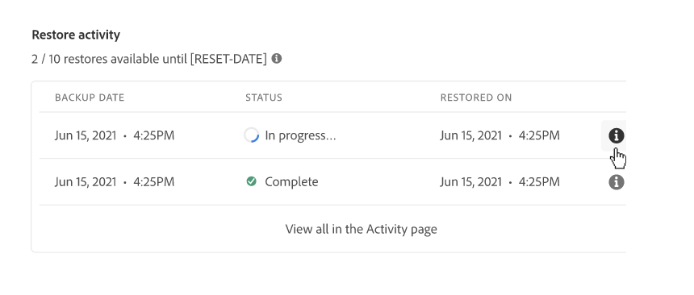

# Innehållsåterställning i AEM as a Cloud Service {#content-restore}

Lär dig hur du återställer AEM as a Cloud Service innehåll från en säkerhetskopia med hjälp av Cloud Manager.

>[!NOTE]
>
>Den här funktionen är bara tillgänglig för [det tidiga adopteringsprogrammet](/help/implementing/cloud-manager/release-notes/current.md#early-adoption) och har vissa begränsningar utöver de som anges i artikeln. I den tidiga antagandefasen:
>
>* Funktionen är bara tillgänglig i utvecklingsmiljöer.
>* Innehållsåterställningar är begränsade till två per månad och program.
>
>Information om det befintliga säkerhetskopierings- och återställningssystemet för AEM as a Cloud Service finns i dokumentet [Säkerhetskopiera och återställ i AEM as a Cloud Service](/help/operations/backup.md)

## Översikt {#overview}

Cloud Managers självbetjäningsåterställningsprocess kopierar data från säkerhetskopieringar av Adobe-system och återställer dem till den ursprungliga miljön. En återställning utförs för att returnera data som har gått förlorade, skadats eller tagits bort av misstag till det ursprungliga tillståndet.

Återställningsprocessen påverkar bara innehållet, så att koden och versionen av AEM inte ändras. Du kan initiera en återställning av enskilda miljöer när som helst.

Det finns två typer av säkerhetskopior i Cloud Manager som du kan återställa innehåll från.

* **PIT (Point-In-Time):** Den här typen återställer från kontinuerlig systemsäkerhetskopiering de senaste 24 timmarna från den aktuella tiden.
* **Förra veckan:** Den här typen återställer från systemsäkerhetskopieringar de senaste sju dagarna, exklusive de senaste 24 timmarna.

I båda fallen ändras inte versionen av den anpassade koden och AEM.

>[!TIP]
>
>Det går också att återställa säkerhetskopior [med det publika API:t.](https://developer.adobe.com/experience-cloud/cloud-manager/reference/api/)

## Återställer innehåll {#restoring-content}

Bestäm först tidsramen för det innehåll som du vill återställa. Utför sedan dessa steg för att återställa miljöns innehåll från en säkerhetskopia.

>[!NOTE]
>
>En användare med **Företagsägare** eller **Distributionshanteraren** roll måste vara inloggad för att initiera en återställningsåtgärd.

1. Logga in i Cloud Manager på [my.cloudmanager.adobe.com](https://my.cloudmanager.adobe.com/) och välja lämplig organisation.

1. Klicka på det program som du vill starta en återställning för.

1. Från **Programöversikt** sida, på **Miljö** klickar du på ellipsknappen bredvid den miljö som du vill starta en återställning för och väljer **Återställ innehåll**.

   

   * Du kan även navigera direkt till **Återställ innehåll** -fliken på sidan med miljöinformation i en viss miljö.

1. På **Återställ innehåll** på sidan med miljöinformation, först väljer du tidsramen för återställningen under **Tid att återställa** nedrullningsbar meny.

   1. Om du väljer **De senaste 24 timmarna** granne **Tid** I kan du ange exakt tid inom de senaste 24 timmarna som ska återställas.

      

   1. Om du väljer **Senaste veckan** granne **Dag** kan du välja ett datum under de senaste sju dagarna, exklusive de föregående 24 timmarna.

      

1. När du har valt ett datum eller angett en tid visas **Säkerhetskopior är tillgängliga** nedan visar en lista över tillgängliga säkerhetskopior som kan återställas

   

1. Hitta den säkerhetskopia som du vill återställa genom att använda informationsikonen för att visa information om vilken version av koden och AEM som ingår i säkerhetskopian och överväga konsekvenserna av en återställning när [välja säkerhetskopian.](#choosing-the-right-backup)

   

   * Observera att tidsstämpeln som visas för återställningsalternativen baseras på användarens tidszon.

1. Klicka på **Återställ** ikonen till höger i raden som representerar den säkerhetskopia som du vill återställa för att starta återställningsprocessen.

1. Granska informationen på **Återställ innehåll** innan du bekräftar din begäran genom att klicka på **Återställ**.

   

Säkerhetskopieringsprocessen initieras och du kan visa dess status i **[Återställ aktivitet](#restore-activity)** lista. Hur lång tid det tar att slutföra en återställning beror på storleken och profilen på det innehåll som återställs.

När återställningen har slutförts kommer miljön att:

* Kör samma kod och AEM som när återställningen initierades.
* Ha samma innehåll som var tillgängligt vid tidsstämpeln för den valda ögonblicksbilden, med indexen ombyggda så att de matchar den aktuella koden.

## Välja rätt säkerhetskopia {#choosing-backup}

Återställningsprocessen för självbetjäning i Cloud Manager återställer bara innehåll till AEM. Därför måste du noga överväga kodändringar som gjorts mellan den önskade återställningspunkten och den aktuella tidpunkten genom att granska implementeringshistoriken mellan det aktuella implementerings-ID:t och det som återställs.

Det finns flera scenarier.

* Den anpassade koden i miljön och återställningen finns i samma databas och gren.
* Den anpassade koden i miljön och återställningen finns i samma databas men i en annan gren med en gemensam implementering.
* Den anpassade koden i miljön och återställningen finns i olika databaser.
   * I det här fallet visas inget implementerings-ID.
   * Vi rekommenderar att du klonar båda databaserna och använder ett diff-verktyg för att jämföra grenarna.

Tänk dessutom på att en återställning kan göra att produktions- och staging-miljöerna inte synkroniseras. Du ansvarar för konsekvenserna av att återställa innehåll.

## Återställ aktivitet {#restore-activity}

The **Återställ aktivitet** visas status för de tio senaste återställningsbegäranden, inklusive aktiva återställningsåtgärder.

Genom att klicka på informationsikonen för en säkerhetskopia kan du ladda ned loggar för den säkerhetskopian samt kontrollera kodinformationen, inklusive skillnaderna mellan ögonblicksbilden och data när återställningen initierades.

## Säkerhetskopiering offline {#offsite-backup}

Regelbunden säkerhetskopiering täcker risken för oavsiktliga borttagningar eller tekniska fel inom AEM Cloud Service, men ytterligare risker kan uppstå om en region inte fungerar. Förutom tillgänglighet är den största risken i sådana regionala avbrott en dataförlust.

AEM as a Cloud Service minskar denna risk för alla AEM produktionsmiljöer genom att kontinuerligt kopiera allt AEM innehåll till en fjärrregion och göra det tillgängligt för återställning under en period av tre månader. Den här funktionen kallas säkerhetskopiering på annan plats.

Återställandet av AEM Cloud Service för mellanlagrings- och produktionsmiljöer från externa säkerhetskopieringar utförs av AEM Service Reliable Engineering i händelse av dataavbrott i dataområden.

## Begränsningar {#limitations}

Användningen av mekanismen för självbetjäning av återställning omfattas av följande begränsningar.

* Återställningsåtgärderna är begränsade till sju dagar, vilket innebär att det inte går att återställa en ögonblicksbild som är äldre än sju dagar.
* Högst tio lyckade återställningar tillåts i alla miljöer i ett program per kalendermånad.
* När miljön har skapats tar det sex timmar innan den första ögonblicksbilden av säkerhetskopian skapas. Innan den här ögonblicksbilden har skapats går det inte att återställa miljön.
* En återställningsåtgärd initieras inte om det finns en fullständig stack- eller webbskiktskonfigurationspipeline som körs för miljön.
* Det går inte att starta en återställning om en annan återställning redan körs i samma miljö.
* I sällsynta fall, på grund av gränsen på 24 timmar/sju dagar för säkerhetskopiering, kan den markerade säkerhetskopian bli otillgänglig på grund av en fördröjning mellan den tidpunkt då den valdes och den tidpunkt då återställningen initierades.
* Data från borttagna miljöer går förlorade permanent och kan inte återställas.
