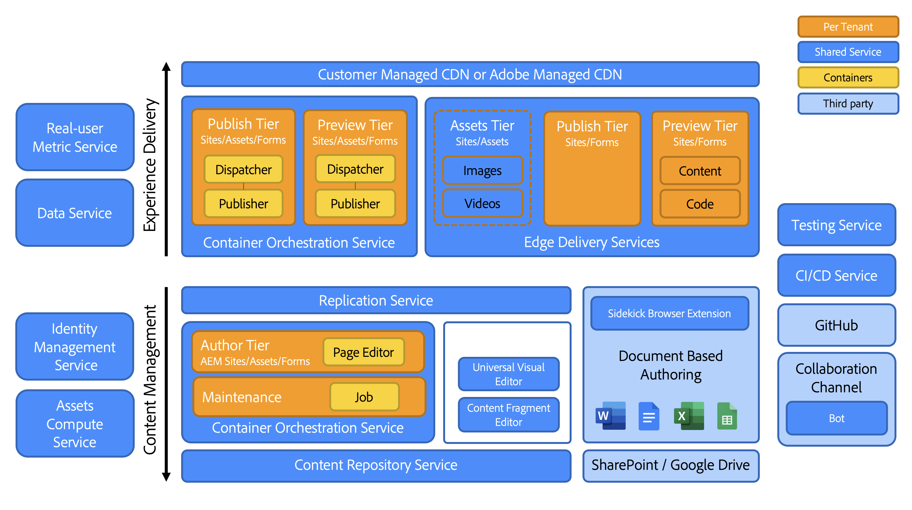

# En introduktion till arkitekturen i Adobe Experience Manager as a Cloud Service {#an-introduction-to-the-architecture-adobe-experience-manager-as-a-cloud-service}

>[!CONTEXTUALHELP]
>id="intro_aem_cloudservice_architecture"
>title="Introduktion till AEM as a Cloud Service Architecture"
>abstract="På den här fliken kan du visa den nya arkitekturen AEM as a Cloud Service och förstå ändringarna. AEM har resulterat i en dynamisk arkitektur med ett varierande antal bilder, så det är viktigt att du tar dig tid att förstå molnarkitekturen."
>additional-url="https://video.tv.adobe.com/v/330542/" text="Arkitektur - översikt"

Adobe Experience Manager (AEM) as a Cloud Service erbjuder en uppsättning sammanställningsbara tjänster för att skapa och hantera slagkraftiga upplevelser.

Den här sidan innehåller en introduktion till den logiska arkitekturen, tjänstarkitekturen, systemarkitekturen och utvecklingsarkitekturen för AEM as a Cloud Service.

## Logisk arkitektur {#logical-architecture}

AEM as a Cloud Service består av högnivålösningar som AEM Sites, AEM Assets och AEM Forms. Dessa tjänster licensieras individuellt, men kan användas i samarbete. Varje lösning använder en kombination av sammanställningsbara tjänster som tillhandahålls av AEM as a Cloud Service, beroende på hur de används.

### Program {#programs}

AEM används som en [Program](/help/implementing/cloud-manager/getting-access-to-aem-in-cloud/program-types.md) som du skapar i Cloud Manager-programmet, enligt dina licensrättigheter. Dessa program ger dig full kontroll över hur det associerade AEM namnges, konfigureras och hur behörigheter tilldelas i ett visst projekt.

Som kund identifieras du vanligtvis av Adobe som **tenant**, som också kallas *IMS-organisation* (Identity Management System). En innehavare kan ha så många program som behövs och licensieras. Det är till exempel ganska vanligt att se ett centralt program för AEM Assets, medan AEM Sites kan användas i flera program som motsvarar flera onlineupplevelser.

>[!NOTE]
>
>AEM Edge Delivery Services exponeras som en toppnivålösning i Cloud Manager, och är en del av de andra huvudlösningarna ur licenssynpunkt. Exempel: AEM Sites med Edge Delivery Services.

Ett program kan konfigureras med valfri kombination av högnivålösningar och varje lösning kan stödja från ett-till-många-tillägg. Exempel: Commerce eller Screens för AEM Sites, Dynamic Media eller Brand Portal för AEM Assets.

### Miljöer {#environments}

När ett program har skapats med AEM Sites-, AEM Assets- eller AEM Forms-lösningarna kommer tillhörande AEM att representeras i form av AEM miljöer i det här programmet.

Det finns fyra typer av [miljö](/help/implementing/cloud-manager/manage-environments.md) finns med AEM as a Cloud Service:

* Produktionsmiljö:

   * En produktionsmiljö är värd för företagstillämpningarna och driver liveupplevelserna.

* Scenmiljö:

   * En scenmiljö är vanligtvis kopplad till en produktionsmiljö i en 1:1-relation.
   * Scenmiljön är främst utformad för automatisk testning innan ändringar i programmet överförs till produktionsmiljön.
      * Detta är oberoende av de ändringar som initieras av Adobe som en del av en underhållsuppdatering eller av koddistributionerna.
      * Du kan också utföra manuell testning om en koddistribution sker.
   * Innehållet i scenmiljön synkroniseras vanligtvis med produktionsinnehållet med hjälp av funktionen för självbetjäning av innehållskopiering.
* Utvecklingsmiljö:
   * Med en utvecklingsmiljö kan utvecklare implementera och testa AEM program under samma körningsförhållanden som scen- och produktionsmiljöer.
   * Ändringarna går igenom en distributionspipeline som ger samma kodkvalitet och säkerhetsportar som i produktionsdistributionspipelines.
* Rapid development environment (RDE):
   * I en RDE-miljö går det att snabbt utveckla iterationer när ny eller befintlig kod distribueras till RDE-instanserna, utan att behöva gå igenom en formell distributionskanal som i vanliga utvecklingsmiljöer.

### Edge Delivery Services {#logical-architecture-edge-delivery-services}

Ett AEM program kan konfigureras med [Edge Delivery Services](/help/edge/overview.md) också.

När AEM har konfigurerats kan de referera till GitHub-koddatabaser som används för att skapa upplevelser med Edge Delivery Services. Därför blir nya konfigurationsalternativ tillgängliga för de associerade upplevelserna. Det kan vara att konfigurera CDN som hanteras i Adobe och få tillgång till licensstatistik och SLA-rapporter.

## Tjänstarkitektur {#service-architecture}

Listan över högnivåsammansatta tjänster i AEM as a Cloud Service kan representeras av två segment - Innehållshantering och Experience Delivery:

För innehållshantering finns det två huvuduppsättningar tjänster för utveckling av innehåll, som båda representeras av *innehållskällor*:

* AEM på författarnivå: Tillhandahåller ett webbaserat gränssnitt (med associerade API:er) för hantering av webbinnehåll. Detta gäller båda inriktningarna:
   * Headful - via Page editor and the Universal Editor
   * Headless - via Content Fragment editor
* Den dokumentbaserade redigeringsnivån: Gör att du kan skapa innehåll med standardprogram som:
   * Microsoft Word och Excel - via SharePoint
   * Google Docs and Sheets - via Google Drive

När det gäller upplevelseleverans finns det också två huvuduppsättningar tjänster, som inte är ömsesidigt uteslutande och som körs under ett delat Adobe-hanterat CDN (Content Delivery Network) som har olika ursprung:

* AEM publiceringsnivå:
   * Kör en grupp med AEM förlag och utgivare, som möjliggör dynamisk återgivning av webbsidor och API-innehåll (t.ex. GraphQL) sammanställt med publicerat innehåll.
   * Bygger huvudsakligen på programlogik på serversidan.
* The Edge Delivery Publish tier:
   * Möjliggör dynamisk återgivning av webbsidor och API-innehåll från olika innehållskällor, till exempel AEM författarnivå eller dokumentbaserad redigeringsnivå.
   * Baseras på applikationslogik på klientsidan och är utformad för maximala prestanda.

Där finns också de viktigaste närliggande tjänsterna:

* Edge Delivery Assets-nivån:
   * Tillåter leverans av godkända och publicerade medieobjekt från AEM Assets. Till exempel bilder och videor.
   * Medieobjekten refereras vanligtvis från upplevelser som körs på AEM publiceringsnivå, på Edge Delivery-publiceringsnivå eller från andra Adobe Experience Cloud-program som är integrerade med AEM Assets.
* AEM och förhandsgranskningsskiktet för Edge Delivery Services:
   * Finns även för upplevelser som skapats med AEM eller Edge Delivery-publiceringsskiktet.
   * Innehållsförfattare kan förhandsgranska innehåll i sitt sammanhang före publiceringsåtgärder.

>[!NOTE]
>
>Som standard har program som bara innehåller resurser varken en publiceringsnivå eller en förhandsgranskningsnivå.

Det finns andra närliggande tjänster:

* Replikeringstjänsten:
   * Finns mellan innehållshanteringsnivån och upplevelseleveransnivån.
   * Bearbetar *publicera* åtgärder som har utfärdats av innehållsförfattare och som sedan tillhandahåller det publicerade innehållet till publiceringsnivåerna (AEM eller Edge Delivery).

  >[!NOTE]
  >Replikeringstjänsten genomgick en fullständig omarbetning jämfört med 6.x-versionerna av AEM eftersom replikeringsramverket från tidigare versioner av AEM inte längre används för att publicera innehåll.
  >
  >Den senaste arkitekturen bygger på en *publicera och prenumerera* med molnbaserade innehållsköer. För AEM publiceringsnivå tillåter det ett varierande antal utgivare att prenumerera på publiceringsinnehållet och är en viktig del i att uppnå äkta och snabb autoskalning för AEM as a Cloud Service

* Tjänsten Content Repository:
   * Används av AEM författarnivå.
   * Är en molnbaserad instans av en JCR-kompatibel innehållsdatabas som implementeras av Apache Oak-tekniken.
   * Innehållets beständighet baseras främst på blobbaserad molnlagring.
* CI/CD-tjänsten:
   * Representerar den delmängd av Cloud Manager-funktioner som är dedikerade till hantering av distributionspipelines i AEM miljöer.
* Testtjänsten:
   * Representerar den underliggande infrastruktur som används för att köra:
      * funktionstester,
      * Gränssnittstester: t.ex. baserade på skript för selen eller Cypress,
      * upplevelsegranskningstester: t.ex. poäng i Lighthuse,

     som en del av en driftsättningspipeline till en AEM miljö, eller som en del av en GitHub-pull-begäran till en Edge Delivery-koddatabas.
* Datatjänsten:
   * Ansvarar för att exponera kunddata, t.ex. licensvärden (t.ex. innehållsförfrågningar, lagring, användare) eller användningsrapporter (t.ex. antalet överföringar och hämtningar).
   * Kunddata kan exponeras via API:er och i produktanvändargränssnitt (till exempel Cloud Manager).
* Real-User Metric-tjänsten (RUM):
   * Samlar in nyckeltal från en kundupplevelse (t.ex. sidvyer, centrala webbinarier, konverteringshändelser) och svarar på tillhörande frågor (t.ex. de översta sidvyerna för en viss domän de senaste 7 dagarna).
* Tjänsten Assets Compute:
   * Ansvarar för bearbetning av överförda bilder, videoklipp och dokument, till exempel PDF och Adobe Photoshop-filer. Bearbetningen kan använda Adobe Sensei för att extrahera bild- och videometadata (till exempel beskrivande taggar eller primära färgtoner) och sedan generera återgivningar (till exempel olika storlekar eller format) med tillgång till API:er som Adobe Photoshop och Adobe Lightroom API:er.
* Identity Management-tjänsten (IMS):
   * Är den centrala plats som ansvarar för att hantera och autentisera användare och användargrupper för ett visst Adobe Experience Cloud-program (till exempel Cloud Manager eller AEM författarnivå).
   * Är tillgänglig via Adobe Admin Console.

## Systemarkitektur {#system-architecture}

### AEM, förhandsgranska och publicera nivåer {#aem-author-preview-publish-tiers}

Lagren AEM författare och Publicera implementeras som en uppsättning Docker-behållare som hanteras av en standardtjänst för behållarsamordning. Den resulterande behållararkitekturen innebär ett helt dynamiskt system med ett varierande antal poder, beroende på faktisk aktivitet (för innehållshantering) och faktisk trafik (för leverans av upplevelser). Detta gör att AEM as a Cloud Service kan anpassa sig till era trafikmönster när de ändras.

AEM Author-nivån används som ett kluster AEM författarpoder som delar en enda innehållsdatabas. Minst två tillfällen möjliggör kontinuitet i verksamheten medan underhållsåtgärder körs eller när en distributionsprocess pågår.

AEM publiceringsskikt används som en grupp AEM publiceringsinstanser, var och en med sin egen innehållslagringsplats för publicerat innehåll. Varje utgivare är kopplad till en enda Apache-instans som är utrustad med AEM dispatcher-modulen för en materialiserad vy av innehållet, vilket fungerar som ursprung för det Adobe-hanterade CDN. Ett minimum på två punkter möjliggör även kontinuitet i verksamheten, men det är inte ovanligt att detta antal utökas under perioder med hög trafik.

AEM förhandsgranskningsnivå består av en enda AEM. Detta används för kvalitetssäkring av innehåll innan det publiceras på publiceringsnivån. Ibland kan det uppstå driftavbrott, särskilt under distributioner, på förhandsgranskningsnivån.

### Edge Delivery Services {#system-architecture-edge-delivery-services}

Edge Delivery Servicens ligger ovanpå ett CDN och serverlös infrastruktur för att sammanställa sidorna på det mest prestandaoptimerade sättet. När en resurs begärs ansvarar den serverlösa infrastrukturen för att konvertera det publicerade innehållet till semantiskt HTML och fungerar som ursprung för CDN.

Konverteringen till semantisk HTML sker från det publicerade innehåll som hanteras från AEM eller dokumentbaserade redigeringsmiljön.

Följande diagram visar hur du kan redigera webbplatsinnehåll i Microsoft Word (dokumentbaserad redigering) och publicera på Edge Delivery. Det visar också den traditionella AEM publiceringsmetoden med olika redigerare.

Eftersom Edge Delivery Services är en del av Adobe Experience Manager och som sådana kan Edge Delivery, AEM Sites och AEM Assets finnas parallellt i samma domän. Detta är ett vanligt användningsexempel för större webbplatser. En kund kanske till exempel vill migrera en viss sida med hög trafik till Edge Delivery Services, medan alla andra sidor kanske finns kvar på AEM.

## Utvecklingsarkitektur {#development-architecture}

### Koddatabaser {#code-repositories}

Koden och konfigurationen för AEM-projekt lagras i en koddatabas från vilken distributionsförloppen skickas när ändringar görs. Det finns olika typer av koddatabaser:

* AEM full stack:
   * För lagring av Java-kod och OSGI-konfigurationer på serversidan för AEM författare och publiceringsnivåer.
* AEM på framsidan:
   * För lagring av JS-, CSS- och HTML-kod på klientsidan för AEM författare- och publiceringsnivåer.
Mer information om clientlibs finns i [Använda bibliotek på klientsidan på AEM as a Cloud Service.](/help/implementing/developing/introduction/clientlibs.md)
* AEM webbnivå:
   * Lagrar dispatcherkonfigurationsfilerna för AEM publiceringsnivå.
* AEM:
   * Tillåter lagring av olika konfigurationsalternativ (t.ex. CDN-inställningar eller underhållsinställningar) för AEM och Edge Delivery Servicens publiceringsnivå.
* AEM kantleverans:
   * För lagring av JS-, CSS- och HTML-kod på klientsidan för webbplatser som byggts med Edge Delivery Servicens

### Distributionspipelines {#deployment-pipelines}

Utvecklare och administratörer hanterar det AEM as a Cloud Service programmet med hjälp av en CI/CD-tjänst (Continuous Integration/Continuous Delivery) som är tillgänglig via Cloud Manager. Cloud Manager visar också allt som rör övervakning, underhåll, felsökning (till exempel åtkomst till loggfiler) och licensiering.

Cloud Manager hanterar alla uppdateringar av dina instanser av AEM as a Cloud Service. Det är obligatoriskt, eftersom det är det enda sättet att bygga, testa och distribuera kundapplikationen till författaren, förhandsgranskningen och publiceringsnivåerna. Dessa uppdateringar kan aktiveras av Adobe, när en ny version av AEM Cloud Service är klar, eller av dig själv, när en ny version av ditt program är klar.

Detta implementeras av en distributionspipeline som är kopplad till varje miljö i ett program. När en pipeline för Cloud Manager körs skapas en ny version av kundprogrammet, både på redigerings- och publiceringsnivå. Det uppnås genom att de senaste kundpaketen kombineras med den senaste Adobe-baslinjebilden.

Distributionsflödet utlöses antingen när kunderna gör kodändringar eller när Adobe distribuerar en ny underhållsrelease.

I båda fallen utförs samma uppsättning automatiska tester. Den består av tester:

* som Adobe bidragit med för att säkerställa produktens integritet
* tester från kunden
   * Funktionstester: via http-begäranden till AEM författare eller publiceringsnivå
   * Gränssnittstester: baserade på selen- eller Cypress-teknik

Dessa automatiserade tester körs på scenmiljön, och det är därför viktigt att scenmiljöinnehållet hålls så nära som möjligt med innehållet i Production-instansen.

När alla tester har slutförts distribueras den nya koden till produktionsmiljön.

### Rullande uppdateringar {#rolling-updates}

Cloud Manager automatiserar helt brytningen till den senaste versionen av AEM genom att uppdatera alla tjänstnoder med ett rullande uppdateringsmönster. Det betyder att det finns **inga driftavbrott** för antingen författaren eller publiceringstjänsten.

## Viktiga innovationer sedan AEM 6.x {#major-innovations-since-aem-6x}

Den senaste arkitekturen för AEM as a Cloud Service medför vissa grundläggande förändringar och innovationer jämfört med tidigare generationer (AEM 6.x och tidigare):

* Alla filer överförs direkt och hanteras från ett molndatalager. Den associerade strömmen med bitar går aldrig igenom JVM för redigerings- och publiceringstjänsterna i AEM. Det innebär att noderna för AEM författare och publiceringstjänster kan bli mindre och därför mer kompatibla med förväntningarna på snabb autoskalning. För dem som arbetar med affärsverksamhet ger detta en snabbare upplevelse vid överföring och nedladdning av bilder, video och andra uppgifter.

* Alla åtgärder som består av publicering av innehåll omfattar nu en pipeline som följer ett prenumerationsmönster. Publicerat innehåll skickas till olika köer i pipelinen som alla noder i publiceringstjänsten prenumererar på. Därför behöver redigeringsmiljön inte känna till antalet noder i publiceringstjänsten. Det möjliggör snabb autoskalning av publiceringsnivån.

* Arkitekturen separerar programinnehållet helt från programkoden och konfigurationen. Kod och konfigurering är i stort sett oföränderliga och inbäddade i baslinjebilden som används för att skapa de olika noderna i redigerings- och publiceringstjänsterna. Det innebär att det finns en absolut garanti för att varje nod är identisk och att ändringar i kod och konfiguration bara kan göras globalt genom att man kör en Cloud Manager-pipeline.

* Arkitekturen omfattar flera mikrotjänster som bygger på serverlös teknik, särskilt med Adobe I/O runtime

## Ytterligare information {#further-information}

Se även:

* Edge Delivery Services:

   * [AEM as a Cloud Service Overview - med Edge Delivery Services](/help/edge/overview.md)
   * [Använda Edge Delivery Services](/help/edge/using.md)
   * [Utforska den underliggande arkitekturen och viktiga delar av AEM as a Cloud Service med Edge Delivery Services](https://experienceleague.adobe.com/docs/experience-manager-learn/cloud-service/introduction/architecture.html)
