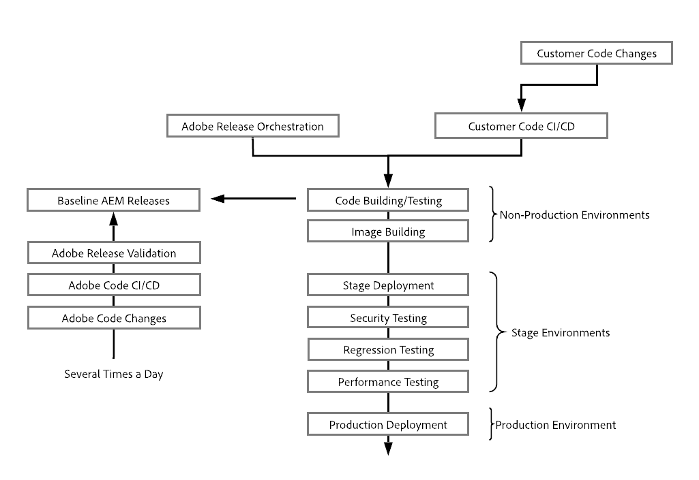

# En introduktion till arkitekturen i Adobe Experience Manager as a Cloud Service {#an-introduction-to-the-architecture-adobe-experience-manager-as-a-cloud-service}

>[!CONTEXTUALHELP]
>id="intro_aem_cloudservice_architecture"
>title="Introduktion till AEM as a Cloud Service Architecture"
>abstract="På den här fliken kan du visa den nya arkitekturen AEM as a Cloud Service och förstå ändringarna. AEM har resulterat i en dynamisk arkitektur med ett varierande antal bilder, så det är viktigt att du tar dig tid att förstå.molnarkitekturen"
>additional-url="https://video.tv.adobe.com/v/330542/" text="Arkitektur - översikt"

Adobe Experience Manager (AEM) as a Cloud Service har lett till ändringar i arkitekturen.

## Skalning   {#scaling}

AEM as a Cloud Service har nu:

* En dynamisk arkitektur med ett varierande antal AEM-bilder.

Arkitekturen:

* Skalas baserat på den *faktiska* trafiken och den *faktiska* aktiviteten.

* Har enskilda instanser som bara körs vid behov.

* Använder modulära program.

* Har ett redigeringskluster som standard och på så sätt undviks driftavbrott vid underhåll.

Det möjliggör automatisk skalning för olika användningsmönster:

För att uppnå detta skapas alla instanser av AEM as a Cloud Service lika, med samma standardegenskaper som antalet noder, allokerat minne och allokerad datorkapacitet.

AEM as a Cloud Service baseras på en orkestreringsmotor som:

* Övervakar tjänstens tillstånd kontinuerligt.

* Skalar de olika tjänstinstanserna dynamiskt efter faktiska behov, både uppåt och nedåt.

Det:

* Gäller antalet noder, mängden minne och den allokerade processorkapaciteten för varje nod.

* Gör att AEM as a Cloud Service anpassas när trafikmönstren ändras.

Skalningen av tjänstens klientinstanser kan vara automatisk eller manuell på två axlar:

* Lodrätt: allokerat minne och processorkapacitet kan skalas upp eller ned för ett fast antal noder.

* Vågrätt: antalet noder för en viss tjänst kan ökas eller minskas.

## Miljöer {#environments}

>[!NOTE]
>Mer information finns i [Distribuera – Körningslägen](/help/implementing/deploying/overview.md#runmodes)

AEM as a Cloud Service är tillgängligt som enskilda instanser där varje instans representerar en komplett AEM-miljö.

Det finns tre typer av miljöer med AEM as a Cloud Service:

* **Produktionsmiljö**: är värd för de program som riktar sig till företagsanvändare.

* **Scenmiljö**: är alltid kopplad till en enda produktionsmiljö i ett 1:1-förhållande. Scenmiljön används för olika prestanda- och kvalitetstester innan ändringar i programmet överförs till produktionsmiljön.

* **Utvecklingsmiljö**: ger utvecklare möjlighet att implementera AEM-program under samma körningsförhållanden som scen- och produktionsmiljöerna.

   Se [Hantera miljöer](https://experienceleague.adobe.com/docs/experience-manager-cloud-service/implementing/using-cloud-manager/manage-environments.html?lang=en#using-cloud-manager) för mer information.

## Program {#programs}

Alla nya AEM-projekt är alltid bundna till en specifik kodbas där du kan lagra både konfiguration och anpassad kod för ditt projekt. Den här informationen lagras i en koddatabas som du kan nå via de vanliga Git-klienterna när nya program skapas.

Ett AEM-program är den behållare som innehåller:

|  Programelement |  Siffra |
|--- |--- |
| Koddatabas (Git) |  1 |
| Baslinjebild (Sites eller Assets) |  1 |
| 1:1-förhållande mellan scen- och produktionsmiljö  | 0 eller 1 |
| Icke-produktionsmiljöer (utveckling eller demonstration) | 0 till N |
| Pipeline för varje miljö | 0 eller 1 |

Två typer av program är inledningsvis tillgängliga för AEM as a Cloud Service:

* AEM Cloud Sites Service

* AEM Cloud Assets Service

Båda dessa ger tillgång till ett antal funktioner. Författarnivån kommer att innehålla alla Sites and Assets-funktioner för alla program, men Assets-programmen kommer som standard inte att ha någon publiceringsnivå eller förhandsvisningsnivå.

## Körningsarkitektur {#runtime-architecture}

Det finns olika huvudkomponenter i den nya arkitekturen:

<!--- needs reworking -->

* För AEM Sites as a Cloud Service:

   * Det finns fortfarande en redigeringsnivå och en publiceringsnivå för varje miljö (på hög nivå).

   * Redigeringsnivån består av två eller flera noder i ett enda författarkluster. Den skalas automatiskt beroende på redigeringsaktiviteten.

      * Innehållsförfattare/skapare loggar in på AEM-redigeringsnivå för att skapa, redigera och hantera innehåll.

      * Inloggning på redigeringsnivå hanteras av Adobe Identity Management Services (IMS).

      * En dedikerad resurshanteringstjänst används för integrering och bearbetning av resurser.
   * Förhandsgranskningsnivån består av en enda förhandsvisningsnod. Detta används för kvalitetssäkring av innehåll innan det publiceras på publiceringsnivån.

   * Publiceringsnivån består av två eller flera noder i en enda publiceringsgrupp: de kan fungera oberoende av varandra. Varje nod består av en AEM-utgivare och en webbserver utrustad med modulen AEM Dispatcher. Den skalas automatiskt efter webbplatsens trafik.

      * Slutanvändare, eller besökare, besöker webbplatsen via AEM Publish Service.

* För AEM Assets as a Cloud Service:

   * Arkitekturen innehåller bara en redigeringsmiljö.

* Både författarnivån, förhandsgranskningsnivån och publiceringsnivån läser och behåller innehåll från/till en innehållslagringstjänst.

   * Publiceringsnivån och förhandsgranskningsnivån läser bara innehåll från det beständiga lagret.

   * Redigeringsnivån läser och skriver innehåll från och till det beständiga lagret.

   * BLOB-lagringen delas av alla publicerings-, förhandsgransknings- och författarnivåer. filer är inte *flyttad*.

   * När innehåll godkänns från författarnivån är detta en indikation på att det kan aktiveras och därför skickas till publiceringsskiktet för beständighet. eller eventuellt till förhandsvisningsnivån. Detta sker via replikeringstjänsten, en pipeline för mellanprogram. Den här pipeline tar emot det nya innehållet, där de enskilda publiceringstjänstens (eller förhandsgranskningstjänstens) noder prenumererar på det innehåll som skickas till pipeline.

      >[!NOTE]
      >
      >Mer information finns i [Replikering](/help/operations/replication.md).

   * Utvecklare och administratörer hanterar AEM as a Cloud Service genom att använda en CI/CD-tjänst (Continuous Integration/Continuous Delivery) som är tillgänglig via [Cloud Manager](/help/overview/what-is-new-and-different.md#cloud-manager). Det inkluderar kod- och konfigurationsdistribution med Cloud Managers CI/CD-pipeline. Allt som rör övervakning, underhåll och felsökning (till exempel loggfiler) visas för kunder i Cloud Manager.

   * Åtkomst till redigerings- och publiceringsnivåerna sker alltid via en lastbalanserare. Det är alltid uppdaterat med de aktiva noderna på varje nivå.

   * För publiceringsskiktet och förhandsvisningsskiktet finns även en CDN-tjänst (Continuous Delivery Network) som första startpunkt.

* För demonstrationsinstanser av AEM as a Cloud Service förenklas arkitekturen till en enda redigeringsnod. Därför innehåller den inte alla egenskaper hos standardutvecklingsmiljön, scen- eller produktionsmiljön. Det innebär också att det kan finnas vissa driftavbrott och att det inte finns stöd för säkerhetskopierings-/återställningsåtgärder.

## Distributionsarkitektur {#deployment-architecture}

Cloud Manager hanterar alla instansuppdateringar av AEM as a Cloud Service. Det är obligatoriskt, eftersom det är det enda sättet att bygga, testa och distribuera kundapplikationen, till både författaren, förhandsgranskningen och publiceringsnivån. Uppdateringarna kan aktiveras av Adobe när en ny version av AEM Cloud Service är klar eller av kunden när en ny version av kundens program är klar.

Tekniskt sett genomförs detta med en distributionspipeline som är kopplad till varje miljö i ett program. När en pipeline för Cloud Manager körs skapas en ny version av kundprogrammet, både för författaren, förhandsgranskningen och publiceringsskikten. Det uppnås genom att de senaste kundpaketen kombineras med den senaste Adobe-baslinjebilden. När de nya bilderna har byggts och testats automatiserar Cloud Manager helt övergången till den senaste versionen av bilden genom att uppdatera alla tjänstnoder med ett rullande uppdateringsmönster. Detta medför inga driftavbrott i redigerings- och publiceringstjänsten.

<!--- needs reworking -->

## Innehållsdistribution {#content-distribution}

Adobe Experience Manager as a Cloud Service har förändrat hur publicering av innehåll fungerar. Med AEM as a Cloud Service används inte längre replikeringsramverket från tidigare versioner av AEM för att publicera sidor (flytta ändringar från redigeringsinstansen till publiceringsinstansen).

AEM as a Cloud Service använder nu funktionen [Sling Content Distribution](https://sling.apache.org/documentation/bundles/content-distribution.html) för att flytta rätt innehåll. Det använder en pipeline-tjänst som körs på Adobe I/O som ligger utanför AEM-miljön.

Installationen är automatiserad med automatisk självkonfigurering när publiceringsnoder läggs till, tas bort eller återanvänds under körning.

En enda begäran om publicering eller avpublicering kan innehålla flera resurser, men returnerar en enda status som gäller för alla. Det fungerar eller misslyckas för alla resurser i AEM-publiceringstjänsten. Det garanterar att resurserna i AEM-publiceringstjänsten aldrig är inkonsekventa.

**Arkitekturdiagram för innehållsdistribution på hög nivå**

## Viktiga händelser {#key-evolutions}

Den nya arkitekturen för AEM as a Cloud Service introducerar några grundläggande förändringar och innovationer jämfört med tidigare generationer:

* Alla filer (blobs) överförs direkt och hanteras från ett molndatalager. Den associerade strömmen med bitar går aldrig igenom JVM för redigerings- och publiceringstjänsterna i AEM. Därför kan noderna för redigerings- och publiceringstjänsterna i AEM vara mindre och mer kompatibla med förväntningarna på snabb autoskalning. För företagsanvändare ger det en snabbare upplevelse när bilder, video med mera laddas upp och ned.

* Alla åtgärder som består av publicering av innehåll omfattar nu en pipeline som följer ett prenumerationsmönster. Publicerat innehåll skickas till olika köer i pipelinen som alla noder i publiceringstjänsten prenumererar på. Därför behöver redigeringsmiljön inte känna till antalet noder i publiceringstjänsten. Det möjliggör snabb autoskalning av publiceringsnivån.

* Begreppet med en huvudnod introducerades för att automatisera publiceringsnodernas livscykel. Huvudnoden är en specialiserad publiceringsnod som inga slutanvändare har åtkomst till och som alla noder i publiceringstjänsten skapas från. Underhållsåtgärder som komprimering utförs på innehållsdatabasen som är kopplad till huvudnoden. Publiceringsnoderna återvinns dagligen och behöver inget rutinunderhåll. Tidigare måste driften stoppas för sådant underhåll, särskilt för redigeringsinstansen.

* Arkitekturen separerar programinnehållet helt från programkoden och konfigurationen. Kod och konfigurering är i stort sett oföränderliga och inbäddade i baslinjebilden som används för att skapa de olika noderna i redigerings- och publiceringstjänsterna. Det innebär att det finns en absolut garanti för att varje nod är identisk och att ändringar i kod och konfiguration bara kan göras globalt genom att man kör en Cloud Manager-pipeline.
