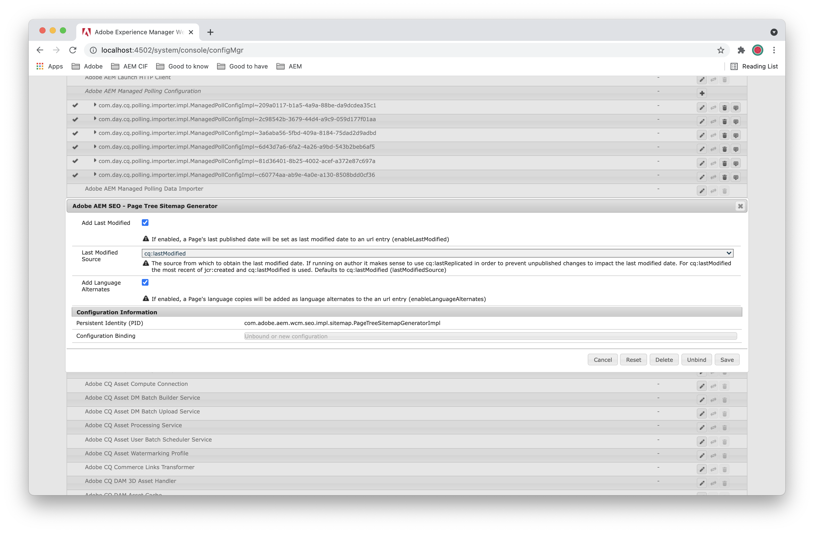

# Bästa metoder för SEO- och URL-hantering för Adobe Experience Manager as a Cloud Service{#seo-and-url-management-best-practices-for-aem}

Sökmotoroptimering (SEO) har blivit en viktig fråga för många marknadsförare. Därför måste SEO-frågor hanteras i många Adobe Experience Manager (AEM) as a Cloud Service-projekt.

I det här dokumentet beskrivs först några [SEO-metodtips](#seo-best-practices) och rekommendationer för hur du kan använda dem på en AEM as a Cloud Service-implementering. Sedan får du en närmare titt på några av de mer [komplexa implementeringsstegen](#aem-configurations) som togs upp i det första avsnittet.

## SEO-metodtips {#seo-best-practices}

I det här avsnittet beskrivs några allmänna SEO-metodtips.

### URL:er {#urls}

Det finns vissa vedertagna rutiner för webbadresser.

Ställ följande fråga när du utvärderar URL:er i ett AEM-projekt:

*&quot;Om en användare ser den här URL:en och inget av innehållet på sidan, kan de beskriva vad sidan handlar om?&quot;*

Om svaret är ja är det troligt att URL:en fungerar bra för en sökmotor.

Här följer några allmänna tips om hur du skapar URL:er för SEO:

* Använd bindestreck för att avgränsa ord.

   * Namnge sidor med bindestreck (-) som avgränsare.
   * Undvik att använda kamelnotation, understreck och mellanslag.

* Undvik att använda frågeparametrar när det är möjligt. Begränsa dem till två eller färre om de behövs.

   * Använd katalogstrukturen för att ange informationsarkitekturen, om en sådan finns.
   * Om en katalogstruktur inte är ett alternativ använder du Delningsväljare i URL:en i stället för frågesträngar. Förutom det SEO-värde som de anger kan du även göra sidorna tillgängliga för Dispatcher med hjälp av snedväljare.

* Ju mer läsbar en URL är, desto bättre. om det finns nyckelord i URL-adressen ökar värdet.

   * När du använder väljare på en sida är det bäst att använda väljare som har ett semantiskt värde.
   * Om en användare inte kan läsa URL:en kan inte en sökmotor heller göra det.
   * Till exempel:
      `mybrand.com/products/product-detail.product-category.product-name.html`
är att föredra framför 
`mybrand.com/products/product-detail.1234.html`

* Undvik underdomäner när det är möjligt, eftersom sökmotorer behandlar dem som olika enheter och fragmenterar SEO-värdet för webbplatsen.

   * Använd i stället undersökvägar på första nivån. Använd till exempel `www.mybrand.com/es/home.html` istället för `es.mybrand.com/home.html`.

   * Planera din innehållshierarki så att den matchar hur innehållet presenteras, enligt den här riktlinjen.

* URL:ens nyckelordseffektivitet minskar ju längre URL:en är och nyckelordets position ökar. Med andra ord är kortare bättre.

   * Använd tekniker och funktioner för förkortning av URL:er från AEM för att ta bort onödiga URL-delar.
   * Till exempel är `mybrand.com/en/myPage.html` att föredra framför `mybrand.com/content/my-brand/en/myPage.html`.

* Använd kanoniska URL:er.

   * Använd en `rel=canonical`-tagg på sidan när en URL kan hanteras från olika sökvägar, eller med olika parametrar eller väljare.

   * Den kan inkluderas i koden för AEM-mallen.

* Matcha URL:er med sidtitlar när det är möjligt.

   * Innehållsförfattare bör uppmuntras att följa den här metoden.

* Stöd skiftlägesokänslighet i URL-begäranden.

   * Konfigurera Dispatcher för att skriva om alla inkommande begäranden som gemener.
   * Utbilda innehållsförfattarna att skapa alla sidor med gemener.

* Se till att varje sida bara hanteras från ett protokoll.

   * Ibland hanteras webbplatser över `http` tills en användare når en sida med t.ex. ett utchecknings- eller inloggningsformulär, då sidan växlar till `https`. Vid länkning från den här sidan, om användaren kan återgå till `http` sidor och få tillgång till dem via `https`spårar sökmotorn dessa som två separata sidor.

   * Google föredrar för närvarande `https`-sidor framför `http`-sidor. Därför gör det ofta att allas liv blir lättare att betjäna hela webbplatsen `https`.

### Serverkonfiguration {#server-configuration}

Följ följande steg för serverkonfigurationen för att se till att endast rätt innehåll crawlas:

* Använd en `robots.txt`-fil för att blockera crawlning av innehåll som inte ska indexeras.

   * Blockera **all** crawlning i testmiljöer.

* Implementera 301-omdirigeringar när du startar en ny webbplats med uppdaterade URL:er, för att säkerställa att din befintliga SEO-rankning inte går förlorad.
* Inkludera en favoritikonbild för webbplatsen.
* Implementera en XML-webbplatskarta som gör det enklare för sökmotorer att crawla innehållet. Se till att du inkluderar en mobilwebbplatskarta för mobiler och/eller responsiva webbplatser.

## AEM-konfigurationer {#aem-configurations}

I det här avsnittet beskrivs de implementeringssteg som krävs för att konfigurera AEM för att följa dessa SEO-rekommendationer.

### Använda Sling-väljare {#using-sling-selectors}

Tidigare var det vedertaget att använda frågeparametrar när man skapade ett företagswebbprogram.

Trenden de senaste åren har varit att ta bort dessa så att URL:er blir mer läsbara. På många plattformar innebär det att omdirigeringar implementeras på webbservern eller innehållsleveransnätverket (CDN) – men Sling gör det enklare. Sling-väljare:

* gör webbadresser enklare att läsa
* Gör att du kan cachelagra sidorna på Dispatcher, vilket ofta förbättrar säkerheten.
* gör att du kan adressera innehållet direkt, i stället för att ha en allmän servlet som hämtar innehållet. Detta ger dig de fördelar med ACL:er som du tillämpar på din databas och filter som du tillämpar på Dispatcher.

#### Använda väljare för servletar {#using-selectors-for-servlets}

AEM ger oss två alternativ när vi skriver servletar:

* **bin**-servletar
* **Sling**-servletar

I följande exempel visas hur du registrerar servrar som följer både dessa mönster och fördelarna med att använda Sling-servrar.

#### Bin-servletar (en nivå ned) {#bin-servlets-one-level-down}

**Bin**-servletar följer mönstret som många utvecklare är vana vid från J2EE-programmering. Servleten registreras på en viss sökväg, som för AEM vanligtvis finns under `/bin`, och du extraherar de nödvändiga parametrarna från frågesträngen.

SCR-anteckningen för den här typen av servlet skulle se ut ungefär så här:

```
@SlingServlet(paths = "/bin/myApp/myServlet", extensions = "json", methods = "GET")
```

Sedan extraherar du parametrarna från frågesträngen via objektet `SlingHttpServletRequest` som finns i metoden `doGet`. Till exempel:

```
String myParam = req.getParameter("myParam");
```

Den URL som skapas skulle se ut ungefär så här:

`https://www.mydomain.com/bin/myApp/myServlet.json?myParam=myValue`

Några saker att ha i åtanke:

* Själva URL:en förlorar SEO-värde. Användare som har åtkomst till webbplatsen, inklusive sökmotorer, får inga semantiska värden från URL:en eftersom URL:en representerar en programmatisk sökväg och inte innehållshierarkin.
* Frågeparametrar finns i URL:en vilket innebär att Dispatcher inte kan cachelagra svaret.
* Om du vill skydda servleten måste du implementera en egen anpassad säkerhetslogik i den.
* Dispatcher måste konfigureras (med försiktighet) för att kunna visas `/bin/myApp/myServlet`. Att helt enkelt visa `/bin` ger åtkomst till vissa servletar som inte ska vara öppna för webbplatsens besökare.

#### Sling-servletar (en nivå ned) {#sling-servlets-one-level-down}

Med **Sling**-servletar kan du registrera en servlet på motsatt sätt. I stället för att adressera en servlet och ange det innehåll som du vill att servleten ska återge baserat på frågeparametrarna, kan du adressera det innehåll som du vill ha och ange den servlet som ska återge innehållet baserat på Sling-väljare.

SCR-anteckningen för den här typen av servlet skulle se ut ungefär så här:

```
@SlingServlet(resourceTypes = "myBrand/components/pages/myPageType", selectors = "myRenderer", extensions = "json”, methods=”GET”)
```

I det här fallet är den resurs som URL:en adresserar (en instans av resursen `myPageType`) automatiskt tillgänglig i servleten. För att få åtkomst till den ska du anropa:

```
Resource myPage = req.getResource();
```

Den URL som skapas skulle se ut ungefär så här:

`https://www.mydomain.com/content/my-brand/my-page.myRenderer.json`

Fördelarna med det här tillvägagångssätt är:

* Du kan baka in SEO-värdet, som genereras av semantiken i webbplatshierarkin och sidnamnet.
* Eftersom det inte finns några frågeparametrar kan Dispatcher cachelagra svaret. Uppdateringar som görs på den adresserade sidan gör även att cacheminnet blir ogiltigt när sidan aktiveras.
* Alla åtkomstkontrollistor som används för `/content/my-brand/my-page` träder i kraft när en användare försöker få åtkomst till den här servern.
* Dispatcher kommer redan att konfigureras för att hantera det här innehållet som en funktion för att skicka webbplatsen. Ingen ytterligare konfiguration krävs.

### URL-omskrivning {#url-rewriting}

I AEM lagras alla webbplatser under `/content/my-brand/my-content`. Det kan vara användbart för databashantering, men det är inte nödvändigtvis så du vill att dina kunder ska se din webbplats och det kan strida mot SEO-riktlinjen som förespråkar att URL:er ska hållas så korta som möjligt. Du kan också betjäna flera webbplatser från samma AEM och olika domännamn.

I det här avsnittet beskrivs alternativen i AEM som används för att hantera URL:erna och hur de kan presenteras för användarna på ett mer läsbart och SEO-vänligt sätt.

#### Alternativa URL:er {#vanity-urls}

Om en författare vill att en sida ska vara tillgänglig från en andra plats i marknadsföringssyfte, kan det vara användbart att definiera alternativa URL:er, sida för sida, för AEM. Om du vill lägga till en alternativ URL för en sida ska du gå till den i konsolen **Webbplatser** och redigerar sidegenskaperna. Det finns ett avsnitt där du kan lägga till alternativa URL:er längst ned på fliken **Grundläggande**. Tänk på att sidans SEO-värde fragmenteras om sidan är tillgänglig via mer än en URL. Du kan dock undvika det här problemet genom att lägga till en kanonisk URL-tagg på sidan.

#### Lokaliserade sidnamn {#localized-page-names}

Du kanske vill visa lokaliserade sidnamn för användare av översatt innehåll. Till exempel:

* I stället för att en spansk användare går till:
   `www.mydomain.com/es/home.html`

* Vore det bättre om URL:en var:
   `www.mydomain.com/es/casa.html`.

Utmaningen med att lokalisera sidans namn är att många av de lokaliseringsverktyg som är tillgängliga på AEM-plattformen kräver att sidnamnen matchar för alla språk för att innehållet ska kunna synkroniseras.

Egenskapen `sling:alias` gör att du både kan äta kakan och ha den kvar. Du kan lägga till `sling:alias` som en egenskap för alla resurser för att tillåta att ett aliasnamn används för resursen. I föregående exempel skulle du få:

* En sida i JCR:
   `…/es/home`

* Lägg sedan till en egenskap till den:
   `sling:alias` = `casa`

På så sätt kan AEM-översättningsverktyg som Multi Site Manager fortsätta att upprätthålla relationen mellan:

* `/en/home`

* `/es/home`

Samtidigt som slutanvändarna kan visa sidnamnen på olika språk.

>[!NOTE]
>
>Egenskapen `sling:alias` kan anges med [aliasegenskapen vid redigering av sidegenskaper](/help/sites-cloud/authoring/fundamentals/page-properties.md#advanced).

#### /etc/map {#etc-map}

I en vanlig AEM-installation:

* för OSGi-konfigurationen
   **Apache Sling Resource Resolver Factory**
( 
`org.apache.sling.jcr.resource.internal.JcrResourceResolverFactoryImpl`)

* egenskapen
   **Mappningsplats** ( `resource.resolver.map.location`)

* blir som standard `/etc/map`.

Mappningsdefinitioner kan läggas till på den här platsen för att mappa inkommande begäranden, skriva om URL:er på sidorna i AEM, eller både och.

Skapa en `sling:Mapping` nod på den här platsen under `/http` eller `/https`. Baserat på egenskaperna `sling:match` och `sling:internalRedirect` som har angetts för den här noden dirigerar AEM om all trafik för den matchade URL:en till det värde som har angetts i egenskapen `internalRedirect`.

Det här är den metod som beskrivs i den officiella AEM- och Sling-dokumentationen, men det stöd för reguljära uttryck som tillhandahålls av implementeringen är begränsat i omfattning jämfört med de alternativ som är tillgängliga om `SlingResourceResolver` används direkt. Implementering av mappningar på det här sättet kan även leda till problem med invalidering av Dispatcher-cache.

Här är ett exempel på hur problemet uppstår:

1. En användare besöker webbplatsen och begär `https://www.mydomain.com/my-page.html`
1. Dispatcher vidarebefordrar denna begäran till publiceringsservern.
1. Publiceringsservern skickar begäran till `/content/my-brand/my-page` med `/etc/map` och återger sidan.

1. Dispatcher cache-lagrar svaret vid `/my-page.html` och returnerar svaret till användaren.
1. En innehållsförfattare ändrar den här sidan och aktiverar den.
1. Dispatcher flush-agenten skickar en ogiltigförklaring för `/content/my-brand/my-page`**.** Eftersom Dispatcher inte har någon cache-lagrad sida på den här sökvägen, förblir det gamla innehållet cache-lagrat och inaktuellt.

Det finns sätt att konfigurera anpassade regler för utskickstömning som mappar den kortare URL:en till den längre URL:en för att göra cache-lagring ogiltig.

Det finns dock ett enklare sätt att hantera det här på:

1. **SlingResourceResolver-regler**

   Du kan konfigurera Sling Resource Resolver med webbkonsolen (till exempel localhost:4502/system/console/configMgr):

   * **Apache Sling Resource Resolver Factory**

      `(org.apache.sling.jcr.resource.internal.JcrResourceResolverFactoryImpl)`.
   Vi rekommenderar att du skapar de mappningar som krävs för att korta ned URL:er som reguljära uttryck och sedan definierar konfigurationerna under en OSGi-konfigurationsnod, `config.publish`, som ingår i bygget.

   I stället för att definiera mappningarna i `/etc/map` kan de tilldelas direkt till egenskapen **URL-mappningar** ( `resource.resolver.mapping`):

   ```xml
   resource.resolver.mapping="[/content/my-brand/(.*)</$1]"
   ```

   I det här enkla exemplet tar du bort `/content/my-brand/` från början av alla URL:er där den finns.

   Det konverterar en URL:

   * från `/content/my-brand/my-page.html`
   * till bara `/my-page.html`

   Vilket är i linje med rekommendationen att hålla URL:erna så korta som möjligt.

1. **Mappa URL-utdata på sidor**

   När du har definierat mappningarna i Apache Sling Resource Resolver måste du använda mappningarna i dina komponenter för att se till att de URL:er som du skapar på sidorna är korta och tydliga. Du kan göra det med Mappningsfunktionen i `ResourceResolver`.

   Om du till exempel implementerade en anpassad navigeringskomponent som listar de underordnade sidorna för den aktuella sidan kan du använda mappningsmetoden så här:

   ```
   for (Page child : children) {
     String childUrl = resourceResolver.map(request, child.getPath());
     //Output the childUrl on the page here
   }
   ```

#### Apache HTTP Server mod_rewrite {#apache-http-server-mod-rewrite}

Hittills har du implementerat mappningar tillsammans med logiken i dina komponenter för att använda mappningarna när du skriver URL:er på våra sidor.

Den sista pusselbiten är hantering av dessa förkortade URL:er när de kommer till Dispatcher, där är `mod_rewrite` blir en lek. Den största fördelen med att använda `mod_rewrite` är att URL:erna mappas tillbaka till det långa formuläret *före* skickas till modulen Dispatcher. Det innebär att Dispatcher begär den långa URL:en från publiceringsservern och cachelagrar den därefter. Därför kan alla Dispatcher-tömningar som kommer in från publiceringsservern göra det här innehållet ogiltigt.

Om du vill implementera den här reglerna kan du lägga till `RewriteRule`-element under den virtuella värden i Apache HTTP Server-konfigurationen. Om du vill utöka de förkortade URL:erna från det tidigare exemplet kan du implementera en regel som ser ut så här:

```
<VirtualHost *:80>
  ServerName www.mydomain.com
  RewriteEngine on
  RewriteRule ^/(.*)$ /content/my-brand/$1 [PT,L]
  …
</VirtualHost>
```

### Kanoniska URL-taggar {#canonical-url-tags}

Kanoniska URL-taggar är länktaggar som placeras i ett HTML-dokuments sidhuvud för att klargöra hur sökmotorer ska hantera en sida när innehållet indexeras. Fördelen med dem är att se till att (olika versioner av) en sida indexeras som densamma även när URL:en till sidan kan innehålla skillnader.

Om en webbplats till exempel har en utskriftsvänlig version av en sida skulle en sökmotor kunna indexera sidan separat från den vanliga versionen av sidan. Den kanoniska taggen anger för sökmotorn att de är samma.

Exempel:

* `<https://www.mydomain.com/my-brand/my-page.html>`
* `<https://www.mydomain.com/my-brand/my-page.print.html>`

Båda skulle använda följande tagg i sidans sidhuvud:

```xml
<link rel=”canonical” href=”my-brand/my-page.html”/>
```

`href` kan vara relativt eller absolut. Koden bör inkluderas i sidmarkeringen för att fastställa sidans kanoniska URL och returnera den här taggen.

### Konfigurera Dispatcher för skiftlägeskänslighet {#configuring-the-dispatcher-for-case-insensitivity}

Den bästa metoden är att skicka alla sidor med gemener. Du vill däremot inte att en användare som får åtkomst till webbplatsen med URL med versaler får en 404-felkod. Därför rekommenderar Adobe att du lägger till en omskrivningsregel i Apache HTTP Server-konfigurationen för att mappa alla inkommande URL:er till gemener. Innehållsförfattare måste dessutom utbildas att skapa sidor med gemener.

Lägg till följande i `vhost`-konfigurationen om du vill konfigurera Apache för att tvinga all inkommande trafik till gemener:

```xml
RewriteEngine On
RewriteMap lowercase int:tolower
```

Lägg även till följande längst upp i `htaccess` fil:

```xml
RewriteCond $1 [A-Z]
RewriteRule ^(.*)$ /${lowercase:$1} [R=301,L]
```

### Implementera robots.txt för att skydda utvecklingsmiljöer {#implementing-robots-txt-to-protect-development-environments}

Sökmotorer *bör* kontrollera om det finns en `robots.txt`-fil i webbplatsroten innan de crawlar webbplatsen. Medan stora sökmotorer som Google, Yahoo och Bing alla respekterar detta, gör inte vissa utländska sökmotorer det.

Det enklaste sättet att blockera åtkomst till hela webbplatsen är att placera en fil med namnet `robots.txt` i webbplatsroten med följande innehåll:

```xml
User-agent: *
Disallow: /
```

I en aktiv miljö kan du även välja att inte tillåta specifika sökvägar som du inte vill indexera.

Caveat med placeringen av `robots.txt` filen i platsroten är att begäranden om rensning av Dispatcher kan ta bort den här filen och URL-mappningar placerar troligtvis platsroten någon annanstans än i `DOCROOT` enligt definitionen i Apache HTTP Server-konfigurationen. Därför är det vanligt att placera den här filen på författarinstansen i webbplatsroten och replikera den till publiceringsinstansen.

### Bygga en XML-webbplatskarta på AEM {#building-an-xml-sitemap-on-aem}

Crawlers använder XML-webbplatskartor för att bättre förstå webbplatsernas struktur. Även om det inte finns någon garanti för att en platskarta leder till förbättrad SEO-rankning är detta en överenskommen bästa praxis. Du kan manuellt underhålla en XML-fil på webbservern och använda den som platskarta, men du rekommenderas att generera platskartan programmatiskt, vilket säkerställer att platskartan automatiskt återspeglar ändringarna när författare skapar innehåll.

AEM använder [Modulen Apache Sling Sitemap](https://github.com/apache/sling-org-apache-sling-sitemap) för att generera XML-webbplatskartor, som innehåller ett stort antal alternativ för utvecklare och redigerare att hålla webbplatsernas XML-webbplatskarta uppdaterad.

Modulen Apache Sling Sitemap skiljer mellan en webbplatskarta på den översta nivån och en kapslad platskarta, som båda genereras för en resurs som har den `sling:sitemapRoot` egenskap inställd på `true`. I allmänhet återges platskartor med hjälp av väljare på sökvägen till platskartan på den översta nivån i trädet, vilket är den resurs som inte har något annat överordnat objekt för platskartan. Denna platskarta på den översta nivån visar också platskartsindexet, som vanligtvis är det som en webbplatsägare konfigurerar i sökmotorns konfigurationsportal eller lägger till i webbplatsens `robots.txt`.

Ta till exempel en plats som definierar en platskarta på den översta nivån på `my-page` och en kapslad platskarta på `my-page/news`, för att generera en dedikerad webbplatskarta för sidor i nyhetsunderträdet. De resulterande, relevanta URL-adresserna skulle

* `<https://www.mydomain.com/my-brand/my-page.sitemap-index.xml>`
* `<https://www.mydomain.com/my-brand/my-page.sitemap.xml>`
* `<https://www.mydomain.com/my-brand/my-page.sitemap.news-sitemap.html>`

>[!NOTE]
>
> Väljarna `sitemap` och `sitemap-index` kan störa anpassade implementeringar. Om du inte vill använda produktfunktionen konfigurerar du en egen servertjänst som servar väljarna med en `service.ranking` högre än 0.

I standardkonfigurationen finns ett alternativ i dialogrutan Sidegenskaper för att markera en sida som en platskarta och på så sätt generera en platskarta för sig själv och dess underordnade. Detta beteende implementeras av implementeringar av `SitemapGenerator` gränssnitt och kan utökas genom att man lägger till alternativa implementeringar. Men eftersom hur ofta XML-webbplatskartorna ska genereras om beror på arbetsflödena och arbetsbelastningarna för att skapa innehåll, levereras inte produkten `SitemapScheduler` konfiguration. Detta gör att funktionen effektivt kan välja att delta.

För att aktivera bakgrundsjobbet som genererar XML-platskartorna är `SitemapScheduler` måste konfigureras. Om du vill göra det skapar du en OSGI-konfiguration för PID `org.apache.sling.sitemap.impl.SitemapScheduler`. Schemaläggarens uttryck `0 0 0 * * ?` kan användas som utgångspunkt för att generera om alla XML-webbplatskartor en gång om dagen vid midnatt.


Jobbet för att skapa platskartor kan köras både på instanser för författare och publiceringsnivåer. I de flesta fall rekommenderas att du kör genereringen på instanser av publiceringsskikt, eftersom rätt kanoniska URL:er bara kan genereras där (på grund av att reglerna för Sling Resource Mapping vanligtvis bara finns på instanser av publiceringsskikt). Det är dock möjligt att plugin-program för en anpassad implementering av den externaliseringsmekanism som används för att generera kanoniska URL:er genom att implementera [SitemapLinkExternalizer](https://javadoc.io/doc/com.adobe.cq.wcm/com.adobe.aem.wcm.seo/latest/com/adobe/aem/wcm/seo/sitemap/externalizer/SitemapLinkExternalizer.html) gränssnitt. Om en anpassad implementering kan generera de kanoniska URL:erna för en platskarta på författarskiktsinstansen, `SitemapScheduler` kan konfigureras för utvecklarens körningsläge och arbetsbelastningen för generering av XML-platskarta kan fördelas mellan författartjänstklustrets instanser. I det här scenariot måste särskild försiktighet ägnas åt hantering av innehåll som ännu inte har publicerats, som har ändrats eller som bara är synligt för en begränsad grupp användare.

AEM Sites innehåller en standardimplementering av en `SitemapGenerator` som går igenom ett träd med sidor för att generera en platskarta. Den är förkonfigurerad så att bara kanoniska URL:er för en webbplats och eventuella språkalternativ genereras, om sådana finns. Den kan även konfigureras så att den innehåller det senaste ändringsdatumet för en sida vid behov. Aktivera *Lägg till senast ändrad* alternativ för *Adobe AEM SEO - Generator för sidträdsschema* Konfiguration och val *Senast ändrad källa*. När platskartor genereras på publiceringsnivån bör du använda `cq:lastModified` datum.



För att begränsa innehållet i en webbplatskarta kan följande gränssnitt implementeras vid behov:

* den [SitemapPageFilter](https://javadoc.io/doc/com.adobe.cq.wcm/com.adobe.aem.wcm.seo/latest/com/adobe/aem/wcm/seo/sitemap/SitemapPageFilter.html) kan implementeras för att dölja sidor från XML-webbplatskartor som genereras av den AEM Sites-specifika webbplatskartegeneratorn
* a [SitemapProductFilter](https://javadoc.io/doc/com.adobe.commerce.cif/core-cif-components-core/latest/com/adobe/cq/commerce/core/components/services/sitemap/SitemapProductFilter.html) eller [SitemapCategoryFilter](https://javadoc.io/doc/com.adobe.commerce.cif/core-cif-components-core/latest/com/adobe/cq/commerce/core/components/services/sitemap/SitemapCategoryFilter.html) kan implementeras för att filtrera bort produkter eller kategorier från XML-webbplatskartor som genereras av [Ramverk för handelsintegrering](https://experienceleague.adobe.com/docs/experience-manager-cloud-service/content/content-and-commerce/home.html) specifika generatorer för webbplatskartor

Om standardimplementeringarna inte fungerar med ett visst användningsfall eller om tilläggspunkterna inte är tillräckligt flexibla, kan en anpassad `SitemapGenerator` kan implementeras för att få full kontroll över innehållet i en genererad webbplatskarta. I följande exempel visas hur detta kan göras med hjälp av standardimplementeringens logik för AEM Sites. Den använder [ResourceTreeSitemapGenerator](https://javadoc.io/doc/org.apache.sling/org.apache.sling.sitemap/latest/org/apache/sling/sitemap/spi/generator/ResourceTreeSitemapGenerator.html) som en startpunkt för att gå igenom ett sidträd:

```
import java.util.Optional;

import org.apache.sling.api.resource.Resource;
import org.apache.sling.sitemap.SitemapException;
import org.apache.sling.sitemap.builder.Sitemap;
import org.apache.sling.sitemap.builder.Url;
import org.apache.sling.sitemap.spi.common.SitemapLinkExternalizer;
import org.apache.sling.sitemap.spi.generator.ResourceTreeSitemapGenerator;
import org.apache.sling.sitemap.spi.generator.SitemapGenerator;
import org.jetbrains.annotations.NotNull;
import org.osgi.service.component.annotations.Component;
import org.osgi.service.component.annotations.Reference;
import org.slf4j.Logger;
import org.slf4j.LoggerFactory;

import com.adobe.aem.wcm.seo.sitemap.PageTreeSitemapGenerator;
import com.day.cq.wcm.api.Page;

@Component(
    service = SitemapGenerator.class,
    property = { "service.ranking:Integer=20" }
)
public class SitemapGeneratorImpl extends ResourceTreeSitemapGenerator {

    private static final Logger LOG = LoggerFactory.getLogger(SitemapGeneratorImpl.class);

    @Reference
    private SitemapLinkExternalizer externalizer;
    @Reference
    private PageTreeSitemapGenerator defaultGenerator;

    @Override
    protected void addResource(@NotNull String name, @NotNull Sitemap sitemap, Resource resource) throws SitemapException {
        Page page = resource.adaptTo(Page.class);
        if (page == null) {
            LOG.debug("Skipping resource at {}: not a page", resource.getPath());
            return;
        }
        String location = externalizer.externalize(resource);
        Url url = sitemap.addUrl(location + ".html");
        // add any additional content to the Url like lastmod, change frequency, etc
    }

    @Override
    protected final boolean shouldFollow(@NotNull Resource resource) {
        return super.shouldFollow(resource)
            && Optional.ofNullable(resource.adaptTo(Page.class)).map(this::shouldFollow).orElse(Boolean.TRUE);
    }

    private boolean shouldFollow(Page page) {
        // add additional conditions to stop traversing some pages
        return !defaultGenerator.isProtected(page);
    }

    @Override
    protected final boolean shouldInclude(@NotNull Resource resource) {
        return super.shouldInclude(resource)
            && Optional.ofNullable(resource.adaptTo(Page.class)).map(this::shouldInclude).orElse(Boolean.FALSE);
    }

    private boolean shouldInclude(Page page) {
        // add additional conditions to stop including some pages
        return defaultGenerator.isPublished(page)
            && !defaultGenerator.isNoIndex(page)
            && !defaultGenerator.isRedirect(page)
            && !defaultGenerator.isProtected(page);
    }
}
```

Dessutom kan de funktioner som implementeras för XML-webbplatskartor även användas i olika fall, t.ex. för att lägga till den kanoniska länken eller språkvarianterna på en sidas huvud. Se [SeoTags](https://javadoc.io/doc/com.adobe.cq.wcm/com.adobe.aem.wcm.seo/latest/com/adobe/aem/wcm/seo/SeoTags.html) för mer information.

### Skapa 301-omdirigeringar för äldre URL:er {#creating-redirects-for-legacy-urls}

När du startar en webbplats med en ny struktur är det av två skäl viktigt att implementera och testa 301-omdirigeringar i Apache HTTP Server:

* De äldre URL:erna har byggt upp ett SEO-värde över tid. Genom att implementera en omdirigering kan sökmotorn tillämpa det värdet på den nya URL:en.
* Webbplatsens användare kan ha skapat bokmärken på de gamla sidorna. Genom att implementera omdirigeringar kan du vara säker på att användarna skickas vidare till de sidor på den nya webbplatsen som mest liknar de sidor som de försöker ta sig till på den gamla webbplatsen.

Se till att du kontrollerar avsnittet med ytterligare resurser som följer för instruktioner om hur 301 omdirigeringar implementeras och ett verktyg för att testa att omdirigeringarna fungerar som förväntat.

## Ytterligare resurser {#additional-resources}

Mer information finns i följande resurser:

<!--
* [Resource Mapping](/help/sites-deploying/resource-mapping.md)
-->

* [https://moz.com/blog/seo-cheat-sheet-anatomy-of-a-url](https://moz.com/blog/seo-cheat-sheet-anatomy-of-a-url)
* [https://moz.com/blog/15-seo-best-practices-for-structuring-urls](https://moz.com/blog/15-seo-best-practices-for-structuring-urls)
* [https://mysiteauditor.com/blog/top-10-most-important-seo-tips-for-url-optimization/](https://mysiteauditor.com/blog/top-10-most-important-seo-tips-for-url-optimization/)
* [https://sling.apache.org/documentation/the-sling-engine/servlets.html](https://sling.apache.org/documentation/the-sling-engine/servlets.html)
* [https://sling.apache.org/documentation/the-sling-engine/mappings-for-resource-resolution.html](https://sling.apache.org/documentation/the-sling-engine/mappings-for-resource-resolution.html)
* [https://httpd.apache.org/docs/current/mod/mod_rewrite.html](https://httpd.apache.org/docs/current/mod/mod_rewrite.html)
* [https://moz.com/blog/canonical-url-tag-the-most-important-advancement-in-seo-practices-since-sitemaps](https://moz.com/blog/canonical-url-tag-the-most-important-advancement-in-seo-practices-since-sitemaps)
* [https://www.robotstxt.org/robotstxt.html](https://www.robotstxt.org/robotstxt.html)
* [https://www.internetmarketingninjas.com/blog/search-engine-optimization/](https://www.internetmarketingninjas.com/blog/search-engine-optimization/)
* [https://github.com/Adobe-Marketing-Cloud/tools/tree/master/dispatcher/redirectTester](https://github.com/Adobe-Marketing-Cloud/tools/tree/master/dispatcher/redirectTester)
* [https://adobe-consulting-services.github.io/](https://adobe-consulting-services.github.io/)
* [https://github.com/apache/sling-org-apache-sling-sitemap](https://github.com/apache/sling-org-apache-sling-sitemap)
