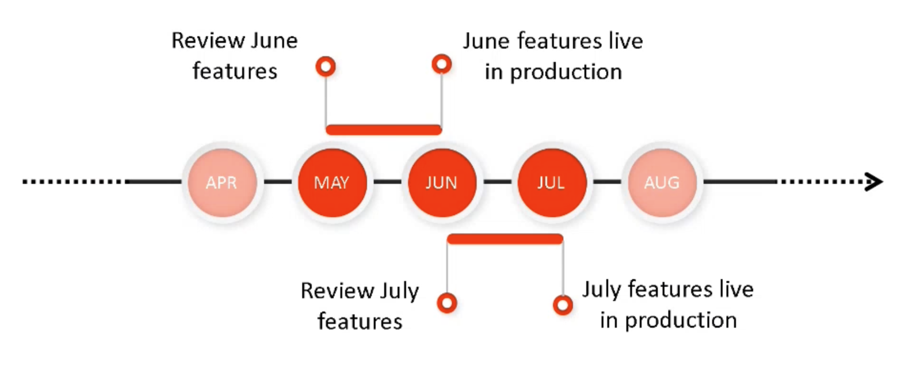
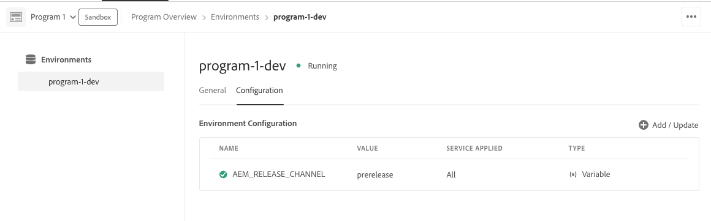

# Adobe Experience Manager as a Cloud Service Prerelease Channel {#prerelease-channel}

Lär dig hur du använder betaversionskanalen för att få en förhandsvisning av kommande funktioner som AEM as a Cloud Service.

## Introduktion {#introduction}

Adobe Experience Manager as a Cloud Service har nya funktioner på ett regelbundet cadence, enligt [Experience Manager släpper vägkartan.](https://experienceleague.adobe.com/docs/experience-manager-release-information/aem-release-updates/update-releases-roadmap.html#aem-as-cloud-service)

Om du vill bekanta dig med de funktioner som är schemalagda att användas i följande funktionsrelease kan du prenumerera på betaversionskanalen, som du kommer åt genom att konfigurera dina utvecklingsmiljöer eller andra sandlådemiljöer. Du kan förhandsgranska ändringar som är tillgängliga via det AEM användargränssnittet samt skapa kod mot nya förhandsversioner-API:er.

Listan över förhandsversionsfunktioner för en viss funktionsrelease finns i [versionsinformation.](/help/release-notes/release-notes-cloud/release-notes-current.md)

## AEM as a Cloud Service releaser {#releases}

AEM as a Cloud Service har två typer av releaser.

* **Funktionsreleaser** lägga till funktioner och funktioner AEM as a Cloud Service, vid aktivering
* **Underhållsreleaser** lägga till säkerhetsuppdateringar, prestandaförbättringar och felkorrigeringar och tillämpas regelbundet och ofta.

Det här mönstret säkerställer kontinuerliga releaser utan avbrott i tjänsten.

Med betaversionskanalen kan du förhandsgranska funktioner som är schemalagda för den kommande funktionsversionen för att utvärdera kommande funktioner och planera för en eventuell implementering för dina egna projekt. Du kan planera i förväg för nästa funktionsversion.

Om det till exempel är maj och du prenumererar på betaversionskanalen kan du utvärdera funktionerna i den kommande versionen från juni.



Med Förhandsversionen får du ett rullande månadsfönster med kommande AEMaaCS-funktioner, som ger dig tid att bedöma effekten av nya funktioner i dina projekt och anpassningar samt planera lanseringar av sådana funktioner, tester och användarutbildning.

För att utnyttja prerelease-kanalen effektivt krävs fyra steg.

1. [Markera dina kalendrar](#mark-calendars)
1. [Granska versionsinformationen](#release-notes)
1. [Få tillgång till och testa de nya funktionerna](#new-features)
1. [Utbilda dina användare](#train-users)

## Markera dina kalendrar {#mark-calendars}

Funktionsreleaser är schemalagda långt i förväg och aktiveringsdatumen publiceras på [Adobe Experience League.](https://experienceleague.adobe.com/docs/experience-manager-release-information/aem-release-updates/update-releases-roadmap.html#aem-as-cloud-service)

Notera releasedatumen så att du kan planera tiden för granskning och test av kommande funktioner.

## Granska versionsinformationen {#release-notes}

När du har markerat releasedatum i kalendern ska du kontrollera [Adobe Experience League](/help/release-notes/release-notes-cloud/release-notes-current.md) webbplatsen på dagen för releasen av den senaste versionsinformationen.

Varje release åtföljs av en versionsinformation som visar att det inte bara är det som är nytt i den versionen, utan även de funktioner som är tillgängliga för förhandsversionsutvärdering. Lär känna dig i förväg och planera för att utnyttja de senaste funktionerna i AEMaaCS!

Du kan också [kontrollera kända fel](/help/release-notes/maintenance/latest.md) som publiceras tillsammans med varje release så att du också kan vara medveten om tekniska problem som kan utgöra en utmaning för din utvärdering eller ett eventuellt antagande av nya funktioner.

## Aktivera förhandsversionskanalen för att få åtkomst och testa nya funktioner {#new-features}

Prerelease-kanalen kan aktiveras i alla utvecklings- och sandlådemiljöer. Förhandsversionen kan inte aktiveras i staging- eller produktionsmiljöer.

Förhandsversionsfunktionerna kan användas på olika sätt:

* [Molnmiljöer](#cloud-environments)
* [Lokal SDK](#local-sdk)

### Molnmiljöer {#cloud-environments}

Om du vill uppdatera en molnmiljö så att den använder förhandsversionen måste du lägga till en ny miljövariabel. Du kan göra detta antingen med användargränssnittet i Cloud Manager eller via CLI.

#### Lägg till miljövariabel med användargränssnittet {#add-with-ui}

1. Logga in i Cloud Manager på [my.cloudmanager.adobe.com](https://my.cloudmanager.adobe.com/) och välja lämplig organisation.

1. Navigera till programmet där du vill aktivera förhandsversionen.

1. Välj den miljö där du vill aktivera förhandsversionen och få åtkomst till konfigurationen via **Program** > **Miljö** > **Miljökonfiguration**.

1. Lägg till en ny [miljövariabel:](../implementing/cloud-manager/environment-variables.md)

   | Namn | Värde | Tjänsten används | Typ |
   |------|-------|-----------------|------|
   | `AEM_RELEASE_CHANNEL` | `prerelease` | Alla | Variabel |

1. Spara ändringarna så uppdateras miljön med prerelease-funktionen aktiverad.

   

#### Lägg till miljövariabel med CLI {#add-with-cli}

Du kan också använda Cloud Manager API och CLI för att uppdatera miljövariablerna.

* Använda [Cloud Manager API:s miljövariabelslutpunkt,](https://developer.adobe.com/experience-cloud/cloud-manager/reference/api/#operation/patchEnvironmentVariables) ange `AEM_RELEASE_CHANNEL` miljövariabel till värdet `prerelease`.

   ```text
   PATCH /program/{programId}/environment/{environmentId}/variables
   [
           {
                   "name" : "AEM_RELEASE_CHANNEL",
                   "value" : "prerelease",
                   "type" : "string"
           }
   ]
   ```

* [Cloud Manager CLI](https://github.com/adobe/aio-cli-plugin-cloudmanager#aio-cloudmanagerset-environment-variables-environmentid) kan också användas

   ```shell
   aio cloudmanager:environment:set-variables <ENVIRONMENT_ID> --programId=<PROGRAM_ID> --variable AEM_RELEASE_CHANNEL “prerelease
   ```

Variabeln kan tas bort eller återställas till ett annat värde om du vill att miljön ska återställas till det vanliga (ej prerelease) kanalens beteende.

### Lokal SDK {#local-sdk}

Du kan se nya funktioner i Sites-konsolen i den lokala QuickStart SDK och kod mot nya API:er i förhandsversionen genom att konfigurera Maven-projektet så att det refererar till förhandsversionen `API Jar` i Maven Central. Du kan också se dessa prerelease-funktioner i den lokala utvecklingsmiljön genom att starta den vanliga QuickStart SDK i förhandsversionsläge.

#### Starta Quickstart SDK i förhandsversionsläge {#prerelease-mode}

1. Hämta SDK från programdistributionsportalen och installera enligt beskrivningen i [Åtkomst till AEM as a Cloud Service SDK.](/help/implementing/developing/introduction/aem-as-a-cloud-service-sdk.md)
1. Inkludera argumentet när du startar SDK QuickStart `-r prerelease`.

Värdet är fästigt så att det bara kan markeras vid första starten. Installera om SDK om du vill ändra kommandoradsalternativet.

Eftersom det kan finnas flera AEM underhållsreleaser mellan de olika månadsvisa funktionsreleaserna kan du ladda ned dessa nya SDK och hänvisa till de nya Jar-versionerna av SDK API i större projekt. Underhållsreleaserna kommer inte att innehålla ytterligare förhandsversionsfunktioner, men kan innehålla andra mindre ändringar som felkorrigeringar, säkerhetskorrigeringar och prestandaförbättringar.
Javadocs publiceras i Maven Central.

#### Bygg mot prerelease SDK {#build-sdk}

1. Ändra maven-projektets `pom.xml` för att hänvisa till en separat förhandsversion av SDK API jar som publiceras i Maven Central. Den innehåller alla nya Java API:er för prerelease-funktionerna och är beroende av SDK API jar. Den har samma version.

   Här är ett exempel på ett utdrag från det överordnade elevens beroendehanteringsavsnitt som refererar till den vanliga API-behållaren:

   ```
   <dependencyManagement>
    <dependencies>
        <dependency>
            <groupId>com.adobe.aem</groupId>
            <artifactId>aem-sdk-api</artifactId>
            <version>${aem.sdk.api}</version>
            <scope>provided</scope>
        </dependency>
   ```

   Och sedan användningen i en modul:

   ```
    <dependencies>
     <dependency>
         <groupId>com.adobe.aem</groupId>
         <artifactId>aem-sdk-api</artifactId>
     </dependency>
   ```

   Ändra bara beroendet från `com.adobe.aem:aem-sdk-api` till `com.adobe.aem:aem-prerelease-sdk-api` enligt vad som anges nedan:

   ```
   <dependencyManagement>
    <dependencies>
      <dependency>
            <groupId>com.adobe.aem</groupId>
            <artifactId>aem-prerelease-sdk-api</artifactId>
            <version>${aem.sdk.api}</version>
            <scope>provided</scope>
      </dependency>
   <dependencies>
      <dependency>
         <groupId>com.adobe.aem</groupId>
         <artifactId>aem-prerelease-sdk-api</artifactId>
      </dependency>
   ```

   Som vanligt kan enskilda projekt använda beroendet.

1. Distribuera till den lokala servern.

1. Om du är säker på att det fungerar som förväntat lokalt kan du implementera kod i en utvecklingsgren och använda en icke-produktionsprocess i Cloud Manager för att distribuera till en miljö som prenumererar på betaversionskanalen.

>[!CAUTION]
> 
> The `aem-prerelease-sdk-api` artifactId får aldrig användas vid distribution till scenen eller produktionen. Använd alltid `aem-sdk-api` vid driftsättning via produktionsflödet. Kod som refererar till prerelease-API:er ska inte heller distribueras via produktionsflödet.

The [AEM CS SDK build Analyzer maven plugin v1.0 och senare](https://experienceleague.adobe.com/docs/experience-manager-core-components/using/developing/archetype/build-analyzer-maven-plugin.html#developing) identifierar om prerelease API används i ett projekt genom att undersöka beroendena. Om analyseraren hittar den kommer den att använda SDK-API:t för prerelease för att analysera projektet.

## Utbilda dina användare {#train-users}

När du har testat de nya funktionerna i betaversionskanalen och har bestämt dig för att utnyttja dem i dina projekt måste du utbilda dina användare.

Adobe Experience League erbjuder massor av resurser för att lära sig AEMaaCS.

* [AEMaaCS-dokumentationen](https://experienceleague.adobe.com/docs/experience-manager-cloud-service.html)
* [Självstudiekurser](https://experienceleague.adobe.com/docs/experience-manager-learn/aem-tutorials/overview.html)
* [Översikt över månadsreleasen](/help/release-notes/release-notes-cloud/release-notes-current.md#release-video) i versionsinformationen

## Överväganden {#considerations}

Det finns några saker att tänka på när du använder betaversionskanalen.

* Prerelease-kanalen innehåller inte nödvändigtvis alla nya funktioner som ska lanseras i följande version.
* Funktioner i betaversionen är strikta och avsedda att vara fullständiga snarare än betakvalitet. Om du upptäcker några problem ska du rapportera dem, precis som du skulle göra om du misstänker att det finns fel i en vanlig AEM.
* Om du vill avgöra om en miljö är konfigurerad för betaversionskanalen går du till AEM konsols **Om** och kontrollera om AEM innehåller en *prerelease* suffix som ```Adobe Experience Manager 2021.4.5226.20210427T070726Z-210429-PRERELEASE```.


