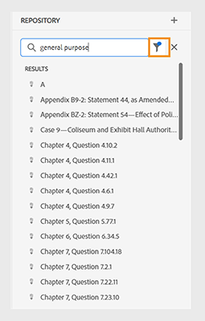
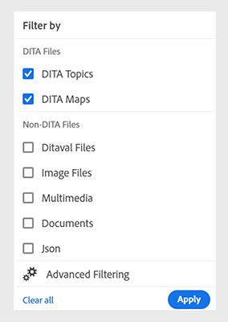
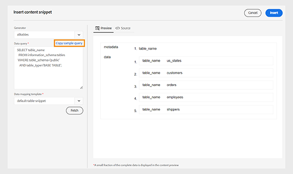

# Aktuell versionsinformation för [!DNL Adobe Experience Manager] as a Cloud Service {#release-notes}

I följande avsnitt beskrivs versionsinformationen för den aktuella (senaste) versionen av [!DNL Experience Manager] as a Cloud Service.

>[!NOTE]
>
>Härifrån kan du navigera till versionsinformation för tidigare versioner som 2021 eller 2022.
>
>Ta en titt på [Roadmap för lanseringar av Experience Manager](https://experienceleague.adobe.com/en/docs/experience-manager-release-information/aem-release-updates/update-releases-roadmap) om de kommande funktionsaktiviteterna för [!DNL Experience Manager] as a Cloud Service.

>[!NOTE]
>
>Se [Senaste dokumentationsuppdateringar](https://experienceleague.adobe.com/en/docs/experience-manager-release-information/aem-release-updates/doc-updates/documentation-updates) för information om dokumentationsuppdateringar som inte är direkt relaterade till en release.

## Releasedatum {#release-date}

Utgivningsdatumet [!DNL Adobe Experience Manager] som [!DNL Cloud Service] aktuell version (2024.4.0) är 25 april 2024. Nästa version (2024.5.0) är planerad till 30 maj 2024.

## Versionsinformation om underhåll {#maintenance}

Du kan hitta den senaste underhållsreleasenumerationen [här](/help/release-notes/maintenance/latest.md).

<!-- ## Release Video {#release-video}

Have a look at the April 2024 Release Overview video for a summary of the features added in the 2024.4.0 release:

>[!VIDEO](https://video.tv.adobe.com/v/3428342?quality=12)

-->

## [!DNL Experience Manager Sites] som [!DNL Cloud Service] {#sites}

### Tidiga Adobe-program {#sites-early-adopter}

**Generera variationer**

Utnyttja GenAI genom AEM nya funktioner, [generera variationer](/help/generative-ai/generate-variations.md), nu i Cloud Service. Generera variationer hjälper er att generera och skala innehåll med hjälp av generativ AI. Kontakta ert Adobe-kontoteam för att ta del av detta i programmet.

**Resursbläddring i Content Fragment Console**

Innehållsförfattare kan nu bläddra bland, visa och vidta åtgärder för bilder och andra resurser utan att behöva lämna konsolen Innehållsfragment.

Är du intresserad av att testa funktionen och ge feedback? Skicka ett e-postmeddelande till aemcs-headless-adopter@adobe.com från ditt officiella e-post-ID om du vill veta mer om det tidiga adopterprogrammet.

## [!DNL Experience Manager Assets] som [!DNL Cloud Service] {#assets}

### Nya funktioner i resursvyn {#assets-view-new-features}

**Sammanhangsbaserad sökning**

Nu kan du också [sökresurser som är tillgängliga i databasen genom att definiera textmeddelanden](/help/assets/search-assets-view.md#contextual-search). Experience Manager Assets omvandlar automatiskt dessa textmeddelanden till sökfilter och visar sökresultaten. Du kan visa och ändra automatiska filter med hjälp av filterpanelen för att begränsa sökresultaten ytterligare.

**Snabba videoåtgärder**

Experience Manager Assets innehåller nu [enkla och intuitiva videoredigeringsverktyg som bygger på Adobe Express](/help/assets/edit-videos-assets-view.md) för att öka återanvändning av innehåll och snabba upp innehållets hastighet. Redigeringsalternativen omfattar trimning, beskärning, storleksändring av en video och även konvertering av en MP4-fil till en GIF-fil.

**Dynamiska renderingar**

Nu kan du [visa och hämta dynamiska återgivningar (inklusive smarta beskärningar)](/help/assets/renditions.md) i Experience Manager Assets. Dynamiska återgivningar är anpassade versioner av bildresurser som skapats i realtid för att uppfylla specifika behov, som att ändra storlek på bilder baserat på enhetsupplösning eller beskära för att passa olika proportioner. Med dessa renderingar kan organisationer leverera personaliserade och optimerade upplevelser till olika målgruppsbehov.

**Byt namn på plats för resurser och mappar**

Experience Manager Assets erbjuder nu en förenklad användarupplevelse genom att tillhandahålla [möjlighet att byta namn på en resurs eller mapp med ett enda klick](/help/assets/manage-organize-assets-view.md).

**Tilldela eller ta bort metadataformulär till flera mappar**

Nu kan du [tilldela eller ta bort metadataformulär till flera mappar](/help/assets/metadata-assets-view.md#assign-metadata-form-to-a-folder).

## [!DNL Experience Manager Forms] som [!DNL Cloud Service] {#forms}

<!-- 

* **Configure a shard for Adobe Sign for AEM Forms**: Adobe distributes Acrobat Sign API around the globe in many deployment units called "shards." Each shard serves a customer's account, such as NA1, NA2, NA3, EU1, JP1, AU1, IN1, and others. The shard names correspond to geographic locations. You can now use more than one shard while using Adobe Sign integration with AEM Forms. 

-->

### Nya funktioner i AEM Forms {#forms-new-features}

* **Förbättrad Visual Rule Editor för Core Component Based Adaptive Forms**: Den här versionen innebär en betydande uppgradering av den visuella regelredigeraren för adaptiva formulär baserade på kärnkomponenter. Den här versionen innebär en betydande uppgradering av den visuella regelredigeraren för adaptiva formulär baserade på kärnkomponenter. Uppdateringen fokuserar på att effektivisera interaktionen med anpassade funktioner, så att du kan skapa mer robusta och effektiva formulär.

  Nu kan du effektivisera anpassade funktionsinteraktioner genom att:

   * [Använd nya kommentarer för att få tydligare funktionsdefinitioner](/help/forms/create-and-use-custom-functions.md#supported-javascript-annotations-for-custom-function).
   * [Använda cachningsmekanismer för anpassade funktioner, vilket ger snabbare formulärprestanda](/help/forms/create-and-use-custom-functions.md#caching-support-for-custom-function).
   * [Arbeta smidigt med globala objekt i anpassade funktioner](/help/forms/create-and-use-custom-functions.md#field-and-global-scope-objects-in-custom-functions).
   * [Definiera och använda valfria parametrar i anpassade funktioner](/help/forms/create-and-use-custom-functions.md#parameter).

  Uppdateringen innehåller även följande förbättringar av regelredigeringsfunktionen. Du kan:

   * Implementera kraftfulla [&quot;when-then-else&quot;](/help/forms/rule-editor-core-components.md#when) logik för villkorlig körning.
   * Utnyttja moderna JavaScript-funktioner som låt- och pilfunktioner (ES10-stöd).
   * Validera eller återställ inte bara fält, utan även hela paneler och formulär, vilket ger bättre kontroll över användarinteraktioner.

  Dessa förbättringar ger en mer intuitiv och kraftfull upplevelse när man skapar regler och anpassade funktioner i den visuella regelredigeraren.

* **[Skapa flera versioner av ett adaptivt formulär](/help/forms/add-comments-annotations-versioning-adaptive-form-core-components.md)**: Nu kan du enkelt hantera varianter av befintliga formulär. Detta förenklar versionskontrollen och underlättar jämförelse för formuläroptimering, allt i ett enda smidigt arbetsflöde.

* **[Jämför adaptiv form](/help/forms/compare-forms.md)**: Du kan nu enkelt jämföra två formulär för att identifiera skillnader mellan två formulär. Det underlättar smidigt samarbete genom att teammedlemmarna kan jämföra revisioner och diskutera ändringar effektivt.

* **Hjälpmedelsförbättringar för komponent för flexibel signatur**: Den här uppdateringen förbättrar tillgängligheten avsevärt för komponenten Scribble Signature:

  **Förbättrad navigering:**
   * Genom att trycka på Tabb kan användarna navigera bland alla interaktiva element i signaturdialogrutan.
   * Om du signerar med en pensel eller ett tangentbord och trycker på Retur stängs dialogrutan.
   * Fokuset ligger kvar på signaturkontrollen när du har signerat och klickat på OK.

  **Rensa signaturfunktioner:**

   * En tydlig kryssikon för att radera signaturen är tillgänglig via tabbtangenten.
   * Dialogrutan&quot;Bekräfta signatur&quot; är också tillgänglig via tabbnavigering.

  **Förbättrade etiketter och kontroller:**
   * Etiketten för tangentbordssignaturknappen är nu tydligare och använder&quot;aria-label&quot; för att meddela funktioner (till exempel&quot;aria-label=&#39;Signera med tangentbord&#39;&quot;).
   * Förbättrad kontrast gör att alla kontroller i den klotbaserade signaturen är lätta att urskilja.
   * Knappen OK/bock visar nu när den är inaktiv.

  **Signaturfeedback för Screen Reader:**
   * När en signatur skrivs kan skärmläsaranvändare höra texten som användes för att skapa signaturen.

Denna uppdatering ger en mer heltäckande upplevelse för användare med funktionshinder genom att förbättra navigering, klarhet och feedback för komponenten Klottsignatur.

### Tidiga Adobe-program {#forms-early-adopter}

* **[Skicka ett anpassat formulär till Adobe Workfront Fusion Scenario](/help/forms/submit-adaptive-form-to-workfront-fusion.md)**: Forms as a Cloud Service har ett körklart alternativ för att enkelt ansluta ett adaptivt formulär till Adobe Workfront. Detta förenklar processen att skicka in ett adaptivt formulär till ett Adobe Workfront-scenario, vilket gör att du kan utlösa ett Workfront Fusion-scenario när ett adaptivt formulär skickas in.

       Med Adobe Workfront Fusion Connector kan du utforma arbetsflöden som aktiveras automatiskt när ett adaptivt formulär skickas in. Du kan till exempel förutse ett scenario där ett arbetsflöde initieras för att tilldela en viss person uppgiften att granska inskickade data, vilket gör det möjligt att godkänna eller avvisa en ansökan baserat på den information som hämtas via det anpassade formuläret. Denna smidiga integrering ökar effektiviteten och ger en ny nivå av automatisering i arbetsflödesprocesserna.|

* **[Tilläggstjänsten Reader](/help/forms/aem-forms-cloud-service-communications-introduction.md#reader-extension-service)**: AEM Forms Communication API:er har Reader Extension Service där du kan lägga till funktioner som ifyllnad av formulär och kommentarer i vanliga PDF, vilket gör dem interaktiva för användare med kostnadsfria Adobe Reader.

* [Stöd för språk från höger till vänster](/help/forms/supporting-new-language-localization-core-components.md): Adaptiv Forms som bygger på kärnkomponenter kan nu presenteras på höger-till-vänster-språk (RTL) som arabiska, persiska och urdu. RTL-språken talas av över 2 miljarder människor globalt. Genom att använda ett formulär på RTL-språk kan ni utöka räckvidden för era adaptiva formulär så att de kan anpassas till dessa olika målgrupper och väljas ut på RTL-marknader. I vissa regioner är det också ett juridiskt mandat att tillhandahålla formulär på det lokala språket. Genom att ta hand om lokala språk kan ni inte bara öppna dörrar för en bredare publik utan också säkerställa att relevanta lagar och bestämmelser följs.

* **[Protect dina dokument med DocAssurance API:er (del av kommunikations-API:er)](/help/forms/aem-forms-cloud-service-communications-introduction.md#document-assurance-doc-assurance)**: Med API:erna för DocAssurance kan du skydda känslig information genom att signera och kryptera dokumenten. Genom kryptering omvandlas innehållet i ett dokument till ett oläsligt format så att bara behöriga användare kan få åtkomst till det. Detta förstärkta skydd skyddar inte bara värdefulla data från obehöriga ögon, utan ger även sinnesro. Med signatur-API:erna kan din organisation skydda säkerheten och sekretessen för Adobe PDF-dokument som den distribuerar och tar emot. Den här tjänsten använder digitala signaturer och certifiering för att säkerställa att endast avsedda mottagare kan ändra dokument.

  Du kan skriva till `aem-forms-ea@adobe.com` från ditt officiella e-post-id för att gå med i programmet för tidiga användare och begära åtkomst till funktionen.

* **[Du kan använda datatjänsten för övervakning av verkliga användare (RUM)](/help/implementing/cloud-manager/content-requests.md#real-user-monitoring-for-aem-as-a-cloud-service)** för att aktivera klientsidessamling för AEM as a Cloud Service.
Real User Monitoring (RUM) Data Service ger en mer exakt återgivning av användarinteraktioner och säkerställer ett tillförlitligt mått på webbplatsengagemanget. Det är en utmärkt möjlighet att få avancerade insikter om hur sidan fungerar. Detta är fördelaktigt för kunder som använder antingen Adobe-hanterat CDN eller icke-Adobe-hanterat CDN. För kunder som använder ett icke-Adobe-hanterat CDN kan nu dessutom automatiserad trafikrapportering aktiveras för dem, vilket eliminerar behovet av att dela trafikrapporter med Adobe.

  Om du vill testa den här nya funktionen och dela med dig av dina synpunkter skickar du ett e-postmeddelande till `aemcs-rum-adopter@adobe.com`, tillsammans med ditt domännamn för varje miljö som du vill aktivera RUM för från din e-postadress som är kopplad till din Adobe ID. Adobe produktteam aktiverar sedan datatjänsten Real User Monitoring (RUM) åt dig.

## [!DNL Experience Manager] som [!DNL Cloud Service] Foundation {#foundation}

### CDN-konfiguration {#cdn-config}

Konfigurera trafiken på CDN i Adobe på följande sätt:

* [Begär omformningar](/help/implementing/dispatcher/cdn-configuring-traffic.md#request-transformations) - ändra aspekter av inkommande begäranden, inklusive sökvägar, frågeparametrar och HTTP-huvuden innan de dirigeras till AEM.
* [Svarsomvandlingar](/help/implementing/dispatcher/cdn-configuring-traffic.md#response-transformations) - ändra HTTP-huvuden för utgående svar innan de skickas till webbläsaren.
* [Väljare för ursprung](/help/implementing/dispatcher/cdn-configuring-traffic.md#response-transformations#origin-selectors) - dirigera trafik genom CDN till externa webbplatser och tillämpningar AEM.

När dessa regler har deklarerats i Git (Source Control) kan du distribuera dem till CDN med hjälp av Cloud Manager Configuration Pipeline. Se även funktionen för omdirigering på klientsidan i avsnittet för tidig användare nedan.

### Anpassade CDN-felsidor {#cdn-error-pages}

Om det osannolika skulle inträffa att leveransnätverket inte kan dirigera trafik till AEM ursprung, kan en anpassad felsida deklareras och ersätta den generiska versionen. [Läs mer](/help/implementing/dispatcher/cdn-error-pages.md) om hur du hanterar varumärkesanpassade felsidor.

### Tidiga Adobe-program {#foundation-early-adopter}

#### Omdirigeringar på klientsidan (tidig Adobe-program) {#client-side-redirects-early-adopter}

Konfigurera 301/302 klientomdirigeringar i källkontroll och distribuera till CDN. [Läs mer](/help/implementing/dispatcher/cdn-configuring-traffic.md#client-side-redirectors) och gå med i det tidiga adopterprogrammet genom att mejla **<aemcs-cdn-config-adopter@adobe.com>**.

#### Varningar om trafikfilterregler (tidig Adobe-program) {#traffic-filter-rules-alerts-early-adopter}

Nyligen släppt [Trafikfilterregler](/help/security/traffic-filter-rules-including-waf.md), som innehåller de valfria reglerna för brandvägg för webbprogram (WAF), låter dig konfigurera vilken trafik som ska tillåtas eller nekas.

Nu kan du mejla **<aemcs-cdn-config-adopter@adobe.com>** om du vill gå med i det tidiga adopterprogrammet så att du kan varnas när trafikfilterreglerna aktiveras. E-postmeddelanden från Åtgärdscenter håller dig informerad när vissa trafikförhållanden inträffar så att du kan vidta lämpliga åtgärder.

#### Apache/Dispatcher Runtime Ing of Rewrite Maps (Early Adobe Program) {#apache-rewritemaps-early-adopter}

Ungefär som AEM 6.5, kommer Apache/dispatcher att importera omskrivningskartor som placerats på en viss plats i publiceringsdatabasen och läsa in dem, utan att någon pipeline-körning för webbnivån krävs. Detta öppnar möjligheter för en affärsanvändare att deklarera omdirigeringar med ett användargränssnitt, som det som finns i ACS Commons Redirect Map Manager. Kontakta **<aemcs-cdn-config-adopter@adobe.com>** för mer information.

#### Edge Side Includes (ESI) för inläsning av dynamiskt innehåll (tidig Adobe-program) {#esi-early-adopter}

Hanterad CDN i Adobe har nu stöd för Edge Side Includes (ESI), ett markeringsspråk för dynamisk sammanställning av webbinnehåll på edge-nivå. Genom att ta med ESI-fragment kan du cachelagra hela HTML-sidan vid CDN med högre TTL-värden, medan du oftare hämtar mindre avsnitt från ursprungsläget som kräver högre uppdateringsintervall (nedre TTL-värden). Kontakta **<aemcs-cdn-config-adopter@adobe.com>** för mer information.

#### RDE-stöd för Front-End-kod med hjälp av Site Themes och Site Templates (Early Adopter Program) {#rde-frontend-early-adopter}

[Rapid Development Environment (RDE)](/help/implementing/developing/introduction/rapid-development-environments.md) nu stöder kod som bygger på [webbplatsteman](/help/sites-cloud/administering/site-creation/site-themes.md) och [webbplatsmallar](/help/sites-cloud/administering/site-creation/site-templates.md), för tidiga användare. Med de lokala redigeringssystemen görs detta med hjälp av ett kommandoradsdirektiv i stället för ett [rörledning för frontend](/help/sites-cloud/administering/site-creation/enable-front-end-pipeline.md). Kontakta **<aemcs-rde-support@adobe.com>** för att testa och ge feedback.

#### Förbättrad loggning för RDE (Early Adobe Program) {#rde-logging-early-adopter}

När du felsöker kod i en [Rapid Development Environment (RDE)](/help/implementing/developing/introduction/rapid-development-environments.md)kan utvecklare nu konfigurera och strömma loggar effektivare med kommandoraden utan att ändra OSGI-egenskaperna i versionskontrollen. Funktioner:

* deklarera loggnivåer per paket eller klassnivå
* anpassa loggutdataformatet
* strömma flera loggar parallellt

Kontakta **<aemcs-rde-support@adobe.com>** för att testa och ge feedback.

## [!DNL Experience Manager] Stödlinjer {#guides}

### Möjlighet att översätta innehåll till flera språk med förkonfigurerade språkgrupper

Nu kan du skapa språkgrupper och enkelt översätta innehåll till flera språk med hjälp av guiderna i Experience Manager. Med den här funktionen kan du ordna och hantera översättningar efter organisationens behov.

Om du till exempel behöver översätta innehåll för vissa länder i Europa kan du skapa en språkgrupp för europeiska språk som engelska (EN), franska (FR), tyska (DE), spanska (ES) och italienska (IT).

*Välj de språkgrupper eller språk som du vill översätta dina dokument.*

>[!NOTE]
>
>Om målmappen för ett språk saknas eller målspråket är samma som källan, är den nedtonad och visar ett varningstecken.

Som administratör kan du skapa språkgrupper och konfigurera dem till flera mappprofiler. Som författare kan du visa språkgrupperna som är konfigurerade för din mappprofil.

Generellt sett förbättrar möjligheten att skapa språkgrupper effektiviteten och produktiviteten i översättningsprojekt, vilket i slutänden förbättrar lokaliseringsprocessen för flera språk.

Lär dig hur [översätta dokument från webbredigeraren](https://experienceleague.adobe.com/en/docs/experience-manager-guides/using/user-guide/author-content/create-preview-topics/author-content-aem-guides/work-with-web-editor/translate-documents-web-editor)

### Förbättrad upplevelse för att söka efter och filtrera filer i databasvyn

Nu får du en bättre upplevelse när du filtrerar filer. Den förbättrade funktionen för att filtrera filer är ett bättre sätt att enkelt söka efter och navigera bland filer.

*Sök efter filerna som innehåller texten`general purpose.`*

Få snabbare åtkomst till relevanta filer och ett mer intuitivt användargränssnitt, vilket gör sökningen smidigare och effektivare.

*Använd snabbfiltren för att söka efter DITA- och icke-DITA-filer.*

Läs mer om **Filtersökning** i [Vänster panel](https://experienceleague.adobe.com/en/docs/experience-manager-guides/using/user-guide/author-content/create-preview-topics/author-content-aem-guides/work-with-web-editor/web-editor-features#id2051EA0M0HS) -avsnitt.

### Förbättringar i datakällkopplingen

Följande förbättringar har gjorts i datakällanslutningarna för version 2024.4.0:

#### Anslut till datakällor för Salsify, Akeneo och Microsoft Azure DevOps Boards (ADO)

Förutom de befintliga färdiga anslutningarna har Experience Manager Guides även kopplingar för datakällorna Salsify, Akeneo och Microsoft Azure DevOps Boards (ADO). Som administratör kan du hämta och installera dessa anslutningar. Konfigurera sedan de installerade anslutningarna.

#### Kopiera och klistra in exempelfrågan för att skapa ett innehållsutdrag eller ämne

Du kan enkelt kopiera och klistra in en exempeldatafråga i generatorn för att skapa ett innehållsavdrag eller ämne. Med den här funktionen behöver du inte komma ihåg syntaxen eller skapa en fråga manuellt. I stället för att skriva frågan manuellt kan du kopiera och klistra in en exempelfråga, redigera den och använda den för att hämta data efter dina behov.

*Kopiera och redigera en exempelfråga för att skapa innehållsfragmentet.*

#### Anslut till JSON-datafiler med en filkoppling

Som administratör kan du nu konfigurera en JSON-filkoppling så att JSON-datafiler används som datakälla. Använd anslutningen för att importera JSON-filerna från datorn eller Adobe Experience Manager Assets. Som författare kan du sedan skapa innehållsfragment eller ämnen med hjälp av generatorerna.

Den här funktionen hjälper dig att använda data som lagras i dina JSON-filer och återanvända dem i olika fragment. Innehållet uppdateras också dynamiskt när du uppdaterar JSON-filerna.

#### Konfigurera flera resurs-URL:er för en koppling för att skapa innehållskodfragment eller ämnen

Som administratör kan du konfigurera flera resurs-URL:er för vissa anslutningar som Generic REST Client, Salsify, Akeneo och Microsoft Azure DevOps Boards (ADO).
Som författare kan du sedan ansluta till datakällorna för att skapa innehållsfragment eller ämnen med generatorerna. Den här funktionen är användbar eftersom du inte behöver skapa en datakälla för varje URL. Det hjälper dig att snabbt hämta data från någon av resurserna för en viss datakälla i ett enda innehållskuvert eller ämne. Visa mer information om datakällanslutningar och hur [konfigurera en datakällanslutning från användargränssnittet](https://experienceleague.adobe.com/en/docs/experience-manager-guides/using/install-guide/cs-ig/web-editor-configs-cs/conf-data-source-connector-tools). Lär dig hur [använda data från datakällan](https://experienceleague.adobe.com/en/docs/experience-manager-guides/using/user-guide/author-content/create-preview-topics/author-content-aem-guides/work-with-web-editor/web-editor-content-snippet).

Mer information om de nya funktionerna och förbättringarna finns i [Nyheter i version 2024.04.0](https://experienceleague.adobe.com/en/docs/experience-manager-guides/using/release-info/release-notes/cloud-release-notes/2024-releases/2404-release/whats-new-2024-04-0).

En lista över problem som har åtgärdats i den här versionen finns på [Åtgärdade problem i version 2024.4.0](https://experienceleague.adobe.com/en/docs/experience-manager-guides/using/release-info/release-notes/cloud-release-notes/2024-releases/2404-release/fixed-issues-2024-04-0).

## Cloud Manager {#cloud-manager}

Du hittar en fullständig lista över månatliga utgåvor av Cloud Manager [här](/help/implementing/cloud-manager/release-notes/current.md).

## Migreringsverktyg {#migration-tools}

Du hittar en fullständig lista över versioner av migreringsverktyg [här](/help/journey-migration/release-notes/release-notes-migration-tools-current.md).
