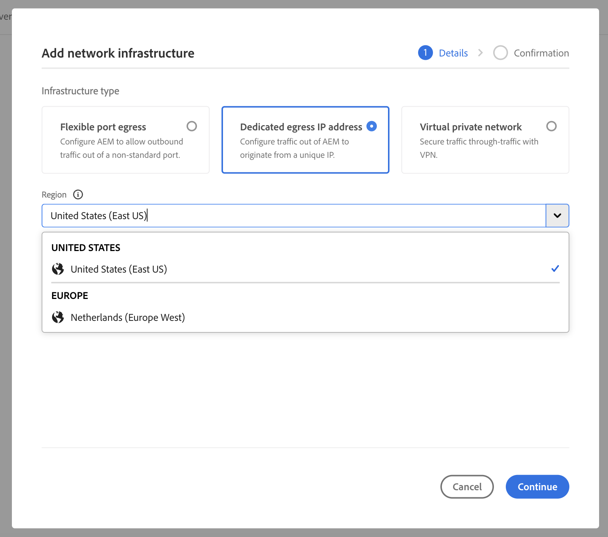
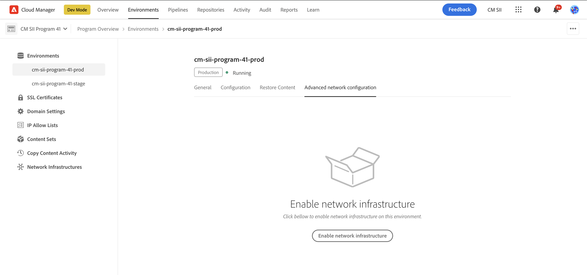
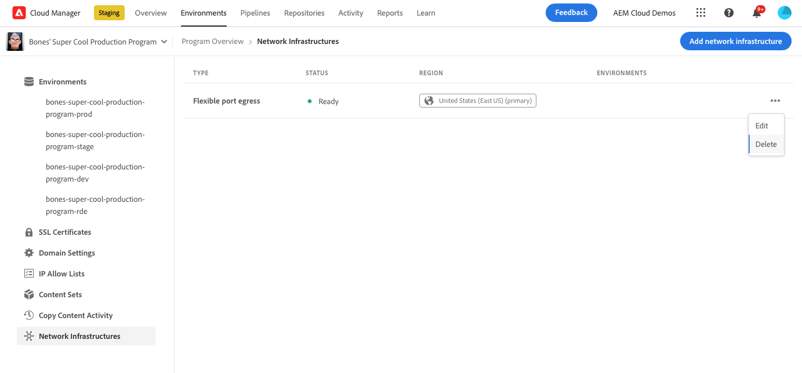

# Konfigurera avancerat nätverk för AEM as a Cloud Service {#configuring-advanced-networking}

I den här artikeln beskrivs de olika avancerade nätverksfunktionerna i AEM as a Cloud Service, inklusive självbetjäning och API-etablering för VPN, icke-standardportar och dedikerade IP-adresser för utgångar.

>[!TIP]
>
>Förutom den här dokumentationen finns det också en serie självstudiekurser som hjälper dig igenom de avancerade nätverksalternativen på den här [platsen](https://experienceleague.adobe.com/en/docs/experience-manager-learn/cloud-service/networking/advanced-networking).

## Ökning {#overview}

AEM as a Cloud Service erbjuder följande avancerade nätverksalternativ:

* [Flexibel portutgång](#flexible-port-egress) - Konfigurera AEM as a Cloud Service så att utgående trafik tillåts från icke-standardportar.
* [Dedikerad IP-adress för utgångar](#dedicated-egress-ip-address) - Konfigurera trafik från AEM as a Cloud Service att komma från en unik IP-adress.
* [VPN (Virtual Private Network)](#vpn) - Säker trafik mellan din infrastruktur och AEM as a Cloud Service, om du har ett VPN.

I den här artikeln beskrivs dessa alternativ i detalj och varför du kan använda dem, innan du beskriver hur de konfigureras med Cloud Manager-gränssnittet och med API:t. Artikeln avslutas med några exempel på avancerad användning.

>[!CAUTION]
>
>Om du redan har etablerat dig med äldre dedikerad utgångsteknik och vill konfigurera något av dessa avancerade nätverksalternativ, [kontaktar du Adobe Client Care](https://experienceleague.adobe.com/?support-solution=Experience+Manager#home).
>
>Om du försöker konfigurera avancerade nätverk med äldre teknik kan det påverka webbplatsanslutningen.

### Krav och begränsningar {#requirements}

När avancerade nätverksfunktioner konfigureras gäller följande begränsningar.

* Ett program kan tillhandahålla ett enda avancerat nätverksalternativ (flexibel portutgång, dedikerad IP-adress för utgångar eller VPN).
* Avancerade nätverk är inte tillgängliga för [sandlådeprogram](/help/implementing/cloud-manager/getting-access-to-aem-in-cloud/program-types.md).
* En användare i måste ha rollen **Administratör** för att lägga till och konfigurera nätverksinfrastruktur i ditt program.
* Produktionsmiljön måste skapas innan nätverksinfrastrukturen kan läggas till i programmet.
* Nätverksinfrastrukturen måste finnas i samma region som produktionsmiljöns primära region.
   * Om produktionsmiljön har [extra publiceringsregioner](/help/implementing/cloud-manager/manage-environments.md#multiple-regions) kan du skapa en annan nätverksinfrastruktur som speglar varje ytterligare region.
   * Du får inte skapa fler nätverksinfrastrukturer än det maximala antalet regioner som är konfigurerade i din produktionsmiljö.
   * Du kan definiera så många nätverksinfrastrukturer som tillgängliga regioner i din produktionsmiljö, men ny infrastruktur måste vara av samma typ som den tidigare skapade infrastrukturen.
   * När du skapar flera infrastrukturer får du bara välja bland de områden där avancerad nätverksinfrastruktur inte har skapats.

### Konfigurera och aktivera avancerat nätverk {#configuring-enabling}

För avancerade nätverksfunktioner krävs två steg:

1. Konfigurationen av det avancerade nätverksalternativet, oavsett om det är [flexibel portutgång](#flexible-port-egress), [dedikerad IP-adress](#dedicated-egress-ip-address) eller [VPN](#vpn), måste först göras på programnivå.
1. Om du vill använda det avancerade nätverksalternativet måste du [aktivera på miljönivå](#enabling).

Båda stegen kan utföras med Cloud Manager-gränssnittet eller Cloud Manager-API:t.

* När du använder användargränssnittet i Cloud Manager innebär det att du skapar avancerade nätverkskonfigurationer med en guide på programnivå och sedan redigerar varje miljö där du vill aktivera konfigurationen.

* När du använder Cloud Manager API anropas API-slutpunkten `/networkInfrastructures` på programnivå för att deklarera önskad typ av avancerat nätverk. Därefter anropas slutpunkten `/advancedNetworking` för varje miljö för att aktivera infrastrukturen och konfigurera miljöspecifika parametrar.

## Flexibla portägg {#flexible-port-egress}

Med den här avancerade nätverksfunktionen kan du konfigurera AEM as a Cloud Service att utlösa trafik via andra portar än HTTP (port 80) och HTTPS (port 443), som är öppna som standard.

>[!TIP]
>
>När du ska välja mellan flexibel portutgång och dedikerad IP-adress för utgångar bör du välja flexibel portutgång om en viss IP-adress inte krävs. Orsaken är att Adobe kan optimera prestanda för flexibel hamnutresetrafik.

>[!NOTE]
>
>Efter det att du skapat en portutgångsinfrastruktur kan du inte redigera den. Det enda sättet att ändra konfigurationsvärden är att ta bort och återskapa dem.

### UI-konfiguration {#configuring-flexible-port-egress-provision-ui}

1. Logga in på Cloud Manager på [my.cloudmanager.adobe.com](https://my.cloudmanager.adobe.com/) och välj lämplig organisation.

1. Välj programmet på konsolen **[Mina program](/help/implementing/cloud-manager/navigation.md#my-programs)**.

1. Gå till fliken **Miljö** på sidan **Programöversikt** och välj **Nätverksinfrastruktur** på den vänstra panelen.

   

1. I guiden **Lägg till nätverksinfrastruktur** väljer du **Flexibel portutgång** och den region där den ska skapas i listrutan **Region** och klickar på **Fortsätt**.

   

1. Fliken **Bekräftelse** sammanfattar ditt val och nästa steg. Klicka på **Spara** för att skapa infrastrukturen.

   

En ny post visas under rubriken **Nätverksinfrastruktur** på sidopanelen, med information om vilken typ av infrastruktur, status, region och miljöer som den har aktiverats för.


>[!NOTE]
>
>Det kan ta upp till en timme att skapa en infrastruktur för flexibel hamnutgångar efter vilken den kan konfigureras på miljönivå.

### API-konfiguration {#configuring-flexible-port-egress-provision-api}

En gång per program anropas slutpunkten för POSTEN `/program/<programId>/networkInfrastructures` och värdet `flexiblePortEgress` skickas för parametern och regionen `kind`. Slutpunkten svarar med `network_id` och annan information, inklusive status.

När nätverksinfrastrukturen väl har anropats tar det oftast ca 15 minuter innan den etableras. Ett anrop till Cloud Manager [GET-slutpunkten för nätverksinfrastruktur](https://developer.adobe.com/experience-cloud/cloud-manager/reference/api/#operation/getNetworkInfrastructure) skulle visa statusen **ready**.

>[!TIP]
>
>Hela uppsättningen parametrar, exakt syntax och viktig information, som vilka parametrar som inte kan ändras senare, [kan refereras i API-dokumentationen](https://developer.adobe.com/experience-cloud/cloud-manager/reference/api/#operation/createNetworkInfrastructure).

### Trafikroutning {#flexible-port-egress-traffic-routing}

För http- eller https-trafik som går till andra portar än 80 eller 443 bör en proxy konfigureras med följande värden och portmiljövariabler:

* för HTTP: `AEM_PROXY_HOST` / `AEM_HTTP_PROXY_PORT ` (standard är `proxy.tunnel:3128` i AEM versioner &lt; 6094)
* för HTTPS: `AEM_PROXY_HOST` / `AEM_HTTPS_PROXY_PORT ` (standard är `proxy.tunnel:3128` i AEM versioner &lt; 6094)

Här följer exempelkoden som skickar en begäran till `www.example.com:8443`:

```java
String url = "www.example.com:8443"
String proxyHost = System.getenv().getOrDefault("AEM_PROXY_HOST", "proxy.tunnel");
int proxyPort = Integer.parseInt(System.getenv().getOrDefault("AEM_HTTPS_PROXY_PORT", "3128"));
HttpClient client = HttpClient.newBuilder()
      .proxy(ProxySelector.of(new InetSocketAddress(proxyHost, proxyPort)))
      .build();
 
HttpRequest request = HttpRequest.newBuilder().uri(URI.create(url)).build();
HttpResponse<String> response = client.send(request, BodyHandlers.ofString());
```

Om du använder Java™-nätverksbibliotek som inte är standard ska du konfigurera proxies med egenskaperna ovan för all trafik.

Icke-http/s-trafik med mål via portar som deklarerats i parametern `portForwards` ska referera till egenskapen `AEM_PROXY_HOST`, tillsammans med den mappade porten. Till exempel:

```java
DriverManager.getConnection("jdbc:mysql://" + System.getenv("AEM_PROXY_HOST") + ":53306/test");
```

Tabellen nedan beskriver trafikdirigering:

<table>
<thead>
  <tr>
    <th>Trafik</th>
    <th>Målvillkor</th>
    <th>Port</th>
    <th>Anslutning</th>
    <th>Exempel på externt mål</th>
  </tr>
</thead>
<tbody>
  <tr>
    <td><b>HTTP- eller https-protokoll</b></td>
    <td>Standard-http/s-trafik</td>
    <td>80 eller 443</td>
    <td>Tillåtet</td>
    <td></td>
  </tr> 
  <tr>
    <td></td>
    <td>Ej standardiserad trafik (på andra portar utanför 80 eller 443) via http-proxy som konfigurerats med följande miljövariabel och proxyportnummer. Deklarera inte målporten i parametern portForwards i Cloud Manager API-anropet:<br><ul>
     <li>AEM_PROXY_HOST (standard är "proxy.tunnel" i AEM versioner &lt; 6094)</li>
     <li>AEM_HTTPS_PROXY_PORT (standard är port 3128 i AEM utgåvor &lt; 6094)</li>
    </ul>
    <td>Portar utanför 80 eller 443</td>
    <td>Tillåtet</td>
    <td>example.com:8443</td>
  </tr>
  <tr>
    <td></td>
    <td>Ej standardiserad trafik (på andra portar utanför port 80 eller 443) som inte använder http-proxy</td>
    <td>Portar utanför 80 eller 443</td>
    <td>Blockerad</td>
    <td></td>
  </tr>
  <tr>
    <td><b>Non-http or non-https</b></td>
    <td>Klienten ansluter till miljövariabeln <code>AEM_PROXY_HOST</code> med hjälp av en <code>portOrig</code> som deklarerats i API-parametern <code>portForwards</code>.</td>
    <td>Alla</td>
    <td>Tillåtet</td>
    <td><code>mysql.example.com:3306</code></td>
  </tr>
  <tr>
    <td></td>
    <td>Allt annat</td>
    <td>Alla</td>
    <td>Blockerad</td>
    <td><code>db.example.com:5555</code></td>
  </tr>
</tbody>
</table>

#### Konfiguration av Apache/Dispatcher {#apache-dispatcher}

AEM Cloud Service Apache/Dispatcher-skiktets `mod_proxy`-direktiv kan konfigureras med de egenskaper som beskrivs ovan.

```
ProxyRemote "http://example.com:8080" "http://${AEM_PROXY_HOST}:3128"
ProxyPass "/somepath" "http://example.com:8080"
ProxyPassReverse "/somepath" "http://example.com:8080"
```

```
SSLProxyEngine on //needed for https backends
 
ProxyRemote "https://example.com:8443" "http://${AEM_PROXY_HOST}:3128"
ProxyPass "/somepath" "https://example.com:8443"
ProxyPassReverse "/somepath" "https://example.com:8443"
```

## IP-adress för dedikerad utpressning {#dedicated-egress-ip-address}

En dedikerad IP-adress kan förbättra säkerheten vid integrering med SaaS-leverantörer (som en CRM-leverantör) eller andra integreringar utanför AEM as a Cloud Service som erbjuder en tillåtelselista av IP-adresser. Genom att lägga till den dedikerade IP-adressen till tillåtelselista säkerställer det att endast trafik från AEM Cloud Service tillåts att flöda in i den externa tjänsten. Detta är utöver trafik från andra IP-adresser som tillåts.

Samma dedikerade IP-adress används för alla miljöer i ett program och gäller både för författartjänster och Publish-tjänster.

Utan den dedikerade IP-adressfunktionen aktiverad flödar trafik från AEM as a Cloud Service via en uppsättning IP-adresser som delas med andra kunder i AEM as a Cloud Service.

Konfigurationen av IP-adressen för den dedikerade IP-adressen liknar [den flexibla porten](#flexible-port-egress). Den största skillnaden är att efter konfigurationen kommer trafiken alltid att gå från en dedikerad, unik IP-adress. Om du vill hitta IP-adressen använder du en DNS-matchare för att identifiera IP-adressen som är associerad med `p{PROGRAM_ID}.external.adobeaemcloud.com`. IP-adressen förväntas inte ändras, men om den måste ändras visas ett avancerat meddelande.

>[!TIP]
>
>När du ska välja mellan flexibel portutgång och dedikerad IP-adress för utgångar väljer du flexibel portutgång om en specifik IP-adress inte krävs. Orsaken är att Adobe kan optimera prestanda för flexibel hamnutresetrafik.

>[!NOTE]
>
>Om du har fått en dedikerad IP-adress för utgångar före 2021.09.30 (d.v.s. före versionen från september 2021) har din dedikerade IP-funktion bara stöd för HTTP- och HTTPS-portar.
>
>Detta inkluderar HTTP/1.1 och HTTP/2 vid kryptering. Dessutom kan en dedikerad slutpunkt bara kommunicera med vilket mål som helst via HTTP/HTTPS på port 80/443.

>[!NOTE]
>
>När du har skapat en dedikerad IP-adressinfrastruktur kan du inte redigera den. Det enda sättet att ändra konfigurationsvärden är att ta bort och återskapa dem.

### UI-konfiguration {#configuring-dedicated-egress-provision-ui}

1. Logga in på Cloud Manager på [my.cloudmanager.adobe.com](https://my.cloudmanager.adobe.com/) och välj lämplig organisation.

1. Välj programmet på konsolen **[Mina program](/help/implementing/cloud-manager/navigation.md#my-programs)**.

1. Gå till fliken **Miljö** på sidan **Programöversikt** och välj **Nätverksinfrastruktur** på den vänstra panelen.

   

1. I guiden **Lägg till nätverksinfrastruktur** som startar väljer du **Dedikerad IP-adress** och den region där den ska skapas från den nedrullningsbara menyn **Region** och klickar på **Fortsätt**.

   

1. Fliken **Bekräftelse** sammanfattar ditt val och nästa steg. Klicka på **Spara** för att skapa infrastrukturen.

   

En ny post visas under rubriken **Nätverksinfrastruktur** på sidopanelen, med information om vilken typ av infrastruktur, status, region och miljöer som den har aktiverats för.


>[!NOTE]
>
>Det kan ta upp till en timme att skapa en infrastruktur för flexibel hamnutgångar efter vilken den kan konfigureras på miljönivå.

### API-konfiguration {#configuring-dedicated-egress-provision-api}

En gång per program anropas slutpunkten för POSTEN `/program/<programId>/networkInfrastructures` och värdet `dedicatedEgressIp` skickas för parametern och regionen `kind`. Slutpunkten svarar med `network_id` och annan information, inklusive status.

När nätverksinfrastrukturen väl har anropats tar det oftast ca 15 minuter innan den etableras. Ett anrop till Cloud Manager [GET-slutpunkten för nätverksinfrastruktur](https://developer.adobe.com/experience-cloud/cloud-manager/reference/api/#operation/getNetworkInfrastructure) skulle visa statusen **ready**.

>[!TIP]
>
>Hela uppsättningen parametrar, exakt syntax och viktig information, som vilka parametrar som inte kan ändras senare, [kan refereras i API-dokumentationen](https://developer.adobe.com/experience-cloud/cloud-manager/reference/api/#operation/createNetworkInfrastructure).

### Trafikroutning {#dedicated-egress-ip-traffic-routing}

Http- och https-trafik går genom en förkonfigurerad proxy, förutsatt att de använder Java™-standardegenskaper för proxykonfigurationer.

Icke-http/s-trafik med mål via portar som deklarerats i parametern `portForwards` ska referera till egenskapen `AEM_PROXY_HOST`, tillsammans med den mappade porten. Till exempel:

```java
DriverManager.getConnection("jdbc:mysql://" + System.getenv("AEM_PROXY_HOST") + ":53306/test");
```

<table>
<thead>
  <tr>
    <th>Trafik</th>
    <th>Målvillkor</th>
    <th>Port</th>
    <th>Anslutning</th>
    <th>Exempel på externt mål</th>
  </tr>
</thead>
<tbody>
  <tr>
    <td><b>HTTP- eller https-protokoll</b></td>
    <td>Trafik till Azure (*.windows.net) eller Adobes tjänster</td>
    <td>Alla</td>
    <td>Genom de delade IP-klusteradresserna (inte den dedikerade IP-adressen)</td>
    <td>adobe.io<br>api.windows.net</td>
  </tr>
  <tr>
    <td></td>
    <td>Värden som matchar parametern <code>nonProxyHosts</code></td>
    <td>80 eller 443</td>
    <td>Genom de delade kluster-IP:n</td>
    <td></td>
  </tr>
  <tr>
    <td></td>
    <td>Värden som matchar parametern <code>nonProxyHosts</code></td>
    <td>Portar utanför 80 eller 443</td>
    <td>Blockerad</td>
    <td></td>
  </tr>
  <tr>
    <td></td>
    <td>Via http-proxykonfiguration, konfigurerad som standard för http/s-trafik med Java™ HTTP-klientbibliotek</td>
    <td>Alla</td>
    <td>Genom den dedikerade IP-adressen för utgångar</td>
    <td></td>
  </tr>
  <tr>
    <td></td>
    <td>Ignorerar http-proxykonfiguration (t.ex. om den uttryckligen tagits bort från standard-Java™ HTTP-klientbiblioteket eller om ett Java™-bibliotek som ignorerar standardproxykonfigurationen används)</td>
    <td>80 eller 443</td>
    <td>Genom de delade kluster-IP:n</td>
    <td></td>
  </tr>
  <tr>
    <td></td>
    <td>Ignorerar http-proxykonfiguration (t.ex. om den uttryckligen tagits bort från standard-Java™ HTTP-klientbiblioteket eller om ett Java™-bibliotek som ignorerar standardproxykonfigurationen används)</td>
    <td>Portar utanför 80 eller 443</td>
    <td>Blockerad</td>
    <td></td>
  </tr>
  <tr>
    <td><b>Non-http or non-https</b></td>
    <td>Klienten ansluter till <code>AEM_PROXY_HOST</code>-miljövariabeln med hjälp av en <code>portOrig</code> som deklarerats i API-parametern <code>portForwards</code></td>
    <td>Alla</td>
    <td>Genom den dedikerade IP-adressen för utgångar</td>
    <td><code>mysql.example.com:3306</code></td>
  </tr>
  <tr>
    <td></td>
    <td>Allt annat</td>
    <td></td>
    <td>Blockerad</td>
    <td></td>
  </tr>
</tbody>
</table>

### Funktionsanvändning {#feature-usage}

Funktionen är kompatibel med Java™-kod eller bibliotek som resulterar i utgående trafik, förutsatt att de använder Java™-standardegenskaper för proxykonfigurationer. I praktiken bör detta omfatta de vanligaste biblioteken.

Nedan visas ett kodexempel:

```java
public JSONObject getJsonObject(String relativePath, String queryString) throws IOException, JSONException {
  String relativeUri = queryString.isEmpty() ? relativePath : (relativePath + '?' + queryString);
  URL finalUrl = endpointUri.resolve(relativeUri).toURL();
  URLConnection connection = finalUrl.openConnection();
  connection.addRequestProperty("Accept", "application/json");
  connection.addRequestProperty("X-API-KEY", apiKey);

  try (InputStream responseStream = connection.getInputStream(); Reader responseReader = new BufferedReader(new InputStreamReader(responseStream, Charsets.UTF_8))) {
    return new JSONObject(new JSONTokener(responseReader));
  }
}
```

Vissa bibliotek kräver explicit konfiguration för att använda Java™-standardegenskaper för proxykonfigurationer.

Ett exempel med Apache HttpClient som kräver explicita anrop till
[`HttpClientBuilder.useSystemProperties()`](https://hc.apache.org/httpcomponents-client-4.5.x/current/httpclient/apidocs/org/apache/http/impl/client/HttpClientBuilder.html) eller använd
[`HttpClients.createSystem()` ](https://hc.apache.org/httpcomponents-client-4.5.x/current/httpclient/apidocs/org/apache/http/impl/client/HttpClients.html#createSystem()):

```java
public JSONObject getJsonObject(String relativePath, String queryString) throws IOException, JSONException {
  String relativeUri = queryString.isEmpty() ? relativePath : (relativePath + '?' + queryString);
  URL finalUrl = endpointUri.resolve(relativeUri).toURL();

  HttpClient httpClient = HttpClientBuilder.create().useSystemProperties().build();
  HttpGet request = new HttpGet(finalUrl.toURI());
  request.setHeader("Accept", "application/json");
  request.setHeader("X-API-KEY", apiKey);
  HttpResponse response = httpClient.execute(request);
  String result = EntityUtils.toString(response.getEntity());
}
```

### Felsökningsöverväganden {#debugging-considerations}

Kontrollera loggarna i måltjänsten om de är tillgängliga för att verifiera att trafiken faktiskt är utgående från den förväntade dedikerade IP-adressen. Annars kan det vara praktiskt att ringa ut till en felsökningstjänst som [https://ifconfig.me/ip](https://ifconfig.me/ip) som returnerar den anropande IP-adressen.

## VPN (Virtual Private Network) {#vpn}

Med ett VPN kan du ansluta till en lokal infrastruktur eller ett datacenter från författaren, publiceringen eller förhandsgranskningsinstanserna. Detta kan till exempel vara användbart för att skydda åtkomsten till en databas. Det gör det även möjligt att ansluta till SaaS-leverantörer, t.ex. en CRM-leverantör som stöder VPN.

De flesta VPN-enheter med IPSec-teknik stöds. Läs informationen i kolumnen **RouteBased configuration instructions** i [den här listan över enheter](https://learn.microsoft.com/en-us/azure/vpn-gateway/vpn-gateway-about-vpn-devices#devicetable). Konfigurera enheten enligt beskrivningen i tabellen.

>[!NOTE]
>
>Följande begränsningar gäller för en VPN-infrastruktur:
>
>* Stödet är begränsat till en VPN-anslutning
>* DNS-lösare måste listas i gateway-adressutrymmet för att matcha privata värdnamn.

### UI-konfiguration {#configuring-vpn-ui}

1. Logga in på Cloud Manager på [my.cloudmanager.adobe.com](https://my.cloudmanager.adobe.com/) och välj lämplig organisation.

1. Välj programmet på konsolen **[Mina program](/help/implementing/cloud-manager/navigation.md#my-programs)**.

1. Gå till fliken **Miljö** på sidan **Programöversikt** och välj **Nätverksinfrastruktur** på den vänstra panelen.

   

1. I guiden **Lägg till nätverksinfrastruktur** som startar väljer du **Virtuellt privat nätverk** och anger nödvändig information innan du klickar på **Fortsätt**.

   * **Region** - Det här är regionen som infrastrukturen ska skapas i.
   * **Adressutrymme** - Adressutrymmet kan bara vara en/26 CIDR (64 IP-adresser) eller ett större IP-intervall i ditt eget utrymme.
      * Det här värdet kan inte ändras senare.
   * **DNS-information** - Det här är en lista över fjärr-DNS-matchare.
      * Tryck på `Enter` när du har angett en DNS-serveradress för att lägga till en annan.
      * Klicka på `X` efter en adress för att ta bort den.
   * **Delad nyckel** - Detta är din i förväg delade VPN-nyckel.
      * Välj **Visa delad nyckel** om du vill visa nyckeln så att du kan dubbelkontrollera dess värde.

   

1. På fliken **Anslutningar** i guiden anger du ett **anslutningsnamn** som identifierar din VPN-anslutning och klickar på **Lägg till anslutning**.

   

1. Ange din VPN-anslutning i dialogrutan **Lägg till anslutning** och klicka sedan på **Spara**.

   * **Anslutningsnamn** - Detta är ett beskrivande namn på VPN-anslutningen, som du angav i föregående steg och kan uppdateras här.
   * **Adress** - Detta är VPN-enhetens IP-adress.
   * **Adressutrymme** - Detta är IP-adressintervallen som ska dirigeras via VPN.
      * Tryck på `Enter` när du har angett ett intervall för att lägga till ett till.
      * Klicka på `X` efter ett intervall för att ta bort det.
   * **IP-säkerhetsprincip** - Justera från standardvärdena efter behov

   

1. Dialogrutan stängs och du återgår till fliken **Anslutningar** i guiden. Klicka på **Fortsätt**.

   

1. Fliken **Bekräftelse** sammanfattar ditt val och nästa steg. Klicka på **Spara** för att skapa infrastrukturen.

   

En ny post visas under rubriken **Nätverksinfrastruktur** på sidopanelen, med information om vilken typ av infrastruktur, status, region och miljöer som den har aktiverats för.

### API-konfiguration {#configuring-vpn-api}

När POSTEN `/program/<programId>/networkInfrastructures` har anropats per program. Den skickar en nyttolast med konfigurationsinformation. Den informationen innehåller värdet **vpn** för parametern `kind`, regionen, adressutrymmet (listan över CIDR - observera att detta inte kan ändras senare), DNS-matchare (för att matcha namn i nätverket). Den innehåller även VPN-anslutningsinformation som gatewaykonfiguration, delad VPN-nyckel och IP-säkerhetsprincipen. Slutpunkten svarar med `network_id` och annan information, inklusive status.

När den anropats tar det oftast från 45 till 60 minuter innan nätverksinfrastrukturen etableras. Metoden GET i API kan anropas för att returnera statusen, som eventuellt ändras från `creating` till `ready`. Läs API-dokumentationen för alla lägen.

>[!TIP]
>
>Hela uppsättningen parametrar, exakt syntax och viktig information, som vilka parametrar som inte kan ändras senare, [kan refereras i API-dokumentationen](https://developer.adobe.com/experience-cloud/cloud-manager/reference/api/#operation/createNetworkInfrastructure).

### Trafikroutning {#vpn-traffic-routing}

Tabellen nedan beskriver trafikdirigering.

<table>
<thead>
  <tr>
    <th>Trafik</th>
    <th>Målvillkor</th>
    <th>Port</th>
    <th>Anslutning</th>
    <th>Exempel på externt mål</th>
  </tr>
</thead>
<tbody>
  <tr>
    <td><b>HTTP- eller https-protokoll</b></td>
    <td>Trafik till Azure eller Adobe-tjänster</td>
    <td>Alla</td>
    <td>Genom de delade IP-klusteradresserna (inte den dedikerade IP-adressen)</td>
    <td>adobe.io<br>api.windows.net</td>
  </tr>
  <tr>
    <td></td>
    <td>Värden som matchar parametern <code>nonProxyHosts</code></td>
    <td>80 eller 443</td>
    <td>Genom de delade kluster-IP:n</td>
    <td></td>
  </tr>
  <tr>
    <td></td>
    <td>Värden som matchar parametern <code>nonProxyHosts</code></td>
    <td>Portar utanför 80 eller 443</td>
    <td>Blockerad</td>
    <td></td>
  </tr>
  <tr>
    <td></td>
    <td>Om IP-adressen finns i <i>VPN-gatewayadressintervallet</i> och via http-proxykonfigurationen (konfigurerad som standard för http/s-trafik med Java™ HTTP-standardklientbiblioteket)</td>
    <td>Alla</td>
    <td>Via VPN</td>
    <td><code>10.0.0.1:443</code><br>Det kan också vara ett värdnamn.</td>
  </tr>
  <tr>
    <td></td>
    <td>Om IP-adressen inte faller inom intervallet <i>VPN-gatewayens adressutrymme</i> och via http-proxykonfigurationen (konfigureras som standard för http/s-trafik med Java™ HTTP-klientbibliotek som standard)</td>
    <td>Alla</td>
    <td>Genom den dedikerade IP-adressen för utgångar</td>
    <td></td>
  </tr>
  <tr>
    <td></td>
    <td>Ignorerar http-proxykonfiguration (t.ex. om den uttryckligen tagits bort från standard-Java™ HTTP-klientbiblioteket eller om Java™-biblioteket som ignorerar standardproxykonfigurationen används)
</td>
    <td>80 eller 443</td>
    <td>Genom de delade kluster-IP:n</td>
    <td></td>
  </tr>
  <tr>
    <td></td>
    <td>Ignorerar http-proxykonfiguration (t.ex. om den uttryckligen tagits bort från standard-Java™ HTTP-klientbiblioteket eller om Java™-biblioteket som ignorerar standardproxykonfigurationen används)</td>
    <td>Portar utanför 80 eller 443</td>
    <td>Blockerad</td>
    <td></td>
  </tr>
  <tr>
    <td><b>Non-http or non-https</b></td>
    <td>Om IP-adressen ligger i <i>VPN-gatewayadressintervallet</i> och klienten ansluter till <code>AEM_PROXY_HOST</code> env-variabeln med hjälp av en <code>portOrig</code> som deklarerats i API-parametern <code>portForwards</code></td>
    <td>Alla</td>
    <td>Via VPN</td>
    <td><code>10.0.0.1:3306</code><br>Det kan också vara ett värdnamn.</td>
  </tr>
  <tr>
    <td></td>
    <td>Om IP-adressen inte faller inom intervallet <i>VPN-gatewayadress</i> och klienten ansluter till <code>AEM_PROXY_HOST</code> env-variabeln med hjälp av en <code>portOrig</code> som deklarerats i API-parametern <code>portForwards</code></td>
    <td>Alla</td>
    <td>Genom den dedikerade IP-adressen för utgångar</td>
    <td></td>
  </tr>
  <tr>
    <td></td>
    <td>Allt annat</td>
    <td>Alla</td>
    <td>Blockerad</td>
    <td></td>
  </tr>
</tbody>
</table>

### Användbara domäner för konfiguration {#vpn-useful-domains-for-configuration}

Bilden nedan visar en visuell representation av en uppsättning domäner och associerade IP-adresser som är användbara för konfiguration och utveckling. Tabellen längre ned i diagrammet beskriver dessa domäner och IP-adresser.


<table>
<thead>
  <tr>
    <th>Domänmönster</th>
    <th>AEM</th>
    <th>Ingång (till AEM), betydelse</th>
  </tr>
</thead>
<tbody>
  <tr>
    <td><code>p{PROGRAM_ID}.external.adobeaemcloud.com</code></td>
    <td>Dedikerad IP-adress för utgångar för trafik som går till Internet i stället för via privata nätverk </td>
    <td>Anslutningar från VPN visas vid CDN från den här IP-adressen. Om du bara vill tillåta anslutningar från VPN att gå till AEM, konfigurerar du Cloud Manager så att endast denna IP tillåts och blockerar allt annat. Mer information finns i avsnittet Begränsa ingång till VPN-anslutningar.</td>
  </tr>
  <tr>
    <td><code>p{PROGRAM_ID}.{REGION}-gateway.external.adobeaemcloud.com</code></td>
    <td>Ej tillämpligt</td>
    <td>VPN-gatewayens IP på AEM. Nätverksteknikteamet kan använda detta för att endast tillåta VPN-anslutningar till din VPN-gateway från en viss IP-adress. </td>
  </tr>
</tbody>
</table>

## Aktivera avancerade nätverkskonfigurationer i miljöer {#enabling}

När du har konfigurerat ett avancerat nätverksalternativ för ett program, oavsett om det är [flexibel portutgång](#flexible-port-egress), [dedikerad IP-adress](#dedicated-egress-ip-address) eller [VPN](#vpn), måste du aktivera det på miljönivå.

När du aktiverar en avancerad nätverkskonfiguration för en miljö kan du även aktivera valfri portvidarebefordring och icke-proxyvärdar. Parametrar kan konfigureras per miljö för att ge flexibilitet.

* **Portvidarebefordring** - regler för portvidarebefordran ska deklareras för alla andra målportar än 80/443, men bara om inte http- eller https-protokoll används.
   * Regler för portvidarebefordran definieras genom att ange uppsättningen målvärdar (namn eller IP och portar).
   * Klientanslutningen som använder port 80/443 över http/https måste fortfarande använda proxyinställningar i anslutningen för att egenskaperna för avancerade nätverk ska tillämpas på anslutningen.
   * För varje målvärd måste du mappa den avsedda målporten till en port från 30000 till 30999.
   * Reglerna för portvidarebefordran är tillgängliga för alla avancerade nätverkstyper.

* **Icke-proxyvärdar** - Med icke-proxyvärdar kan du deklarera en uppsättning värdar som ska dirigeras via ett delat IP-adressintervall i stället för den dedikerade IP-adressen.
   * Detta kan vara användbart eftersom trafikutjämning via delade IP-adresser kan optimeras ytterligare.
   * Värdar som inte är proxyservrar är bara tillgängliga för dedikerade IP-adresser och avancerade VPN-nätverkstyper.

>[!NOTE]
>
>Du kan inte aktivera en avancerad nätverkskonfiguration för en miljö om miljön har statusen **Uppdatering**.

### Aktivera med användargränssnittet {#enabling-ui}

1. Logga in på Cloud Manager på [my.cloudmanager.adobe.com](https://my.cloudmanager.adobe.com/) och välj lämplig organisation.

1. Välj programmet på konsolen **[Mina program](/help/implementing/cloud-manager/navigation.md#my-programs)**.

1. Gå till fliken **Miljö** på sidan **Programöversikt** och välj den miljö där du vill aktivera den avancerade nätverkskonfigurationen under rubriken **Miljö** i den vänstra panelen. Välj sedan fliken **Avancerad nätverkskonfiguration** i den valda miljön och klicka på **Aktivera nätverksinfrastruktur**.

   

1. Dialogrutan **Konfigurera avancerat nätverk** öppnas.

1. På fliken **Icke-proxyvärdar** kan du, för dedikerade IP-adresser och VPN:er, definiera en uppsättning värdar. Dessa definierade värdar ska dirigeras via ett delat IP-adressintervall i stället för den dedikerade IP-adressen, genom att ange värdnamnet i fältet **Värd som inte är proxyvärd** och klicka på **Lägg till**.

   * Värden läggs till i listan över värdar på fliken.
   * Upprepa det här steget om du vill lägga till flera värdar.
   * Klicka på X till höger om raden om du vill ta bort en värd.
   * Den här fliken är inte tillgänglig för flexibla portutgångskonfigurationer.

   

1. På fliken **Port forwards** kan du definiera regler för portvidarebefordran för andra målportar än 80/443 om du inte använder HTTP eller HTTPS. Ange ett **namn**, **portmärke** och **portmål** och klicka på **Lägg till**.

   * Regeln läggs till i listan med regler på fliken.
   * Upprepa det här steget om du vill lägga till flera regler.
   * Klicka på X till höger om raden om du vill ta bort en regel.

   

1. Klicka på **Spara** i dialogrutan så att du kan använda konfigurationen i miljön.

Den avancerade nätverkskonfigurationen används i den valda miljön. På fliken **Miljö** kan du se information om den konfiguration som har tillämpats på den valda miljön och deras status.


### Aktivera med API {#enabling-api}

Om du vill aktivera en avancerad nätverkskonfiguration för en miljö måste slutpunkten `PUT /program/<program_id>/environment/<environment_id>/advancedNetworking` anropas per miljö.

API:t ska svara på bara några sekunder, vilket anger statusen `updating`. Efter cirka 10 minuter visas statusen `ready` för ett anrop till Cloud Manager GET-slutpunkten, vilket anger att miljöuppdateringen tillämpas.

Det går att uppdatera portvidarebefordringsregler per miljö genom att anropa slutpunkten `PUT /program/{programId}/environment/{environmentId}/advancedNetworking` och inkludera hela uppsättningen konfigurationsparametrar, i stället för en delmängd.

Dedikerad IP-adress för utgångar och avancerade VPN-nätverkstyper har stöd för en `nonProxyHosts`-parameter. Detta gör att du kan deklarera en uppsättning värdar som ska dirigeras via ett delat IP-adressintervall i stället för den dedikerade IP-adressen. URL:erna för `nonProxyHost` kan följa mönstren för `example.com` eller `*.example.com`, där jokertecknet bara stöds i början av domänen.

Även om det inte finns några trafikroutningsregler för miljön (värdar eller bypass) måste `PUT /program/<program_id>/environment/<environment_id>/advancedNetworking` fortfarande anropas, bara med en tom nyttolast.

>[!TIP]
>
>Hela uppsättningen parametrar, exakt syntax och viktig information, som vilka parametrar som inte kan ändras senare, [kan refereras i API-dokumentationen](https://developer.adobe.com/experience-cloud/cloud-manager/reference/api/#operation/createNetworkInfrastructure).

## Redigera och ta bort avancerade nätverkskonfigurationer i miljöer {#editing-deleting-environments}

När du har [aktiverat avancerade nätverkskonfigurationer för miljöer](#enabling) kan du uppdatera informationen om dessa konfigurationer eller ta bort dem.

>[!NOTE]
>
>Du kan inte redigera nätverksinfrastruktur om den har statusen **Skapar**, **Uppdaterar** eller **Tar bort**.

### Redigera eller ta bort med användargränssnittet {#editing-ui}

1. Logga in på Cloud Manager på [my.cloudmanager.adobe.com](https://my.cloudmanager.adobe.com/) och välj lämplig organisation.

1. Välj programmet på konsolen **[Mina program](/help/implementing/cloud-manager/navigation.md#my-programs)**.

1. Gå till fliken **Miljö** på sidan **Programöversikt** och välj den miljö där du vill aktivera den avancerade nätverkskonfigurationen under rubriken **Miljö** i den vänstra panelen. Välj sedan fliken **Avancerad nätverkskonfiguration** i den valda miljön och klicka på ellipsknappen.

   

1. Välj antingen **Redigera** eller **Ta bort** på ellipsmenyn.

   * Om du väljer **Redigera** ska du uppdatera informationen enligt stegen som beskrivs i föregående avsnitt, [Aktivera med användargränssnittet](#enabling-ui), och klicka på **Spara**.
   * Om du väljer **Ta bort** bekräftar du borttagningen i dialogrutan **Ta bort nätverkskonfiguration** med **Ta bort** eller avbryter med **Avbryt**.

Ändringarna återspeglas på fliken **Miljö**.

### Redigera eller ta bort med API:t {#editing-api}

Anropa `DELETE [/program/{programId}/environment/{environmentId}/advancedNetworking]()` om du vill ta bort avancerade nätverk för en viss miljö.

>[!TIP]
>
>Hela uppsättningen parametrar, exakt syntax och viktig information, som vilka parametrar som inte kan ändras senare, [kan refereras i API-dokumentationen](https://developer.adobe.com/experience-cloud/cloud-manager/reference/api/#operation/createNetworkInfrastructure).

## Redigera och ta bort nätverksinfrastruktur för ett program {#editing-deleting-program}

När nätverksinfrastrukturen har skapats för ett program kan endast begränsade egenskaper redigeras. Om du inte längre behöver det kan du ta bort den avancerade nätverksinfrastrukturen för hela programmet.

>[!NOTE]
>
>Följande begränsningar gäller redigering och borttagning av nätverksinfrastruktur:
>
>* Ta bort tar bara bort infrastrukturen om alla miljöer har sina avancerade nätverk inaktiverade.
>* Du kan inte redigera nätverksinfrastruktur om den har statusen **Skapar**, **Uppdaterar** eller **Tar bort**.
>* Endast VPN-infrastrukturen för avancerad nätverksinfrastruktur kan redigeras när den har skapats och sedan endast begränsade fält.
>* Av säkerhetsskäl måste den **delade nyckeln** alltid anges när du redigerar en avancerad VPN-nätverksinfrastruktur, även om du inte redigerar själva nyckeln.

### Redigera och ta bort med användargränssnittet {#delete-ui}

1. Logga in på Cloud Manager på [my.cloudmanager.adobe.com](https://my.cloudmanager.adobe.com/) och välj lämplig organisation

1. Välj programmet på konsolen **[Mina program](/help/implementing/cloud-manager/navigation.md#my-programs)**.

1. Gå till fliken **Miljö** på sidan **Programöversikt** och välj rubriken **Nätverksinfrastruktur** på den vänstra panelen. Klicka sedan på ellipsknappen bredvid den infrastruktur som du vill ta bort.

   

1. Välj antingen **Redigera** eller **Ta bort** på ellipsmenyn.

1. Om du väljer **Redigera** öppnas guiden **Redigera nätverksinfrastruktur** . Redigera efter behov och följ stegen som beskrivs när du skapar infrastrukturen.

1. Om du väljer **Ta bort** bekräftar du borttagningen i dialogrutan **Ta bort nätverkskonfiguration** med **Ta bort** eller avbryter med **Avbryt**.

Ändringarna återspeglas på fliken **Miljö**.

### Redigera och ta bort med API:t {#delete-api}

Anropa `DELETE /program/{program ID}/networkinfrastructure/{networkinfrastructureID}` om du vill **ta bort** nätverksinfrastrukturen för ett program.

## Ändra ett programs avancerade nätverksinfrastrukturtyp {#changing-program}

Det är bara möjligt att ha en typ av avancerad nätverksinfrastruktur konfigurerad för ett program åt gången. Den avancerade nätverksinfrastrukturen måste antingen ha flexibel portutgång, dedikerad IP-adress för utgångar eller VPN.

Om du bestämmer dig för att du behöver en annan avancerad nätverksinfrastrukturtyp än den du redan har konfigurerat, tar du bort den befintliga och skapar en annan. Gör följande:

1. [Ta bort avancerade nätverk i alla miljöer](#editing-deleting-environments).
1. [Ta bort den avancerade nätverksinfrastrukturen](#editing-deleting-program).
1. Skapa den avancerade nätverksinfrastrukturtyp som du nu behöver, antingen [flexibel portutgång](#flexible-port-egress), [dedikerad IP-adress](#dedicated-egress-ip-address) eller [VPN](#vpn).
1. [Återaktivera avancerat nätverk på miljönivå](#enabling).

>[!WARNING]
>
> Den här proceduren resulterar i att avancerade nätverkstjänster kraschar mellan borttagning och återskapande.
> Om driftsavbrott skulle få allvarliga konsekvenser för verksamheten kontaktar du kundsupport för att få hjälp med att beskriva vad som redan har skapats och orsaken till ändringen.

## Avancerad nätverkskonfiguration för andra Publish-regioner {#advanced-networking-configuration-for-additional-publish-regions}

När ytterligare en region läggs till i en miljö som redan har avancerade nätverk konfigurerade, dirigeras trafik från den extra publiceringsregionen som matchar de avancerade nätverksreglerna genom den primära regionen som standard. Om den primära regionen blir otillgänglig tas emellertid den avancerade nätverkstrafiken bort om avancerade nätverk inte har aktiverats i den extra regionen. Om du vill optimera fördröjningen och öka tillgängligheten om någon av regionerna skulle råka ut för ett driftstopp är det nödvändigt att aktivera avancerade nätverk för de ytterligare publiceringsregionerna. Två olika scenarier beskrivs i följande avsnitt.

>[!NOTE]
>
>Alla regioner delar [avancerad nätverkskonfiguration för miljö](https://developer.adobe.com/experience-cloud/cloud-manager/reference/api/#tag/Environment-Advanced-Networking-Configuration), så det är inte möjligt att dirigera trafik till olika destinationer baserat på den region som trafiken går ut från.

### Dedikerade IP-adresser för Egress {#additional-publish-regions-dedicated-egress}

#### Avancerade nätverk är redan aktiverade i den primära regionen {#already-enabled}

Om en avancerad nätverkskonfiguration redan är aktiverad i den primära regionen gör du så här:

1. Om du har låst din infrastruktur så att den dedikerade AEM IP-adressen är tillåtslista kan du tillfälligt inaktivera eventuella spärrregler i den infrastrukturen. Om detta inte görs finns det en kort period då förfrågningar från den nya regionens IP-adresser nekas av din egen infrastruktur. Detta är inte nödvändigt om du har låst din infrastruktur med ett FQDN (FullyQualified Domain Name), (`p1234.external.adobeaemcloud.com` till exempel), eftersom alla AEM regioner utlöser avancerad nätverkstrafik från samma FQDN
1. Skapa en nätverksinfrastruktur som omfattar hela programmet för den sekundära regionen genom ett POST-anrop till Cloud Manager Create Network Infrastructure API, vilket beskrivs i avancerad nätverksdokumentation. Den enda skillnaden i nyttolastens JSON-konfiguration i förhållande till den primära regionen är egenskapen region
1. Om din infrastruktur måste låsas av IP för att tillåta AEM trafik lägger du till IP-adresser som matchar `p1234.external.adobeaemcloud.com`. Det ska finnas en per region.

#### Avancerade nätverk har ännu inte konfigurerats i någon region {#not-yet-configured}

Proceduren liknar oftast de föregående instruktionerna. Om produktionsmiljön ännu inte har aktiverats för avancerade nätverk finns det dock en möjlighet att testa konfigurationen genom att först aktivera den i en staging-miljö:

1. Skapa nätverksinfrastruktur för alla POSTER genom att anropa [Cloud Manager Create Network Infrastructure API](https://developer.adobe.com/experience-cloud/cloud-manager/reference/api/#tag/Network-infrastructure/operation/createNetworkInfrastructure). Den enda skillnaden i nyttolastens JSON-konfiguration i förhållande till den primära regionen är egenskapen region.
1. Aktivera och konfigurera miljöomfattande avancerade nätverk för mellanlagringsmiljön genom att köra `PUT api/program/{programId}/environment/{environmentId}/advancedNetworking`. Mer information finns i [API-dokumentationen](https://developer.adobe.com/experience-cloud/cloud-manager/reference/api/#tag/Environment-Advanced-Networking-Configuration/operation/enableEnvironmentAdvancedNetworkingConfiguration)
1. Om det behövs låser du den externa infrastrukturen, helst av FQDN (till exempel `p1234.external.adobeaemcloud.com`). Annars kan du göra det via IP-adressen
1. Om staging-miljön fungerar som förväntat aktiverar och konfigurerar du den miljöanpassade avancerade nätverkskonfigurationen för produktion.

#### VPN {#vpn-regions}

Proceduren är nästan identisk med de dedikerade IP-adressinstruktionerna för utgångar. Den enda skillnaden är att förutom att egenskapen region konfigureras på ett annat sätt än den primära regionen, kan fältet `connections.gateway` konfigureras. Konfigurationen kan dirigera till en annan VPN-slutpunkt som hanteras av din organisation, geografiskt närmare den nya regionen.

## Felsökning

Observera att följande punkter är informativa riktlinjer och innehåller bästa praxis för felsökning. Dessa rekommendationer är avsedda att bidra till att effektivt diagnostisera och lösa problem.

### Anslutningspoolning {#connection-pooling-advanced-networking}

Anslutningspoolning är en teknik som är anpassad för att skapa och underhålla en databas med anslutningar som är redo för omedelbar användning av alla trådar som kan behöva dem. Många sammanfogningstekniker finns på olika onlineplattformar och resurser, var och en med sina unika fördelar och överväganden. Vi uppmuntrar våra kunder att undersöka dessa metoder för att identifiera den som är mest kompatibel med deras systemarkitektur.

Att införa en lämplig strategi för sammanfogning av anslutningar är en proaktiv åtgärd för att korrigera en vanlig tillsyn i systemkonfigurationen, vilket ofta leder till sämre prestanda. Genom att upprätta en anslutningspool på rätt sätt kan Adobe Experience Manager (AEM) effektivisera externa samtal. Detta minskar inte bara resursförbrukningen utan minskar också risken för tjänstavbrott och minskar sannolikheten för att stöta på misslyckade begäranden vid kommunikation med servrar i föregående ström.

Mot bakgrund av dessa uppgifter rekommenderar Adobe att du gör en ny bedömning av din nuvarande AEM och överväger att avsiktligt införliva sammanfogning av anslutningar i samband med avancerade nätverksinställningar. Genom att hantera antalet parallella anslutningar och minimera risken för inaktuella anslutningar, leder dessa åtgärder till en minskning av risken för att proxyservrar når sina anslutningsgränser. Denna strategiska implementering är därför avsedd att minska sannolikheten för att begäranden inte når externa slutpunkter.

#### Vanliga frågor om anslutningsgränser

När du använder avancerat nätverk är antalet anslutningar begränsat för att säkerställa stabilitet i olika miljöer och för att förhindra att lägre miljöer tömmer de tillgängliga anslutningarna.

Anslutningarna är begränsade till 1 000 per AEM och varningar skickas till kunderna när antalet är 750.

##### Gäller anslutningsgränsen endast utgående trafik från icke-standardportar eller all utgående trafik?

Gränsen gäller endast för anslutningar som använder avancerat nätverk (utgångar på portar som inte är standard, som använder dedikerad IP-adress eller VPN).

##### Vi ser ingen betydande skillnad i antalet utgående anslutningar. Varför får vi meddelandet nu?

Om kunden skapar anslutningar dynamiskt (t.ex. en eller flera för varje begäran) kan en ökning av trafiken leda till att anslutningarna krymper.

##### Är det möjligt att vi har råkat ut för en liknande situation tidigare utan att behöva varnas?

Varningar skickas endast när den mjuka gränsen nås.

##### Vad händer om maxgränsen nås?

När den hårda gränsen nås kommer nya utgångsanslutningar från AEM via Advanced Networking (egress på portar som inte är standard, med dedikerad IP eller VPN) att tas bort för att skydda mot DoS-attacker.

##### Kan gränsen höjas?

Nej, om du har ett stort antal anslutningar kan det få en avsevärd prestandapåverkan och en DoS-funktion över brädor och miljöer.

##### Stängs anslutningarna automatiskt av AEM efter en viss period?

Ja, anslutningarna stängs på JVM-nivå och olika punkter i nätverksinfrastrukturen. Detta kommer dock att bli för sent för alla produktionstjänster. Anslutningar bör stängas explicit när de inte längre behövs eller återställs till poolen när anslutningspoolen används. I annat fall blir resursförbrukningen för hög och kan leda till att resurser överbelastas.

##### Om den maximala anslutningsgränsen uppnås, påverkar den några licenser och leder till extra kostnader?

Nej, det finns ingen licens eller kostnad kopplad till den här gränsen. Det är en teknisk gräns.

##### Hur nära är vi gränsen? Vad är maxgränsen?

Varningen utlöses när anslutningarna överskrider 750. Maxgränsen är 1 000 anslutningar per AEM.

##### Gäller denna gräns VPN?

Ja, gränsen gäller anslutningar som använder avancerade nätverk, inklusive VPN.

##### Om vi använder ett dedikerat egress-IP, kommer denna begränsning fortfarande att gälla?

Ja, gränsen gäller fortfarande om en dedikerad IP-adress används.
