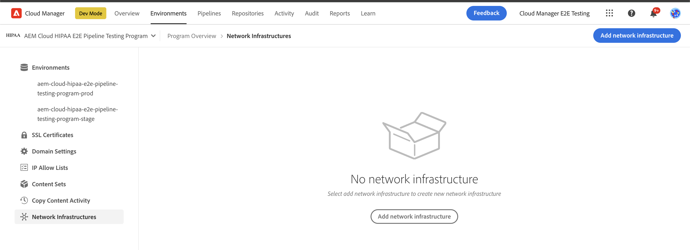
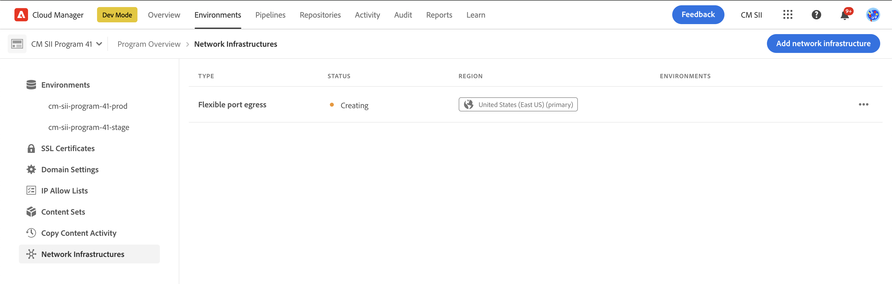
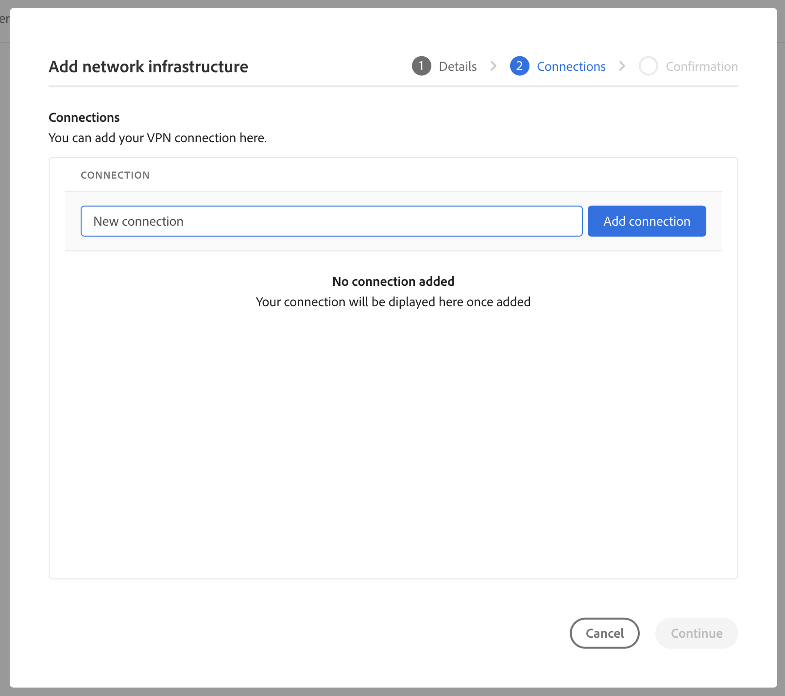
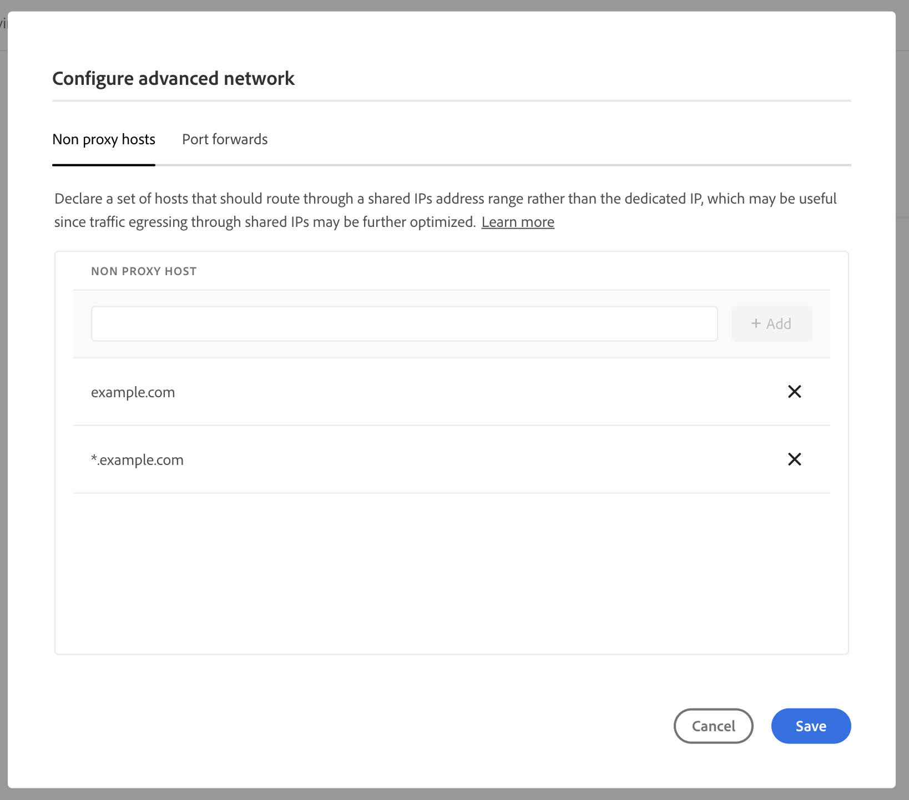

# Konfigurera avancerat nätverk för AEM as a Cloud Service {#configuring-advanced-networking}

I den här artikeln beskrivs de olika avancerade nätverksfunktionerna i AEM as a Cloud Service, inklusive självbetjäning och API-etablering av VPN, icke-standardportar och dedikerade IP-adresser.

>[!TIP]
>
>Förutom den här dokumentationen finns det även en serie självstudiekurser som hjälper dig igenom de olika avancerade nätverksalternativen i den här [plats.](https://experienceleague.adobe.com/docs/experience-manager-learn/cloud-service/networking/advanced-networking.html)

## Ökning {#overview}

AEM as a Cloud Service har följande avancerade nätverksalternativ:

* [Flexibel portutgång](#flexible-port-egress) - Konfigurera AEM as a Cloud Service för att tillåta utgående trafik från icke-standardportar.
* [Dedikerad IP-adress för utgångar](#dedicated-egress-ip-address) - Konfigurera trafik från AEM as a Cloud Service för att komma från en unik IP-adress.
* [VPN (Virtual Private Network)](#vpn) - Säker trafik mellan din infrastruktur och AEM as a Cloud Service, om du har ett VPN.

I den här artikeln beskrivs först de här alternativen i detalj och varför du kan använda dem, innan du beskriver hur de konfigureras med hjälp av användargränssnittet i molnhanteraren och med hjälp av API:t, och slutligen med några avancerade användningsfall.

>[!CAUTION]
>
>Om du redan har en äldre dedikerad utgångsteknik och vill konfigurera något av dessa avancerade nätverksalternativ, [kontakta först Adobe Client Care.](https://experienceleague.adobe.com/?support-solution=Experience+Manager#home)
>
>Om du försöker konfigurera avancerade nätverk med äldre teknik kan det påverka webbplatsanslutningen.

### Krav och begränsningar {#requirements}

När avancerade nätverksfunktioner konfigureras gäller följande begränsningar.

* Ett program kan tillhandahålla ett enda avancerat nätverksalternativ (flexibel portutgång, dedikerad IP-adress för utgångar eller VPN).
* Avancerade nätverk är inte tillgängliga för [sandlådeprogram.](/help/implementing/cloud-manager/getting-access-to-aem-in-cloud/program-types.md)
* En användare i måste ha **Administratör** roll för att lägga till och konfigurera nätverksinfrastruktur i ditt program.
* Produktionsmiljön måste skapas innan nätverksinfrastrukturen kan läggas till i programmet.
* Nätverksinfrastrukturen måste finnas i samma region som produktionsmiljöns primära region.
   * Om produktionsmiljön har [ytterligare publiceringsregioner,](/help/implementing/cloud-manager/manage-environments.md#multiple-regions) kan du skapa ytterligare nätverksinfrastruktur som speglar varje ytterligare region.
   * Du får inte skapa fler nätverksinfrastrukturer än det maximala antalet regioner som är konfigurerade i din produktionsmiljö.
   * Du kan definiera så många nätverksinfrastrukturer som tillgängliga regioner i din produktionsmiljö, men ny infrastruktur måste vara av samma typ som den tidigare skapade infrastrukturen.
   * När du skapar flera infrastrukturer får du bara välja bland de områden där avancerad nätverksinfrastruktur inte har skapats.

### Konfigurera och aktivera avancerat nätverk {#configuring-enabling}

För avancerade nätverksfunktioner krävs två steg:

1. Konfiguration av det avancerade nätverksalternativet, oavsett om [Flexibel hamnutgång.](#flexible-port-egress) [IP-adress för dedikerad egress,](#dedicated-egress-ip-address) eller [VPN,](#vpn) måste först göras på programnivå.
1. För att kunna användas måste det avancerade nätverksalternativet aktiveras på miljönivå.

Båda stegen kan utföras antingen med användargränssnittet i molnhanteraren eller med API:t för molnhanteraren.

* När du använder användargränssnittet i Cloud Manager innebär det att du skapar avancerade nätverkskonfigurationer med en guide på programnivå och sedan redigerar varje miljö där du vill aktivera konfigurationen.

* När du använder Cloud Manager-API:t `/networkInfrastructures` API-slutpunkten anropas på programnivå för att deklarera önskad typ av avancerat nätverk, följt av ett anrop till `/advancedNetworking` slutpunkt för varje miljö för att aktivera infrastrukturen och konfigurera miljöspecifika parametrar.

## Flexibla portägg {#flexible-port-egress}

Med den här avancerade nätverksfunktionen kan du konfigurera AEM as a Cloud Service att utlösa trafik via andra portar än HTTP (port 80) och HTTPS (port 443), som är öppna som standard.

>[!TIP]
>
>När du ska välja mellan flexibel portutgång och dedikerad IP-adress för utgångar bör du välja flexibel portutgång om en viss IP-adress inte krävs, eftersom Adobe kan optimera prestanda för flexibel portbelastningstrafik.

>[!NOTE]
>
>Flexibla infrastrukturtyper för portutgångar kan inte redigeras när de har skapats. Det enda sättet att ändra konfigurationsvärden är att ta bort och återskapa dem.

### UI-konfiguration {#configuring-flexible-port-egress-provision-ui}

1. Logga in i Cloud Manager på [my.cloudmanager.adobe.com](https://my.cloudmanager.adobe.com/) och välja lämplig organisation.

1. På **[Mina program](/help/implementing/cloud-manager/getting-access-to-aem-in-cloud/editing-programs.md#my-programs)** väljer du programmet.

1. Från **Programöversikt** sida, navigera till **Miljö** och markera **Nätverksinfrastruktur** till vänster.

   

1. I **Lägg till nätverksinfrastruktur** guide som startar, välj **Flexibel portutgång** och regionen där den ska skapas från **Län** nedrullningsbar meny och tryck eller klicka **Fortsätt**.

   

1. The **Bekräftelse** sammanfattar markeringen och nästa steg. Tryck eller klicka **Spara** för att skapa infrastrukturen.

   

En ny post visas under **Nätverksinfrastruktur** på sidopanelen med uppgifter om den typ av infrastruktur, status, region och miljö där den har aktiverats.



>[!NOTE]
>
>Det kan ta upp till en timme att skapa en infrastruktur för flexibel hamnutgångar efter vilken den kan konfigureras på miljönivå.

### API-konfiguration {#configuring-flexible-port-egress-provision-api}

POSTEN `/program/<programId>/networkInfrastructures` slutpunkten anropas, bara värdet för `flexiblePortEgress` för `kind` parameter och region. Slutpunkten svarar med `network_id`och annan information, inklusive status.

När nätverksinfrastrukturen väl har anropats tar det oftast ca 15 minuter innan den etableras. Ett anrop till Cloud Managers [slutpunkt för GET av nätverksinfrastruktur](https://developer.adobe.com/experience-cloud/cloud-manager/reference/api/#operation/getNetworkInfrastructure) skulle visa status för **klar**.

>[!TIP]
>
>Den fullständiga uppsättningen parametrar, exakt syntax och viktig information som vilka parametrar som inte kan ändras senare. [kan refereras i API-dokumentationen.](https://developer.adobe.com/experience-cloud/cloud-manager/reference/api/#operation/createNetworkInfrastructure)

### Trafikroutning {#flexible-port-egress-traffic-routing}

För http- eller https-trafik som går till andra portar än 80 eller 443 bör en proxy konfigureras med följande värden och portmiljövariabler:

* för HTTP: `AEM_PROXY_HOST` / `AEM_HTTP_PROXY_PORT ` (standard till `proxy.tunnel:3128` i AEM versioner &lt; 6094)
* för HTTPS: `AEM_PROXY_HOST` / `AEM_HTTPS_PROXY_PORT ` (standard till `proxy.tunnel:3128` i AEM versioner &lt; 6094)

Här följer till exempel exempelkoden som du kan skicka en begäran till `www.example.com:8443`:

```java
String url = "www.example.com:8443"
String proxyHost = System.getenv().getOrDefault("AEM_PROXY_HOST", "proxy.tunnel");
int proxyPort = Integer.parseInt(System.getenv().getOrDefault("AEM_HTTPS_PROXY_PORT", "3128"));
HttpClient client = HttpClient.newBuilder()
      .proxy(ProxySelector.of(new InetSocketAddress(proxyHost, proxyPort)))
      .build();
 
HttpRequest request = HttpRequest.newBuilder().uri(URI.create(url)).build();
HttpResponse<String> response = client.send(request, BodyHandlers.ofString());
```

Om du använder Java-nätverksbibliotek som inte är standard ska du konfigurera proxies med egenskaperna ovan för all trafik.

Ej http/s-trafik med destinationer via portar som deklarerats i `portForwards` parametern ska referera till en egenskap som kallas `AEM_PROXY_HOST`, tillsammans med den mappade porten. Till exempel:

```java
DriverManager.getConnection("jdbc:mysql://" + System.getenv("AEM_PROXY_HOST") + ":53306/test");
```

Tabellen nedan beskriver trafikdirigering:

<table>
<thead>
  <tr>
    <th>Trafik</th>
    <th>Målvillkor</th>
    <th>Port</th>
    <th>Anslutning</th>
    <th>Exempel på externt mål</th>
  </tr>
</thead>
<tbody>
  <tr>
    <td><b>HTTP- eller https-protokoll</b></td>
    <td>Standard-http/s-trafik</td>
    <td>80 eller 443</td>
    <td>Tillåtet</td>
    <td></td>
  </tr> 
  <tr>
    <td></td>
    <td>Ej standardiserad trafik (på andra portar utanför 80 eller 443) via http-proxy som konfigurerats med följande miljövariabel och proxyportnummer. Deklarera inte målporten i API-anropets portForwards-parameter för Cloud Manager:<br><ul>
     <li>AEM_PROXY_HOST (standard är "proxy.tunnel" i AEM versioner &lt; 6094)</li>
     <li>AEM_HTTPS_PROXY_PORT (standard är port 3128 i AEM utgåvor &lt; 6094)</li>
    </ul>
    <td>Portar utanför 80 eller 443</td>
    <td>Tillåtet</td>
    <td>example.com:8443</td>
  </tr>
  <tr>
    <td></td>
    <td>Ej standardiserad trafik (på andra portar utanför port 80 eller 443) som inte använder http-proxy</td>
    <td>Portar utanför 80 eller 443</td>
    <td>Blockerad</td>
    <td></td>
  </tr>
  <tr>
    <td><b>Non-http or non-https</b></td>
    <td>Klienten ansluter till <code>AEM_PROXY_HOST</code> miljövariabel med en <code>portOrig</code> deklareras i <code>portForwards</code> API-parameter.</td>
    <td>Alla</td>
    <td>Tillåtet</td>
    <td><code>mysql.example.com:3306</code></td>
  </tr>
  <tr>
    <td></td>
    <td>Allt annat</td>
    <td>Alla</td>
    <td>Blockerad</td>
    <td><code>db.example.com:5555</code></td>
  </tr>
</tbody>
</table>

#### Konfiguration av Apache/Dispatcher {#apache-dispatcher}

AEM Cloud Service Apache/Dispatcher-skiktets `mod_proxy` -direktivet kan konfigureras med hjälp av de egenskaper som beskrivs ovan.

```
ProxyRemote "http://example.com:8080" "http://${AEM_PROXY_HOST}:3128"
ProxyPass "/somepath" "http://example.com:8080"
ProxyPassReverse "/somepath" "http://example.com:8080"
```

```
SSLProxyEngine on //needed for https backends
 
ProxyRemote "https://example.com:8443" "http://${AEM_PROXY_HOST}:3128"
ProxyPass "/somepath" "https://example.com:8443"
ProxyPassReverse "/somepath" "https://example.com:8443"
```

## IP-adress för dedikerad utpressning {#dedicated-egress-ip-address}

En dedikerad IP-adress kan förbättra säkerheten vid integrering med SaaS-leverantörer (som en CRM-leverantör) eller andra integreringar utanför AEM as a Cloud Service som erbjuder en tillåtelselista av IP-adresser. Genom att lägga till den dedikerade IP-adressen till tillåtelselista säkerställer det att endast trafik från kundens AEM Cloud Service tillåts att flöda in i den externa tjänsten. Detta är utöver trafik från andra IP-adresser som tillåts.

Samma dedikerade IP-adress används för alla program i organisationen Adobe och för alla miljöer i alla program. Det gäller både författare och publiceringstjänster.

Utan den dedikerade IP-adressfunktionen aktiverad flödar trafik från AEM as a Cloud Service genom en uppsättning IP-adresser som delas med andra AEM as a Cloud Service kunder.

Konfigurationen av IP-adressen för den dedikerade IP-adressen liknar den [flexibel portutgång.](#flexible-port-egress) Den största skillnaden är att efter konfigurationen kommer trafiken alltid att gå från en dedikerad, unik IP-adress. Om du vill hitta IP-adressen använder du en DNS-matchare för att identifiera IP-adressen som är associerad med `p{PROGRAM_ID}.external.adobeaemcloud.com`. IP-adressen förväntas inte ändras, men om den måste ändras visas ett avancerat meddelande.

>[!TIP]
>
>När du ska välja mellan flexibel portutgång och dedikerad IP-adress för utgångar bör du välja flexibel portutgång om en viss IP-adress inte krävs, eftersom Adobe kan optimera prestanda för flexibel portbelastningstrafik.

>[!NOTE]
>
>Om du har fått en dedikerad IP-adress för utgångar före 2021.09.30 (dvs. före versionen från september 2021) har din dedikerade IP-funktion bara stöd för HTTP- och HTTPS-portar.
>
>Detta inkluderar HTTP/1.1 och HTTP/2 vid kryptering. Dessutom kan en dedikerad slutpunkt bara kommunicera med vilket mål som helst via HTTP/HTTPS på port 80/443.

>[!NOTE]
>
>När du har skapat en dedikerad IP-adressinfrastruktur kan du inte redigera den. Det enda sättet att ändra konfigurationsvärden är att ta bort och återskapa dem.

>[!INFO]
>
>Splunk-vidarebefordringsfunktionen är inte möjlig från en dedikerad IP-adress.

### UI-konfiguration {#configuring-dedicated-egress-provision-ui}

1. Logga in i Cloud Manager på [my.cloudmanager.adobe.com](https://my.cloudmanager.adobe.com/) och välja lämplig organisation.

1. På **[Mina program](/help/implementing/cloud-manager/getting-access-to-aem-in-cloud/editing-programs.md#my-programs)** väljer du programmet.

1. Från **Programöversikt** sida, navigera till **Miljö** och markera **Nätverksinfrastruktur** till vänster.

   

1. I **Lägg till nätverksinfrastruktur** guide som startar, välj **Dedikerad IP-adress för utgångar** och regionen där den ska skapas från **Län** nedrullningsbar meny och tryck eller klicka **Fortsätt**.

   

1. The **Bekräftelse** sammanfattar markeringen och nästa steg. Tryck eller klicka **Spara** för att skapa infrastrukturen.

   

En ny post visas under **Nätverksinfrastruktur** på sidopanelen med uppgifter om den typ av infrastruktur, status, region och miljö där den har aktiverats.


>[!NOTE]
>
>Det kan ta upp till en timme att skapa en infrastruktur för flexibel hamnutgångar efter vilken den kan konfigureras på miljönivå.

### API-konfiguration {#configuring-dedicated-egress-provision-api}

POSTEN `/program/<programId>/networkInfrastructures` slutpunkten anropas, bara värdet för `dedicatedEgressIp` för `kind` parameter och region. Slutpunkten svarar med `network_id`och annan information, inklusive status.

När nätverksinfrastrukturen väl har anropats tar det oftast ca 15 minuter innan den etableras. Ett anrop till Cloud Managers [slutpunkt för GET av nätverksinfrastruktur](https://developer.adobe.com/experience-cloud/cloud-manager/reference/api/#operation/getNetworkInfrastructure) skulle visa status för **klar**.

>[!TIP]
>
>Den fullständiga uppsättningen parametrar, exakt syntax och viktig information som vilka parametrar som inte kan ändras senare. [kan refereras i API-dokumentationen.](https://developer.adobe.com/experience-cloud/cloud-manager/reference/api/#operation/createNetworkInfrastructure)

### Trafikroutning {#dedicated-egress-ip-traffic-routing}

Http- och https-trafik går genom en förkonfigurerad proxy, förutsatt att de använder Java-standardegenskaper för proxykonfigurationer.

Ej http/s-trafik med destinationer via portar som deklarerats i `portForwards` parametern ska referera till en egenskap som kallas `AEM_PROXY_HOST`, tillsammans med den mappade porten. Till exempel:

```java
DriverManager.getConnection("jdbc:mysql://" + System.getenv("AEM_PROXY_HOST") + ":53306/test");
```

<table>
<thead>
  <tr>
    <th>Trafik</th>
    <th>Målvillkor</th>
    <th>Port</th>
    <th>Anslutning</th>
    <th>Exempel på externt mål</th>
  </tr>
</thead>
<tbody>
  <tr>
    <td><b>HTTP- eller https-protokoll</b></td>
    <td>Trafik till Azure eller Adobe-tjänster</td>
    <td>Alla</td>
    <td>Genom de delade IP-klusteradresserna (inte den dedikerade IP-adressen)</td>
    <td>adobe.io<br>api.windows.net</td>
  </tr>
  <tr>
    <td></td>
    <td>Värden som matchar <code>nonProxyHosts</code> parameter</td>
    <td>80 eller 443</td>
    <td>Genom de delade kluster-IP:n</td>
    <td></td>
  </tr>
  <tr>
    <td></td>
    <td>Värden som matchar <code>nonProxyHosts</code> parameter</td>
    <td>Portar utanför 80 eller 443</td>
    <td>Blockerad</td>
    <td></td>
  </tr>
  <tr>
    <td></td>
    <td>Via http-proxykonfiguration, konfigurerad som standard för http/s-trafik med Java HTTP-klientbibliotek</td>
    <td>Alla</td>
    <td>Genom den dedikerade IP-adressen för utgångar</td>
    <td></td>
  </tr>
  <tr>
    <td></td>
    <td>Ignorerar http-proxykonfiguration (t.ex. om den uttryckligen tagits bort från standard-Java HTTP-klientbiblioteket eller om ett Java-bibliotek som ignorerar standardproxykonfigurationen används)</td>
    <td>80 eller 443</td>
    <td>Genom de delade kluster-IP:n</td>
    <td></td>
  </tr>
  <tr>
    <td></td>
    <td>Ignorerar http-proxykonfiguration (t.ex. om den uttryckligen tagits bort från standard-Java HTTP-klientbiblioteket eller om ett Java-bibliotek som ignorerar standardproxykonfigurationen används)</td>
    <td>Portar utanför 80 eller 443</td>
    <td>Blockerad</td>
    <td></td>
  </tr>
  <tr>
    <td><b>Non-http or non-https</b></td>
    <td>Klienten ansluter till <code>AEM_PROXY_HOST</code> env-variabel med en <code>portOrig</code> deklareras i <code>portForwards</code> API-parameter</td>
    <td>Alla</td>
    <td>Genom den dedikerade IP-adressen för utgångar</td>
    <td><code>mysql.example.com:3306</code></td>
  </tr>
  <tr>
    <td></td>
    <td>Allt annat</td>
    <td></td>
    <td>Blockerad</td>
    <td></td>
  </tr>
</tbody>
</table>

### Funktionsanvändning {#feature-usage}

Funktionen är kompatibel med Java-kod eller bibliotek som resulterar i utgående trafik, förutsatt att de använder Java-standardegenskaper för proxykonfigurationer. I praktiken bör detta omfatta de vanligaste biblioteken.

Nedan visas ett kodexempel:

```java
public JSONObject getJsonObject(String relativePath, String queryString) throws IOException, JSONException {
  String relativeUri = queryString.isEmpty() ? relativePath : (relativePath + '?' + queryString);
  URL finalUrl = endpointUri.resolve(relativeUri).toURL();
  URLConnection connection = finalUrl.openConnection();
  connection.addRequestProperty("Accept", "application/json");
  connection.addRequestProperty("X-API-KEY", apiKey);

  try (InputStream responseStream = connection.getInputStream(); Reader responseReader = new BufferedReader(new InputStreamReader(responseStream, Charsets.UTF_8))) {
    return new JSONObject(new JSONTokener(responseReader));
  }
}
```

Vissa bibliotek kräver explicit konfiguration för att använda Java-standardegenskaper för proxykonfigurationer.

Ett exempel med Apache HttpClient, som kräver explicita anrop till
[`HttpClientBuilder.useSystemProperties()`](https://hc.apache.org/httpcomponents-client-4.5.x/current/httpclient/apidocs/org/apache/http/impl/client/HttpClientBuilder.html) eller använda
[`HttpClients.createSystem()`](https://hc.apache.org/httpcomponents-client-4.5.x/current/httpclient/apidocs/org/apache/http/impl/client/HttpClients.html#createSystem()):

```java
public JSONObject getJsonObject(String relativePath, String queryString) throws IOException, JSONException {
  String relativeUri = queryString.isEmpty() ? relativePath : (relativePath + '?' + queryString);
  URL finalUrl = endpointUri.resolve(relativeUri).toURL();

  HttpClient httpClient = HttpClientBuilder.create().useSystemProperties().build();
  HttpGet request = new HttpGet(finalUrl.toURI());
  request.setHeader("Accept", "application/json");
  request.setHeader("X-API-KEY", apiKey);
  HttpResponse response = httpClient.execute(request);
  String result = EntityUtils.toString(response.getEntity());
}
```

### Felsökningsöverväganden {#debugging-considerations}

Kontrollera loggarna i måltjänsten om de är tillgängliga för att verifiera att trafiken faktiskt är utgående från den förväntade dedikerade IP-adressen. I annat fall kan det vara praktiskt att ringa ut till en felsökningstjänst som [https://ifconfig.me/IP](https://ifconfig.me/IP), som returnerar den anropande IP-adressen.

## VPN (Virtual Private Network) {#vpn}

Med ett VPN kan du ansluta till en lokal infrastruktur eller ett datacenter från författaren, publiceringen eller förhandsgranskningsinstanserna. Detta kan till exempel vara användbart för att skydda åtkomsten till en databas. Det gör det även möjligt att ansluta till SaaS-leverantörer, t.ex. en CRM-leverantör som stöder VPN eller ansluter från ett företagsnätverk till AEM as a Cloud Service författare, förhandsgranskning eller publiceringsinstans.

De flesta VPN-enheter med IPSec-teknik stöds. Läs informationen i **RouteBased configuration instructions** kolumn i [den här listan över enheter.](https://docs.microsoft.com/en-us/azure/vpn-gateway/vpn-gateway-about-vpn-devices#devicetable) Konfigurera enheten enligt beskrivningen i tabellen.

>[!NOTE]
>
>Observera följande begränsningar för VPN-infrastrukturen:
>
>* Stödet är begränsat till en VPN-anslutning
>* Splunk-vidarebefordran är inte möjlig via en VPN-anslutning.
>* DNS-lösare måste listas i gateway-adressutrymmet för att matcha privata värdnamn.

### UI-konfiguration {#configuring-vpn-ui}

1. Logga in i Cloud Manager på [my.cloudmanager.adobe.com](https://my.cloudmanager.adobe.com/) och välja lämplig organisation.

1. På **[Mina program](/help/implementing/cloud-manager/getting-access-to-aem-in-cloud/editing-programs.md#my-programs)** väljer du programmet.

1. Från **Programöversikt** sida, navigera till **Miljö** och markera **Nätverksinfrastruktur** till vänster.

   

1. I **Lägg till nätverksinfrastruktur** guide som startar, välj **Virtuellt privat nätverk** och tillhandahålla nödvändig information innan man knackar eller klickar **Fortsätt**.

   * **Län** - Detta är den region där infrastruktur bör skapas.
   * **Adressutrymme** - Adressutrymmet kan bara vara en/26 CIDR (64 IP-adresser) eller ett större IP-intervall i kundutrymmet.
      * Det här värdet kan inte ändras senare.
   * **DNS-information** - Det här är en lista över fjärr-DNS-matchare.
      * Tryck `Enter` efter att en DNS-serveradress har angetts för att lägga till en annan.
      * Tryck eller klicka på `X` efter en adress att ta bort.
   * **Delad nyckel** - Det här är din i förväg delade VPN-nyckel.
      * Välj **Visa delad nyckel** för att visa nyckeln för att dubbelkontrollera dess värde.

   

1. På **Anslutningar** -fliken i guiden, ange en **Anslutningsnamn** för att identifiera din VPN-anslutning och trycka eller klicka **Lägg till anslutning**.

   

1. I **Lägg till anslutning** definierar du din VPN-anslutning och trycker eller klickar på **Spara**.

   * **Anslutningsnamn** - Detta är ett beskrivande namn på VPN-anslutningen, som du angav i föregående steg och som kan uppdateras här.
   * **Adress** - Detta är VPN-enhetens IP-adress.
   * **Adressutrymme** - Detta är IP-adressintervallen som ska dirigeras via VPN.
      * Tryck `Enter` när du har angett ett intervall för att lägga till ett annat.
      * Tryck eller klicka på `X` efter ett intervall för att ta bort det.
   * **IP-säkerhetsprincip** - Justera från standardvärdena efter behov

   

1. Dialogrutan stängs och du återgår till **Anslutningar** i guiden. Tryck eller klicka **Fortsätt**.

   

1. The **Bekräftelse** sammanfattar markeringen och nästa steg. Tryck eller klicka **Spara** för att skapa infrastrukturen.

   

En ny post visas under **Nätverksinfrastruktur** på sidopanelen med uppgifter om den typ av infrastruktur, status, region och miljö där den har aktiverats.

### API-konfiguration {#configuring-vpn-api}

POSTEN `/program/<programId>/networkInfrastructures` slutpunkten anropas och skickar en nyttolast med konfigurationsinformation, inklusive: värdet för **vpn** för `kind` parameter, region, adressutrymme (lista med CIDR - observera att detta inte kan ändras senare), DNS-matchare (för att matcha namn i kundens nätverk) och VPN-anslutningsinformation som gatewaykonfiguration, delad VPN-nyckel och IP-säkerhetsprincipen. Slutpunkten svarar med `network_id`och annan information, inklusive status.

När det anropas tar det normalt mellan 45 och 60 minuter innan nätverksinfrastrukturen etableras. API:ts GET-metod kan anropas för att returnera den aktuella statusen, som så småningom kommer att ändras `creating` till `ready`. Läs API-dokumentationen för alla lägen.

>[!TIP]
>
>Den fullständiga uppsättningen parametrar, exakt syntax och viktig information som vilka parametrar som inte kan ändras senare. [kan refereras i API-dokumentationen.](https://developer.adobe.com/experience-cloud/cloud-manager/reference/api/#operation/createNetworkInfrastructure)

### Trafikroutning {#vpn-traffic-routing}

Tabellen nedan beskriver trafikdirigering.

<table>
<thead>
  <tr>
    <th>Trafik</th>
    <th>Målvillkor</th>
    <th>Port</th>
    <th>Anslutning</th>
    <th>Exempel på externt mål</th>
  </tr>
</thead>
<tbody>
  <tr>
    <td><b>HTTP- eller https-protokoll</b></td>
    <td>Trafik till Azure eller Adobe-tjänster</td>
    <td>Alla</td>
    <td>Genom de delade IP-klusteradresserna (inte den dedikerade IP-adressen)</td>
    <td>adobe.io<br>api.windows.net</td>
  </tr>
  <tr>
    <td></td>
    <td>Värden som matchar <code>nonProxyHosts</code> parameter</td>
    <td>80 eller 443</td>
    <td>Genom de delade kluster-IP:n</td>
    <td></td>
  </tr>
  <tr>
    <td></td>
    <td>Värden som matchar <code>nonProxyHosts</code> parameter</td>
    <td>Portar utanför 80 eller 443</td>
    <td>Blockerad</td>
    <td></td>
  </tr>
  <tr>
    <td></td>
    <td>Om IP-värdet faller inom <i>VPN-gateway-adress</i> utrymme och genom http-proxykonfiguration (konfigurerad som standard för http/s-trafik med Java HTTP-klientbibliotek som standard)</td>
    <td>Alla</td>
    <td>Via VPN</td>
    <td><code>10.0.0.1:443</code><br>Det kan också vara ett värdnamn.</td>
  </tr>
  <tr>
    <td></td>
    <td>Om IP-adressen inte faller inom <i>Adressutrymme för VPN-gateway</i> och via http-proxykonfiguration (konfigurerad som standard för http/s-trafik med Java HTTP-klientbibliotek som standard)</td>
    <td>Alla</td>
    <td>Genom den dedikerade IP-adressen för utgångar</td>
    <td></td>
  </tr>
  <tr>
    <td></td>
    <td>Ignorerar http-proxykonfiguration (t.ex. om den uttryckligen tagits bort från standard-Java HTTP-klientbiblioteket eller om Java-biblioteket som ignorerar standardproxykonfigurationen används)
</td>
    <td>80 eller 443</td>
    <td>Genom de delade kluster-IP:n</td>
    <td></td>
  </tr>
  <tr>
    <td></td>
    <td>Ignorerar http-proxykonfiguration (t.ex. om den uttryckligen tagits bort från standard-Java HTTP-klientbiblioteket eller om Java-biblioteket som ignorerar standardproxykonfigurationen används)</td>
    <td>Portar utanför 80 eller 443</td>
    <td>Blockerad</td>
    <td></td>
  </tr>
  <tr>
    <td><b>Non-http or non-https</b></td>
    <td>Om IP-värdet faller inom <i>Adressutrymme för VPN-gateway</i> och klienten ansluter till <code>AEM_PROXY_HOST</code> env-variabel med en <code>portOrig</code> deklareras i <code>portForwards</code> API-parameter</td>
    <td>Alla</td>
    <td>Via VPN</td>
    <td><code>10.0.0.1:3306</code><br>Det kan också vara ett värdnamn.</td>
  </tr>
  <tr>
    <td></td>
    <td>Om IP-adressen inte faller inom <i>Adressutrymme för VPN-gateway</i> omfång och klienten ansluter till <code>AEM_PROXY_HOST</code> env-variabel med en <code>portOrig</code> deklareras i <code>portForwards</code> API-parameter</td>
    <td>Alla</td>
    <td>Genom den dedikerade IP-adressen för utgångar</td>
    <td></td>
  </tr>
  <tr>
    <td></td>
    <td>Allt annat</td>
    <td>Alla</td>
    <td>Blockerad</td>
    <td></td>
  </tr>
</tbody>
</table>

### Användbara domäner för konfiguration {#vpn-useful-domains-for-configuration}

Bilden nedan visar en visuell representation av en uppsättning domäner och associerade IP-adresser som är användbara för konfiguration och utveckling. Tabellen längre ned i diagrammet beskriver dessa domäner och IP-adresser.


<table>
<thead>
  <tr>
    <th>Domänmönster</th>
    <th>AEM</th>
    <th>Ingång (till AEM), betydelse</th>
  </tr>
</thead>
<tbody>
  <tr>
    <td><code>p{PROGRAM_ID}.external.adobeaemcloud.com</code></td>
    <td>Dedikerad IP-adress för utgångar för trafik som går till Internet i stället för via privata nätverk </td>
    <td>Anslutningar från VPN visas vid CDN från den här IP-adressen. Om du bara vill tillåta anslutningar från VPN att gå till AEM konfigurerar du Cloud Manager så att endast den här IP-adressen tillåts och så att allt annat blockeras. Mer information finns i avsnittet Begränsa ingång till VPN-anslutningar.</td>
  </tr>
  <tr>
    <td><code>p{PROGRAM_ID}.{REGION}-gateway.external.adobeaemcloud.com</code></td>
    <td>Ej tillämpligt</td>
    <td>VPN-gatewayens IP på AEM. En kunds nätverksteam kan använda detta för att endast tillåta VPN-anslutningar till sin VPN-gateway från en viss IP-adress. </td>
  </tr>
  <tr>
    <td><code>p{PROGRAM_ID}.{REGION}.inner.adobeaemcloud.net</code></td>
    <td>IP-adressen för trafik från VPN:s AEM till kundsidan. Detta kan tillåtslista i kundens konfiguration för att säkerställa att anslutningar bara kan göras från AEM.</td>
    <td>Om kunden vill tillåta VPN-åtkomst till AEM bör de konfigurera DNS-poster för CNAME så att de mappar sin anpassade domän och/eller <code>author-p{PROGRAM_ID}-e{ENVIRONMENT_ID}.adobeaemcloud.com</code> och/eller <code>publish-p{PROGRAM_ID}-e{ENVIRONMENT_ID}.adobeaemcloud.com</code> till detta.</td>
  </tr>
</tbody>
</table>

### Begränsa VPN till ingångsanslutningar {#restrict-vpn-to-ingress-connections}

Om du bara vill tillåta VPN-åtkomst till AEM kan tillåtelselista konfigureras i Cloud Manager så att endast IP-adressen som definieras av `p{PROGRAM_ID}.external.adobeaemcloud.com` får tala med miljön. Detta kan göras på samma sätt som andra IP-baserade tillåtelselista i Cloud Manager.

Om reglerna måste vara sökvägsbaserade använder du http-standarddirektiv på dispatchernivå för att neka eller tillåta vissa IP-adresser. De bör se till att de önskade sökvägarna inte heller är tillgängliga vid CDN så att begäran alltid kommer till ursprungsläget.

#### Exempel på Httpd-konfiguration {#httpd-example}

```
Order deny,allow
Deny from all
Allow from 192.168.0.1
Header always set Cache-Control private
```

## Aktivera avancerade nätverkskonfigurationer i miljöer {#enabling}

När du har konfigurerat ett avancerat nätverksalternativ för ett program, oavsett om [Flexibel hamnutgång.](#flexible-port-egress) [IP-adress för dedikerad egress,](#dedicated-egress-ip-address) eller [VPN,](#vpn) för att kunna använda den måste du aktivera den på miljönivå.

När du aktiverar en avancerad nätverkskonfiguration för en miljö kan du aktivera valfri portvidarebefordran och icke-proxyvärdar. Parametrar kan konfigureras per miljö för att ge flexibilitet.

* **Portvidarebefordran** - regler för portvidarebefordran ska deklareras för alla andra destinationsportar än 80/443, men bara om inte http- eller https-protokoll används.
   * Regler för portvidarebefordran definieras genom att ange uppsättningen målvärdar (namn eller IP och portar).
   * Klientanslutningen som använder port 80/443 över http/https måste fortfarande använda proxyinställningar i anslutningen för att egenskaperna för avancerade nätverk ska tillämpas på anslutningen.
   * För varje målvärd måste kunderna mappa den avsedda destinationsporten till en port från 30000 till 30999.
   * Reglerna för portvidarebefordran är tillgängliga för alla avancerade nätverkstyper.

* **Icke-proxyvärdar** - Med icke-proxyvärdar kan du deklarera en uppsättning värdar som ska dirigeras via ett delat IP-adressintervall i stället för den dedikerade IP-adressen.
   * Detta kan vara användbart eftersom trafikutjämning via delade IP-adresser kan optimeras ytterligare.
   * Värdar som inte är proxyvärdar är bara tillgängliga för dedikerad IP-adress och avancerade VPN-nätverkstyper.

>[!NOTE]
>
>Du kan inte aktivera en avancerad nätverkskonfiguration för en miljö om miljön finns i **Uppdaterar** status.

### Aktivera med användargränssnittet {#enabling-ui}

1. Logga in i Cloud Manager på [my.cloudmanager.adobe.com](https://my.cloudmanager.adobe.com/) och välja lämplig organisation.

1. På **[Mina program](/help/implementing/cloud-manager/getting-access-to-aem-in-cloud/editing-programs.md#my-programs)** väljer du programmet.

1. Från **Programöversikt** sida, navigera till **Miljö** och välj den miljö där du vill aktivera den avancerade nätverkskonfigurationen under **Miljö** i den vänstra panelen. Välj sedan **Avancerad nätverkskonfiguration** -fliken i den valda miljön och tryck eller klicka **Aktivera nätverksinfrastruktur**.

   

1. The **Konfigurera avancerat nätverk** öppnas.

1. På **Icke-proxyvärdar** för dedikerade IP-adresser för utgångar och VPN-adresser kan du välja att definiera en uppsättning värdar som ska dirigeras via ett delat IP-adressintervall i stället för den dedikerade IP-adressen genom att ange värdnamnet i **Icke-proxyvärd** fält och knacka eller klicka **Lägg till**.

   * Värden läggs till i listan över värdar på fliken.
   * Upprepa det här steget om du vill lägga till flera värdar.
   * Tryck eller klicka på X till höger om raden för att ta bort en värd.
   * Den här fliken är inte tillgänglig för flexibla portutgångskonfigurationer.

   

1. På **Portvidarebefordran** kan du även definiera regler för portvidarebefordran för andra destinationsportar än 80/443 om du inte använder HTTP eller HTTPS. Ange en **Namn**, **Portutrustning** och **Portmål** och trycka eller klicka **Lägg till**.

   * Regeln läggs till i listan med regler på fliken.
   * Upprepa det här steget om du vill lägga till flera regler.
   * Tryck eller klicka på X till höger om raden för att ta bort en regel.

   

1. Tryck eller klicka **Spara** i dialogrutan för att tillämpa konfigurationen på miljön.

Den avancerade nätverkskonfigurationen används i den valda miljön. Tillbaka till **Miljö** kan du se information om konfigurationen som används i den valda miljön och deras status.


### Aktivera med API {#enabling-api}

Om du vill aktivera en avancerad nätverkskonfiguration för en miljö `PUT /program/<program_id>/environment/<environment_id>/advancedNetworking` slutpunkten måste anropas per miljö.

API:t bör svara på bara några sekunder, vilket anger statusen `updating` och efter cirka 10 minuter visar ett anrop till Cloud Managers miljöslutpunkt statusen för GET `ready`, vilket anger att uppdateringen av miljön har tillämpats.

Portvidarebefordringsregler per miljö kan uppdateras genom att anropa `PUT /program/{programId}/environment/{environmentId}/advancedNetworking` slutpunkt och inkludera hela uppsättningen konfigurationsparametrar i stället för en delmängd.

Dedikerad IP-adress för utgångar och avancerade VPN-nätverkstyper stöder en `nonProxyHosts` parameter. Detta gör att du kan deklarera en uppsättning värdar som ska dirigeras via ett delat IP-adressintervall i stället för den dedikerade IP-adressen. The `nonProxyHost` URL:er kan följa mönstren för `example.com` eller `*.example.com`, där jokertecknet bara stöds i början av domänen.

Även om det inte finns några trafikdirigeringsregler för miljön (värdar eller bypass), `PUT /program/<program_id>/environment/<environment_id>/advancedNetworking` måste fortfarande anropas, bara med en tom nyttolast.

>[!TIP]
>
>Den fullständiga uppsättningen parametrar, exakt syntax och viktig information som vilka parametrar som inte kan ändras senare. [kan refereras i API-dokumentationen.](https://developer.adobe.com/experience-cloud/cloud-manager/reference/api/#operation/createNetworkInfrastructure)

## Redigera och ta bort avancerade nätverkskonfigurationer i miljöer {#editing-deleting-environments}

Efter [möjliggör avancerad nätverkskonfiguration för miljöer,](#enabling) du kan uppdatera informationen om dessa konfigurationer eller ta bort dem.

>[!NOTE]
>
>Du kan inte redigera nätverksinfrastrukturen om den har statusen **Skapar**, **Uppdaterar**, eller **Tar bort**.

### Redigera eller ta bort med användargränssnittet {#editing-ui}

1. Logga in i Cloud Manager på [my.cloudmanager.adobe.com](https://my.cloudmanager.adobe.com/) och välja lämplig organisation.

1. På **[Mina program](/help/implementing/cloud-manager/getting-access-to-aem-in-cloud/editing-programs.md#my-programs)** väljer du programmet.

1. Från **Programöversikt** sida, navigera till **Miljö** och välj den miljö där du vill aktivera den avancerade nätverkskonfigurationen under **Miljö** i den vänstra panelen. Välj sedan **Avancerad nätverkskonfiguration** i den valda miljön och tryck eller klicka på ellipsknappen.

   

1. I ellipsmenyn väljer du antingen **Redigera** eller **Ta bort**.

   * Om du väljer **Redigera**, uppdatera informationen enligt stegen i föregående avsnitt, [Aktivera användning av användargränssnittet,](#enabling-ui) och trycka eller klicka **Spara**.
   * Om du väljer **Ta bort**, bekräfta borttagningen i dialogrutan **Ta bort nätverkskonfiguration** dialogruta med **Ta bort** eller avbryta med **Avbryt**.

Ändringarna kommer att återspeglas på **Miljö** -fliken.

### Redigera eller ta bort med API:t {#editing-api}

Om du vill ta bort avancerade nätverk för en viss miljö anropar du `DELETE [/program/{programId}/environment/{environmentId}/advancedNetworking]()`.

>[!TIP]
>
>Den fullständiga uppsättningen parametrar, exakt syntax och viktig information som vilka parametrar som inte kan ändras senare. [kan refereras i API-dokumentationen.](https://developer.adobe.com/experience-cloud/cloud-manager/reference/api/#operation/createNetworkInfrastructure)

## Redigera och ta bort nätverksinfrastruktur för ett program {#editing-deleting-program}

När nätverksinfrastrukturen har skapats för ett program kan endast begränsade egenskaper redigeras. Om du inte längre behöver det kan du ta bort den avancerade nätverksinfrastrukturen för hela programmet.

>[!NOTE]
>
>Observera följande begränsningar för redigering och borttagning av nätverksinfrastruktur:
>
>* Borttagningen tar bara bort infrastrukturen om alla miljöer har sina avancerade nätverk inaktiverade.
>* Du kan inte redigera nätverksinfrastrukturen om den har statusen **Skapar**, **Uppdaterar**, eller **Tar bort**.
>* Endast VPN-infrastrukturen för avancerad nätverksinfrastruktur kan redigeras när den har skapats och sedan endast begränsade fält.
>* Av säkerhetsskäl är **Delad nyckel** måste alltid anges när du redigerar en avancerad VPN-nätverksinfrastruktur, även om du inte redigerar själva nyckeln.

### Redigera och ta bort med användargränssnittet {#delete-ui}

1. Logga in i Cloud Manager på [my.cloudmanager.adobe.com](https://my.cloudmanager.adobe.com/) och välja lämplig organisation

1. På **[Mina program](/help/implementing/cloud-manager/getting-access-to-aem-in-cloud/editing-programs.md#my-programs)** väljer du programmet.

1. Från **Programöversikt** sida, navigera till **Miljö** och markera **Nätverksinfrastruktur** i den vänstra panelen. Tryck eller klicka sedan på ellipsknappen bredvid den infrastruktur du vill ta bort.

   

1. I ellipsmenyn väljer du antingen **Redigera** eller **Ta bort**.

1. Om du väljer **Redigera**, **Redigera nätverksinfrastruktur** öppnas. Redigera efter behov och följ stegen som beskrivs när du skapar infrastrukturen.

1. Om du väljer **Ta bort**, bekräfta borttagningen i dialogrutan **Ta bort nätverkskonfiguration** dialogruta med **Ta bort** eller avbryta med **Avbryt**.

Ändringarna kommer att återspeglas på **Miljö** -fliken.

### Redigera och ta bort med API:t {#delete-api}

Till **delete** nätverksinfrastrukturen för ett program, anropa `DELETE /program/{program ID}/networkinfrastructure/{networkinfrastructureID}`.

## Ändra ett programs avancerade nätverksinfrastrukturtyp {#changing-program}

Det är bara möjligt att ha en typ av avancerad nätverksinfrastruktur konfigurerad för ett program åt gången, antingen flexibel portutgång, dedikerad IP-adress för utgångar eller VPN.

Om du anser att du behöver en annan avancerad nätverksinfrastrukturtyp än den du redan har konfigurerat måste du ta bort den befintliga och skapa en ny. Följ den här proceduren:

1. [Ta bort avancerade nätverk i alla miljöer.](#editing-deleting-environments)
1. [Ta bort den avancerade nätverksinfrastrukturen.](#editing-deleting-program)
1. Skapa den avancerade nätverksinfrastrukturtyp som du nu behöver, antingen [Flexibel hamnutgång.](#flexible-port-egress) [IP-adress för dedikerad egress,](#dedicated-egress-ip-address) eller [VPN.](#vpn)
1. [Återaktivera avancerade nätverk på miljönivå.](#enabling)

>[!WARNING]
>
> Den här proceduren kommer att resultera i en driftstopp för avancerade nätverkstjänster mellan borttagning och återskapande
> Om driftsavbrott skulle få allvarliga konsekvenser för verksamheten kontaktar du kundsupport för att få hjälp med att beskriva vad som redan har skapats och orsaken till ändringen.

## Avancerad nätverkskonfiguration för ytterligare publiceringsregioner {#advanced-networking-configuration-for-additional-publish-regions}

När ytterligare en region läggs till i en miljö som redan har avancerade nätverk konfigurerade, dirigeras trafik från den extra publiceringsregionen som matchar de avancerade nätverksreglerna som standard via den primära regionen. Om den primära regionen blir otillgänglig tas emellertid den avancerade nätverkstrafiken bort om avancerade nätverk inte har aktiverats i den extra regionen. Om du vill optimera fördröjningen och öka tillgängligheten om någon av regionerna skulle råka ut för ett driftstopp är det nödvändigt att aktivera avancerade nätverk för ytterligare publiceringsregioner. Två olika scenarier beskrivs i följande avsnitt.

>[!NOTE]
>
>Alla regioner har samma [konfiguration för avancerat nätverk](https://developer.adobe.com/experience-cloud/cloud-manager/reference/api/#tag/Environment-Advanced-Networking-Configuration)så det är inte möjligt att dirigera trafik till olika destinationer baserat på den region där trafiken försvinner.

### Dedikerade IP-adresser för Egress {#additional-publish-regions-dedicated-egress}

#### Avancerade nätverk är redan aktiverade i den primära regionen {#already-enabled}

Om en avancerad nätverkskonfiguration redan är aktiverad i den primära regionen gör du så här:

1. Om du har låst din infrastruktur så att den dedikerade IP-adressen för AEM är tillåten, bör du tillfälligt inaktivera eventuella spärrregler i den infrastrukturen. Om detta inte görs finns det en kort period då förfrågningar från den nya regionens IP-adresser nekas av din egen infrastruktur. Detta är inte nödvändigt om du har låst din infrastruktur med ett FQDN (FullyQualified Domain Name), (`p1234.external.adobeaemcloud.com`, till exempel) eftersom alla AEM regioner utlöser avancerad nätverkstrafik från samma FQDN
1. Skapa en nätverksinfrastruktur som omfattar programmet för den sekundära regionen genom ett POST-anrop till API:t för att skapa nätverksinfrastruktur i Cloud Manager, vilket beskrivs i avancerad nätverksdokumentation. Den enda skillnaden i nyttolastens JSON-konfiguration i förhållande till den primära regionen är egenskapen region
1. Om din infrastruktur måste låsas av IP för att tillåta AEM trafik lägger du till IP-adresser som matchar `p1234.external.adobeaemcloud.com`. Det ska finnas en per region.

#### Avancerade nätverk har ännu inte konfigurerats i någon region {#not-yet-configured}

Proceduren liknar oftast de föregående instruktionerna. Om produktionsmiljön ännu inte har aktiverats för avancerade nätverk finns det dock en möjlighet att testa konfigurationen genom att först aktivera den i en staging-miljö:

1. Skapa nätverksinfrastruktur för alla regioner genom att ringa POSTEN till [Cloud Manager Skapa API för nätverksinfrastruktur](https://developer.adobe.com/experience-cloud/cloud-manager/reference/api/#tag/Network-infrastructure/operation/createNetworkInfrastructure). Den enda skillnaden i nyttolastens JSON-konfiguration i förhållande till den primära regionen är egenskapen region.
1. Aktivera och konfigurera avancerat nätverk för miljön genom att köra `PUT api/program/{programId}/environment/{environmentId}/advancedNetworking`. Mer information finns i API-dokumentationen [här](https://developer.adobe.com/experience-cloud/cloud-manager/reference/api/#tag/Environment-Advanced-Networking-Configuration/operation/enableEnvironmentAdvancedNetworkingConfiguration)
1. Vid behov kan du låsa den externa infrastrukturen, helst av FQDN (t.ex. `p1234.external.adobeaemcloud.com`). Annars kan du göra det via IP-adressen
1. Om staging-miljön fungerar som förväntat aktiverar och konfigurerar du den miljöanpassade avancerade nätverkskonfigurationen för produktion.

#### VPN {#vpn-regions}

Proceduren är nästan identisk med de dedikerade IP-adressinstruktionerna för utgångar. Den enda skillnaden är att förutom att egenskapen region konfigureras på ett annat sätt än den primära regionen är `connections.gateway` -fältet kan konfigureras för att dirigera till en annan VPN-slutpunkt som hanteras av organisationen, kanske geografiskt närmare den nya regionen.
