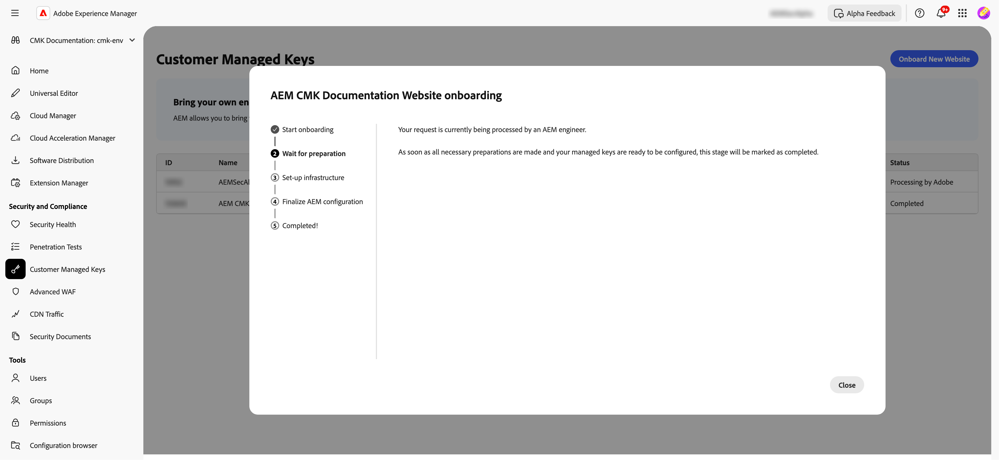
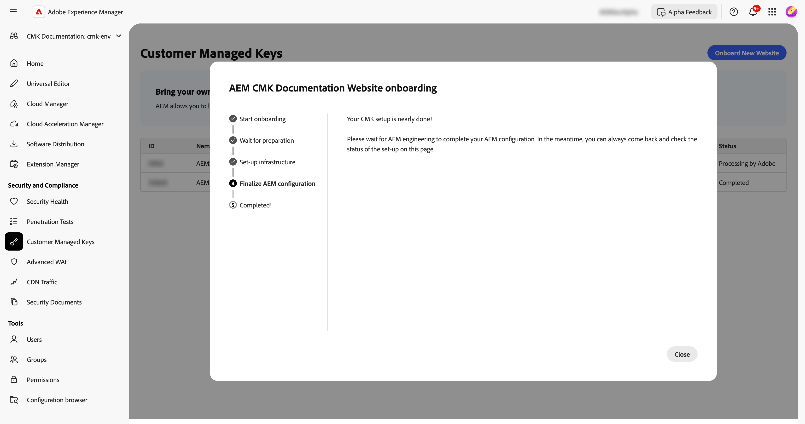

# Inställningar för kundhanterade nycklar för AEM as a Cloud Service {#customer-managed-keys-for-aem-as-a-cloud-service}

AEM as a Cloud Service lagrar för närvarande kunddata i Azure Blob Storage och MongoDB, och använder krypteringsnycklar som hanteras av providerleverantörer som standard för att skydda data. Även om den här konfigurationen uppfyller säkerhetskraven för många organisationer kan företag i reglerade branscher eller de som behöver förbättrad datasäkerhet söka större kontroll över sin krypteringsmetod. För organisationer som prioriterar datasäkerhet, efterlevnad och möjlighet att hantera sina krypteringsnycklar erbjuder CMK-lösningen (Customer-Managed Keys) en viktig förbättring.

## Problemet som löses {#the-problem-being-solved}

Leverantörshanterade nycklar kan skapa bekymmer för företag som behöver ytterligare sekretess och integritet. Utan kontroll över nyckelhanteringen kan organisationer möta utmaningar när det gäller att uppfylla regelkrav, implementera anpassade säkerhetsregler och säkerställa fullständig datasäkerhet.

Införandet av kundhanterade nycklar (CMK) löser dessa problem genom att ge AEM-kunder full kontroll över deras krypteringsnycklar. Genom att autentisera via Microsoft Entra ID (tidigare Azure Active Directory) ansluter AEM CS på ett säkert sätt till kundens Azure Key Vault, vilket gör att de kan hantera livscykeln för sina krypteringsnycklar, som omfattar skapande av nycklar, rotation och återkallning.

CMK har flera fördelar:

* **Kontrollera data- och programkryptering:** Öka säkerheten med direktstyrning av ditt AEM-program och kryptografiska nycklar.
* **Öka sekretessen och integriteten:** Minska sannolikheten för oavsiktlig åtkomst och exponering av känsliga eller egna data med fullständig krypteringshantering.
* **Stöd för Azure Key Vault:** Användning av Azure Key Vault möjliggör nyckellagring, bearbetning av hemligheter och utförande av nyckelrotationer.

Genom att använda CMK kan man få bättre kontroll över datasäkerhet och kryptering, förbättra säkerheten och minska riskerna samtidigt som man får tillgång till skalbarheten och flexibiliteten i AEM CS.

Med AEM as a Cloud Service kan du få dina egna krypteringsnycklar för att kunna kryptera data i vila. Den här guiden innehåller steg för att konfigurera en kundhanterad nyckel (CMK) i Azure Key Vault för AEM as a Cloud Service.

>[!WARNING]
>
>När du har konfigurerat CMK kan du inte återgå till systemhanterade nycklar. Du ansvarar för att hantera dina nycklar på ett säkert sätt och ge åtkomst till dina Key Vault-, Key- och CMK-appar i Azure för att förhindra att åtkomsten till dina data går förlorad.

Du får även hjälp med följande steg när du skapar och konfigurerar den nödvändiga infrastrukturen:

1. Konfigurera din miljö
1. Hämta ett program-ID från Adobe
1. Skapa en ny resursgrupp
1. Skapa ett nyckelvalv
1. Ge Adobe åtkomst till nyckelvalvet
1. Skapa en krypteringsnyckel

Du måste dela nyckelvalvs-URL:en, krypteringsnyckelns namn och information om nyckelvalvet med Adobe.

## Konfigurera miljön {#setup-your-environment}

Azure Command Line Interface (CLI) är det enda kravet för den här guiden. Om du inte redan har Azure CLI installerat följer du de officiella installationsanvisningarna [här](https://learn.microsoft.com/en-us/cli/azure/install-azure-cli).

Innan du fortsätter med resten av den här guiden loggar du in på ditt CLI med `az login`.

>[!NOTE]
>
>Den här guiden använder Azure CLI, men det går att utföra samma åtgärder via Azure-konsolen. Om du föredrar att använda Azure-konsolen använder du kommandona nedan som referens.


## Starta CMK-konfigurationsprocessen för AEM as a Cloud Service {#request-cmk-for-aem-as-a-cloud-service}

Du måste begära att kundhanterade nycklar (CMK) konfigureras för din AEM as a Cloud Service-miljö via användargränssnittet. Det gör du genom att navigera till AEM hemsäkerhetsgränssnitt under avsnittet **Kundhanterade nycklar**.
Du kan sedan starta introduktionsprocessen genom att klicka på knappen **Starta introduktion** .


## Hämta ett program-ID från Adobe {#obtain-an-application-id-from-adobe}

När startprocessen har startats kommer ett Entra-program-ID att tillhandahållas av Adobe. Detta program-ID är nödvändigt för resten av guiden och kommer att användas för att skapa ett huvudkonto som gör att Adobe kan komma åt ditt nyckelvalv. Om du inte redan har ett program-ID måste du vänta tills det kommer från Adobe.



När begäran är klar kan du se program-ID:t i CMK-gränssnittet.


## Skapa en ny resursgrupp {#create-a-new-resource-group}

Skapa en ny resursgrupp på valfri plats.

```powershell
# Choose a location and a name for the resource group.
$location="<AZURE LOCATION>"
$resourceGroup="<RESOURCE GROUP>"

# Create the resource group.
az group create --location $location --resource-group $resourceGroup
```

Om du redan har en resursgrupp kan du använda den i stället. I resten av den här guiden identifieras platsen för resursgruppen och dess namn med `$location` respektive `$resourceGroup`.

## Skapa ett nyckelvalv {#create-a-key-vault}

Du måste skapa ett nyckelvalv som innehåller din krypteringsnyckel. Töm skydd måste vara aktiverat för nyckelvalvet. Rensningsskydd krävs för kryptering av vilande data från andra Azure-tjänster. Åtkomst till offentliga nätverk måste aktiveras för att säkerställa att Adobes tjänster kan komma åt nyckelvalvet.

>[!IMPORTANT]
>När nyckelvalvet med offentlig nätverksåtkomst inaktiverat skapas måste alla nyckelvalsrelaterade åtgärder, som skapande av nyckel eller rotation, utföras från en miljö som har nätverksåtkomst till KeyVault, till exempel en virtuell dator som har åtkomst till KeyVault.

```powershell
# Reuse this information from the previous step.
$location="<AZURE LOCATION>"
$resourceGroup="<RESOURCE GROUP>"

# Choose a name for the key vault.
$keyVaultName="<KEY VAULT NAME>"

# Create the key vault.
az keyvault create `
  --location $location `
  --resource-group $resourceGroup `
  --name $keyVaultName `
  --default-action=Allow `
  --enable-purge-protection `
  --enable-rbac-authorization `
  --public-network-access Enabled
```

## Bevilja Adobe åtkomst till nyckelvalvet {#grant-adobe-access-to-the-key-vault}

I det här steget ger du Adobe åtkomst till ditt nyckelvalv via ett Entra-program. ID:t för Entra-programmet ska redan ha angetts av Adobe.

Först måste du skapa ett huvudnamn för tjänsten som är kopplat till Entra-programmet och tilldela det rollerna **Key Vault Reader** och **Key Vault Crypto User** till det. Rollerna är begränsade till nyckelvalvet som skapas i den här guiden.

```powershell
# Reuse this information from the previous steps.
$resourceGroup="<RESOURCE GROUP>"
$keyVaultName="<KEY VAULT NAME>"

# The application ID is provided by Adobe.
$appId="<APPLICATION ID>"

# Retrieve the ID of the key vault.
$keyVaultId=(az keyvault show --resource-group $resourceGroup --name $keyVaultName --query id --output tsv)

# Create a new service principal.
$servicePrincipalId=(az ad sp create --id $appId --query id --out tsv)

# Assign the roles to the service principal.
az role assignment create --assignee $servicePrincipalId --role "Key Vault Reader" --scope $keyVaultId
az role assignment create --assignee $servicePrincipalId --role "Key Vault Crypto User" --scope $keyVaultId
```

## Skapa en krypteringsnyckel {#create-an-encryption-key}

Slutligen kan du skapa en krypteringsnyckel i nyckelvalvet. Observera att du behöver rollen **Nyckelvalvkryptograf** för att slutföra det här steget. Om den inloggade användaren inte har den här rollen kontaktar du systemadministratören och ber någon som redan har den rollen att slutföra det här steget åt dig.

Nätverksåtkomst till nyckelvalvet krävs för att skapa krypteringsnyckeln. Verifiera först att du har åtkomst till nyckelvalvet och fortsätt med att skapa nyckeln:

```powershell
# Reuse this information from the previous steps.
$keyVaultName="<KEY VAULT NAME>"

# Choose a name for your key.
$keyName="<KEY NAME>"

# Create the key.
az keyvault key create --vault-name $keyVaultName --name $keyName
```

## Dela information om nyckelvalvet {#share-the-key-vault-information}

Nu är ni färdiga. Du behöver bara dela viss nödvändig information via CMK-gränssnittet, som startar konfigurationsprocessen för miljön.

```powershell
# Reuse this information from the previous steps.
$resourceGroup="<RESOURCE GROUP>"
$keyVaultName="<KEY VAULT NAME>"

# Retrieve the URL of your key vault.
$keyVaultUri=(az keyvault show --name $keyVaultName `
    --resource-group $resourceGroup `
    --query properties.vaultUri `
    --output tsv)

# In addition we would need the tenantId and the subscriptionId in order to setup the connection.
$tenantId=(az keyvault show --name $keyVaultName `
    --resource-group $resourceGroup `
    --query properties.tenantId `
    --output tsv)
$subscriptionId="<Subscription ID>"
```

Ange den här informationen i CMK-användargränssnittet:


## Konsekvenser av återkallande av nyckelåtkomst {#implications-of-revoking-key-access}

Om du återkallar eller inaktiverar åtkomsten till Key Vault-, key- eller CMK-appen kan det leda till allvarliga störningar, bland annat att plattformens åtgärder inte fungerar som de ska. När dessa tangenter har inaktiverats kan data i Platform bli oåtkomliga, och alla åtgärder längre fram i kedjan som är beroende av dessa data kommer inte att fungera. Det är viktigt att förstå effekterna i efterföljande led till fullo innan du gör några ändringar i dina nyckelkonfigurationer.

Om du bestämmer dig för att återkalla plattformsåtkomst till dina data kan du göra det genom att ta bort den användarroll som är associerad med programmet från nyckelvalvet i Azure.

## Nästa steg {#next-steps}

När du har angett nödvändig information i CMK-användargränssnittet startar Adobe konfigurationsprocessen för din AEM as a Cloud Service-miljö. Detta kan ta en stund och du meddelas när det är klart.




## Slutför CMK-inställningarna {#complete-the-cmk-setup}

När konfigurationsprocessen är klar kan du se status för CMK-inställningen i användargränssnittet. Du kan också se nyckelvalvet och krypteringsnyckeln.


## Frågor och support {#questions-and-support}

Kontakta oss om du har frågor, frågor eller behöver hjälp med konfigurationen av kundhanterade nycklar för AEM as a Cloud Service. Adobe Support kan hjälpa dig med frågor du har.
