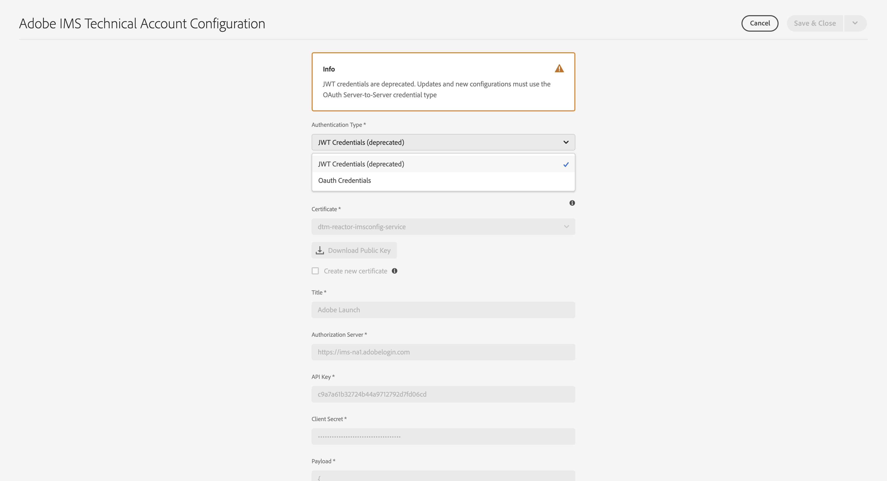
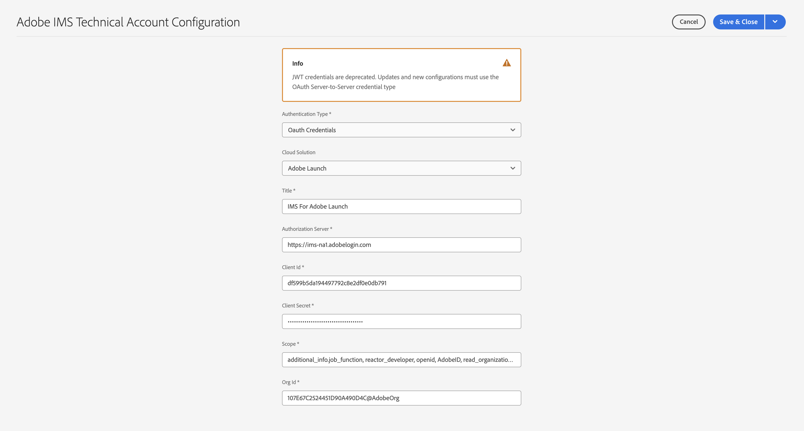

# Konfigurera IMS-integreringar för AEM as a Cloud Service {#setting-up-ims-integrations-for-aemaacs}

Adobe Experience Manager (AEM) as a Cloud Service kan integreras med många andra Adobe-lösningar. Exempel: Adobe Target, Adobe Analytics med flera.

Integreringarna använder en IMS-integrering som konfigurerats med S2S OAuth.

* När du har skapat:

   * [Autentiseringsuppgifter i Developer Console](#credentials-in-the-developer-console)

* Då kan du:

   * Skapa en (ny) [OAuth-konfiguration](#creating-oauth-configuration)

   * [Migrera en befintlig JWT-konfiguration till en OAuth-konfiguration](#migrating-existing-JWT-configuration-to-oauth)

>[!CAUTION]
>
>Tidigare gjordes konfigurationer med [JWT-autentiseringsuppgifter som nu är borttagna i Adobe Developer Console](/help/security/jwt-credentials-deprecation-in-adobe-developer-console.md).
>
>Sådana konfigurationer kan inte längre skapas eller uppdateras, men kan migreras till OAuth-konfigurationer.

## Autentiseringsuppgifter i Developer Console {#credentials-in-the-developer-console}

Som ett första steg måste du konfigurera OAuth-autentiseringsuppgifterna i Adobe Developer Console.

Mer information om hur du gör detta finns i dokumentationen för Developer Console, beroende på dina krav:

* Översikt

   * [Server-till-server-autentisering](https://developer.adobe.com/developer-console/docs/guides/authentication/ServerToServerAuthentication/)

* Skapa en ny OAuth-autentiseringsuppgift:

   * [Implementeringshandbok för OAuth Server-till-Server-autentiseringsuppgifter](https://developer.adobe.com/developer-console/docs/guides/authentication/ServerToServerAuthentication/implementation/)

* Migrera en befintlig JWT-autentiseringsuppgift till en OAuth-autentiseringsuppgift:

   * [Migrerar från JWT-autentiseringsuppgifter (Service Account) till OAuth Server-till-Server-autentiseringsuppgifter](https://developer.adobe.com/developer-console/docs/guides/authentication/ServerToServerAuthentication/migration/)

Till exempel:

## Skapa en OAuth-konfiguration {#creating-oauth-configuration}

Så här skapar du en ny Adobe IMS-integrering med OAuth:

1. I AEM navigerar du till **verktyg**, **Säkerhet**, **Integrering med Adobe IMS**.

1. Välj **Skapa**.

1. Slutför konfigurationen baserat på information från [Developer Console](https://developer.adobe.com/developer-console/docs/guides/authentication/ServerToServerAuthentication/implementation/). Till exempel:

   

1. **Spara** dina ändringar.

## Migrera en befintlig JWT-konfiguration till en OAuth-konfiguration {#migrating-existing-JWT-configuration-to-oauth}

Så här migrerar du en befintlig Adobe IMS-integrering baserad på JWT-autentiseringsuppgifter:

>[!NOTE]
>
>I det här exemplet visas en Starta IMS-konfiguration.

1. I AEM navigerar du till **verktyg**, **Säkerhet**, **Integrering med Adobe IMS**.

1. Välj den JWT-konfiguration som ska migreras. JWT-konfigurationer är markerade med en varning **JWT-autentiseringsuppgifter (borttagen)**.

1. Välj **Egenskaper**:

   

1. Konfigurationen öppnas som skrivskyddad:

   

1. Välj **OAuth** från **Autentiseringstyp** listruta:

   

1. De tillgängliga egenskaperna uppdateras. Använd information från Developer Console för att slutföra dem:

   

1. Använd **Spara och stäng** för att behålla uppdateringarna.
När du återgår till konsolen **JWT-autentiseringsuppgifter (borttagen)** varningen försvinner.