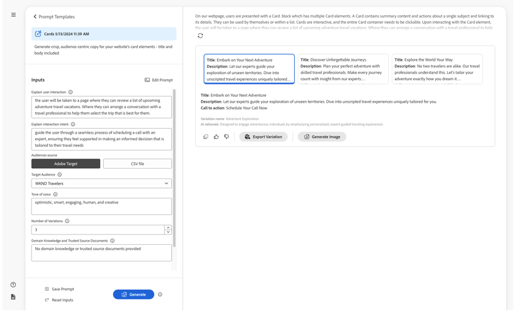
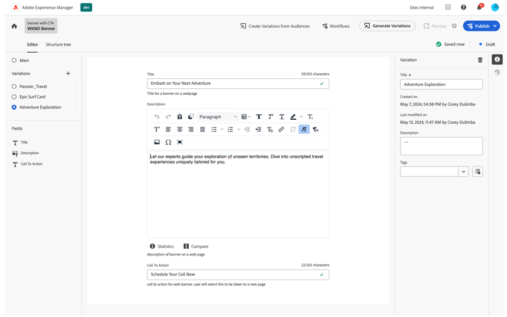
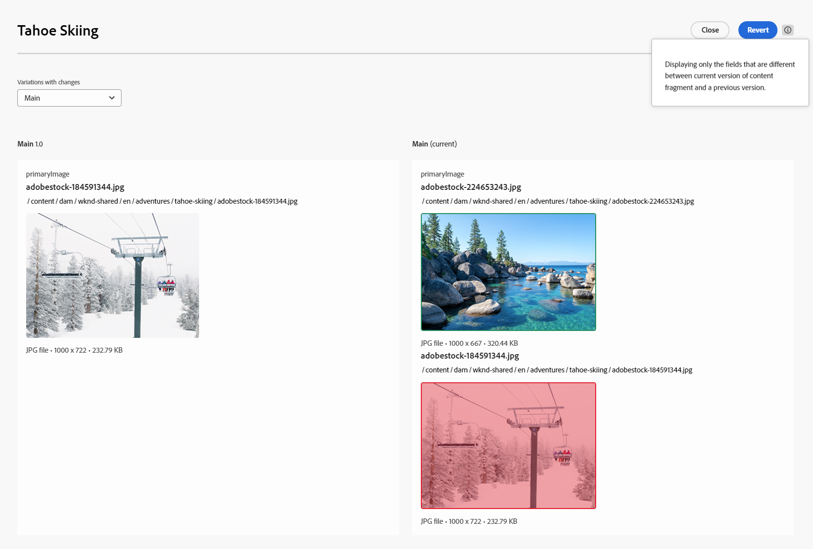

# Skapa innehållsfragment {#authoring-content-fragments}

>[!IMPORTANT]
>
>Du kan få tillgång till olika funktioner i Content Fragment Editor via Early Adobe Program.
>
>Kontrollera [Versionsinformation](/help/release-notes/release-notes-cloud/release-notes-current.md) om du vill se status och hur du tillämpar den om du är intresserad.

Att skapa innehållsfragment är inriktat på både headless-leverans och framtagning av sidor.

Det finns två redigerare för innehållsfragment. Redigeraren som beskrivs i det här avsnittet:

* har utvecklats för leverans av headless-innehåll (men kan användas för alla scenarier)
* är tillgängligt från konsolen **Innehållsfragment**

Den här redigeraren innehåller:

* [Spara automatiskt](#saving-autosaving) för att förhindra oavsiktlig förlust av redigeringar.
* [Inline-överföring av resurser som innehållsreferenser](#reference-images), utan att först behöva överföra dem till resursens DAM.
* [Generera variationer](#generate-variations-ai) om du vill använda den generativa AI-filen för att snabba upp innehållsskapandet baserat på uppmaningar.
* [Förhandsgranska](#preview-content-fragment) av den återgivna upplevelsen som levereras av innehållsfragmentet.
* Möjlighet att [Publish](#publish-content-fragment) och [avpublicera](#unpublish-content-fragment) från redigeraren.
* Möjlighet att [visa och öppna associerade språkkopior](#view-language-copies) i redigeraren.
* Möjlighet att [visa versionsinformation](#view-version-history) i redigeraren. Du kan också återgå till en vald version.
* Möjlighet att [visa och öppna överordnade referenser](#view-parent-references).
* En hierarkisk vy av innehållsfragmentet och dess referenser med hjälp av [strukturträdet](#structure-tree).

>[!WARNING]
>
>Redigeraren som beskrivs i det här avsnittet är *endast* tillgänglig i *online* Adobe Experience Manager-as a Cloud Service (AEM).

## Innehållsfragmentsredigerare {#content-fragment-editor}

När du först öppnar Content Fragment Editor visas fyra huvudområden:

* övre verktygsfältet: för nyckelinformation och åtgärder
   * en länk till konsolen för innehållsfragment (hemikonen)
   * information om modellen och mappen
   * länkar till [Förhandsgranska (om URL-mönstret för standardförhandsvisning har konfigurerats för modellen)](/help/sites-cloud/administering/content-fragments/content-fragment-models.md#content-fragment-model-properties)
   * [Publish](#publish-content-fragment) och [Avpublicera](#unpublish-content-fragment) åtgärder
   * ett alternativ för att visa alla **överordnade referenser** (länkikon)
   * fragmentet **[Status](/help/sites-cloud/administering/content-fragments/managing.md#statuses-content-fragments)** och den senast sparade informationen
   * växla till den ursprungliga (Assets-baserade) redigeraren

     >[!WARNING]
     >
     >Den ursprungliga redigeraren öppnas på samma flik. Vi rekommenderar inte att båda redigerarna är öppna samtidigt.

* vänster panel: visar **[Variationer](#variations)** för innehållsfragmentet och dess **fält**:
   * dessa länkar kan användas för att [navigera i strukturen för innehållsfragment](#navigate-structure)
* höger panel: presenterar flikar [som visar egenskaper (metadata) och taggar](#view-properties-tags), information om [versionshistoriken](#view-version-history) och information om [språkkopior](#view-language-copies)
   * på fliken **Egenskaper** kan du uppdatera **Title** och **Description** för fragmentet, eller **Variation**
   * På fliken **Kommentarer** kan du lägga till och läsa kommentarer som hjälper dig att samarbeta med andra författare
* central panel: visar de faktiska fälten och innehållet i den valda varianten
   * gör att du kan redigera innehållet
      * när den är konfigurerad (som flera) i modellen tillåter olika datatyper dig att **lägga till** instanser av det relevanta fältet
   * om **platshållarfält** definieras i modellen som de visas här och:
      * kan användas för navigering
      * visas antingen vågrätt eller som en listruta

  >[!NOTE]
  >
  >Beroende på definitioner i den underliggande modellen kan fälten omfattas av vissa typer av [validering](/help/assets/content-fragments/content-fragments-models.md#validation).

## Navigera i innehållsfragmentsstrukturen {#navigate-structure}

Ett enda innehållsfragment;

* Består av två nivåer:

   * **[Variationer](#variations)** i innehållsfragmentet
   * **Fält** - definieras av innehållsfragmentmodellen och används av alla variationer

* Kan innehålla flera olika referenser.

### Variationer och fält {#variations-and-fields}

I den vänstra panelen ser du:

* listan med **[Variationer](#variations)** som har skapats för det här fragmentet:
   * **Main** är variationen som finns när innehållsfragmentet skapas, du kan lägga till andra senare
   * Du kan använda Generate Variations(#generate-variations) för att använda en promptbaserad mall som Adobe har skapat för ett visst användningsfall.
   * du kan även [skapa en variant](#create-variation)
* **Fält** i fragmentet och dess varianter:
   * ikonen anger [datatypen](/help/sites-cloud/administering/content-fragments/content-fragment-models.md#data-types)
   * texten är fältnamnet
   * tillsammans utgör de en direkt länk till fältinnehållet på den centrala panelen (för den aktuella variationen)

### Följ länkar {#follow-links}

I olika delar av redigeraren ser du länkikonen. Den här ikonen kan användas för att öppna det objekt som visas, till exempel en innehållsfragmentmodell, en överordnad referens eller ett fragment som refereras:

### Strukturträd {#structure-tree}

Öppna fliken **Strukturträd** i redigeringsverktygsfältet för att visa den hierarkiska strukturen för innehållsfragmentet och dess referenser. Använd länkikonerna för att navigera till referenserna.

>[!NOTE]
>
>Mer information finns i [Analyserar struktur för innehållsfragment - strukturträd](/help/sites-cloud/administering/content-fragments/analysis.md#structure-tree).

## Spara och spara automatiskt {#saving-autosaving}

<!-- CHECK: cannot be saved, no undo, redo -->

För varje uppdatering som du gör sparas innehållsfragmentet automatiskt. Den senast sparade versionen visas i det övre verktygsfältet.

## Variationer {#variations}

[Variationer](/help/sites-cloud/administering/content-fragments/overview.md#main-and-variations) är en viktig funktion för att AEM innehållsfragment. Med dem kan du skapa och redigera kopior av **Main** -innehållet som ska användas i vissa kanaler och scenarier, vilket gör innehållsleverans utan rubrik och sidredigering ännu mer flexibelt.

Från redigeraren kan du:

* [Skapa variationer](#create-variation) av **Main** -innehållet

* [Använd Generate Variations AI](#generate-variations-ai) om du vill använda Generative AI för att använda en promptbaserad mall som Adobe har skapat för ett visst användningsfall.

* Välj önskad variant för att redigera innehållet

* [Byt namn på din variant](#rename-variation)

* [Ta bort en variant](#delete-variation)

### Skapa en variant {#create-variation}

Så här skapar du en variant av ditt innehållsfragment:

1. I den vänstra panelen väljer du **plustecknet** (**Skapa variation**) till höger om **Variationer**.

   >[!NOTE]
   >
   >När du har skapat din första variant visas befintliga varianter på samma panel.

   

1. I dialogrutan anger du en **titel** för varianten och en **beskrivning** om du vill:

   

1. **Skapa** variationen. Den visas i listan.

### Byta namn på en variant {#rename-variation}

Så här byter du namn på en **variation**:

1. Välj önskad variant.

1. Öppna fliken **Egenskaper** i den högra panelen.

1. Uppdatera variationen **Rubrik**.

1. Tryck antingen på **Retur** eller flytta till ett annat fält för att spara ändringen automatiskt. Titeln uppdateras på panelen **Variationer** till vänster.

### Skapa variationer med GenAI med Generera variationer {#generate-variations-ai}

Använd Generative Variations för att utnyttja generativ AI för att snabba upp framtagningen av innehåll.

Så här använder du de generativa variationerna i redigeraren för innehållsfragment:

1. Öppna Content Fragment Editor. I rubriken hittar du startpunkten till Generera variationer:

   

1. Generera varianter öppnas på en ny flik. I den vänstra listen kan du se AEM Cloud-instansen och det innehållsfragment som du skapar innehåll för. Välj den fråga du vill använda eller skapa en ny fråga.

   >[!NOTE]
   >
   >De tillgängliga mallarna för uppmaningsmeddelanden för Adobe är nu begränsade, men fler kommer att läggas till i framtida versioner.

   

1. Generera innehåll genom att fylla i uppmaningarna. Innehållsmodellen från fragmentet används automatiskt för att generera innehåll med GenAI.

   >[!NOTE]
   >
   >Vi stöder för närvarande bara textfält.

   

1. Välj den variant som du vill ha och välj &quot;exportvariant&quot;. Bekräfta namnet på varianten av innehållsfragmentet och välj antingen:

   * **Exportera**: exportera variation till innehållsfragment och stanna i programmet Generera variation.
   * **Exportera och öppna**: Exportera variation till innehållsfragment och öppna en ny flik som visar innehållsfragment med den nya varianten från GenAI.

     

1. Variationer som genereras visas i redigeraren för huvudinnehållsfragment.

   

Mer information finns i [Generera variationer](/help/generative-ai/generate-variations.md).

### Ta bort en variant {#delete-variation}

Så här tar du bort en variant av ditt innehållsfragment:

    >[!NOTE]
    >
    >Du kan inte ta bort **Main**.

1. Välj Variation.

1. På panelen **Variation** väljer du borttagningsikonen (papperskorgen):

   

1. En dialogruta öppnas. Bekräfta åtgärden genom att välja **Ta bort**.

## Redigera textfält med flera rader - Oformaterad text eller Markering {#edit-multi-line-text-fields-plaintext-markdown}

**[Flerradiga textfält](/help/sites-cloud/administering/content-fragments/content-fragment-models.md#data-types)** kan ha ett av tre format:

* Oformaterad text
* [Markering](/help/sites-cloud/administering/content-fragments/markdown.md)
* [RTF](#edit-multi-line-text-fields-rich-text)

Fält som definieras som antingen Oformaterad text eller Oformaterad markering har en enkel textruta utan formateringsalternativ (på skärmen):

## Redigera textfält med flera rader - RTF {#edit-multi-line-text-fields-rich-text}

För **[flerradiga textfält](/help/sites-cloud/administering/content-fragments/content-fragment-models.md#data-types)** som definieras som **RTF** finns olika funktioner:

* Redigera innehållet:
   * Ångra/Gör om
   * Klistra in/klistra in som text
   * Kopiera
   * Välj styckeformat
   * Skapa/hantera tabell
   * Formatera text; fet, kursiv, understruken, färg
   * Ange styckejustering
   * Skapa/hantera listor; punktlistor, numrerade
   * Dra in text; minska, öka
   * Rensa aktuell formatering
   * Infoga länkar
   * Markera och infoga referenser till bildresurser
   * Lägg till specialtecken
* [Helskärmsredigerare](#full-screen-editor-rich-text) - växla mellan helskärmsredigering och arbetsflöde
* [Statistik](#statistics-rich-text)
* [Jämför och synkronisera](#compare-and-synchronize-rich-text)

Till exempel:

>[!NOTE]
>
>Flerradiga textfält indikeras även av rätt [ikon](#fields-datatypes-icons) på panelen **Fält**.

### Helskärmsredigerare - RTF {#full-screen-editor-rich-text}

Helskärmsredigeraren har samma redigeringsalternativ som vid inflöde, men ger mer utrymme för texten.

Till exempel:

### Statistik - RTF {#statistics-rich-text}

Åtgärden **Statistik** visar ett intervall med information om texten i ett fält med flera rader.

Till exempel:

### Jämför och synkronisera - RTF {#compare-and-synchronize-rich-text}

Åtgärden **Jämför** är tillgänglig för flerradsfält när du har öppnat **Variation**.

Då öppnas fältet Flera rader i helskärmsläge och:

* visar innehållet för både **Main** och den aktuella **Variation** parallellt, med alla skillnader markerade

* skillnaderna anges med färg:

   * grönt anger innehåll som lagts till (i varianten)
   * rött anger att innehållet har tagits bort (från varianten)
   * blå anger ersatt text

* innehåller åtgärden **Synkronisera** som synkroniserar innehållet från **Huvudsida** till den aktuella varianten

   * om **Main** har uppdaterats överförs dessa ändringar till variationen
   * om varianten har uppdaterats, skrivs dessa ändringar över av innehållet från **Main**

  >[!CAUTION]
  >
  >Synkronisering är bara tillgängligt för att kopiera ändringar *från **Huvudsida**till variationen*.
  >
  >Det går inte att överföra ändringar *från en variation till **Main*** som ett alternativ.

Ett scenario där variantinnehållet till exempel har skrivits om helt, så en synkronisering ersätter det nya innehållet med innehållet från **Huvudsida**:

## Hantera referenser {#manage-references}

### Fragmentreferenser {#fragment-references}

[Fragmentreferenser](/help/sites-cloud/administering/content-fragments/content-fragment-models.md#fragment-reference-nested-fragments) kan användas för att:

* [skapa en referens till ett befintligt innehållsfragment](#create-reference-existing-content-fragment)
* [skapa ett innehållsfragment och referera sedan till det](#create-reference-content-fragment)

#### Skapa en referens till ett befintligt innehållsfragment {#create-reference-existing-content-fragment}

Så här skapar du en referens till ett befintligt innehållsfragment:

1. Markera fältet.
1. Välj **Lägg till befintligt fragment**.
1. Välj önskat fragment från fragmentväljaren.

   >[!NOTE]
   >
   >Du kan bara markera ett fragment åt gången.

#### Skapa ett innehållsfragment och en referens {#create-reference-content-fragment}

Du kan också [välja **Skapa nytt fragment** för att öppna dialogrutan **Skapa**](/help/sites-cloud/administering/content-fragments/managing.md#creating-a-content-fragment). När fragmentet har skapats refereras det.

### Innehållsreferenser {#content-references}

[Innehållsreferenser](/help/sites-cloud/administering/content-fragments/content-fragment-models.md#content-reference) används för att referera till andra AEM innehållstyper, som bilder, sidor och Experience Fragments.

#### Referensbilder {#reference-images}

I fälten **Innehållsreferens** kan du båda:

* referensresurser som redan finns i databasen
* ladda upp dem direkt till fältet. På så sätt slipper du använda konsolen **Assets** för att ladda upp dem

  >[!NOTE]
  >
  >Om du vill överföra en bild direkt till fältet **Innehållsreferens** måste den **vara**:
  >
  >* har en **rotsökväg** definierad (i [Content Fragment Model](/help/sites-cloud/administering/content-fragments/content-fragment-models.md#content-reference)). Detta anger var bilden ska sparas.
  >* ta med **Bild** i listan över godkända innehållstyper

Du kan antingen lägga till en resurs:

* dra och släpp den nya resursfilen direkt (till exempel från filsystemet) till fältet **Innehållsreferens**
* Använd åtgärden **Lägg till resurs** och välj sedan antingen **Bläddra i Assets** eller **Överför** för att öppna den väljare som du vill använda:

  

#### Referenssidor {#reference-pages}

Så här lägger du till referenser till AEM sidor, Experience Fragments eller andra sådana innehållstyper:

1. Välj **Lägg till innehållssökväg**.

1. Lägg till den obligatoriska sökvägen i indatafältet.

1. Bekräfta med **Lägg till**.

>[!NOTE]
>
>Detta ska inte användas för referenser till:
>
>* Innehållsfragment - använd en [fragmentreferens](#fragment-references)
>* Bilder - använd [referensbilder](#reference-images)

### Visa överordnade referenser {#view-parent-references}

Om du väljer länkikonen i det övre verktygsfältet öppnas en lista med alla överordnade referenser.

Till exempel:

Ett fönster öppnas med alla relaterade referenser. Om du vill öppna en referens markerar du namnet eller titeln eller länkikonen.

Till exempel:

## Visa egenskaper och taggar {#view-properties-tags}

Egenskaper (metadata) och taggar kan visas på egenskapsfliken på den högra panelen. Egenskaperna kan antingen vara:

* för **innehållsfragment** - om **Huvudfragment** är markerat
* för en specifik **variation**

### Redigera egenskaper och taggar {#edit-properties-tags}

På fliken Egenskaper (den högra panelen) kan du även redigera:

* **Titel**
* **Beskrivning**
* **Taggar**: använda den nedrullningsbara listan eller valdialogrutan

  

### Öppna innehållsfragmentmodellen {#open-content-fragment-model}

När du har markerat **Huvudsida** visas namnet på den underliggande modellen för innehållsfragment i egenskapsavsnittet. När du väljer länkikonen öppnas modellen på en separat flik.

Till exempel:

## Visa versionshistorik {#view-version-history}

På fliken **Versionshistorik** i den högra panelen visas information om den aktuella och tidigare versionen:

>[!NOTE]
>
>En ny version skapas när innehållsfragmentet publiceras.

### Jämför version {#compare-version}

För ett innehållsfragment kan du jämföra en tidigare version med den aktuella versionen.

Så här jämför du en tidigare version med den aktuella:

1. Välj ikonen med tre punkter bredvid versionen.

1. Välj **Jämför**.

Då öppnas en vy som visar skillnader mellan den aktuella versionen av innehållet och den valda tidigare versionen av innehållsfragmentet. I listrutan **Variationer med ändringar** kan du välja att visa skillnader från huvudinnehållet och/eller innehållet från en variation.

Skillnader anges med färg:

* Grön: anger innehåll som har lagts till (i den aktuella versionen)
* Röd: anger att innehåll har tagits bort (från den aktuella versionen)

### Återgå till en version {#revert-version}

Du kan återgå till vilken version som helst.

Så här återgår du till en viss version:

1. Välj ikonen med tre punkter bredvid versionen.

1. Välj **Återgå**.

## Visa språkkopior {#view-language-copies}

På fliken **Språkegenskaper** visas information om relaterade språkkopior. Om du väljer en länkikon öppnas kopian på en separat flik.

Till exempel:

>[!NOTE]
>
>Mer information om hur du översätter ett innehållsfragment och skapar språkkopior finns i [AEM Headless Translation Journey](/help/journey-headless/translation/overview.md).

## Kommentera fragmentet {#commenting-on-your-fragment}

Fliken **Kommentarer** i den högra panelen ger dig möjlighet att samarbeta i produkter och i sammanhang:

* Lägg till en ny kommentar
* Tagga specifika användare i en kommentar
   * De får ett meddelande med en länk för att öppna fragmentet direkt
* Gilla en befintlig kommentar
* Svara på en kommentar
* Formatera dina kommentarer; grundläggande formatering finns tillgänglig
* Genomför en textsökning med befintliga kommentarer
* Redigera en befintlig kommentar
* Ta bort kommentarer

>[!NOTE]
>
>Dessa kommentarer visas inte som [Anteckningar i den ursprungliga redigeraren](/help/assets/content-fragments/content-fragments-managing.md#annotating-a-content-fragment) eller i [tidslinjen i Assets-konsolen](/help/assets/content-fragments/content-fragments-managing.md#timeline-for-content-fragments).

## Förhandsgranska fragmentet {#preview-content-fragment}

Med redigeraren för innehållsfragment kan författare förhandsgranska sina redigeringar i ett externt klientprogram.

Om du vill använda den här funktionen måste du först:

* Samarbeta med IT-avdelningen och skapa ett externt klientprogram som återger innehållsfragmentet genom att använda JSON-utdata.
* När det externa klientprogrammet har konfigurerats måste URL-mönstret **Standardförhandsgranskning** definieras som en [egenskap för rätt innehållsfragmentmodell](/help/sites-cloud/administering/content-fragments/content-fragment-models.md#properties).

När URL:en har definierats är knappen **Förhandsgranska** aktiv. Du kan välja den här knappen om du vill starta det externa programmet (på en separat flik) för att återge innehållsfragmentet.

## Publish ditt fragment {#publish-content-fragment}

Du kan **Publish** ditt fragment till antingen din:

* Förhandsgranska instans
* Publish, instans

Du kan publicera fragmentet antingen från redigeraren eller konsolen. Mer information finns i [Publicera och förhandsgranska ett fragment](/help/sites-cloud/administering/content-fragments/managing.md#publishing-and-previewing-a-fragment).

## Avpublicera fragment {#unpublish-content-fragment}

Du kan även **Avpublicera** ditt fragment från antingen din:

* Förhandsgranska instans
* Publish, instans

Du kan avpublicera fragmentet från antingen redigeraren eller konsolen. Mer information finns i [Avpublicera ett fragment](/help/sites-cloud/administering/content-fragments/managing.md#unpublishing-a-fragment).

## Fält, datatyper och ikoner {#fields-datatypes-icons}

På panelen **Fält** visas alla fält i innehållsfragmentet. Ikonen anger **[datatypen](/help/sites-cloud/administering/content-fragments/content-fragment-models.md#data-types)**:

<table style="table-layout:auto">
 <tbody>
  <tr>
   <td>
<b>Enkelradig text</b>
 </td>
   <td>
  
</td>
  </tr>
  <tr>
   <td>
<b>Flerradstext</b>
 </td>
   <td>
  
</td>
  </tr>
  <tr>
   <td>
<b>Nummer</b>
 </td>
   <td>
  
</td>
  </tr>
  <tr>
   <td>
<b>Boolean</b>
 </td>
   <td>
  
</td>
  </tr>
  <tr>
   <td>
<b>Datum och tid</b>
 </td>
   <td>
  
</td>
  </tr>
  <tr>
   <td>
<b>Uppräkning</b>
 </td>
   <td>
  
</td>
  </tr>
  <tr>
   <td>
<b>Taggar</b>
 </td>
   <td>
  
</td>
  </tr>
  <tr>
   <td>
<b>Innehållsreferens</b>
 </td>
   <td>
  
</td>
  </tr>
  <tr>
   <td>
<b>Fragmentreferens</b>
 </td>
   <td>
  
</td>
  </tr>
  <tr>
   <td>
<b>JSON-objekt</b>
 </td>
   <td>
  
</td>
  </tr>
  <tr>
   <td>
<b>Platshållare för flik</b>

Även om den inte representeras av en faktisk ikon visas en <b>platshållare för tabbar</b> i den vänstra panelen.  Den visas också på den centrala panelen, antingen vågrätt som det visas, eller i en nedrullningsbar lista (när det finns för många för att visa vågrätt).
 </td>
   <td>
  
</td>
  </tr>
 </tbody>
</table>

## Bra att veta {#good-to-know}

* Du behöver [lämplig behörighet](/help/implementing/developing/extending/content-fragments-customizing.md#asset-permissions) för att redigera ett innehållsfragment. Kontakta systemadministratören om du har problem.

  Om du t.ex. inte har `edit` behörigheter kommer redigeraren att vara skrivskyddad.

* En innehållsfragmentmodell kan ofta definiera datafält med namnen **Title** och **Description**. Om dessa fält finns är de användardefinierade fält och kan uppdateras på den *centrala panelen* när fragmentet redigeras.

  Innehållsfragmentet och dess varianter har också metadatafält (variationsegenskaper) som kallas **Titel** och **Beskrivning**. De här fälten är en integrerad del av ett innehållsfragment och definieras från början när fragmentet. De kan uppdateras på den *högra panelen* när du redigerar fragmentet.

* Mer information om den [ursprungliga Content Fragment-redigeraren](/help/assets/content-fragments/content-fragments-variations.md) finns i Assets-dokumentationen. Den finns tillgänglig både från **Assets**-konsolen och från konsolen **Content Fragments**.

* Ditt projektteam kan anpassa redigeraren om det behövs. Mer information finns i [Anpassa konsolen och redigeraren för innehållsfragment](/help/implementing/developing/extending/content-fragments-console-and-editor.md).
