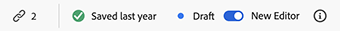
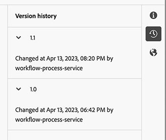

# Skapa innehållsfragment {#authoring-content-fragments}

Att skapa innehållsfragment är inriktat på både headless-leverans och framtagning av sidor.

Det finns två redigerare för innehållsfragment. Redigeraren som beskrivs i det här avsnittet:

* har utvecklats för leverans av headless-innehåll (men kan användas för alla scenarier)
* är tillgängligt från **Innehållsfragment** konsol

Den här redigeraren innehåller:

* [Spara automatiskt](#saving-autosaving), för att förhindra oavsiktlig förlust av redigeringar.
* [Inline-överföring av resurser som innehållsreferenser](#reference-images), utan att först behöva överföra dem till resursens DAM.
* [Förhandsgranska](#preview-content-fragment) av den renderade upplevelsen som levereras av innehållsfragmentet.
* Möjlighet att [Publicera](#publish-content-fragment) och [Avpublicera](#unpublish-content-fragment) från redigeraren.
* Möjlighet att [visa och öppna, associerade språkkopior](#view-language-copies) i redigeraren.
* Möjlighet att [visa versionsinformation](#view-version-history) i redigeraren.
   * Du kan också återgå till en vald version.
* Möjlighet att [visa och öppna överordnade referenser](#view-parent-references).
* En hierarkisk vy av innehållsavsnittet och dess referenser med hjälp av [Strukturträd](#structure-tree).

>[!CAUTION]
>
>Redigeraren som beskrivs i det här avsnittet är *endast* finns i *online* Adobe Experience Manager (AEM) as a Cloud Service.

>[!CAUTION]
>
>Om du vill redigera ett innehållsfragment behöver du [lämpliga behörigheter](/help/implementing/developing/extending/content-fragments-customizing.md#asset-permissions). Kontakta systemadministratören om du har problem.
> 
>Om du till exempel inte har `edit` behörigheter som redigeraren ska vara skrivskyddad.

>[!NOTE]
>
>I Assets-dokumentationen finns fullständig information om [ursprunglig Content Fragment-redigerare](/help/assets/content-fragments/content-fragments-variations.md) - det finns på båda **Resurser** konsolen och **Innehållsfragment** konsol.

>[!NOTE]
>
>Ditt projektteam kan anpassa redigeraren om det behövs. Se [Anpassa konsolen och redigeraren för innehållsfragment](/help/implementing/developing/extending/content-fragments-console-and-editor.md) för mer information.

## Innehållsfragmentsredigerare {#content-fragment-editor}

När du först öppnar Content Fragment Editor visas fyra huvudområden:

* övre verktygsfältet: för nyckelinformation och åtgärder
   * en länk till konsolen för innehållsfragment (hemikonen)
   * information om modellen och mappen
   * länkar till [Förhandsgranska (om standardmönstret för URL för förhandsgranskning har konfigurerats för modellen)](/help/sites-cloud/administering/content-fragments/content-fragment-models.md#content-fragment-model-properties)
   * [Publicera](#publish-content-fragment)och [Avpublicera](#unpublish-content-fragment) funktionsmakron
   * ett alternativ för att visa alla **Överordnade referenser** (länkikon)
   * fragmentet **[Status](/help/sites-cloud/administering/content-fragments/managing.md#statuses-content-fragments)** och senast sparad information
   * växla till den ursprungliga (resursbaserade) redigeraren
* vänster panel: visar **[Variationer](#variations)** för innehållsfragmentet och dess **Fält**:
   * dessa länkar kan användas för [navigera i strukturen för innehållsfragment](#navigate-structure)
* höger panel: presenterar flikar [visa egenskaper (metadata) och taggar](#view-properties-tags), information om [versionshistorik](#view-version-history)och information om [språkversioner](#view-language-copies)
   * i **Egenskaper** kan du uppdatera **Titel** och **Beskrivning** för fragmentet, eller **Variation**
* central panel: visar de faktiska fälten och innehållet i den valda varianten
   * gör att du kan redigera innehållet
   * if **Platshållare för flik** fält definieras i den modell de visas här och kan användas för navigering. De visas antingen vågrätt eller som en listruta

>[!CAUTION]
>
>En innehållsfragmentmodell kan ofta definiera datafält med namnet **Titel** och **Beskrivning**. Om fälten finns är de användardefinierade och kan uppdateras i *central panel* när du redigerar fragmentet.
>
>Innehållsfragmentet och dess varianter har också metadatafält (variationsegenskaper) som anropas **Titel** och **Beskrivning**. De här fälten är en integrerad del av ett innehållsfragment och definieras från början när fragmentet. De kan uppdateras i *höger panel* när du redigerar fragmentet.

## Navigera i innehållsfragmentsstrukturen {#navigate-structure}

Ett enda innehållsfragment;

* Består av två nivåer:

   * **[Variationer](#variations)** i innehållsfragmentet
   * **Fält** - som definieras av innehållsfragmentmodellen och används av alla variationer

* Kan innehålla flera olika referenser.

### Variationer och fält {#variations-and-fields}

I den vänstra panelen ser du:

* listan med **[Variationer](#variations)** som har skapats för detta fragment:
   * **Huvud** är variationen som finns när innehållsfragmentet skapas, du kan lägga till andra senare.
   * du kan markera och öppna en variant för redigering
   * kan du också [skapa en variant](#create-variation)
* den **Fält** inom fragmentet och dess variationer:
   * ikonen anger att [Datatyp](/help/sites-cloud/administering/content-fragments/content-fragment-models.md#data-types)
   * texten är fältnamnet
   * tillsammans utgör de en direkt länk till fältinnehållet på den centrala panelen (för den aktuella variationen)

### Följ länkar {#follow-links}

I olika delar av redigeraren ser du länkikonen. Detta kan användas för att öppna det objekt som visas, t.ex. en innehållsfragmentmodell, en överordnad referens eller ett fragment som refereras:

### Strukturträd {#structure-tree}

Öppna **Strukturträd** i redigeringsverktygsfältet för att visa den hierarkiska strukturen för innehållsfragmentet och dess referenser. Använd länkikonerna för att navigera till referenserna.

>[!NOTE]
>
>Se [Analyserar struktur för innehållsfragment - strukturträd](/help/sites-cloud/administering/content-fragments/analysis.md#structure-tree) för mer information.

## Spara och spara automatiskt {#saving-autosaving}

<!-- CHECK: cannot be saved, no undo, redo -->

För varje uppdatering som du gör sparas innehållsfragmentet automatiskt. Den senast sparade versionen visas i det övre verktygsfältet.

## Variationer {#variations}

[Variationer](/help/sites-cloud/administering/content-fragments/overview.md#main-and-variations) är en viktig egenskap i AEM. De gör att du kan skapa och redigera kopior av **Huvud** innehåll som kan användas i specifika kanaler och scenarier, vilket gör innehållsleverans utan rubrik och sidredigering ännu mer flexibelt.

Från redigeraren kan du:

* [Skapa variationer](#create-variation) i **Huvud** innehåll

* Välj önskad variant för att redigera innehållet

* [Byt namn på din variant](#rename-variation)

* [Ta bort en variant](#delete-variation)

### Skapa en variant {#create-variation}

Så här skapar du en variant av ditt innehållsfragment:

1. I den vänstra panelen väljer du **plustecken** (**Skapa variation**) till höger om **Variationer**.

   >[!NOTE]
   >
   >När du har skapat din första variant visas befintliga varianter på samma panel.

   

1. I dialogrutan anger du **Titel** för din variant och **Beskrivning** om du vill:

   

1. **Skapa** variationen. Den visas i listan.

### Byta namn på en variant {#rename-variation}

Byta namn på en **Variation**:

1. Välj önskad variant.

1. Öppna **Egenskaper** i den högra panelen.

1. Uppdatera variationen **Titel**.

1. Tryck **Retur** eller flytta till ett annat fält för att automatiskt spara ändringen. Titeln uppdateras i **Variationer** till vänster.

### Ta bort en variant {#delete-variation}

Så här tar du bort en variant av ditt innehållsfragment:

>[!NOTE]
>
>Du kan inte ta bort **Huvud**.

1. Välj Variation.

1. I **Variation** markerar du ikonen Ta bort (papperskorgen):

   

1. En dialogruta öppnas. Välj **Ta bort** för att bekräfta åtgärden.

## Redigera textfält med flera rader - Oformaterad text eller Markering {#edit-multi-line-text-fields-plaintext-markdown}

**[Flerradstext](/help/sites-cloud/administering/content-fragments/content-fragment-models.md#data-types)** fält kan ha något av tre format:

* Oformaterad text
* [Markdown](/help/sites-cloud/administering/content-fragments/markdown.md)
* [RTF](#edit-multi-line-text-fields-rich-text)

Fält som definieras som antingen Oformaterad text eller Oformaterad markering har en enkel textruta utan formateringsalternativ (på skärmen):

## Redigera textfält med flera rader - RTF {#edit-multi-line-text-fields-rich-text}

För **[Flerradstext](/help/sites-cloud/administering/content-fragments/content-fragment-models.md#data-types)** fält som definieras som **RTF** finns det olika funktioner:

* Redigera innehållet:
   * Ångra/Gör om
   * Klistra in/klistra in som text
   * Kopiera
   * Välj styckeformat
   * Skapa/hantera tabell
   * Formatera text; fet, kursiv, understruken, färg
   * Ange styckejustering
   * Skapa/hantera listor; punktlistor, numrerade
   * Dra in text; minska, öka
   * Rensa aktuell formatering
   * Infoga länkar
   * Markera och infoga referenser till bildresurser
   * Lägg till specialtecken
* [Helskärmsredigerare](#full-screen-editor-rich-text) - växla mellan helskärm och flöde
* [Statistik](#statistics-rich-text)
* [Jämför och synkronisera](#compare-and-synchronize-rich-text)

Till exempel:

>[!NOTE]
>
>Flerradiga textfält anges också med lämplig [icon](#fields-datatypes-icons) i **Fält** -panelen.

### Helskärmsredigerare - RTF {#full-screen-editor-rich-text}

Helskärmsredigeraren har samma redigeringsalternativ som vid inflöde, men ger mer utrymme för texten.

Till exempel:

### Statistik - RTF {#statistics-rich-text}

Åtgärden **Statistik** visar ett intervall med information om texten i ett fält med flera rader.

Till exempel:

### Jämför och synkronisera - RTF {#compare-and-synchronize-rich-text}

Åtgärden **Jämför** är tillgängligt för flerradsfält när du har en **Variation** öppna.

Då öppnas fältet Flera rader i helskärmsläge och:

* visar innehållet för båda **Huvud** och den aktuella **Variation** parallellt med alla skillnader markerade

* skillnaderna anges med färg:

   * grönt anger innehåll som lagts till (i varianten)
   * rött anger att innehållet har tagits bort (från varianten)
   * blå anger ersatt text

* ger **Synkronisera** åtgärd, som synkroniserar innehållet från **Huvud** till aktuell variation

   * if **Huvud** har uppdaterats, kommer dessa ändringar att överföras till varianten
   * om varianten har uppdaterats, skrivs dessa ändringar över av innehållet från **Huvud**

  >[!CAUTION]
  >
  >Synkronisering är bara tillgängligt för att kopiera ändringar *från **Huvud**till variationen*.
  >
  >Överför ändringar *från en variant till **Huvud*** är inte tillgängligt som alternativ.

Ett scenario där variantinnehållet till exempel har skrivits om helt, så en synkronisering ersätter det nya innehållet med innehållet från **Huvud**:

## Hantera referenser {#manage-references}

### Fragmentreferenser {#fragment-references}

[Fragmentreferenser](/help/sites-cloud/administering/content-fragments/content-fragment-models.md#fragment-reference-nested-fragments) kan användas för att:

* [skapa en referens till ett befintligt innehållsfragment](#create-reference-existing-content-fragment)
* [skapa ett innehållsfragment och referera sedan till det](#create-reference-content-fragment)

#### Skapa en referens till ett befintligt innehållsfragment {#create-reference-existing-content-fragment}

Så här skapar du en referens till ett befintligt innehållsfragment:

1. Markera fältet.
1. Välj **Lägg till befintligt fragment**.
1. Välj önskat fragment från fragmentväljaren.

   >[!NOTE]
   >
   >Du kan bara markera ett fragment åt gången.

#### Skapa ett innehållsfragment och en referens {#create-reference-content-fragment}

Alternativt kan du [välj **Skapa nytt fragment** för att öppna **Skapa** dialog](/help/sites-cloud/administering/content-fragments/managing.md#creating-a-content-fragment). När fragmentet har skapats refereras det.

### Innehållsreferenser {#content-references}

[Innehållsreferenser](/help/sites-cloud/administering/content-fragments/content-fragment-models.md#content-reference) används för att referera till andra AEM innehållstyper, som bilder, sidor och upplevelsefragment.

#### Referensbilder {#reference-images}

I **Innehållsreferens** fält som du kan båda:

* referensresurser som redan finns i databasen
* ladda upp dem direkt till fältet. På så sätt slipper du använda **Resurser** konsol att överföra

  >[!NOTE]
  >
  >Överför en bild direkt till **Innehållsreferens** fält, det **måste**:
  >
  >* har **Rotsökväg** definierad (i [Content Fragment Model](/help/sites-cloud/administering/content-fragments/content-fragment-models.md#content-reference)). Detta anger var bilden ska sparas.
  >* include **Bild** i listan över godkända innehållstyper

Du kan antingen lägga till en resurs:

* dra och släpp den nya resursfilen direkt (till exempel från filsystemet) till **Innehållsreferens** fält
* använder **Lägg till resurs** väljer du **Bläddra bland resurser** eller **Överför** så öppnas rätt väljare:

  

#### Referenssidor {#reference-pages}

Så här lägger du till referenser till AEM sidor, Experience Fragments eller andra innehållstyper:

1. Välj **Lägg till innehållssökväg**.

1. Lägg till den obligatoriska sökvägen i indatafältet.

1. Bekräfta med **Lägg till**.

### Visa överordnade referenser {#view-parent-references}

Om du väljer länkikonen i det övre verktygsfältet öppnas en lista med alla överordnade referenser.

Till exempel:

Ett fönster öppnas med alla relaterade referenser. Om du vill öppna en referens markerar du namnet eller titeln eller länkikonen.

Till exempel:

## Visa egenskaper och taggar {#view-properties-tags}

Egenskaper (metadata) och taggar kan visas på egenskapsfliken på den högra panelen. Egenskaperna kan antingen vara:

* för **Innehållsfragment** - if **Huvud** är markerat
* för en specifik **Variation**

### Redigera egenskaper och taggar {#edit-properties-tags}

På fliken Egenskaper (den högra panelen) kan du även redigera:

* **Titel**
* **Beskrivning**
* **Taggar**: med listrutan eller i valdialogrutan

  

### Öppna innehållsfragmentmodellen {#open-content-fragment-model}

När du har **Huvud** Om du väljer det här alternativet visas namnet på den underliggande modellen för innehållsfragment i egenskapsavsnittet. När du väljer länkikonen öppnas modellen på en separat flik.

Till exempel:

## Visa versionshistorik {#view-version-history}

I **Versionshantering** på den högra panelens flik visas information om aktuell och tidigare versioner:

>[!NOTE]
>
>En ny version skapas när innehållsfragmentet publiceras.

### Återgå till en version {#revert-version}

Du kan återgå till vilken version som helst.

Så här återgår du till en viss version:

1. Välj ikonen med tre punkter bredvid versionen.

1. Välj **Återställ**.

## Visa språkkopior {#view-language-copies}

I **Språkegenskaper** tabbinformation om relaterade språkkopior visas. Om du väljer en länkikon öppnas kopian på en separat flik.

Till exempel:

>[!NOTE]
>
>Mer information om hur du översätter ett innehållsfragment och skapar språkkopior finns i [AEM översättningsresa utan rubrik](/help/journey-headless/translation/overview.md).

## Förhandsgranska fragmentet {#preview-content-fragment}

Med redigeraren för innehållsfragment kan författare förhandsgranska sina redigeringar i ett externt klientprogram.

Om du vill använda den här funktionen måste du först:

* Samarbeta med IT-avdelningen och skapa ett externt klientprogram som återger innehållsfragmentet genom att använda JSON-utdata.
* När programmet för den externa frontend har konfigurerats **URL-mönster för standardförhandsvisning** måste definieras som [egenskap för lämplig innehållsfragmentmodell](/help/sites-cloud/administering/content-fragments/content-fragment-models.md#properties).

När URL:en har definierats **Förhandsgranska** knappen är aktiv. Du kan välja den här knappen om du vill starta det externa programmet (på en separat flik) för att återge innehållsfragmentet.

## Publicera fragment {#publish-content-fragment}

Du kan **Publicera** ditt fragment till antingen din

* Förhandsgranska instans
* Publicera instans

Du kan publicera fragmentet antingen från redigeraren eller konsolen. Se [Publicera och förhandsgranska ett fragment](/help/sites-cloud/administering/content-fragments/managing.md#publishing-and-previewing-a-fragment) för fullständig information.

## Avpublicera fragment {#unpublish-content-fragment}

Du kan också **Avpublicera** ditt fragment från antingen din

* Förhandsgranska instans
* Publicera instans

Du kan avpublicera fragmentet från antingen redigeraren eller konsolen. Se [Avpublicera ett fragment](/help/sites-cloud/administering/content-fragments/managing.md#unpublishing-a-fragment) för fullständig information.

## Fält, datatyper och ikoner {#fields-datatypes-icons}

The **Fält** På panelen visas alla fält i innehållsfragmentet. Ikonen indikerar **[Datatyp](/help/sites-cloud/administering/content-fragments/content-fragment-models.md#data-types)**:

<table style="table-layout:auto">
 <tbody>
  <tr>
   <td>
<b>Enkelradig text</b>
 </td>
   <td>
  
</td>
  </tr>
  <tr>
   <td>
<b>Flerradstext</b>
 </td>
   <td>
  
</td>
  </tr>
  <tr>
   <td>
<b>Siffra</b>
 </td>
   <td>
  
</td>
  </tr>
  <tr>
   <td>
<b>Boolean</b>
 </td>
   <td>
  
</td>
  </tr>
  <tr>
   <td>
<b>Datum och tid</b>
 </td>
   <td>
  
</td>
  </tr>
  <tr>
   <td>
<b>Uppräkning</b>
 </td>
   <td>
  
</td>
  </tr>
  <tr>
   <td>
<b>Taggar</b>
 </td>
   <td>
  
</td>
  </tr>
  <tr>
   <td>
<b>Innehållsreferens</b>
 </td>
   <td>
  
</td>
  </tr>
  <tr>
   <td>
<b>Fragmentreferens</b>
 </td>
   <td>
  
</td>
  </tr>
  <tr>
   <td>
<b>JSON-objekt</b>
 </td>
   <td>
  
</td>
  </tr>
  <tr>
   <td>
<b>Platshållare för flik</b>

Även om den inte representeras av en faktisk ikon, visas en <b>Platshållare för flik</b> visas i den vänstra panelen.  Den visas också i den centrala panelen, antingen vågrätt som visas, eller i en listruta (när det finns för många för att visa vågrätt).
 </td>
   <td>
  
</td>
  </tr>
 </tbody>
</table>
