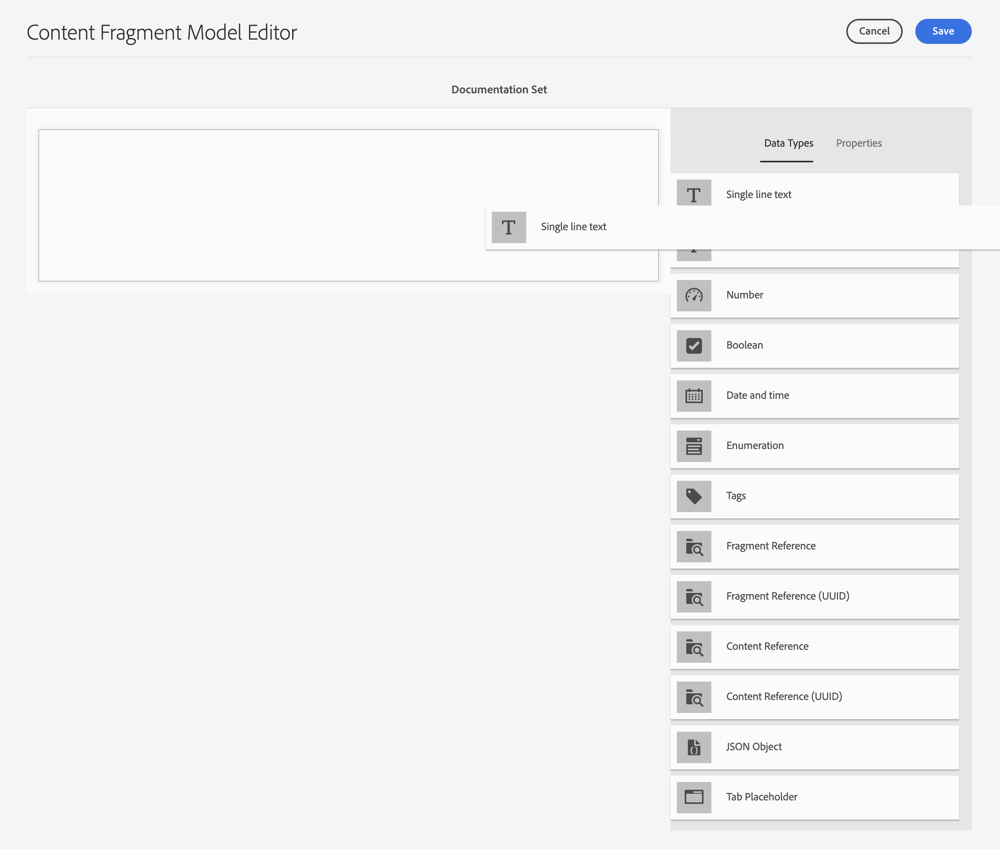
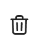

# Modeller för innehållsfragment {#content-fragment-models}

Content Fragment Models in Adobe Experience Manager (AEM) as a Cloud Service definierar strukturen för ditt innehåll [Innehållsfragment](/help/sites-cloud/administering/content-fragments/overview.md). Dessa fragment kan sedan användas för att skapa sidor eller som grund för ditt headless-innehåll.

Så här använder du modeller för innehållsfragment:

1. [Aktivera funktionen Content Fragment Model för instansen](/help/sites-cloud/administering/content-fragments/setup.md)
1. [Skapa](#creating-a-content-fragment-model)och [konfigurera](#defining-your-content-fragment-model), era modeller för innehållsfragment
1. [Aktivera modeller för innehållsfragment](#enabling-disabling-a-content-fragment-model) för användning när du skapar innehållsfragment
1. [Tillåt dina modeller för innehållsfragment i de resursmappar som krävs](#allowing-content-fragment-models-assets-folder) efter konfigurering **Profiler**.

## Skapa en innehållsfragmentmodell {#creating-a-content-fragment-model}

1. Navigera till **verktyg**, **Allmänt**&#x200B;öppna **Modeller för innehållsfragment**.
1. Navigera till den mapp som passar dina [konfiguration eller underkonfiguration](/help/sites-cloud/administering/content-fragments/setup.md).
1. Använd **Skapa** för att öppna guiden.

   >[!CAUTION]
   >
   >Om [användning av modeller för innehållsfragment inte har aktiverats](/help/sites-cloud/administering/content-fragments/setup.md), **Skapa** kommer inte att vara tillgängligt.

1. Ange **Modelltitel**.
Du kan också definiera olika egenskaper, till exempel lägga till **Taggar**, a **Beskrivning**, markera **Aktivera modell** till [aktivera modellen](#enabling-disabling-a-content-fragment-model) om det behövs och definiera
   **URL-mönster för standardförhandsvisning**.

   >[!NOTE]
   >
   >Se [Content Fragment Model - egenskaper](#content-fragment-model-properties) för fullständig information.

   

1. Använd **Skapa** för att spara den tomma modellen. Ett meddelande visar att åtgärden lyckades. Du kan välja **Öppna** för att omedelbart redigera modellen, eller **Klar** för att återgå till konsolen.

### Content Fragment Model - egenskaper {#content-fragment-model-properties}

Dessa egenskaper definieras när du skapar en modell och kan redigeras senare med **Egenskaper** för Content Fragment Model:

* **Grundläggande**
   * **Modelltitel**
   * **Taggar**
   * **Beskrivning**
   * **Aktivera modell**
   * **URL-mönster för standardförhandsvisning**
Med Content Fragment Editor kan författare **Förhandsgranska** innehållet i ett externt klientprogram. När **Förhandsgranskningstjänst** är konfigurerad lägger du till URL:en för klientprogrammet.

     URL:en för förhandsgranskning bör följa detta mönster:
    `https://<preview_url>?param=${expression}`

     Tillgängliga uttryck är:

      * `${contentFragment.path}`
      * `${contentFragment.model.path}`
      * `${contentFragment.model.name}`
      * `${contentFragment.variation}`
      * `${contentFragment.id}`

   * **Överför bild**

<!-- CHECK: currently under FT -->
<!--
* **GraphQL**
  Define names relevant for GraphQL.
  Changing the GraphQL API Name, or Query field names will impact client applications.
  * **API Name**
    Represents the GraphQL type and query field names in the GraphQL schema.
  * **Single Query Field Name**
    Represents the GraphQL single query field name in the GraphQL schema.
  * **Multiple Query Field Name**
    Represents the GraphQL multiple query field name in the GraphQL schema.
-->

## Definiera innehållsfragmentmodellen {#defining-your-content-fragment-model}

Content Fragment Model definierar effektivt strukturen för de resulterande innehållsfragmenten med hjälp av ett urval av **[Datatyper](#data-types)**. Med modellredigeraren kan du lägga till instanser av datatyperna och sedan konfigurera dem för att skapa de obligatoriska fälten:

>[!CAUTION]
>
>Om du redigerar en modell som redan används av befintliga innehållsfragment kan det påverka de beroende fragmenten.

1. Navigera till **verktyg**, **Allmänt**&#x200B;öppna **Modeller för innehållsfragment**.

1. Navigera till den mapp som innehåller innehållsfragmentmodellen.
1. Öppna den modell som krävs för **Redigera**, använd snabbåtgärden eller välj modellen och sedan åtgärden från verktygsfältet.

   När du har öppnat modellredigeraren visas följande:

   * vänster: fält har redan definierats
   * höger: **Datatyper** som är tillgängliga för att skapa fält (och **egenskaper** som kan användas när fälten har skapats)

   >[!NOTE]
   >
   >När ett fält definieras som **Obligatoriskt**, **Etikett** som anges i den vänstra rutan är markerad med ett asterix (**&#42;**).


1. **Lägga till ett fält**

   * Dra en obligatorisk datatyp till önskad plats för ett fält:

     

   * När ett fält har lagts till i modellen visas den högra panelen **Egenskaper** som kan definieras för den aktuella datatypen. Här definierar du vad som krävs för fältet.

      * Många egenskaper är självförklarande, mer information finns i [Egenskaper](#properties).
      * Skriva ett **Fältetikett** fyller i **Egenskapsnamn**  - om den är tom, och sedan kan den uppdateras manuellt.

        >[!CAUTION]
        >
        När egenskapen uppdateras manuellt **Egenskapsnamn** för en datatyp måste namnen innehålla *endast* A-Z, a-z, 0-9 och understreck &quot;_&quot; som specialtecken.
        >
        Om modeller som skapats i tidigare versioner av AEM innehåller ogiltiga tecken tar du bort eller uppdaterar dessa tecken.

     Till exempel:

     

1. **Ta bort ett fält**

   Markera det obligatoriska fältet och välj sedan papperskorgsikonen. Du ombeds bekräfta åtgärden.

   

1. Lägg till alla obligatoriska fält och definiera de relaterade egenskaperna efter behov. Till exempel:

   

1. Välj **Spara** för att behålla definitionen.

## Datatyper {#data-types}

Det finns ett urval datatyper som du kan använda för att definiera din modell:

* **Enkelradig text**
   * Lägg till ett eller flera fält med en enda textrad. Den maximala längden kan definieras
* **Flerradstext**
   * Ett textområde som kan vara RTF, Oformaterad text eller Markering

  >[!NOTE]
  >
  Om textområdet är RTF, Oformaterad text eller Markering definieras i modellen av egenskapen **Standardtyp**.
  >
  Det här formatet kan inte ändras från [Innehållsfragmentsredigerare](/help/sites-cloud/administering/content-fragments/authoring.md), men bara från modellen.

* **Nummer**
   * Lägg till ett eller flera numeriska fält
* **Boolean**
   * Lägg till en boolesk kryssruta
* **Datum och tid**
   * Lägg till ett datum och/eller en tid
* **Uppräkning**
   * Lägga till en uppsättning kryssrutefält, alternativknappar eller nedrullningsbara listrutor
* **Taggar**
   * Tillåter fragmentförfattare att komma åt och markera taggområden
* **Innehållsreferens**
   * Refererar till annat innehåll, oavsett typ, som kan användas för [skapa kapslat innehåll](#using-references-to-form-nested-content)
   * Om en bild refereras kan du välja att visa en miniatyrbild
* **Fragmentreferens**
   * Refererar till andra innehållsfragment; kan användas till [skapa kapslat innehåll](#using-references-to-form-nested-content)
   * Datatypen kan konfigureras så att fragmentförfattare kan:
      * Redigera det refererade fragmentet direkt.
      * Skapa ett nytt innehållsfragment baserat på lämplig modell
* **JSON-objekt**
   * Gör att innehållsfragmentets författare kan ange JSON-syntax i motsvarande element i ett fragment.
      * För att AEM ska kunna lagra direkt JSON som du har kopierat/klistrat in från en annan tjänst.
      * JSON skickas och skrivs ut som JSON i GraphQL.
      * Innehåller JSON-syntaxmarkering, automatisk komplettering och felmarkering i Content Fragment Editor.
* **Platshållare för flik**
   * Tillåter att flikar kan användas när innehållet i innehållsfragmentet redigeras.
      * Dessa visas som avgränsare i modellredigeraren, och delar upp avsnitt i listan med innehållsdatatyper. Varje instans representerar början på en ny flik.
      * I fragmentredigeraren visas varje instans som en flik.

     >[!NOTE]
     >
     Den här datatypen används endast för formatering, den ignoreras av AEM GraphQL-schema.

## Egenskaper {#properties}

Många egenskaper är självförklarande, för vissa egenskaper finns ytterligare information nedan:

* **Egenskapsnamn**

  När den här egenskapen uppdateras manuellt för en datatyp, namn **måste** innehåller *endast* A-Z, a-z, 0-9 och understreck &quot;_&quot; som specialtecken.

  >[!CAUTION]
  >
  Om modeller som skapats i tidigare versioner av AEM innehåller ogiltiga tecken tar du bort eller uppdaterar dessa tecken.

* **Återge som**

  De olika alternativen för att realisera/återge fältet i ett fragment. Detta gör ofta att du kan ange om författaren ska se en enda instans av fältet eller om den ska kunna skapa flera instanser. När **Flera fält** används kan du definiera minsta och högsta antal objekt - se [Validering](#validation) för mer information.

* **Fältetikett**
Ange en **Fältetikett** autogenererar en **Egenskapsnamn**, som sedan kan uppdateras manuellt om det behövs.

* **Validering**
Grundläggande validering är tillgängligt via funktioner som **Obligatoriskt** -egenskap. Vissa datatyper har ytterligare valideringsfält. Se [Validering](#validation) för mer information.

* För datatypen **Flerradig text** går det att definiera **standardtypen** som endera:

   * **RTF**
   * **Markdown**
   * **Oformaterad text**

  Om inget anges används standardvärdet **RTF** används för det här fältet.

  Ändra **Standardtyp** i en Content Fragment-modell börjar bara gälla för ett befintligt, relaterat, innehållsfragment efter att fragmentet har öppnats i redigeraren och sparats.

* **Unik**
Innehållet (för det specifika fältet) måste vara unikt för alla innehållsfragment som skapas från den aktuella modellen.

  Detta används för att säkerställa att innehållsförfattare inte kan upprepa innehåll som redan har lagts till i ett annat fragment av samma modell.

  Till exempel en **Enkelradig text** fältet anropades `Country` i Content Fragment Model får inte ha värdet `Japan` i två beroende innehållsfragment. En varning skickas när ett försök görs att utföra den andra instansen.

  >[!NOTE]
  >
  Unikitet säkerställs per språkrot.

  >[!NOTE]
  >
  Variationer kan ha samma *unik* som variationer av samma fragment, men inte samma värde som används i andra variationer av fragment.

* Se **[Innehållsreferens](#content-reference)** om du vill ha mer information om den specifika datatypen och dess egenskaper.

* Se **[Fragmentreferens (kapslade fragment)](#fragment-reference-nested-fragments)** om du vill ha mer information om den specifika datatypen och dess egenskaper.

* **Översättningsbar**

  Kontrollerar **Översättningsbar** kryssrutan för ett fält i redigeraren för innehållsfragmentmodellen:

   * Kontrollera att fältets egenskapsnamn har lagts till i översättningskonfigurationen, kontexten `/content/dam/<sites-configuration>`, om det inte redan finns.
   * För GraphQL: ange `<translatable>` egenskapen i fältet Innehållsfragment till `yes`, för att tillåta GraphQL-frågefilter för JSON-utdata med endast översättningsbart innehåll.

## Validering {#validation}

Olika datatyper kan nu definiera valideringskrav för när innehåll anges i det resulterande fragmentet:

* **Enkelradig text**
   * Jämför med ett fördefinierat regex.
* **Nummer**
   * Sök efter specifika värden.
* **Innehållsreferens**
   * Testa om det finns specifika typer av innehåll.
   * Det går endast att referera till resurser med en angiven filstorlek eller mindre.
   * Det går endast att referera till bilder inom ett fördefinierat intervall med bredd och/eller höjd (i pixlar).
* **Fragmentreferens**
   * Testa om det finns en viss modell för innehållsfragment.
* **Minsta antal objekt** / **Maximalt antal objekt**

  Fält som har definierats som **Flera fält** (anges med **Återge som**) har följande alternativ:

   * **Minsta antal objekt**
   * **Maximalt antal objekt**

  Dessa valideras i [Innehållsfragmentsredigerare](/help/sites-cloud/administering/content-fragments/authoring.md).

## Använda referenser till kapslat innehåll {#using-references-to-form-nested-content}

Innehållsfragment kan skapa kapslat innehåll med någon av följande datatyper:

* **[Innehållsreferens](#content-reference)**
   * Ger en enkel referens till annat innehåll, av alla typer.
   * Kan konfigureras för en eller flera referenser (i det resulterande fragmentet).

* **[Fragmentreferens](#fragment-reference-nested-fragments)** (Kapslade fragment)
   * Refererar till andra fragment, beroende på vilka specifika modeller som anges.
   * Gör att du kan ta med/hämta strukturerade data.
     >[!NOTE]
     >
     Den här metoden är särskilt intressant när du använder [Headless Content Delivery using Content Fragments with GraphQL](/help/sites-cloud/administering/content-fragments/content-delivery-with-graphql.md).
   * Kan konfigureras för en eller flera referenser (i det resulterande fragmentet).

>[!NOTE]
>
AEM har upprepningsskydd för:
>
* Innehållsreferenser Detta förhindrar att användaren lägger till en referens till det aktuella fragmentet och kan leda till en tom dialogruta för fragmentreferensväljaren.
>
* Fragmentreferenser i GraphQL Om du skapar en djup fråga som returnerar flera innehållsfragment som refereras av varandra, returneras null vid den första förekomsten.

### Innehållsreferens {#content-reference}

Med Innehållsreferens kan du återge innehåll från en annan källa, till exempel bild, sida eller Experience Fragment.

Förutom standardegenskaper kan du ange:

* The **Rotsökväg**, som anger var allt refererat innehåll ska lagras
  >[!NOTE]
  >
  Detta är obligatoriskt om du vill överföra och referera till bilder direkt i det här fältet när du använder redigeraren för innehållsfragment.
  >
  Se [Referensbilder](/help/sites-cloud/administering/content-fragments/authoring.md#reference-images) för mer information.

* De innehållstyper som kan refereras
  >[!NOTE]
  >
  Dessa måste innehålla **Bild** om du vill överföra och referera till bilder direkt i det här fältet när du använder redigeraren för innehållsfragment.
  >
  Se [Referensbilder](/help/sites-cloud/administering/content-fragments/authoring.md#reference-images) för mer information.

* Begränsningar för filstorlekar
* Om en bild refereras:
   * Visa miniatyrbild
   * Bildbegränsningar för höjd och bredd


### Fragmentreferens (kapslade fragment) {#fragment-reference-nested-fragments}

Fragmentreferensen refererar till ett eller flera innehållsfragment. Den här funktionen är av särskilt intresse när du hämtar innehåll som ska användas i din app, eftersom du kan hämta strukturerade data med flera lager.

Till exempel:

* En modell som definierar detaljer för en anställd, inklusive:
   * En referens till modellen som definierar arbetsgivaren (företaget)

```xml
type EmployeeModel {
    name: String
    firstName: String
    company: CompanyModel
}

type CompanyModel {
    name: String
    street: String
    city: String
}
```

>[!NOTE]
>
Fragmentreferenser är av särskilt intresse för [Headless Content Delivery using Content Fragments with GraphQL](/help/sites-cloud/administering/content-fragments/content-delivery-with-graphql.md).

Förutom standardegenskaper kan du definiera:

* **Återge som**:

   * **multifält** - fragmentförfattaren kan skapa flera, enskilda, referenser

   * **fragmentreferens** - låter fragmentförfattaren välja en enskild referens till ett fragment

* **Modelltyp**
Du kan välja flera modeller. När du lägger till referenser till ett innehållsfragment måste alla refererade fragment ha skapats med dessa modeller.

* **Rotsökväg**
Detta anger en rotsökväg för alla fragment som refereras.

* **Tillåt skapande av fragment**

  Detta gör att fragmentförfattaren kan skapa ett fragment baserat på lämplig modell.

   * **fragmentreferencecomposite** - låter fragmentförfattaren skapa en sammansatt bild genom att markera flera fragment

  

>[!NOTE]
>
Det finns en mekanism för upprepningsskydd. Det förhindrar användaren från att markera det aktuella innehållsfragmentet i fragmentreferensen och kan leda till en tom dialogruta för fragmentreferensväljaren.
>
Det finns också upprepningsskydd för fragmentreferenser i GraphQL. Om du skapar en djup fråga i två innehållsfragment som refererar till varandra returneras null.

## Aktivera eller inaktivera en innehållsfragmentmodell {#enabling-disabling-a-content-fragment-model}

Du kan antingen **Aktivera** eller **Inaktivera** dina modeller för innehållsfragment, så att du har full kontroll över hur de används.

### Aktivera en innehållsfragmentmodell {#enabling-a-content-fragment-model}

När en modell har skapats måste den aktiveras så att den:

* Kan markeras när du skapar ett innehållsfragment.
* Kan refereras inifrån en innehållsfragmentmodell.
* Är tillgängligt för GraphQL, så schemat genereras.

Så här aktiverar du en modell som har flaggats som antingen:

* **Utkast** : new (aldrig aktiverad).
* **Handikappade** : har specifikt inaktiverats.

Du använder **Aktivera** från antingen

* Det övre verktygsfältet när den obligatoriska modellen är markerad.
* Motsvarande snabbåtgärd (mouse-over the required Model).


### Inaktivera en innehållsfragmentmodell {#disabling-a-content-fragment-model}

En modell kan också inaktiveras så att:

* Modellen är inte längre tillgänglig som grund för att skapa *new* Innehållsfragment.
* Men:
   * GraphQL-schemat fortsätter att genereras och är fortfarande frågningsbart (för att inte påverka JSON-API:t).
   * Alla innehållsfragment som är baserade på modellen kan fortfarande efterfrågas och returneras från GraphQL slutpunkt.
* Det går inte att referera till modellen längre, men befintliga referenser behålls orörda och kan fortfarande läsas och returneras från GraphQL-slutpunkten.

Inaktivera en modell som är flaggad som **Aktiverad** använder du **Inaktivera** från antingen

* Det övre verktygsfältet när den obligatoriska modellen är markerad.
* Motsvarande snabbåtgärd (mouse-over the required Model).


## Tillåt modeller för innehållsfragment i resursmappen {#allowing-content-fragment-models-assets-folder}

Om du vill implementera innehållsstyrning kan du konfigurera **Profiler** i resursmappen för att kontrollera vilka innehållsfragmentmodeller som tillåts för att skapa fragment i den mappen.

>[!NOTE]
>
Mekanismen liknar [tillåta sidmallar](/help/sites-cloud/authoring/sites-console/templates.md#allowing-a-template-author) för en sida och dess underordnade sidor i avancerade egenskaper för en sida.

Konfigurera **Profiler** for **Tillåtna modeller för innehållsfragment**:

1. Navigera och öppna **Egenskaper** för den resursmapp som krävs.

1. Öppna **Profiler** där du kan konfigurera:

   * **Ärvs från`<folder>`**

     Principer ärvs automatiskt när nya underordnade mappar skapas. Principen kan konfigureras om (och arvet brytas) om undermappar måste tillåta modeller som skiljer sig från den överordnade mappen.

   * **Tillåtna modeller för innehållsfragment efter sökväg**

     Flera modeller kan tillåtas.

   * **Tillåtna modeller för innehållsfragment efter tagg**

     Flera modeller kan tillåtas.

   

1. **Spara** eventuella ändringar.

De Content Fragment-modeller som tillåts för en mapp löses enligt följande:
* The **Profiler** for **Tillåtna modeller för innehållsfragment**.
* Om den är tom kan du försöka identifiera principen med arvsreglerna.
* Om arvskedjan inte ger något resultat kan du titta på **Cloud Service** -konfiguration för den mappen (först direkt och sedan via arv).
* Om inget av ovanstående ger några resultat finns det inga tillåtna modeller för den mappen.

## Ta bort en innehållsfragmentmodell {#deleting-a-content-fragment-model}

>[!CAUTION]
>
Om du tar bort en modell för innehållsfragment kan det påverka beroende fragment.

Så här tar du bort en innehållsfragmentmodell:

1. Navigera till **verktyg**, **Allmänt**&#x200B;öppna **Modeller för innehållsfragment**.

1. Navigera till den mapp som innehåller innehållsfragmentmodellen.
1. Välj modell, följt av **Ta bort** i verktygsfältet.

   >[!NOTE]
   >
   Om det finns referenser till modellen visas en varning så att du kan vidta lämpliga åtgärder.

## Publicera en innehållsfragmentmodell {#publishing-a-content-fragment-model}

Content Fragment Models måste publiceras när/innan beroende Content Fragments publiceras.

Så här publicerar du en innehållsfragmentmodell:

1. Navigera till **verktyg**, **Allmänt**&#x200B;öppna **Modeller för innehållsfragment**.

1. Navigera till den mapp som innehåller innehållsfragmentmodellen.
1. Välj modell, följt av **Publicera** i verktygsfältet.
Publiceringsstatusen visas i konsolen.

   >[!NOTE]
   >
   Om du publicerar ett innehållsfragment för vilket modellen ännu inte har publicerats, visas detta i en urvalslista och modellen publiceras med fragmentet.

## Avpublicera en innehållsfragmentmodell {#unpublishing-a-content-fragment-model}

Modeller för innehållsfragment kan avpubliceras om de inte refereras av några fragment.

Så här avpublicerar du en innehållsfragmentmodell:

1. Navigera till **verktyg**, **Allmänt**&#x200B;öppna **Modeller för innehållsfragment**.

1. Navigera till den mapp som innehåller innehållsfragmentmodellen.
1. Välj modell, följt av **Avpublicera** i verktygsfältet.
Publiceringsstatusen anges i konsolen.

Om du försöker avpublicera en modell som för närvarande används av ett eller flera fragment visas en felvarning. Till exempel:


Meddelandet föreslår att du kontrollerar [Referenser](/help/sites-cloud/authoring/basic-handling.md#references) panel för vidare utredning:


## Låsta (publicerade) modeller för innehållsfragment {#locked-published-content-fragment-models}

Den här funktionen tillhandahåller styrning för publicerade modeller för innehållsfragment.

### Utmaningen {#the-challenge}

* Content Fragment Models bestämmer schemat för GraphQL-frågor i AEM.

   * AEM GraphQL-scheman skapas så snart en innehållsfragmentmodell skapas, och de kan finnas både i författar- och publiceringsmiljöer.

   * Publiceringsscheman är de viktigaste eftersom de utgör grunden för leverans av innehåll i innehållsfragment i JSON-format.

* Problem kan uppstå när modeller för innehållsfragment ändras, eller med andra ord redigeras. Det innebär att schemat ändras, vilket i sin tur kan påverka befintliga GraphQL-frågor.

* Att lägga till nya fält i en innehållsfragmentmodell bör (vanligtvis) inte ha några skadliga effekter. Om du ändrar befintliga datafält (t.ex. namn) eller tar bort fältdefinitioner kommer befintliga GraphQL-frågor att brytas när de begär dessa fält.

### Krav {#the-requirements}

* Att göra användarna medvetna om riskerna vid redigering av modeller som redan används för leverans av direktsänt innehåll, med andra ord, modeller som har publicerats).

* För att undvika oönskade ändringar.

Något av dessa villkor kan göra att frågor bryts om de ändrade modellerna publiceras på nytt.

### Lösningen {#the-solution}

För att åtgärda dessa problem finns följande modeller för innehållsfragment: *låst* i läget SKRIVSKYDDAD vid författare - så snart de har publicerats. Den här statusen anges av **Låst**:


När modellen är **Låst** (i läget SKRIVSKYDDAD) kan du se innehållet i och strukturen på modeller, men du kan inte redigera dem.

Du kan hantera **Låst** modeller från antingen konsolen eller modellredigeraren:

* Konsol

  I konsolen kan du hantera skrivskyddat läge med **Lås upp** och **Lås** åtgärder i verktygsfältet:

  

   * Du kan **Lås upp** en modell för att aktivera redigering.

     Om du väljer **Lås upp** en varning visas och du måste bekräfta **Lås upp** åtgärd:
     

     Du kan sedan öppna modellen för redigering.

   * Du kan också **Lås** modellen efteråt.
   * När modellen publiceras igen återgår den omedelbart till **Låst** (SKRIVSKYDDAT) läge.

* Modellredigerare

   * När du öppnar en låst modell får du en varning och tre åtgärder: **Avbryt**, **Visa skrivskyddad**, **Redigera**:

     

   * Om du väljer **Visa skrivskyddad** kan du se modellens innehåll och struktur:

     

   * Om du väljer **Redigera** kan du redigera och spara uppdateringar:

     

     >[!NOTE]
     >
     Det kan fortfarande finnas en varning överst, men det är när modellen redan används av befintliga innehållsfragment.

   * **Avbryt** går tillbaka till konsolen.
