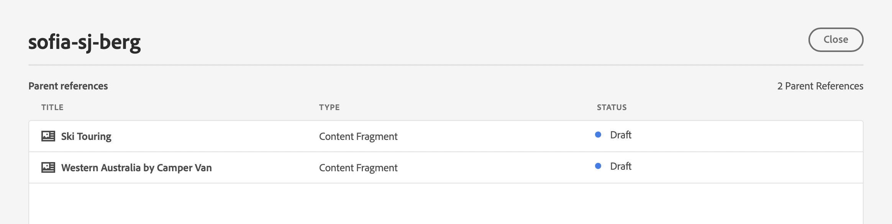
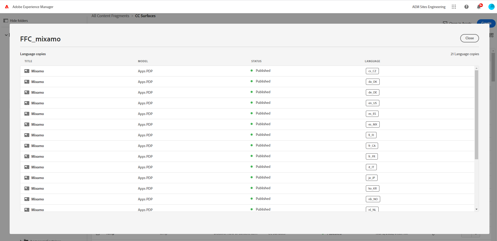

# Konsol för innehållsfragment  {#content-fragments-console}

Lär dig hur konsolen Innehållsfragment optimerar åtkomsten till dina innehållsfragment så att du kan skapa, söka efter och hantera dem genom att vidta administrativa åtgärder som publicera, avpublicera, kopiera.

Konsolen Innehållsfragment är avsedd för hantering, sökning och skapande av innehållsfragment. Den har optimerats för användning i ett Headless-sammanhang, men används även när innehållsfragment skapas för att användas vid sidredigering.

>[!NOTE]
>
>Den här konsolen visar bara innehållsfragment. Den visar inte andra resurstyper, t.ex. bilder och videoklipp.

>[!NOTE]
>
>Du kan få åtkomst till dina innehållsfragment via:
>
>* this **Innehållsfragment** konsol
>* den **Resurser** konsol - se [Hantera innehållsfragment](/help/assets/content-fragments/content-fragments-managing.md)

>[!NOTE]
>
>Ett urval av [kortkommandon är tillgängliga för användning i den här konsolen](/help/sites-cloud/administering/content-fragments/content-fragments-console-keyboard-shortcuts.md).

>[!NOTE]
>
>Ditt projektteam kan anpassa konsolen om det behövs. Se [Anpassa konsolen för innehållsfragment](/help/implementing/developing/extending/content-fragment-console-customizing.md) för mer information.

Konsolen för innehållsfragment kan nås direkt från den översta nivån i Global Navigation:

## Konsolens grundläggande struktur och hantering {#basic-structure-handling-content-fragments-console}

Markera **Innehållsfragment** öppnar konsolen på en ny flik.

Här ser du att det finns tre huvudområden:

* Det övre verktygsfältet
   * Tillhandahåller AEM
   * Visar även din IMS-organisation
* Den vänstra panelen
   * Här kan du dölja, eller visa, mappträdet
   * Du kan välja en viss gren av trädet
* Panelen main/right - härifrån kan du:
   * Se listan med alla innehållsfragment i den markerade grenen i trädet:
      * Platsen anges av vägbeskrivningarna. dessa kan också användas för att ändra platsen
      * Innehållsfragment från den markerade mappen och alla underordnade mappar visas:
         * [Olika informationsområden](#selectuse-available-columns) om ett innehållsfragment som innehåller länkar, Beroende på vilket fält det gäller kan dessa:
            * Öppna rätt fragment i redigeraren
            * Visa information om referenser
            * Visa information om språkversioner av fragmentet
         * Du kan [markera ett eller flera innehållsfragment för att visa tillgängliga åtgärder](#actions-selected-content-fragment)
      * Du kan välja en kolumnrubrik för att sortera tabellen efter den kolumnen; välj igen om du vill växla mellan stigande och fallande. För närvarande stöds sortering på **Titel**, **Ändrad** och **Ändrad av** kolumner.
   * **[Skapa](#creating-new-content-fragment)** ett nytt innehållsfragment
   * [Filter](#filtering-fragments) innehållsfragment enligt ett urval predikatmallar och spara filtret för framtida bruk
   * [Sök](#searching-fragments) innehållsfragment
   * [Anpassa tabellvyn så att markerade informationskolumner visas](#select-available-columns)
   * Använd **Öppna i resurser** om du vill öppna den aktuella platsen direkt i **Resurser** konsol

      >[!NOTE]
      >
      >The **Resurser** konsolen används för att komma åt resurser, som bilder, videor osv.  Konsolen kan nås:
      >
      >* med **Öppna i resurser** link (in the Content Fragments console)
      >* direkt från den globala navigeringsrutan

## Åtgärder för ett (markerat) innehållsfragment {#actions-selected-content-fragment}

Om du väljer ett visst fragment öppnas ett verktygsfält som fokuserar på de åtgärder som är tillgängliga för det fragmentet. Du kan också markera flera fragment. Markeringen av funktionsmakron justeras därefter.

* **Öppna**
* **Publicera** (och **Avpublicera**)
* **Kopiera**
* **Flytta**
* **Byt namn**
* **Ta bort**

>[!NOTE]
>
>Åtgärder som Publicera, Avpublicera, Ta bort, Flytta, Byt namn, Kopiera, utlöser ett asynkront jobb. Jobbets förlopp kan övervakas via gränssnittet AEM asynkrona jobb.

## Information om dina innehållsfragment {#information-content-fragments}

Huvudpanelen/den högra panelen (tabellvyn) i konsolen innehåller en rad information om dina innehållsfragment. Vissa objekt har också direkta länkar till ytterligare åtgärder och/eller information:

* **Namn**
   * Tillhandahåller en länk för att öppna fragmentet i redigeraren.
* **Modell**
   * Tillhandahåller en länk för att öppna fragmentet i redigeraren.
* **Mapp**
   * Tillhandahåller en länk för att öppna mappen i konsolen.
Vid hovring över mappnamnet visas JCR-sökvägen.
* **Status**
   * Endast information
* **Ändrad**
   * Endast information
* **Ändrad av**
   * Endast information
* **Publicerad den**
   * Endast information
* **Publicerat av**
   * Endast information
* **Refererad av**

   * Tillhandahåller en länk som öppnar en dialogruta med alla överordnade referenser till det fragmentet. inklusive referenser till innehållsfragment, upplevelsefragment och sidor. Om du vill öppna en viss referens klickar du på **Titel** i dialogrutan.

      

* **Språk**

   * Anger språket för innehållsfragmentet tillsammans med det totala antalet språk/språkkopior som är associerade med innehållsfragmentet.

      

      * Klicka/tryck på antalet för att öppna en dialogruta som visar alla språkkopior. Om du vill öppna en viss språkkopia klickar du på **Titel** i dialogrutan.

         

## Välj tillgängliga kolumner {#select-available-columns}

Precis som med andra konsoler kan du konfigurera de kolumner som är synliga och tillgängliga för åtgärder:

Här visas en lista med kolumner som du kan dölja eller visa:

## Skapa ett nytt innehållsfragment {#creating-new-content-fragment}

Markera **Skapa** öppnar komprimeringen **Nytt innehållsfragment** dialog:

## Filtrera fragment {#filtering-fragments}

På panelen Filter finns:

* ett urval av predikat som kan markeras och kombineras
* möjlighet att **Spara** din konfiguration
* alternativet att hämta ett sparat sökfilter för återanvändning

## Söka efter fragment {#searching-fragments}

I sökrutan går det att söka i heltext. Ange dina söktermer i sökrutan:

Ger de valda resultaten:

I sökrutan kan du även snabbt komma åt **Senaste innehållsfragment** och **Sparade sökningar**:

