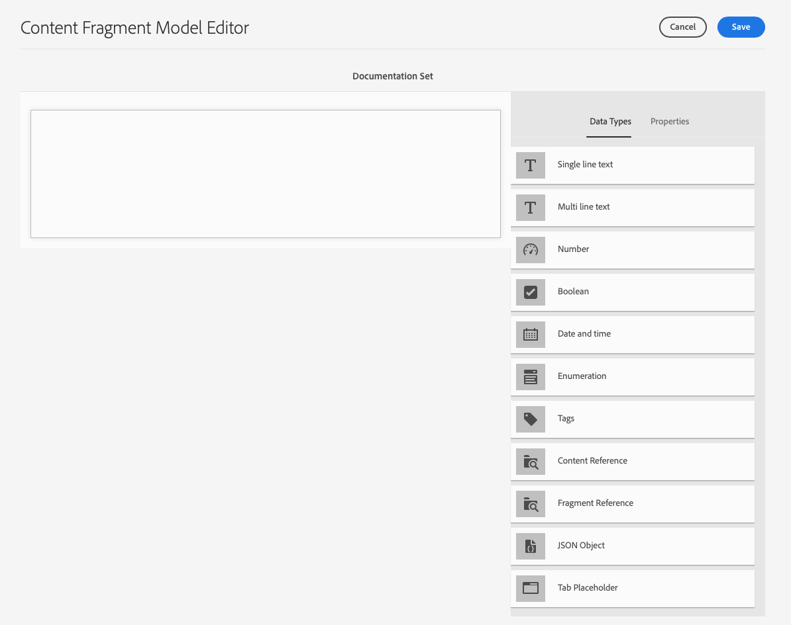
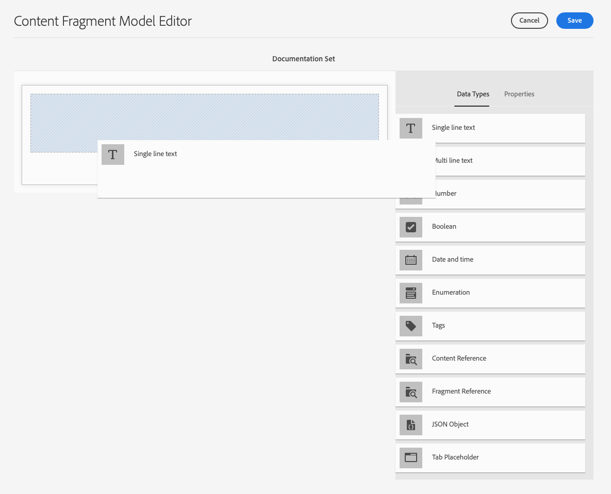
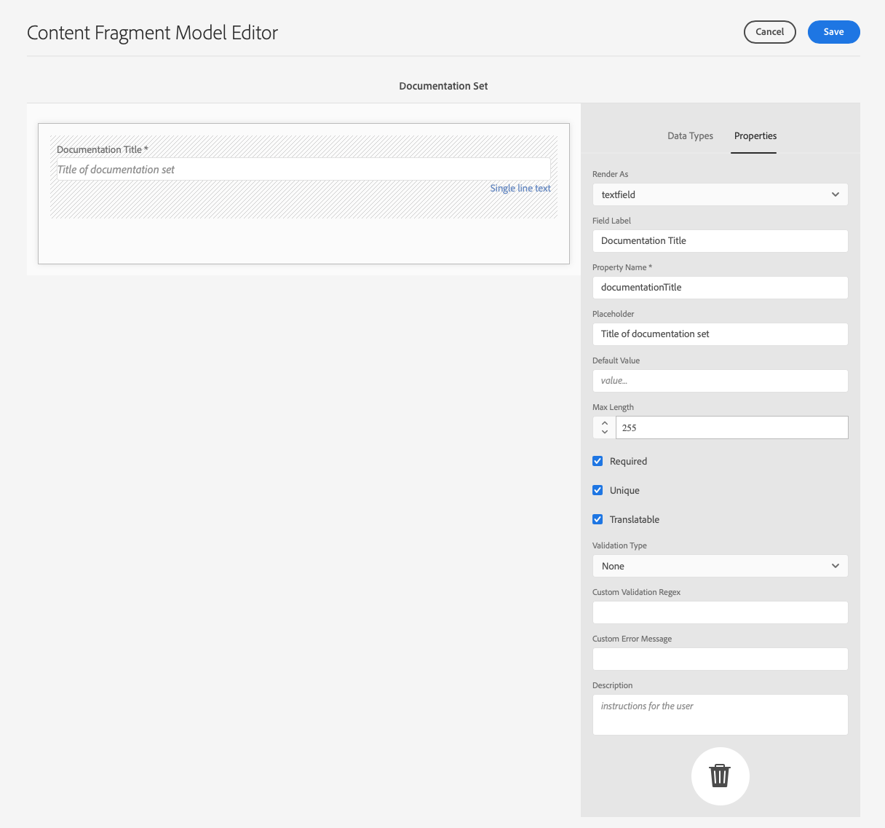
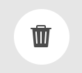
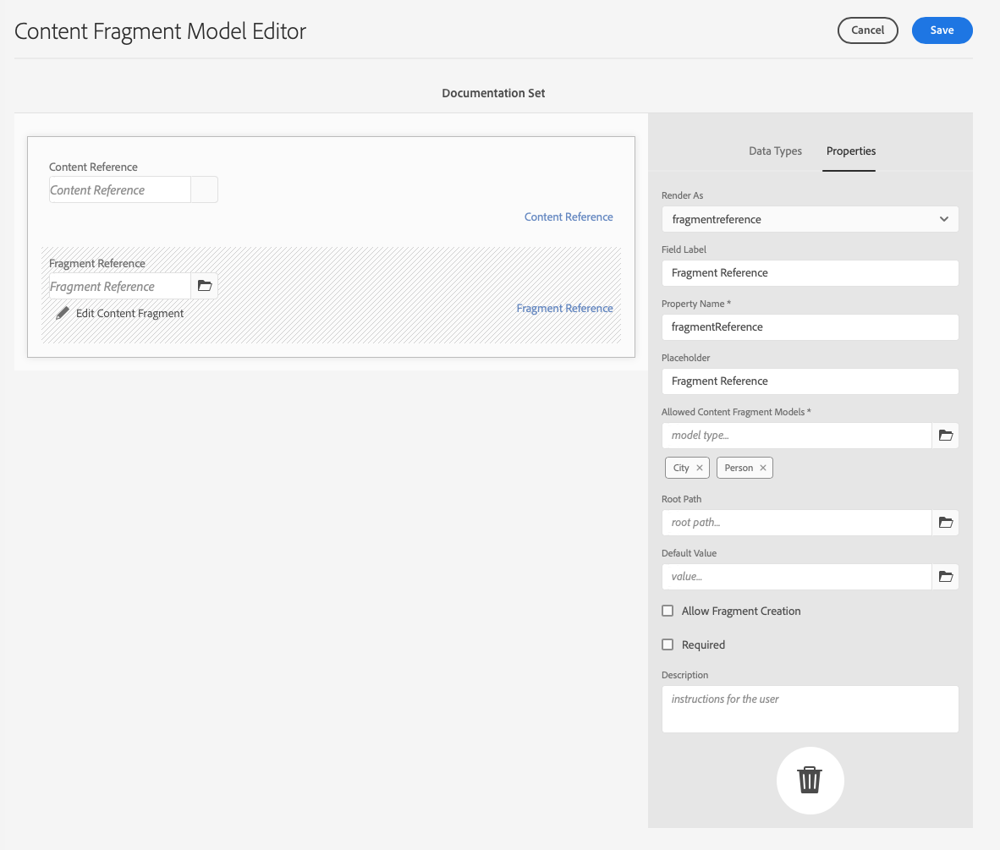
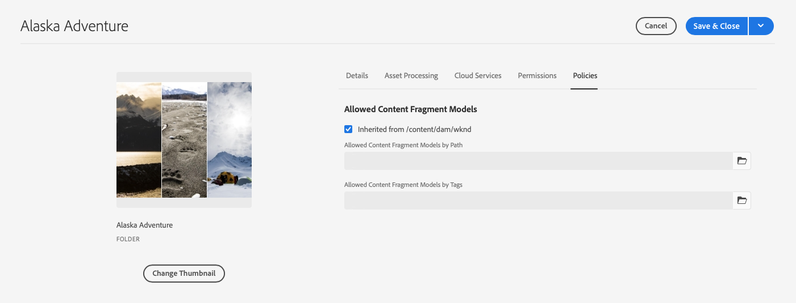

# Modeller för innehållsfragment {#content-fragment-models}

Content Fragment Models in AEM define the structure for the content of your [innehållsfragment](/help/sites-cloud/administering/content-fragments/content-fragments.md). Dessa kan användas för att skapa sidor eller som grund för ditt headless-innehåll.

Så här använder du modeller för innehållsfragment:

1. [Aktivera funktionen Content Fragment Model för instansen](/help/sites-cloud/administering/content-fragments/content-fragments-configuration-browser.md)
1. [Skapa](#creating-a-content-fragment-model)och [konfigurera](#defining-your-content-fragment-model), era modeller för innehållsfragment
1. [Aktivera modeller för innehållsfragment](#enabling-disabling-a-content-fragment-model) för användning när du skapar innehållsfragment
1. [Tillåt dina modeller för innehållsfragment i de resursmappar som krävs](#allowing-content-fragment-models-assets-folder) efter konfiguration **Profiler**.

## Skapa en innehållsfragmentmodell {#creating-a-content-fragment-model}

1. Navigera till **verktyg**, **Allmänt**&#x200B;öppna **Modeller för innehållsfragment**.
1. Navigera till den mapp som passar dina [konfiguration eller underkonfiguration](/help/sites-cloud/administering/content-fragments/content-fragments-configuration-browser.md).
1. Använd **Skapa** för att öppna guiden.

   >[!CAUTION]
   >
   >Om [användning av innehållsfragmentmodeller inte har aktiverats](/help/sites-cloud/administering/content-fragments/content-fragments-configuration-browser.md), **Skapa** kommer inte att vara tillgängligt.

1. Ange **modelltitel**. Du kan också lägga till **Taggar**, a **Beskrivning** och markera **Aktivera modell** till [aktivera modellen](#enabling-disabling-a-content-fragment-model) vid behov.

   

1. Använd **Skapa** för att spara den tomma modellen. Ett meddelande visar att åtgärden lyckades. Du kan välja **Öppna** för att omedelbart redigera modellen, eller **Klar** för att återgå till konsolen.

## Definiera innehållsfragmentmodellen {#defining-your-content-fragment-model}

Modellen för innehållsfragment definierar effektivt strukturen för de resulterande innehållsfragmenten med hjälp av en markering av **[Datatyper](#data-types)**. Med modellredigeraren kan du lägga till instanser av datatyperna och sedan konfigurera dem för att skapa de obligatoriska fälten:

>[!CAUTION]
>
>Om du redigerar en befintlig innehållsfragmentmodell kan det påverka beroende fragment.

1. Navigera till **verktyg**, **Allmänt**&#x200B;öppna **Modeller för innehållsfragment**.

1. Navigera till mappen som innehåller innehållsfragmentmodellen.
1. Öppna den modell som krävs för **Redigera**; använd snabbåtgärden eller välj modell och sedan åtgärden från verktygsfältet.

   När du har öppnat modellredigeraren visas följande:

   * vänster: fält har redan definierats
   * höger: **Datatyper** som är tillgängliga för att skapa fält (och **egenskaper** som kan användas när fälten har skapats)

   >[!NOTE]
   >
   >När ett fält är **Obligatoriskt**, **Etikett** som anges i den vänstra rutan markeras med ett asterix (**&#42;**).



1. **Lägga till ett fält**

   * Dra en obligatorisk datatyp till önskad plats för ett fält:

      

   * När ett fält har lagts till i modellen visas den högra panelen **Egenskaper** som kan definieras för den aktuella datatypen. Här definierar du vad som krävs för fältet.

      * Många egenskaper är självförklarande, mer information finns i [Egenskaper](#properties).
      * Skriva ett **Fältetikett** kommer att slutföra **Egenskapsnamn**  - om den är tom, och sedan kan den uppdateras manuellt.

         >[!CAUTION]
         >
         >När egenskapen uppdateras manuellt **Egenskapsnamn** för en datatyp, observera att namn bara får innehålla A-Z, a-z, 0-9 och understreck &quot;_&quot; som specialtecken.
         >
         >Om modeller som skapats i tidigare versioner av AEM innehåller ogiltiga tecken tar du bort eller uppdaterar dessa tecken.
      Till exempel:

      


1. **Ta bort ett fält**

   Markera det obligatoriska fältet och klicka/tryck sedan på papperskorgsikonen. Du ombeds bekräfta åtgärden.

   

1. Lägg till alla obligatoriska fält och definiera de relaterade egenskaperna efter behov. Till exempel:

   

1. Välj **Spara** för att behålla definitionen.

## Datatyper {#data-types}

Det finns ett urval datatyper som du kan använda för att definiera din modell:

* **Enkelradig text**
   * Lägg till ett eller flera fält på en textrad, maxlängden kan definieras
* **Flerradstext**
   * Ett textområde som kan vara RTF, Oformaterad text eller Markering
* **Siffra**
   * Lägg till ett eller flera numeriska fält
* **Boolesk**
   * Lägg till en boolesk kryssruta
* **Datum och tid**
   * Lägg till ett datum och/eller en tid
* **Uppräkning**
   * Lägga till en uppsättning kryssrutor, alternativknappar eller listrutefält
* **Taggar**
   * Tillåter fragmentförfattare att komma åt och markera taggområden
* **Innehållsreferens**
   * Hänvisningar till annat innehåll, oavsett typ. kan användas till [skapa kapslat innehåll](#using-references-to-form-nested-content)
   * Om det finns referenser till en bild kan du välja att visa en miniatyrbild
* **Fragmentreferens**
   * Hänvisar till andra innehållsfragment. kan användas till [skapa kapslat innehåll](#using-references-to-form-nested-content)
   * Datatypen kan konfigureras så att fragmentförfattare kan:
      * Redigera det refererade fragmentet direkt.
      * Skapa ett nytt innehållsfragment, baserat på lämplig modell
* **JSON-objekt**
   * Gör att innehållsfragmentets författare kan ange JSON-syntax i motsvarande element i ett fragment.
      * För att AEM ska kunna lagra direkt JSON som du har kopierat/klistrat in från en annan tjänst.
      * JSON skickas vidare och skrivs ut som JSON i GraphQL.
      * Innehåller JSON-syntaxmarkering, automatisk komplettering och felmarkering i innehållsfragmentredigeraren.
* **Platshållare för flik**
   * Tillåter introduktion av flikar som kan användas när innehållet i innehållsfragmentet redigeras.
Detta visas som en avgränsare i modellredigeraren, som avgränsar avsnitt i listan med innehållsdatatyper. Varje instans representerar början på en ny flik.
I fragmentredigeraren visas varje instans som en flik.

      >[!NOTE]
      >
      >Den här datatypen används endast för formatering, den ignoreras av det AEM GraphQL-schemat.

## Egenskaper {#properties}

Många egenskaper är självförklarande, för vissa egenskaper finns ytterligare information nedan:

* **Egenskapsnamn**

   Observera följande namn när du uppdaterar den här egenskapen manuellt för en datatyp **måste** innehåller *endast* A-Z, a-z, 0-9 och understreck &quot;_&quot; som specialtecken.

   >[!CAUTION]
   >
   >Om modeller som skapats i tidigare versioner av AEM innehåller ogiltiga tecken tar du bort eller uppdaterar dessa tecken.

* **Återge som**
De olika alternativen för att realisera/återge fältet i ett fragment. Detta gör ofta att du kan ange om författaren ska se en enda instans av fältet eller om den ska kunna skapa flera instanser.

* **Fältetikett**
Ange en 
**Fältetikett** genererar automatiskt en **Egenskapsnamn** som sedan kan uppdateras manuellt vid behov.

* **Validering**
Grundläggande validering är tillgängligt via funktioner som **Obligatoriskt** -egenskap. Vissa datatyper har ytterligare valideringsfält. Se [Validering](#validation) för mer information.

* För datatypen **Flerradig text** går det att definiera **standardtypen** som endera:

   * **RTF-text**
   * **Markdown**
   * **Oformaterad text**

   Om inget anges används standardvärdet **RTF** används för det här fältet.

   Om du ändrar **standardtypen** i en innehållsfragmentmodell börjar detta bara gälla för ett befintligt, relaterat innehållsfragment efter att fragmentet har öppnats i redigeraren och sparats.

* **Unik**
Innehållet (för det specifika fältet) måste vara unikt för alla innehållsfragment som skapas från den aktuella modellen.

   Detta används för att säkerställa att innehållsförfattare inte kan upprepa innehåll som redan har lagts till i ett annat fragment av samma modell.

   Till exempel en **Enkelradig text** fältet anropades `Country` i Content Fragment Model får inte ha värdet `Japan` i två beroende innehållsfragment. En varning kommer att skickas när ett försök görs att utföra den andra instansen.

   >[!NOTE]
   >
   >Unikitet säkerställs per språkrot.

   >[!NOTE]
   >
   >Variationer kan ha samma *unik* som variationer av samma fragment, men inte samma värde som används i andra variationer av fragment.

* Se **[Innehållsreferens](#content-reference)** om du vill ha mer information om den specifika datatypen och dess egenskaper.

* Se **[Fragmentreferens (kapslade fragment)](#fragment-reference-nested-fragments)** om du vill ha mer information om den specifika datatypen och dess egenskaper.

* **Översättningsbar**

   Kontrollerar **Översättningsbar** kryssrutan för ett fält i redigeraren för innehållsfragmentmodellen:

   * Kontrollera att fältets egenskapsnamn har lagts till i översättningskonfigurationen, kontexten `/content/dam/<sites-configuration>`, om det inte redan finns.
   * För GraphQL: ange en `<translatable>` egenskapen i fältet Innehållsfragment till `yes`, för att tillåta GraphQL-frågefilter för JSON-utdata med endast översättningsbart innehåll.

## Validering {#validation}

Olika datatyper kan nu definiera valideringskrav för när innehåll anges i det resulterande fragmentet:

* **Enkelradig text**
   * Jämför med ett fördefinierat regex.
* **Siffra**
   * Kontrollera om det finns specifika värden.
* **Innehållsreferens**
   * Testa för specifika typer av innehåll.
   * Det går endast att referera till resurser med en angiven filstorlek eller mindre.
   * Det går endast att referera till bilder inom ett fördefinierat intervall med bredd och/eller höjd (i pixlar).
* **Fragmentreferens**
   * Testa om det finns en specifik innehållsfragmentmodell.

## Använda referenser till kapslat innehåll {#using-references-to-form-nested-content}

Innehållsfragment kan skapa kapslat innehåll med någon av följande datatyper:

* **[Innehållsreferens](#content-reference)**
   * ger en enkel referens till annat innehåll, av alla typer.
   * Kan konfigureras för en eller flera referenser (i det resulterande fragmentet).

* **[Fragmentreferens](#fragment-reference-nested-fragments)** (Kapslade fragment)
   * Refererar till andra fragment, beroende på vilka specifika modeller som anges.
   * Gör att du kan ta med/hämta strukturerade data.

      >[!NOTE]
      >
      >Denna metod är av särskilt intresse i kombination med [Headless Content Delivery using Content Fragments with GraphQL](/help/sites-cloud/administering/content-fragments/content-fragments-graphql.md).
   * Kan konfigureras för en eller flera referenser (i det resulterande fragmentet).

>[!NOTE]
>
>AEM har ett upprepningsskydd för:
>
>* Innehållsreferenser
   >  Detta förhindrar att användaren lägger till en referens till det aktuella fragmentet. Detta kan leda till en tom dialogruta för fragmentreferensväljaren.
>
>* Fragmentreferenser i GraphQL
   >  Om du skapar en djup fråga som returnerar flera innehållsfragment som refereras av varandra, returneras null vid den första förekomsten.


### Innehållsreferens {#content-reference}

Med innehållsreferensen kan du återge innehåll från en annan källa; till exempel bild- eller innehållsfragment.

Förutom standardegenskaper kan du ange:

* The **Rotsökväg** för refererat innehåll
* De innehållstyper som kan refereras
* Begränsningar för filstorlekar
* Om det refereras till en bild:
   * Visa miniatyrbild
   * Bildbegränsningar för höjd och bredd


### Fragmentreferens (kapslade fragment) {#fragment-reference-nested-fragments}

Fragmentreferensen refererar till ett eller flera innehållsfragment. Den här funktionen är särskilt intressant när du hämtar innehåll som ska användas i appen, eftersom den gör det möjligt att hämta strukturerade data med flera lager.

Till exempel:

* En modell som definierar detaljer för en anställd. bland annat följande:
   * En referens till modellen som definierar arbetsgivaren (företaget)

```xml
type EmployeeModel {
    name: String
    firstName: String
    company: CompanyModel
}

type CompanyModel {
    name: String
    street: String
    city: String
}
```

>[!NOTE]
>
>Detta är av särskilt intresse i kombination med [Headless Content Delivery using Content Fragments with GraphQL](/help/sites-cloud/administering/content-fragments/content-fragments-graphql.md).

Förutom standardegenskaper kan du definiera:

* **Återge som**:

   * **multifält** - fragmentförfattaren kan skapa flera, enskilda, referenser

   * **fragmentreferens** - låter fragmentförfattaren välja en enskild referens till ett fragment

* **Modelltyp**
Du kan välja flera modeller. När du redigerar innehållsfragmentet måste alla refererade fragment ha skapats med dessa modeller.

* **Rotsökväg**
Detta anger en rotsökväg för alla fragment som refereras.

* **Tillåt skapande av fragment**

   Detta gör att fragmentförfattaren kan skapa ett nytt fragment baserat på lämplig modell.

   * **fragmentreferencecomposite** - låter fragmentförfattaren skapa en sammansatt bild genom att markera flera fragment

   

>[!NOTE]
>
>Det finns en mekanism för återkommande skydd. Användaren kan inte välja det aktuella innehållsfragmentet i fragmentreferensen. Detta kan leda till en tom dialogruta för fragmentreferensväljaren.
>
>Det finns också ett upprepningsskydd för fragmentreferenser i GraphQL. Om du skapar en djup fråga i två innehållsfragment som refererar till varandra returneras null.

## Content Fragment Model - egenskaper {#content-fragment-model-properties}

Du kan redigera **Egenskaper** för en innehållsfragmentmodell:

* **Grundläggande**
   * **Modelltitel**
   * **Taggar**
   * **Beskrivning**
   * **Överför bild**

## Aktivera eller inaktivera en innehållsfragmentmodell {#enabling-disabling-a-content-fragment-model}

För fullständig kontroll över användningen av dina modeller för innehållsfragment har de en status som du kan ange.

### Aktivera en innehållsfragmentmodell {#enabling-a-content-fragment-model}

När en modell har skapats måste den aktiveras så att den:

* Kan markeras när du skapar ett nytt innehållsfragment.
* Kan refereras inifrån en Content Fragment-modell.
* är tillgängligt för GraphQL, så att schemat genereras.

Så här aktiverar du en modell som har flaggats som antingen:

* **Utkast** : mew (aldrig aktiverad).
* **Handikappade** : har specifikt inaktiverats.

Du använder **Aktivera** från antingen

* Det övre verktygsfältet när den obligatoriska modellen är markerad.
* Motsvarande snabbåtgärd (mouse-over the required Model).


### Inaktivera en innehållsfragmentmodell {#disabling-a-content-fragment-model}

En modell kan också inaktiveras så att:

* Modellen är inte längre tillgänglig som grund för att skapa *new* Innehållsfragment.
* Men:
   * GraphQL-schemat fortsätter att genereras och är fortfarande frågningsbart (för att inte påverka JSON API).
   * Alla innehållsfragment som är baserade på modellen kan fortfarande efterfrågas och returneras från GraphQL slutpunkt.
* Det går inte att referera till modellen längre, men befintliga referenser behålls orörda och kan fortfarande läsas och returneras från GraphQL-slutpunkten.

Inaktivera en modell som är flaggad som **Aktiverad** du använder **Inaktivera** från antingen

* Det övre verktygsfältet när den obligatoriska modellen är markerad.
* Motsvarande snabbåtgärd (mouse-over the required Model).


## Tillåt modeller för innehållsfragment i resursmappen {#allowing-content-fragment-models-assets-folder}

Om du vill implementera innehållsstyrning kan du konfigurera **Profiler** i resursmappen för att kontrollera vilka innehållsfragmentmodeller som tillåts för att skapa fragment i den mappen.

>[!NOTE]
>
>Mekanismen liknar [tillåta sidmallar](/help/sites-cloud/authoring/features/templates.md#allowing-a-template-author) för en sida och dess underordnade sidor i avancerade egenskaper för en sida.

Så här konfigurerar du **Profiler** for **Tillåtna modeller för innehållsfragment**:

1. Navigera och öppna **Egenskaper** för mappen Resurser.

1. Öppna **Profiler** där du kan konfigurera:

   * **Ärvs från`<folder>`**

      Profiler ärvs automatiskt när nya underordnade mappar skapas; principen kan konfigureras om (och arvet brytas) om undermapparna måste tillåta modeller som skiljer sig från den överordnade mappen.

   * **Tillåtna modeller för innehållsfragment efter sökväg**

      Flera modeller kan tillåtas.

   * **Tillåtna modeller för innehållsfragment efter tagg**

      Flera modeller kan tillåtas.
   

1. **Spara** eventuella ändringar.

De Content Fragment-modeller som tillåts för en mapp löses enligt följande:
* The **Profiler** for **Tillåtna modeller för innehållsfragment**.
* Om den är tom kan du försöka identifiera principen med arvsreglerna.
* Om arvskedjan inte ger något resultat kan du titta på **Cloud Services** -konfiguration för den mappen (först direkt och sedan via arv).
* Om inget av ovanstående ger några resultat finns det inga tillåtna modeller för den mappen.

## Ta bort en innehållsfragmentmodell {#deleting-a-content-fragment-model}

>[!CAUTION]
>
>Om du tar bort en innehållsfragmentmodell kan det påverka beroende fragment.

Så här tar du bort en innehållsfragmentmodell:

1. Navigera till **verktyg**, **Allmänt**&#x200B;öppna **Modeller för innehållsfragment**.

1. Navigera till mappen som innehåller innehållsfragmentmodellen.
1. Välj modell, följt av **Ta bort** i verktygsfältet.

   >[!NOTE]
   >
   >Om det refereras till modellen visas en varning. Vidta lämpliga åtgärder.

## Publicera en innehållsfragmentmodell {#publishing-a-content-fragment-model}

Modeller för innehållsfragment måste publiceras när/innan beroende innehållsfragment publiceras.

Så här publicerar du en innehållsfragmentmodell:

1. Navigera till **verktyg**, **Allmänt**&#x200B;öppna **Modeller för innehållsfragment**.

1. Navigera till mappen som innehåller innehållsfragmentmodellen.
1. Välj modell, följt av **Publicera** i verktygsfältet.
Publiceringsstatusen anges i konsolen.

   >[!NOTE]
   >
   >Om du publicerar ett innehållsfragment för vilket modellen ännu inte har publicerats, visas detta i en urvalslista och modellen publiceras med fragmentet.

## Avpublicera en innehållsfragmentmodell {#unpublishing-a-content-fragment-model}

Modeller för innehållsfragment kan avpubliceras om de inte refereras av några fragment.

Så här avpublicerar du en innehållsfragmentmodell:

1. Navigera till **verktyg**, **Allmänt**&#x200B;öppna **Modeller för innehållsfragment**.

1. Navigera till mappen som innehåller innehållsfragmentmodellen.
1. Välj modell, följt av **Avpublicera** i verktygsfältet.
Publiceringsstatusen anges i konsolen.

Om du försöker avpublicera en modell som för närvarande används av ett eller flera fragment visas en felvarning om detta:


Meddelandet föreslår att du kontrollerar [Referenser](/help/sites-cloud/authoring/getting-started/basic-handling.md#references) panel för vidare utredning:


## Låsta (publicerade) modeller för innehållsfragment {#locked-published-content-fragment-models}

Den här funktionen tillhandahåller styrning för publicerade modeller för innehållsfragment.

### Utmaningen {#the-challenge}

* Content Fragment Models bestämmer schemat för GraphQL-frågor i AEM.

   * AEM GraphQL-scheman skapas så snart en innehållsfragmentmodell skapas, och de kan finnas både i författar- och publiceringsmiljöer.

   * Publiceringsscheman är de viktigaste eftersom de utgör grunden för leverans av innehåll i innehållsfragment i JSON-format.

* Problem kan uppstå när modeller för innehållsfragment ändras, eller med andra ord redigeras. Det innebär att schemat ändras, vilket i sin tur kan påverka befintliga GraphQL-frågor.

* Att lägga till nya fält i en innehållsfragmentmodell bör (vanligtvis) inte ha några skadliga effekter. Om du ändrar befintliga datafält (t.ex. namn) eller tar bort fältdefinitioner kommer befintliga GraphQL-frågor att brytas när de begär dessa fält.

### Krav {#the-requirements}

* Att göra användarna medvetna om riskerna vid redigering av modeller som redan används för leverans av direktsänt innehåll, med andra ord, publicerade modeller).

* För att undvika oönskade ändringar.

Någon av dessa kan göra att frågor bryts om de ändrade modellerna publiceras på nytt.

### Lösningen {#the-solution}

För att åtgärda dessa problem finns följande modeller för innehållsfragment: *låst* i läget SKRIVSKYDDAD vid författare - så snart de har publicerats. Detta anges av **Låst**:


När modellen är **Låst** (i läget SKRIVSKYDDAD) kan du se innehållet i och strukturen på modeller, men du kan inte redigera dem.

Du kan hantera **Låst** modeller från antingen konsolen eller modellredigeraren:

* Konsol

   I konsolen kan du hantera skrivskyddat läge med **Lås upp** och **Lås** funktionsmakron i verktygsfältet:

   

   * Du kan **Lås upp** en modell som aktiverar redigering.

      Om du väljer **Lås upp** en varning visas och du måste bekräfta **Lås upp** åtgärd:
      

      Du kan sedan öppna modellen för redigering.

   * Du kan också **Lås** modellen efteråt.
   * Om modellen publiceras på nytt kommer den omedelbart att användas igen **Låst** (SKRIVSKYDDAT) läge.

* Modellredigerare

   * När du öppnar en låst modell får du en varning och tre åtgärder: **Avbryt**, **Visa skrivskyddad**, **Redigera**:

      

   * Om du väljer **Visa skrivskyddad** du kan se modellens innehåll och struktur:

      

   * Om du väljer **Redigera** kan du redigera och spara dina uppdateringar:

      

      >[!NOTE]
      >
      >Det kan fortfarande finnas en varning överst, men det är när modellen redan används av befintliga innehållsfragment.

   * **Avbryt** kommer du tillbaka till konsolen.
