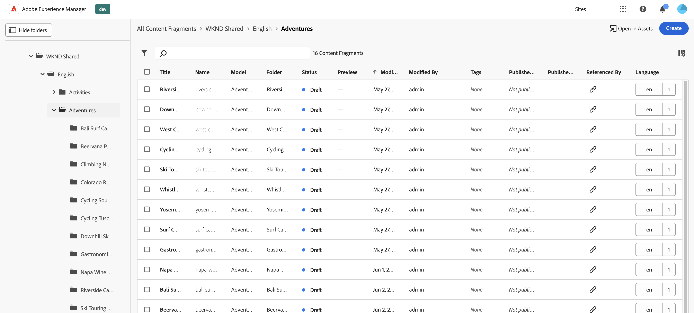
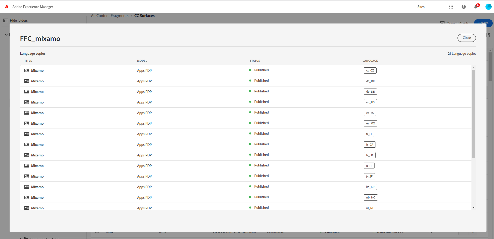
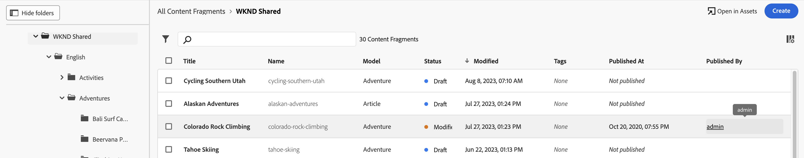

# Hantera innehållsfragment {#managing-content-fragments}

Lär dig hantera dina **Innehållsfragment** i Adobe Experience Manager (AEM) as a Cloud Service från [Konsol för innehållsfragment](#content-fragments-console)och [Innehållsfragmentsredigerare](/help/sites-cloud/administering/content-fragments/authoring.md#content-fragment-editor). Dessa innehållsfragment kan användas som bas för rubrikfritt innehåll eller för att skapa sidor.

>[!NOTE]
>
>Ditt projektteam kan anpassa konsolen och redigeraren om det behövs. Se [Anpassa konsolen och redigeraren för innehållsfragment](/help/implementing/developing/extending/content-fragments-console-and-editor.md) för mer information.

När du har definierat [Modeller för innehållsfragment](#creating-a-content-model) kan du använda dessa för att:

* [Skapa dina innehållsfragment](#creating-a-content-fragment).
* Öppna sedan [Innehållsfragmentsredigerare](#opening-the-fragment-editor) till [skapa ditt innehåll och hantera dina variationer](#editing-the-content-of-your-fragment).
* [Hantera taggar](#manage-tags)
* [Visa och redigera egenskaperna (metadata)](#viewing-and-editing-properties)
* [Visa strukturträdet](/help/sites-cloud/administering/content-fragments/authoring.md#structure-tree)

>[!NOTE]
>
>Innehållsfragment kan användas:
>
>* for [Headless Content Delivery using Content Fragments with GraphQL](/help/sites-cloud/administering/content-fragments/content-delivery-with-graphql.md),
>* när du redigerar sidor, se [Sidredigering med innehållsfragment](/help/sites-cloud/authoring/fundamentals/content-fragments.md).

>[!NOTE]
>
>Innehållsfragment lagras som **Resurser**. De hanteras huvudsakligen från **Innehållsfragment** konsolen, men kan även hanteras från [Resurser](/help/assets/content-fragments/content-fragments-managing.md) konsol.

## Konsolen Innehållsfragment {#content-fragments-console}

Konsolen Innehållsfragment är avsedd för hantering, sökning och skapande av innehållsfragment. Den har optimerats för användning i ett Headless-sammanhang, men används även när innehållsfragment skapas för att användas vid sidredigering.

Konsolen för innehållsfragment ger direktåtkomst till dina fragment och relaterade uppgifter. Konsolen kan nås direkt från den översta nivån i Global Navigation.

Mer information finns i:

* [Grundläggande struktur och hantering av konsolen för innehållsfragment](#basic-structure-handling-content-fragments-console)

* [Information om dina innehållsfragment](#information-content-fragments)

* [Åtgärder för ett innehållsfragment i konsolen för innehållsfragment](#actions-selected-content-fragment)

* [Markera kolumner som visas i konsolen](#select-columns-console)

* [Söka och filtrera i konsolen för innehållsfragment](#filtering-fragments)

* Ett urval av [kortkommandon](/help/sites-cloud/administering/content-fragments/keyboard-shortcuts.md) är tillgängliga för användning i den här konsolen

>[!NOTE]
>
>Den här konsolen visar bara innehållsfragment. Den visar inte andra resurstyper, t.ex. bilder och videoklipp.

>[!CAUTION]
>
>Konsolen är *endast* finns på Adobe Experience Manager-as a Cloud Service (AEM) online.

### Konsolens grundläggande struktur och hantering {#basic-structure-handling-content-fragments-console}

Markera **Innehållsfragment** öppnar konsolen på en ny flik.

Här ser du att det finns tre huvudområden:

* Det övre verktygsfältet
   * Tillhandahåller AEM
   * Visar även din IMS-organisation
   * Tillhandahåller olika [funktionsmakron](#actions-unselected)
* Den vänstra panelen
   * Här kan du dölja eller visa mappträdet
   * Du kan välja en viss gren av trädet
   * Storleken kan ändras så att kapslade mappar visas
* Den högra panelen - härifrån kan du:
   * Se listan med alla innehållsfragment i den markerade grenen i trädet:
      * Innehållsfragment från den markerade mappen och alla underordnade mappar visas:
         * Platsen anges av vägbeskrivningarna. Dessa kan även användas för att ändra platsen:
      * [Information visas om varje fragment](#information-content-fragments)
         * [Du kan välja vilka kolumner som ska visas](#select-columns-console)
      * [Olika informationsområden](#information-content-fragments) om ett innehållsfragment innehåller länkar. Beroende på fältet kan dessa:
         * Öppna rätt fragment i redigeraren
         * Visa information om referenser
         * Visa information om språkversioner av fragmentet
      * [Vissa andra informationsområden](#information-content-fragments) om ett innehållsfragment kan användas för [Snabb filtrering](#fast-filtering):
         * Markera ett värde i kolumnen och tillämpas omedelbart som ett filter
         * Snabb filtrering stöds för **Modell**, **Status**, **Ändrad av**, **Taggar** och **Publicerat av** kolumner.
      * Genom att använda musen på kolumnrubrikerna visas en listruta med åtgärdsväljare och breddreglage. Med dessa kan du:
         * Sortera - välj lämplig åtgärd för antingen stigande eller fallande Detta sorterar hela tabellen efter den kolumnen. Sortering är bara tillgängligt för lämpliga kolumner.
         * Ändra storlek på kolumnen med antingen funktionsmakrot eller breddreglagen
      * Markera ett eller flera fragment för ytterligare [åtgärd](#actions-selected-content-fragment)
   * Använd [Sök](#searching-fragments) box
   * Öppna [Panelen Filter](#filtering-fragments)

### Åtgärder {#actions}

I konsolen finns ett antal åtgärder som du kan använda, antingen direkt eller efter att du har valt ett visst fragment:

* Olika åtgärder är direkt [tillgänglig från konsolen](#actions-unselected)
* Du kan [markera ett eller flera innehållsfragment för att visa lämpliga åtgärder](#actions-selected-content-fragment)

#### Åtgärder (omarkerade) {#actions-unselected}

Vissa åtgärder är tillgängliga från konsolen - utan att du behöver välja ett visst innehållsfragment:

* **[Skapa](#creating-a-content-fragment)** ett nytt innehållsfragment
* [Filter](#filtering-fragments) innehållsfragment enligt ett urval predikatmallar och spara filtret för framtida bruk
* [Sök](#searching-fragments) innehållsfragment
* [Anpassa tabellvyn för att visa markerade kolumner med information](#select-columns-console)
* Använd **Öppna i resurser** om du vill öppna den aktuella platsen direkt i **Resurser** konsol

  >[!NOTE]
  >
  >The **Resurser** konsolen används för att komma åt resurser, som bilder, videor och så vidare.  Konsolen kan nås:
  >
  >* med **Öppna i resurser** link (in the Content Fragments console)
  >* direkt från **Navigering** fönster

#### Åtgärder för ett (markerat) innehållsfragment {#actions-selected-content-fragment}

Om du markerar ett visst fragment öppnas ett verktygsfält som fokuserar på de åtgärder som är tillgängliga för det fragmentet. Du kan också markera flera fragment. Markeringen av funktionsmakron justeras därefter.

* **[Öppna i ny redigerare](#editing-the-content-of-your-fragment)**
* **[Öppna](/help/assets/content-fragments/content-fragments-variations.md)** (i originalredigeraren)
* **[Publicera](#publishing-and-previewing-a-fragment)** (och **[Avpublicera](#unpublishing-a-fragment)**)
* **[Hantera taggar](#manage-tags)**
* **[Kopiera](/help/assets/manage-digital-assets.md)**
* **[Flytta](/help/assets/manage-digital-assets.md)**
* **[Byt namn](/help/assets/manage-digital-assets.md)**
* **[Ta bort](#deleting-a-fragment)**
* **[Ersätt](#find-and-replace)**

>[!NOTE]
>
>Använd **Öppna** för att öppna det markerade fragmentet i *original* redigerare.

>[!NOTE]
>
>Åtgärder som Publicera, Avpublicera, Ta bort, Flytta, Byt namn och Kopiera utlöser ett asynkront jobb. Jobbets förlopp kan övervakas via gränssnittet AEM asynkrona jobb.

### Information om dina innehållsfragment {#information-content-fragments}

Huvudpanelen/den högra panelen (tabellvyn) i konsolen innehåller en rad information om dina innehållsfragment. Vissa objekt har också direkta länkar till ytterligare åtgärder och/eller information:

* **Namn**
   * Tillhandahåller en länk för att öppna fragmentet i redigeraren.
* **Modell**
   * Endast information.
   * Kan användas för [Snabb filtrering](#fast-filtering)
* **Mapp**
   * Tillhandahåller en länk för att öppna mappen i konsolen.
Vid hovring över mappnamnet visas JCR-sökvägen.
* **Status**
   * Endast information.
   * Kan användas för [Snabb filtrering](#fast-filtering)
* **Förhandsgranska**
   * Endast information:
      * **Synkroniserad**: Innehållsfragmentet är synkroniserat på **Upphovsman** och **Förhandsgranska** tjänster.
      * **Slut på synkronisering**: Innehållsfragmentet är inte synkroniserat på **Upphovsman** och **Förhandsgranska** tjänster. Du måste **Publicera** till **Förhandsgranska** för att se till att de två instanserna är synkroniserade igen.
      * blank: Innehållsfragmentet finns inte på **Förhandsgranska** service.
* **Ändrad**
   * Endast information.
* **Ändrad av**
   * Endast information.
   * Kan användas för [Snabb filtrering](#fast-filtering).
* **Taggar**
   * Endast information.
   * Visar alla taggar som hör till innehållsfragmentet, både Main och alla variationer.
   * Kan användas för [Snabb filtrering](#fast-filtering).
* **Publicerad den**
   * Endast information.
* **Publicerat av**
   * Endast information.
   * Kan användas för [Snabb filtrering](#fast-filtering).
* **Refererad av**:
   * Tillhandahåller en länk som öppnar en dialogruta med alla [överordnade referenser](#parent-references-fragment)  av det fragmentet, inklusive referenser till innehållsfragment, upplevelsefragment och sidor. Om du vill öppna en viss referens klickar du på **Titel** i dialogrutan.

     

* **Språk**: visa alla [Språk](#language-copies-fragment) kopior

   * Anger språket för innehållsfragmentet tillsammans med det totala antalet lokala/lokala[Språk](#language-copies-fragment)  kopior som är associerade med innehållsfragmentet.

     

   * Välj antal för att öppna en dialogruta som visar alla språkkopior. Om du vill öppna en viss språkkopia klickar du på **Titel** i dialogrutan.

     

## Skapa innehållsfragment {#creating-content-fragments}

Innan du skapar ditt innehållsfragment måste den underliggande modellen för innehållsfragment skapas.

### Skapa en innehållsmodell {#creating-a-content-model}

[Modeller för innehållsfragment](/help/sites-cloud/administering/content-fragments/content-fragment-models.md) måste aktiveras och skapas innan du kan skapa innehållsfragment med strukturerat innehåll.

### Skapa ett innehållsfragment {#creating-a-content-fragment}

Så här skapar du ett innehållsfragment:

1. Från **Innehållsfragment** konsol, välj **Skapa** (överst till höger).

   >[!NOTE]
   >
   >Om du vill ha platsen för det nya fragmentet fördefinierad kan du navigera till mappen där du vill skapa fragmentet, eller ange platsen när du skapar fragmentet.

1. The **Nytt innehållsfragment** öppnas dialogrutan där du kan ange:

   * **Plats** - Kompletteras automatiskt med den aktuella platsen, men du kan välja en annan plats om det behövs.
   * **Content Fragment Model** - Välj den modell som ska användas som bas för fragmentet i listrutan.
   * **Titel**
   * **Namn** - Kompletteras automatiskt baserat på **Titel**, men du kan redigera den om det behövs.
   * **Beskrivning**

   

1. Välj **Skapa**, eller **Skapa och öppna** för att behålla din definition.

## Status för innehållsfragment {#statuses-content-fragments}

Under dess existens kan ett innehållsfragment ha flera statusvärden, vilket visas i [Konsol för innehållsfragment](/help/sites-cloud/administering/content-fragments/managing.md#content-fragments-console) och [Innehållsfragmentsredigerare](/help/sites-cloud/administering/content-fragments/authoring.md):

* **Nytt** (grå) Ett nytt innehållsfragment har skapats, men har inget innehåll som aldrig har redigerats, eller öppnats, i redigeraren för innehållsfragment.
* **Utkast** (blått) Någon har antingen redigerat eller öppnat (nytt) innehållsfragment i redigeraren för innehållsfragment - men det har ännu inte publicerats.
* **Publicerad** (grönt) Innehållsfragmentet har publicerats.
* **Ändrad** (orange) Innehållsfragmentet har redigerats efter att det publicerades (men innan ändringen publicerades).
* **Opublicerad** (rött) Innehållsfragmentet har avpublicerats.

## Redigera innehållet i fragmentet (och variationer) {#editing-the-content-of-your-fragment}

>[!IMPORTANT]
>
>Mer information finns här: [se Skapa innehållsfragment](/help/sites-cloud/administering/content-fragments/authoring.md)

Så här öppnar du fragmentet för redigering:

1. Använd **Innehållsfragment** för att navigera till platsen för ditt innehållsfragment.
1. Öppna fragmentet för redigering genom att markera fragmentet och sedan **Öppna i ny redigerare** i verktygsfältet.

1. Fragmentredigeraren öppnas. Välj önskat **Variation** Gör önskade ändringar (de sparas automatiskt):

   

## Visa och hantera taggar {#manage-tags}

På konsolen Innehållsfragment kan du visa alla använda taggar i **Taggar** kolumn, efter att ha säkerställt att [kolumnen visas](#select-columns-console).

### Hantera taggar (konsol) {#manage-tags-console}

Så här hanterar du taggar:

1. Navigera till konsolen Innehållsfragment.
1. Markera ett innehållsfragment.
1. Välj **Hantera taggar** i verktygsfältet.
1. Använd taggväljaren för att markera taggar som ska användas eller ta bort:

   

1. **Spara** uppdateringar. Du kommer nu tillbaka till konsolen.

### Visa och redigera, taggar (Editor) {#viewing-and-editing-tags}

Du kan också visa och redigera de taggar som har tillämpats på ett fragment med hjälp av [Egenskaper](/help/sites-cloud/administering/content-fragments/authoring.md) i redigeraren. Den information som visas skiljer sig åt mellan **Huvud** och **Variationer**.

## Visa och redigera, Egenskaper (Editor) {#viewing-and-editing-properties}

Du kan visa och redigera egenskaperna (metadata) för ett fragment med hjälp av [Egenskaper](/help/sites-cloud/administering/content-fragments/authoring.md) i redigeraren. Den information som visas skiljer sig åt mellan **Huvud** och **Variationer**.

## Publicera och förhandsgranska ett fragment {#publishing-and-previewing-a-fragment}

Du kan publicera dina innehållsfragment till:

* den **[Publiceringstjänst](/help/headless/deployment/architecture.md)** - för fullständig, offentlig åtkomst

* den **[Förhandsgranskningstjänst](/help/headless/deployment/architecture.md)** - förhandsgranska innehållet innan det är fullständigt tillgängligt

  >[!CAUTION]
  >
  >Publicera innehållsfragment till **Förhandsgranskningstjänst** är bara tillgängligt från konsolen för innehållsfragment, med **Publicera** åtgärd.

  >[!NOTE]
  >
  >Mer information om förhandsvisningsmiljöerna finns i:
  >
  >* [Hantera miljöer](/help/implementing/cloud-manager/manage-environments.md#access-preview-service)
  >* [Konfigurera OSGi-inställningar för förhandsgranskningsnivån](/help/implementing/preview-tier/preview-tier-configuring-osgi.md#configuring-osgi-settings-for-the-preview-tier)
  >* [Förhandsvisa felsökning med Developer Console](/help/implementing/preview-tier/preview-tier-configuring-osgi.md#debugging-preview-using-the-developer-console)

>[!CAUTION]
>
>Om fragmentet är baserat på en modell bör du se till att [modellen har publicerats](/help/sites-cloud/administering/content-fragments/content-fragment-models.md#publishing-a-content-fragment-model).
>
>Om du publicerar ett innehållsfragment för vilket modellen ännu inte har publicerats, visas detta i en urvalslista och modellen publiceras med fragmentet.

### Publicering {#publishing}

Du kan publicera dina innehållsfragment med **Publicera** från antingen

* verktygsfältet i [Konsol för innehållsfragment](#actions-selected-content-fragment)

   * Markera ett eller flera fragment i listan.

* verktygsfältet i [Redigera innehållsfragment](/help/sites-cloud/administering/content-fragments/authoring.md#content-fragment-editor)

När du har valt **Publicera** åtgärd:

1. Välj något av följande alternativ för att öppna rätt dialogruta:

   * **Nu** - välj antingen **Publiceringstjänst** eller **Förhandsgranskningstjänst**; efter bekräftelse publiceras fragmentet omedelbart
   * **Schema** - förutom den obligatoriska tjänsten kan du även välja datum och tid då fragmentet ska publiceras

1. Ange all information i dialogrutan. För en schemalagd publiceringsbegäran:

   

   >[!NOTE]
   >
   >Vid behov måste du ange vilka referenser som ska publiceras. Som standard publiceras referenser även till förhandsgranskningstjänsten för att säkerställa att det inte finns någon brytning i innehållet.

1. Bekräfta publiceringsåtgärden.

Efter publiceringen uppdateras fragmentets status och visas i redigeraren och konsolen. Om du har angett en schemalagd publikation visas information.

>[!NOTE]
>
>Dessutom när du [publicera en sida som använder fragmentet](/help/sites-cloud/authoring/fundamentals/content-fragments.md#publishing); fragmentet kommer att listas i sidreferenserna.

## Avpublicera ett fragment {#unpublishing-a-fragment}

Du kan avpublicera innehållsfragment:

* verktygsfältet i [Konsol för innehållsfragment](#actions-selected-content-fragment)

   * Markera ett eller flera fragment i listan.

* verktygsfältet i [Redigera innehållsfragment](/help/sites-cloud/administering/content-fragments/authoring.md#content-fragment-editor)

I båda fallen väljer du **Avpublicera** i verktygsfältet, följt av **Nu** eller **Schemalagd**.

När dialogrutan öppnas kan du välja rätt tjänst:

>[!NOTE]
>
>The **Avpublicera** åtgärden visas bara när publicerade fragment är tillgängliga.

>[!CAUTION]
>
>Om fragmentet redan refereras från ett annat fragment, eller från en sida, visas ett varningsmeddelande och du måste bekräfta att du vill fortsätta.

## Sök och ersätt {#find-and-replace}

The **Ersätt** (i det övre verktygsfältet) för att söka efter och ersätta angiven text i de valda innehållsfragmenten.

Innan du ersätter en produkt kontrolleras valideringskriterierna och du informeras om eventuella konflikter, så att du kan ändra ersättningssträngen eller bara ersätta de validerade instanserna.

>[!NOTE]
>
>Åtgärden Sök och ersätt kan bara utföras på högst 20 markerade innehållsfragment (i taget).
>
>Om du markerar fler än 20 innehållsfragment visas meddelandet **Det går inte att hitta och ersätta**.

## Ta bort ett fragment {#deleting-a-fragment}

Ta bort ett fragment:

1. I **Innehållsfragment** konsolen navigerar till platsen för innehållsfragmentet.
1. Markera fragmentet.
1. Välj **Ta bort** i verktygsfältet.
1. Bekräfta **Ta bort** åtgärd.

>[!NOTE]
>
>The **Ta bort** är inte tillgängligt för fragment som för närvarande publiceras, de måste avpubliceras först.

## Söka efter överordnade referenser för ditt fragment {#parent-references-fragment}

Information om överordnade referenser finns i

* **Referenser** kolumn i konsolen Innehållsfragment
* den [överordnad referenslänk i det övre verktygsfältet i redigeraren för innehållsfragment](/help/sites-cloud/administering/content-fragments/authoring.md#view-parent-references)

Båda innehåller en länk som öppnar en dialogruta med alla överordnade referenser till det fragmentet, inklusive referenser till innehållsfragment, Experience Fragments och pages. Om du vill öppna en viss referens klickar du på **Titel** eller länkikonen i dialogrutan.

Till exempel:

## Hitta språkkopior av fragmentet {#language-copies-fragment}

Information om språkkopior finns på:

* den **Språk** kolumn i [Konsol för innehållsfragment](#information-content-fragments)
* den [Fliken Språkkopior i redigeraren för innehållsfragment](/help/sites-cloud/administering/content-fragments/authoring.md#view-language-copies)

Ikonen anger språkområdet för innehållsfragmentet tillsammans med det totala antalet språkområden/språkkopior som är associerade med innehållsfragmentet. Från konsolen:

Välj antal för att öppna en dialogruta som visar alla språkkopior. Om du vill öppna en viss språkkopia klickar du på **Titel** i dialogrutan.

## Markera kolumner som visas i konsolen {#select-columns-console}

Precis som med andra konsoler kan du konfigurera de kolumner som är synliga och tillgängliga för åtgärder:

Här visas en lista med kolumner som du kan dölja eller visa:

## Filtrera fragment {#filtering-fragments}

På panelen Filter finns:

* Ett urval av prediater.
   * inklusive innehållsfragmentmodeller, lokalisering, taggar, statusfält med flera
   * ett eller flera predikat kan markeras och kombineras för att skapa filtret
* möjlighet att **Spara** din konfiguration
* alternativet att hämta ett sparat sökfilter för återanvändning

När du har valt **Filtrera med** visas (under sökrutan). De kan avmarkeras därifrån. Till exempel:

### Snabb filtrering {#fast-filtering}

Du kan också välja ett predikat genom att klicka på ett visst kolumnvärde i listan. Du kan välja ett eller flera värden för att kombinera predikat.

Välj till exempel **Publicerad** i **Status** kolumn:

>[!NOTE]
>
>Snabb filtrering stöds bara för **Modell**, **Status**, **Ändrad av**, **Taggar** och **Publicerat av** kolumner.

När du har valt det här alternativet visas det som ett filterpredikat och listan filtreras därefter:

## Söka efter fragment {#searching-fragments}

I sökrutan går det att söka i heltext. Ange dina söktermer i sökrutan:

Ger de valda resultaten:

I sökrutan kan du även snabbt komma åt **Senaste innehållsfragment** och **Sparade sökningar**:

