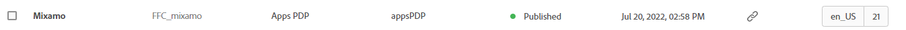
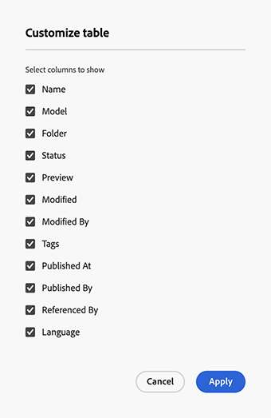

# Hantera innehållsfragment {#managing-content-fragments}

>[!IMPORTANT]
>
>Olika funktioner i Content Fragments och Content Fragment Models finns tillgängliga via Early Adobe Program.
>
>Kontrollera [Versionsinformation](/help/release-notes/release-notes-cloud/release-notes-current.md) om du vill se status och hur du tillämpar den om du är intresserad.

Lär dig hur du hanterar dina **innehållsfragment** i Adobe Experience Manager (AEM) as a Cloud Service från den dedikerade [konsolen för innehållsfragment](#content-fragments-console) och [redigeraren för innehållsfragment](/help/sites-cloud/administering/content-fragments/authoring.md#content-fragment-editor). Dessa innehållsfragment kan användas som bas för rubrikfritt innehåll eller för att skapa sidor.

>[!NOTE]
>
>Ditt projektteam kan anpassa konsolen och redigeraren om det behövs. Mer information finns i [Anpassa konsolen och redigeraren för innehållsfragment](/help/implementing/developing/extending/content-fragments-console-and-editor.md).

När du har definierat dina [modeller för innehållsfragment](#creating-a-content-model) kan du använda dessa för att:

* [Skapa dina innehållsfragment](#creating-a-content-fragment).
* Öppna sedan [Content Fragment Editor](#opening-the-fragment-editor) för att [redigera ditt innehåll och hantera dina variationer](#editing-the-content-of-your-fragment).
* [Hantera taggar](#manage-tags)
* [Visa och redigera egenskaperna (metadata)](#viewing-and-editing-properties)
* [Visa strukturträdet](/help/sites-cloud/administering/content-fragments/authoring.md#structure-tree)

>[!NOTE]
>
>Innehållsfragment kan användas:
>
>* för [leverans av Headless-innehåll med innehållsfragment med GraphQL](/help/sites-cloud/administering/content-fragments/content-delivery-with-graphql.md),
>* när du redigerar sidor, se [Sidredigering med innehållsfragment](/help/sites-cloud/authoring/fragments/content-fragments.md).

>[!NOTE]
>
>Innehållsfragment lagras som **Assets**. De hanteras huvudsakligen från konsolen **Innehållsfragment**, men kan även hanteras från konsolen [Assets](/help/assets/content-fragments/content-fragments-managing.md).

## Konsolen Innehållsfragment {#content-fragments-console}

Konsolen Innehållsfragment är avsedd för hantering, sökning och skapande av innehållsfragment. Den har optimerats för användning i ett Headless-sammanhang, men används även när innehållsfragment skapas för att användas vid sidredigering.

Konsolen för innehållsfragment ger direktåtkomst till dina fragment och relaterade uppgifter. Konsolen kan nås direkt från den översta nivån i Global Navigation.

Mer information finns i:

* [Grundläggande struktur och hantering av konsolen för innehållsfragment](#basic-structure-handling-content-fragments-console)

* [Information om dina innehållsfragment](#information-content-fragments)

* [Åtgärder för ett innehållsfragment i konsolen för innehållsfragment](#actions-selected-content-fragment)

* [Markera kolumner som visas i konsolen](#select-columns-console)

* [Söka och filtrera i konsolen för innehållsfragment](#filtering-fragments)

* Det finns ett urval av [kortkommandon](/help/sites-cloud/administering/content-fragments/keyboard-shortcuts.md) som kan användas i den här konsolen

>[!NOTE]
>
>Den här konsolen visar bara innehållsfragment. Den visar inte andra resurstyper, t.ex. bilder och videoklipp.

>[!CAUTION]
>
>Konsolen är *endast* tillgänglig i Adobe Experience Manager (AEM) as a Cloud Service online.

### Konsolens grundläggande struktur och hantering {#basic-structure-handling-content-fragments-console}

Om du väljer **Innehållsfragment** öppnas konsolen på en ny flik.

<!-- CQDOC-21349: screenshot -->

Här ser du att det finns tre huvudområden:

* Det övre verktygsfältet
   * Tillhandahåller AEM standardfunktioner
   * Visar även din IMS-organisation
   * Tillhandahåller olika [åtgärder](#actions-unselected)
* Den vänstra panelen
   * Här kan du dölja eller visa mappträdet
   * Du kan välja en viss gren av trädet
   * Storleken kan ändras så att kapslade mappar visas
   * Du kan välja mellan att visa innehållsfragment eller [Assets](/help/sites-cloud/administering/content-fragments/assets-content-fragments-console.md)
* Den högra panelen - härifrån kan du:
   * Se listan med alla innehållsfragment i den markerade grenen i trädet:
      * Innehållsfragment från den markerade mappen och alla underordnade mappar visas:
         * Platsen anges av vägbeskrivningarna. Dessa kan även användas för att ändra platsen:
      * [Information visas om varje fragment](#information-content-fragments)
         * [Du kan välja vilka kolumner som ska visas](#select-columns-console)
      * [Olika fält med information](#information-content-fragments) om ett innehållsfragment innehåller länkar. Beroende på fältet kan dessa:
         * Öppna rätt fragment i redigeraren
         * Visa information om referenser
         * Visa information om språkversioner av fragmentet
      * [Vissa andra fält med information](#information-content-fragments) om ett innehållsfragment kan användas för [Snabb filtrering](#fast-filtering):
         * Markera ett värde i kolumnen och tillämpas omedelbart som ett filter
         * Snabb filtrering stöds för kolumnerna **Model**, **Status**, **Modified By**, **Tags** och **Published By By**.
      * Genom att använda musen på kolumnrubrikerna visas en listruta med åtgärdsväljare och breddreglage. Med dessa kan du:
         * Sortera - välj lämplig åtgärd för antingen stigande eller fallande
Då sorteras hela tabellen efter den kolumnen. Sortering är bara tillgängligt för lämpliga kolumner.
         * Ändra storlek på kolumnen med antingen funktionsmakrot eller breddreglagen
      * Välj ett eller flera fragment för ytterligare [åtgärd](#actions-selected-content-fragment)
   * Använd rutan [Sök](#searching-fragments)
   * Öppna [filterpanelen](#filtering-fragments)

### Åtgärder {#actions}

I konsolen finns ett antal åtgärder som du kan använda, antingen direkt eller efter att du har valt ett visst fragment:

* Olika åtgärder är direkt [tillgängliga från konsolen](#actions-unselected)
* Du kan [markera ett eller flera innehållsfragment för att visa lämpliga åtgärder](#actions-selected-content-fragment)

#### Åtgärder (omarkerade) {#actions-unselected}

Vissa åtgärder är tillgängliga från konsolen - utan att du behöver välja ett visst innehållsfragment:

* **[Skapa](#creating-a-content-fragment)** ett nytt innehållsfragment
* [Filtrera](#filtering-fragments) innehållsfragment enligt ett urval predikat och spara filtret för framtida bruk
* [Sök](#searching-fragments) i innehållsfragment
* [Anpassa tabellvyn för att visa markerade kolumner med information](#select-columns-console)
* Använd **Öppna i Assets** för att öppna den aktuella platsen direkt i **Assets**-konsolen

  >[!NOTE]
  >
  >**Assets**-konsolen används för att komma åt resurser, till exempel bilder, videor och så vidare.  Konsolen kan nås:
  >
  >* med länken **Öppna i Assets** (i konsolen för innehållsfragment)
  >* direkt från den globala **navigeringsrutan**

#### Åtgärder för ett (markerat) innehållsfragment {#actions-selected-content-fragment}

Om du markerar ett visst fragment öppnas ett verktygsfält som fokuserar på de åtgärder som är tillgängliga för det fragmentet. Du kan också markera flera fragment. Markeringen av funktionsmakron justeras därefter.

<!-- CQDOC-21349: screenshot -->

* **[Öppna i ny redigerare](#editing-the-content-of-your-fragment)**
* **[Öppna](/help/assets/content-fragments/content-fragments-variations.md)** (i originalredigeraren)
* **[Publicera](#publishing-and-previewing-a-fragment)** (och **[Avpublicera](#unpublishing-a-fragment)**)
* **[Hantera taggar](#manage-tags)**
* **[Kopiera](/help/assets/manage-digital-assets.md)**
* **[Flytta](/help/assets/manage-digital-assets.md)**
* **[Byt namn](/help/assets/manage-digital-assets.md)**
* **[Ta bort](#deleting-a-fragment)**
* **[Ersätt](#find-and-replace)**

>[!NOTE]
>
>Använd **Öppna** för att öppna det markerade fragmentet i *originalredigeraren*.

>[!NOTE]
>
>Åtgärder som Publicera, Avpublicera, Ta bort, Flytta, Byt namn och Kopiera utlöser ett asynkront jobb. Jobbets förlopp kan övervakas via användargränssnittet för AEM Async Jobs.

### Information om dina innehållsfragment {#information-content-fragments}

Huvudpanelen/den högra panelen (tabellvyn) i konsolen innehåller en rad information om dina innehållsfragment. Vissa objekt har också direkta länkar till ytterligare åtgärder och/eller information:

* **Namn**
   * Tillhandahåller en länk för att öppna fragmentet i redigeraren.
* **Modell**
   * Endast information.
   * Kan användas för [snabb filtrering](#fast-filtering)
* **Mapp**
   * Tillhandahåller en länk för att öppna mappen i konsolen.
Vid hovring över mappnamnet visas JCR-sökvägen.
* **Status**
   * Endast information.
   * Kan användas för [snabb filtrering](#fast-filtering)
* **Förhandsgranska**
   * Endast information:
      * **In sync**: Content Fragment is in-sync on the **Author** and **Preview** services.
      * **Osynkroniserad**: Innehållsfragmentet är inte synkroniserat på tjänsterna **Författare** och **Förhandsgranska**. Du måste **Publicera** till **Förhandsgranska** för att se till att de två instanserna synkroniseras igen.
      * blank: Innehållsfragmentet finns inte i tjänsten **Preview**.
* **Ändrad**
   * Endast information.
* **Ändrad av**
   * Endast information.
   * Kan användas för [snabb filtrering](#fast-filtering).
* **Taggar**
   * Endast information.
   * Visar alla taggar som hör till innehållsfragmentet, både Main och alla variationer.
   * Kan användas för [snabb filtrering](#fast-filtering).
* **Publicerad**
   * Endast information.
* **Publicerad av**
   * Endast information.
   * Kan användas för [snabb filtrering](#fast-filtering).
* **Refererad av**:
   * Tillhandahåller en länk som öppnar en dialogruta med alla [överordnade referenser](#parent-references-fragment) för det fragmentet, inklusive referenser till innehållsfragment, upplevelsefragment och sidor. Om du vill öppna en viss referens klickar du på **Titel** i dialogrutan.

     

* **Språk**: ange eventuella [Språk](#language-copies-fragment)-kopior

   * Anger språket för innehållsfragmentet, tillsammans med det totala antalet lokala/[språkkopior](#language-copies-fragment) som är associerade med innehållsfragmentet.

     

   * Välj antal för att öppna en dialogruta som visar alla språkkopior. Om du vill öppna en viss språkkopia klickar du på **Titel** i dialogrutan.

     

## Skapa innehållsfragment {#creating-content-fragments}

Innan du skapar ditt innehållsfragment måste den underliggande modellen för innehållsfragment skapas.

### Skapa en innehållsmodell {#creating-a-content-model}

[Modeller för innehållsfragment](/help/sites-cloud/administering/content-fragments/content-fragment-models.md) måste aktiveras och skapas innan du kan skapa innehållsfragment med strukturerat innehåll.

### Skapa ett innehållsfragment {#creating-a-content-fragment}

Så här skapar du ett innehållsfragment:

1. Välj **Skapa** (överst till höger) i konsolen **Innehållsfragment**.

   >[!NOTE]
   >
   >Om du vill ha platsen för det nya fragmentet fördefinierad kan du navigera till mappen där du vill skapa fragmentet, eller ange platsen när du skapar fragmentet.

1. Dialogrutan **Nytt innehållsfragment** öppnas och här kan du ange:

   * **Plats** - Automatiskt slutförd med den aktuella platsen, men du kan välja en annan plats om det behövs.
   * **Modell för innehållsfragment** - Välj den modell som ska användas som bas för fragmentet i listrutan.
   * **Automatisk tagg** - När du väljer det här alternativet ärvs alla taggar som tilldelats innehållsfragmentmodellen av och läggs till i det nya innehållsfragmentet.
   * **Titel**
   * **Namn** - Kompletteras automatiskt baserat på **Titel**, men du kan redigera det om det behövs.
   * **Beskrivning**

   

1. Välj **Skapa** eller **Skapa och öppna** om du vill behålla definitionen.

## Status för innehållsfragment {#statuses-content-fragments}

Under dess existens kan ett innehållsfragment ha flera statusvärden, vilket visas i [konsolen för innehållsfragment](/help/sites-cloud/administering/content-fragments/managing.md#content-fragments-console) och [redigeraren för innehållsfragment](/help/sites-cloud/administering/content-fragments/authoring.md):

* **Nytt** (grått)
Ett nytt innehållsfragment har skapats, men har inget innehåll som aldrig har redigerats, eller öppnats, i redigeraren för innehållsfragment.
* **Utkast** (blått)
Någon har antingen redigerat eller öppnat (nytt) innehållsfragment i Content Fragment Editor - men det har ännu inte publicerats.
* **Publicerad** (grön)
Innehållsfragmentet har publicerats.
* **Ändrad** (orange)
Innehållsfragmentet har redigerats efter att det publicerades (men innan ändringen publicerades).
* **Opublicerad** (röd)
Innehållsfragmentet har avpublicerats.

## Redigera innehållet i fragmentet (och variationer) {#editing-the-content-of-your-fragment}

>[!IMPORTANT]
>
>Mer information finns i [Skapa innehållsfragment](/help/sites-cloud/administering/content-fragments/authoring.md)

Så här öppnar du fragmentet för redigering:

1. Använd konsolen **Innehållsfragment** för att navigera till platsen för ditt innehållsfragment.
1. Öppna fragmentet för redigering genom att markera fragmentet och sedan **Öppna i ny redigerare** från verktygsfältet.

1. Fragmentredigeraren öppnas. Välj önskad **variant** och gör önskade ändringar (de sparas automatiskt):

   

## Visa och hantera taggar {#manage-tags}

På konsolen Innehållsfragment kan du visa alla taggar som har använts i kolumnen **Taggar**. När du har kontrollerat att [kolumnen visas](#select-columns-console) kan du kontrollera det.

### Hantera taggar (konsol) {#manage-tags-console}

Så här hanterar du taggar:

1. Navigera till konsolen Innehållsfragment.
1. Markera ett innehållsfragment.
1. Välj **Hantera taggar** i verktygsfältet.
1. Använd taggväljaren för att markera taggar som ska användas eller ta bort:

   

1. **Spara** uppdateringar. Du kommer nu tillbaka till konsolen.

### Visa och redigera, taggar (Editor) {#viewing-and-editing-tags}

Du kan också visa och redigera de taggar som har tillämpats på ett fragment på fliken [Egenskaper](/help/sites-cloud/administering/content-fragments/authoring.md) i redigeraren. Informationen som visas skiljer sig mellan **Main** och alla **Variations**.

## Visa och redigera, Egenskaper (Editor) {#viewing-and-editing-properties}

Du kan visa och redigera egenskaperna (metadata) för ett fragment på fliken [Egenskaper](/help/sites-cloud/administering/content-fragments/authoring.md) i redigeraren. Informationen som visas skiljer sig mellan **Main** och alla **Variations**.

## Publicera och förhandsgranska ett fragment {#publishing-and-previewing-a-fragment}

Du kan publicera dina innehållsfragment till:

* **[Publiceringstjänst](/help/headless/deployment/architecture.md)** - för fullständig, offentlig åtkomst

* **[Förhandsgranskningstjänsten](/help/headless/deployment/architecture.md)** - för att förhandsgranska innehållet innan det är fullständigt tillgängligt

  >[!CAUTION]
  >
  >Publicering av innehållsfragment till **förhandsgranskningstjänsten** är bara tillgängligt från konsolen för innehållsfragment, med åtgärden **Publicera** .

  >[!NOTE]
  >
  >Mer information om förhandsvisningsmiljöerna finns i [Hantera miljöer](/help/implementing/cloud-manager/manage-environments.md#access-preview-service).

>[!CAUTION]
>
>Om fragmentet är baserat på en modell bör du kontrollera att modellen [har publicerats](/help/sites-cloud/administering/content-fragments/content-fragment-models.md#publishing-a-content-fragment-model).
>
>Om du publicerar ett innehållsfragment för vilket modellen ännu inte har publicerats, visas detta i en urvalslista och modellen publiceras med fragmentet.

### Publicering {#publishing}

Du kan publicera dina innehållsfragment med alternativet **Publicera** från något av följande:

* verktygsfältet i konsolen [Innehållsfragment](#actions-selected-content-fragment)

   * Markera ett eller flera fragment i listan.

* verktygsfältet i [redigeraren för innehållsfragment](/help/sites-cloud/administering/content-fragments/authoring.md#content-fragment-editor)

När du har valt åtgärden **Publicera**:

1. Välj något av följande alternativ för att öppna rätt dialogruta:

   * **Nu** - välj antingen **Publiceringstjänst** eller **Förhandsgranskningstjänst**. Efter bekräftelse publiceras fragmentet omedelbart
   * **Schema** - förutom den tjänst som krävs kan du även välja datum och tid när fragmentet ska publiceras

1. Ange all information i dialogrutan. För en schemalagd publiceringsbegäran:

   

   >[!NOTE]
   >
   >Vid behov måste du ange vilka referenser som ska publiceras. Som standard publiceras referenser även till förhandsgranskningstjänsten för att säkerställa att det inte finns någon brytning i innehållet.

1. Bekräfta publiceringsåtgärden.

Efter publiceringen uppdateras fragmentets status och visas i redigeraren och konsolen. Om du har angett en schemalagd publikation visas information.

>[!NOTE]
>
>När du [publicerar en sida som använder fragmentet ](/help/sites-cloud/authoring/fragments/content-fragments.md#publishing) visas dessutom fragmentet i sidreferenserna.

## Avpublicera ett fragment {#unpublishing-a-fragment}

Du kan avpublicera innehållsfragment:

* verktygsfältet i konsolen [Innehållsfragment](#actions-selected-content-fragment)

   * Markera ett eller flera fragment i listan.

* verktygsfältet i [redigeraren för innehållsfragment](/help/sites-cloud/administering/content-fragments/authoring.md#content-fragment-editor)

I båda fallen väljer du **Avpublicera** i verktygsfältet, följt av antingen **Nu** eller **Schemalagd**.

När dialogrutan öppnas kan du välja rätt tjänst:

>[!NOTE]
>
>Åtgärden **Avpublicera** visas bara när publicerade fragment är tillgängliga.

>[!CAUTION]
>
>Om fragmentet redan refereras från ett annat fragment, eller från en sida, visas ett varningsmeddelande och du måste bekräfta att du vill fortsätta.

## Sök och ersätt {#find-and-replace}

<!-- CQDOC-21349: screenshot -->

Åtgärden **Ersätt** är tillgänglig (i det övre verktygsfältet) för att söka efter och ersätta angiven text i de valda innehållsfragmenten.

Innan du ersätter en produkt kontrolleras valideringskriterierna och du informeras om eventuella konflikter, så att du kan ändra ersättningssträngen eller bara ersätta de validerade instanserna.

>[!NOTE]
>
>Åtgärden Sök och ersätt kan bara utföras på högst 20 markerade innehållsfragment (i taget).
>
>Om du väljer fler än 20 innehållsfragment visas meddelandet **Det går inte att söka efter och ersätta**.

<!-- CQDOC-21349: screenshot -->

## Ta bort ett fragment {#deleting-a-fragment}

Ta bort ett fragment:

1. I konsolen **Innehållsfragment** navigerar du till platsen för innehållsfragmentet.
1. Markera fragmentet.
1. Välj **Ta bort** i verktygsfältet.
1. Bekräfta åtgärden **Ta bort**.

>[!NOTE]
>
>**Delete** är inte tillgänglig för fragment som är publicerade just nu. De måste avpubliceras först.

## Söka efter överordnade referenser för ditt fragment {#parent-references-fragment}

Information om överordnade referenser finns i

* **Referenser**-kolumnen i konsolen Innehållsfragment
* den [överordnade referenslänken i det övre verktygsfältet i redigeraren för innehållsfragment](/help/sites-cloud/administering/content-fragments/authoring.md#view-parent-references)

Båda innehåller en länk som öppnar en dialogruta med alla överordnade referenser till det fragmentet, inklusive referenser till innehållsfragment, Experience Fragments och pages. Om du vill öppna en viss referens klickar du på **Titel** eller länkikonen i dialogrutan.

Till exempel:

## Hitta språkkopior av fragmentet {#language-copies-fragment}

Information om språkkopior finns på:

* kolumnen **Språk** i konsolen [Innehållsfragment](#information-content-fragments)
* fliken [Språkkopior i redigeraren för innehållsfragment](/help/sites-cloud/administering/content-fragments/authoring.md#view-language-copies)

Ikonen anger språkområdet för innehållsfragmentet tillsammans med det totala antalet språkområden/språkkopior som är associerade med innehållsfragmentet. Från konsolen:

Välj antal för att öppna en dialogruta som visar alla språkkopior. Om du vill öppna en viss språkkopia klickar du på **Titel** i dialogrutan.

## Markera kolumner som visas i konsolen {#select-columns-console}

Precis som med andra konsoler kan du konfigurera de kolumner som är synliga och tillgängliga för åtgärder:

Här visas en lista med kolumner som du kan dölja eller visa:

## Filtrera fragment {#filtering-fragments}

På panelen Filter finns:

* Ett urval av prediater.
   * inklusive innehållsfragmentmodeller, lokalisering, taggar, statusfält med flera
   * ett eller flera predikat kan markeras och kombineras för att skapa filtret
* **Uteslut undermappsobjekt**, vilket ger dig möjlighet att utesluta innehållsfragment som lagras i undermappar
* möjlighet att **spara** din konfiguration
* alternativet att hämta ett sparat sökfilter för återanvändning

När du har valt alternativet **Filtrera efter** visas alternativen (under sökrutan). De kan avmarkeras därifrån. Till exempel:

<!-- CQDOC-21349: screenshot -->

### Snabb filtrering {#fast-filtering}

Du kan också välja ett predikat genom att klicka på ett visst kolumnvärde i listan. Du kan välja ett eller flera värden för att kombinera predikat.

Välj till exempel **Publicerad** i kolumnen **Status**:

>[!NOTE]
>
>Snabb filtrering stöds bara för kolumnerna **Model**, **Status**, **Modified By**, **Tags** och **Published By By** .

När du har valt det här alternativet visas det som ett filterpredikat och listan filtreras därefter:

## Söka efter fragment {#searching-fragments}

I sökrutan går det att söka i heltext. Ange dina söktermer i sökrutan:

<!-- CQDOC-21349: screenshot -->

Ger de valda resultaten:

<!-- CQDOC-21349: screenshot -->

Sökrutan ger dig även snabb åtkomst till **Senaste innehållsfragment** och **sparade sökningar**:

