# Skapa och synkronisera live-kopior {#creating-and-synchronizing-live-copies}

Du kan skapa en Live-kopia från en sida eller en ritningskonfiguration om du vill återanvända innehållet på hela webbplatsen. Hantera arv och synkronisering. Du kan styra hur ändringar av innehållet ska spridas.

## Hantera layoutkonfigurationer {#managing-blueprint-configurations}

En plankonfiguration identifierar en befintlig webbplats som du vill använda som källa för en eller flera Live Copy-sidor.

>[!TIP]
>
>Med layoutkonfigurationer kan du överföra innehållsändringar till Live-kopior. Se [Live-kopior - Källa, utkast och layoutkonfigurationer](overview.md#source-blueprints-and-blueprint-configurations).

När du skapar en ritningskonfiguration väljer du en mall som definierar den interna strukturen för ritningen. Standardmallen för utkast förutsätter att källwebbplatsen har följande egenskaper:

* Webbplatsen har en rotsida.
* De direkt underordnade sidorna i roten är språkgrenar på webbplatsen. När du skapar en Live-kopia visas språken som valfritt innehåll som ska inkluderas i kopian.
* Roten för varje språkgren har en eller flera underordnade sidor. När du skapar en Live-kopia visas underordnade sidor så att du kan ta med dem i Live-kopian.

>[!NOTE]
>
>En annan struktur kräver en annan designmall.

När du har skapat en ritningskonfiguration konfigurerar du följande egenskaper:

* **Namn**: Namnet på designkonfigurationen
* **Källsökväg**: Sökvägen till rotsidan för webbplatsen som du använder som källa (utkast)
* **Beskrivning**. (Valfritt) En beskrivning av designkonfigurationen, som visas i listan över designkonfigurationer att välja mellan när du skapar en webbplats

När du använder en ritningskonfiguration kan du associera den med en utrullningskonfiguration som bestämmer hur Live-kopior av källan/ritytan synkroniseras. Se [Ange vilka utrullningskonfigurationer som ska användas](live-copy-sync-config.md#specifying-the-rollout-configurations-to-use).

### Skapa en designkonfiguration {#creating-a-blueprint-configuration}

Så här skapar du en ritningskonfiguration:

1. [Gå ](/help/sites-cloud/authoring/getting-started/basic-handling.md#global-navigation) till  **** Verktyg-menyn och välj sedan  **** Platser-menyn.
1. Välj **utkast** för att öppna konsolen **Blueprint Configurations**:

   

1. Välj **Skapa**.
1. Välj ritningsmallen och **Nästa** för att fortsätta.
1. Välj den källsida som ska användas som plan, **Nästa** för att fortsätta.
1. Definiera:

   * **Titel**: obligatorisk titel för ritningen
   * **Beskrivning**: en valfri beskrivning med mer information.

1. **Create** skapar en ritningskonfiguration utifrån din specifikation.

### Redigera eller ta bort en designkonfiguration {#editing-or-deleting-a-blueprint-configuration}

Du kan redigera eller ta bort en befintlig ritningskonfiguration:

1. [Gå ](/help/sites-cloud/authoring/getting-started/basic-handling.md#global-navigation) till  **** Verktyg-menyn och välj sedan  **** Platser-menyn.
1. Välj **utkast** för att öppna konsolen **Blueprint Configurations**:

   

1. Välj önskad konfiguration av utkast - lämpliga åtgärder blir tillgängliga i verktygsfältet:

   * **Egenskaper**; kan du använda detta för att visa och sedan redigera egenskaperna för konfigurationen.
   * **Ta bort**

## Skapa en Live-kopia {#creating-a-live-copy}

Du kan skapa en Live-kopia på flera olika sätt.

### Skapa en Live-kopia av en sida {#creating-a-live-copy-of-a-page}

Du kan skapa en Live-kopia av vilken sida eller gren som helst. När du skapar Live-kopian kan du ange vilka rollout-konfigurationer som ska användas för att synkronisera innehållet:

* De valda rollout-konfigurationerna gäller för Live Copy-sidan och dess underordnade sidor.
* Om du inte anger några utplaceringskonfigurationer avgör MSM vilka utplaceringskonfigurationer som ska användas. Se [Ange vilken utrullningskonfiguration som ska användas](live-copy-sync-config.md#specifying-the-rollout-configurations-to-use).

Du kan skapa en Live-kopia av vilken sida som helst:

* Sidor som refereras av en [plantryckskonfiguration](#creating-a-blueprint-configuration)
* Och sidor som inte har någon anslutning till en konfiguration
* Live-kopia på sidorna i en annan Live-kopia ([kapslade Live-kopior](overview.md#nested-live-copies))

Den enda skillnaden är att tillgängligheten för kommandot **Rollout** på käll-/ritningssidorna är beroende av om källan refereras av en ritningskonfiguration:

* Om du skapar Live-kopian från en källsida som **är** refererad till i en ritningskonfiguration, kommer kommandot Rollout att vara tillgängligt på käll-/ritningssidan/sidorna.
* Om du skapar Live-kopian från en källsida som **inte** refereras till i en ritningskonfiguration, kommer kommandot Rollout inte att vara tillgängligt på käll-/ritningssidorna.

Så här skapar du en Live-kopia:

1. I konsolen **Platser** väljer du **Skapa** och sedan **Live Copy**.

   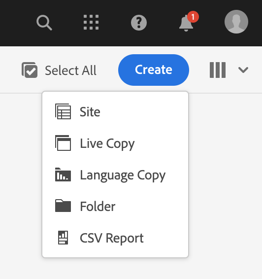

1. Välj källsidan och klicka eller tryck sedan på **Nästa**. Till exempel:

   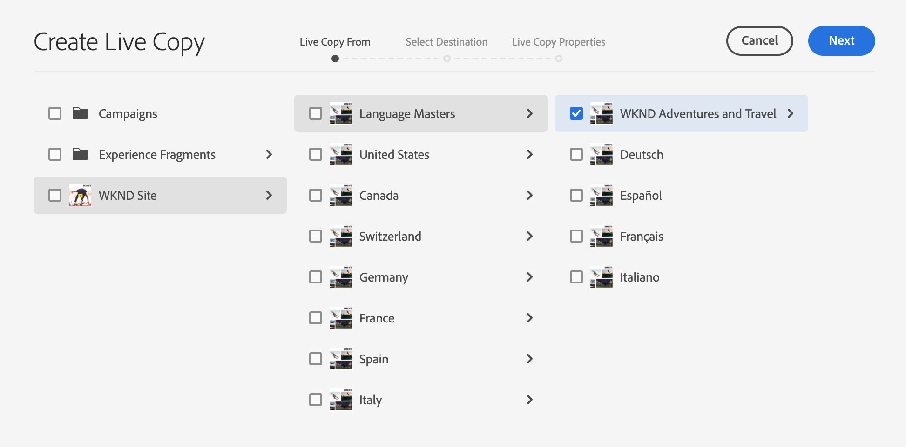

1. Ange målsökvägen för Live-kopian (öppna den överordnade mappen/sidan för Live Copy) och klicka eller tryck sedan på **Nästa**.

   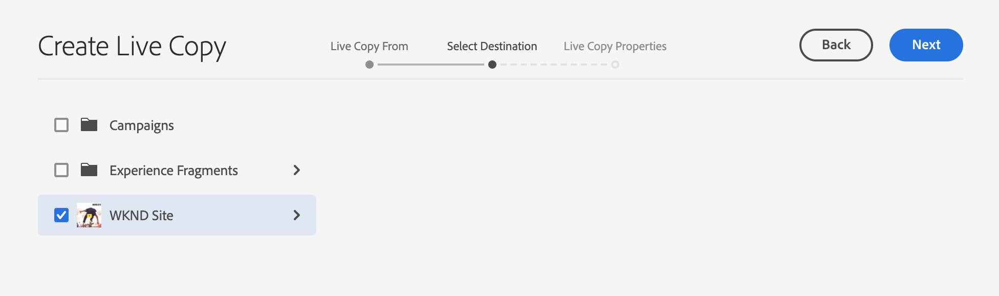

   >[!NOTE]
   >
   >Målsökvägen får inte finnas i källsökvägen.

1. Ange:

   * a **Rubrik** för sidan.
   * a **Namn**, som används i URL:en.

   

1. Använd kryssrutan **Uteslut undersidor**:

   * Markerat: skapa endast en Live-kopia av den markerade sidan (grund Live-kopia)
   * Inte markerat: skapa en Live-kopia som innehåller alla underordnade till den markerade sidan (djup Live Copy)

1. (Valfritt) Om du vill ange en eller flera utrullningskonfigurationer som ska användas för Live-kopian använder du listrutan **Rollout Configs** för att välja dem. Markerade konfigurationer visas under den nedrullningsbara väljaren.
1. Klicka eller tryck på **Skapa**. Ett bekräftelsemeddelande visas. Här kan du välja antingen **Öppna** eller **Klar**.

### Skapa en Live-kopia av en plats från en designkonfiguration {#creating-a-live-copy-of-a-site-from-a-blueprint-configuration}

Skapa en Live Copy med hjälp av en ritningskonfiguration för att skapa en webbplats baserad på innehållet i ritningen (källan). När du skapar en Live-kopia från en ritningskonfiguration väljer du en eller flera språkgrenar i den ritningskälla som ska kopieras och sedan markerar du de kapitel som ska kopieras från språkgrenarna. Se [Skapa en designkonfiguration](#creating-a-blueprint-configuration).

Om du utelämnar vissa språkgrenar från Live-kopian kan du lägga till dem senare. Mer information finns i [Skapa en Live-kopia i en Live-kopia (Konfiguration av utkast)](#creating-a-live-copy-inside-a-live-copy-blueprint-configuration).

>[!CAUTION]
>
>När ritytan innehåller länkar och referenser som aktiverar ett stycke i en annan gren, uppdateras inte målen på sidorna för Live-kopia, utan de är fortfarande kopplade till det ursprungliga målet.

När du skapar platsen anger du värden för följande egenskaper:

* **Ursprungliga språk**: De språkgrenar i designkällan som ska inkluderas i Live Copy
* **Inledande kapitel**: De underordnade sidorna i grenarna för utkast som ska inkluderas i Live Copy
* **Målsökväg**: Platsen för Live Copy-webbplatsens rotsida
* **Titel**: Titeln på rotsidan på Live Copy-webbplatsen
* **Namn**: (Valfritt) Namnet på den JCR-nod som lagrar Live-kopians rotsida (standardvärdet baseras på titeln)
* **Webbplatsägare**: (Valfritt) Information om den part som ansvarar för Live Copy
* **Live Copy**: Välj det här alternativet om du vill skapa en direktrelation med källplatsen. Om du inte markerar det här alternativet skapas en kopia av ritningen, men den synkroniseras inte med källan.
* **Konfiguration** för utrullning: (Valfritt) Välj en eller flera utrullningskonfigurationer som ska användas för synkronisering av Live-kopian. Som standard ärvs utrullningskonfigurationerna från ritningen. Mer information finns i [Ange vilka utrullningskonfigurationer som ska användas](live-copy-sync-config.md#specifying-the-rollout-configurations-to-use).

Så här skapar du en Live-kopia av en webbplats från en designkonfiguration:

1. I konsolen **Platser** väljer du **Skapa** och sedan **Plats** i listrutan.
1. Välj den designkonfiguration som ska användas som källa för Live-kopian och fortsätt med **Nästa**:

   

1. Använd väljaren **Ursprungliga språk** för att ange språket/språken för den webbplats som ska användas för Live-kopian.

   Alla tillgängliga språk är markerade som standard. Om du vill ta bort ett språk klickar eller trycker du på **X** som visas bredvid språket.

   Till exempel:

   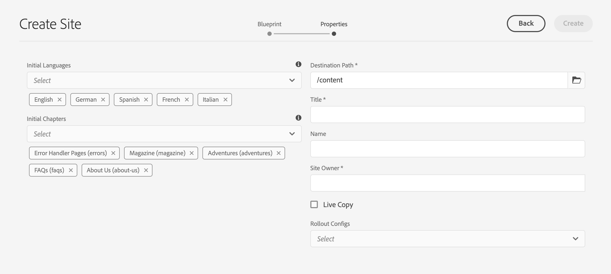

1. Använd listrutan **Inledande kapitel** för att välja de avsnitt i ritningen som ska ingå i Live-kopian. Alla tillgängliga kapitel inkluderas som standard, men kan tas bort.
1. Ange värden för de återstående egenskaperna och välj sedan **Skapa**. I bekräftelsedialogrutan väljer du **Klar** för att återgå till konsolen **Platser** eller **Öppna platsen** för att öppna webbplatsens rotsida.

### Skapa en Live-kopia i en Live-kopia (utkast-konfiguration) {#creating-a-live-copy-inside-a-live-copy-blueprint-configuration}

När du skapar en Live-kopia i den befintliga Live-kopian (som skapats med en ritningskonfiguration) kan du infoga en eller flera språkversioner som inte fanns med när Live-kopian skapades.

## Övervaka din Live-kopia {#monitoring-your-live-copy}

### Se status för en Live-kopia {#seeing-the-status-of-a-live-copy}

Egenskaperna för en Live Copy-sida visar följande information om Live Copy:

* **Källa**: Källsidan för Live Copy-sidan
* **Status**: Synkroniseringsstatusen för Live-kopian, inklusive om Live-kopian är uppdaterad med källan, när den senaste synkroniseringen inträffade och vem som utförde synkroniseringen
* **Konfiguration**:

   * Om sidan fortfarande omfattas av Live Copy-arv
   * Om konfigurationen ärvs från den överordnade sidan
   * Alla utrullningskonfigurationer som används i Live Copy

Så här visar du egenskaperna:

1. I konsolen **Platser** väljer du sidan Live-kopia och öppnar egenskaperna.
1. Välj fliken **Live Copy**.

   Till exempel:

   

   Mer information finns i avsnittet [Använda Live-kopieringsöversikt](live-copy-overview.md#using-the-live-copy-overview) i artikeln Live Copy Overview Console.

### Visa Live-kopior av en blå sida {#seeing-the-live-copies-of-a-blueprint-page}

Du får en lista över de Live Copy-sidor som använder den aktuella (utkast) sidan som källa för utkast (som refereras i en plantryckskonfiguration). Använd den här listan för att hålla reda på Live-kopior. Listan visas på fliken **Blueprint** i [sidegenskaperna](/help/sites-cloud/authoring/fundamentals/page-properties.md).

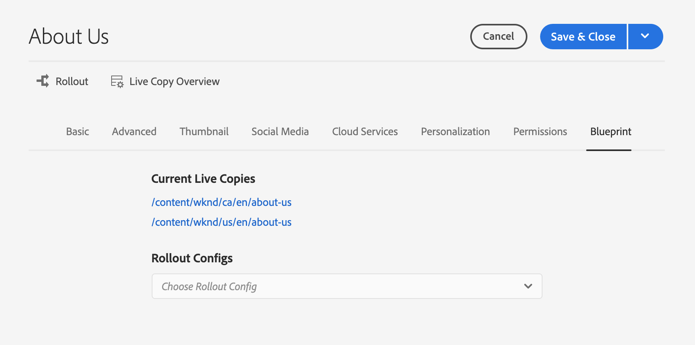

## Synkroniserar din Live-kopia {#synchronizing-your-live-copy}

Det finns flera sätt att synkronisera din Live-kopia.

### Släpper ut ett utkast {#rolling-out-a-blueprint}

Rulla ut en ritningssida för att överföra innehållsändringar till Live-kopior. En **rollout**-åtgärd kör de rollout-konfigurationer som använder utlösaren [On Rollout](live-copy-sync-config.md#rollout-triggers).

>[!NOTE]
>
>Konflikter kan uppstå om nya sidor med samma sidnamn skapas både i den blå grenen och i en beroende Live Copy-gren.
>
>Sådana [konflikter måste hanteras och lösas vid utrullning](rollout-conflicts.md).

#### Släpper ut en skiss från Sidegenskaper {#rolling-out-a-blueprint-from-page-properties}

1. I konsolen **Platser** markerar du sidan i planen och öppnar egenskaperna.
1. Öppna fliken **Blå**.
1. Välj **Överrullning**.

   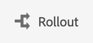

1. Ange sidorna och eventuella underordnade sidor och bekräfta sedan med bockmarkeringen:

   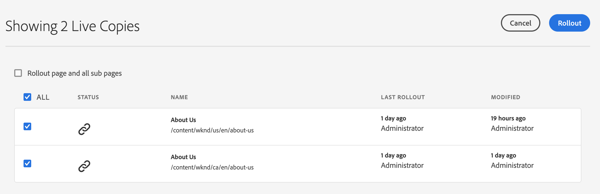

1. Ange om utrullningsjobbet ska köras omedelbart (**Now**) eller vid ett annat datum/tid (**Senare**).

   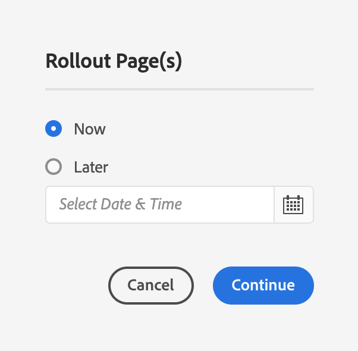

Utsläppen bearbetas som asynkrona jobb och kan kontrolleras på sidan [***Status för asynkrona jobb**.](/help/operations/asynchronous-jobs.md#monitor-the-status-of-asynchronous-operations)

#### Rulla ut en skiss från referenslinjen {#roll-out-a-blueprint-from-the-reference-rail}

1. I konsolen **Platser** markerar du sidan i utkastet och öppnar panelen **[Referenser](/help/sites-cloud/authoring/getting-started/basic-handling.md#references)** (i verktygsfältet).
1. Välj alternativet **Utskrift** i listan för att visa de utkast som är associerade med den här sidan.
1. Välj önskad rityta i listan.
1. Klicka eller tryck på **Överrullning**.

   

1. Du ombeds bekräfta informationen om utrullningen:

   * **Utrullningsomfång**:

      Ange om omfånget gäller enbart för den valda sidan eller om det ska omfatta underordnade sidor.

   * **Schema**:

      Ange om utrullningsjobbet ska köras omedelbart (**Now**) eller vid ett senare datum/tid (**senare**).

      

1. När du har bekräftat dessa uppgifter väljer du **Rollout** för att utföra åtgärden.

Utsläppen bearbetas som asynkrona jobb och kan kontrolleras på sidan [**Status för asynkrona jobb**.](/help/operations/asynchronous-jobs.md#monitor-the-status-of-asynchronous-operations)

#### Rulla ut en utkast från Live Copy-översikten {#roll-out-a-blueprint-from-the-live-copy-overview}

Åtgärden [**Överrullning** är även tillgänglig från Live-kopieringsöversikten](live-copy-overview.md#using-the-live-copy-overview) när en blåtryckningssida har valts.

1. Öppna [Live-kopieringsöversikt](live-copy-overview.md#using-the-live-copy-overview) och välj en designsida.
1. Välj **Överrullning** i verktygsfältet.

   

1. Ange sidorna och eventuella underordnade sidor och bekräfta sedan med bockmarkeringen:

   

1. Ange om utrullningsjobbet ska köras omedelbart (**Now**) eller vid ett annat datum/tid (**Senare**).

   

Utsläppen bearbetas som asynkrona jobb och kan kontrolleras på sidan [**Status för asynkrona jobb**.](/help/operations/asynchronous-jobs.md#monitor-the-status-of-asynchronous-operations)

### Synkronisera en Live-kopia {#synchronizing-a-live-copy}

Synkronisera en Live Copy-sida för att dra in innehållsändringar från källan till Live Copy.

#### Synkronisera en Live-kopia från Sidegenskaper {#synchronize-a-live-copy-from-page-properties}

Synkronisera en Live-kopia för att dra ändringar från källan till Live-kopian.

>[!NOTE]
>
>Synkronisering kör de utrullningskonfigurationer som använder utlösaren [Vid utrullning](live-copy-sync-config.md#rollout-triggers).

1. I konsolen **Platser** väljer du sidan Live-kopia och öppnar egenskaperna.
1. Öppna fliken **Live Copy**.
1. Klicka eller tryck på **Synkronisera**.

   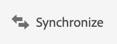

   Bekräftelse kommer att begäras. Använd **Synkronisera** för att fortsätta.

#### Synkronisera en Live-kopia från Live-kopieringsöversikten {#synchronize-a-live-copy-from-the-live-copy-overview}

Åtgärden [Synkronisera är även tillgänglig från Live-kopieringsöversikten](live-copy-overview.md#using-the-live-copy-overview) när en Live-kopieringssida är markerad.

1. Öppna [Live Copy Overview](live-copy-overview.md#using-the-live-copy-overview) och välj en Live Copy-sida.
1. Välj **Synkronisera** i verktygsfältet.
1. Bekräfta åtgärden **Rollout** i dialogrutan när du har angett om du vill inkludera:

   * **Sidor och undersidor**
   * **Endast sida**

   

## Ändra innehåll i Live Copy {#changing-live-copy-content}

Om du vill ändra Live Copy-innehåll kan du:

* Lägg till stycken på sidan.
* Uppdatera befintligt innehåll genom att bryta Live Copy-arvet för alla sidor och komponenter.

>[!TIP]
>
>Om du skapar en ny sida manuellt i Live Copy, är den nya sidan lokal för Live-kopian, vilket innebär att den inte har någon motsvarande källsida som den är kopplad till.
>
>Ett tips för att skapa en lokal sida som är en del av relationen är att skapa den lokala sidan i källan och utföra en djup utrullning. Då skapas sidan lokalt som Live-kopior.

>[!NOTE]
>
>Konflikter kan uppstå om nya sidor med samma sidnamn skapas både i den blå grenen och i en beroende Live Copy-gren.
>
>Sådana [konflikter måste hanteras och lösas vid utrullning](rollout-conflicts.md).

### Lägga till komponenter på en Live Copy-sida {#adding-components-to-a-live-copy-page}

Du kan när som helst lägga till komponenter på en Live Copy-sida. Live Copy-objektets arvsstatus och dess styckesystem styr inte möjligheten att lägga till komponenter.

När Live Copy-sidan synkroniseras med källsidan ändras inte de tillagda komponenterna. Se även [Ändra ordning på komponenter på en Live Copy-sida.](#changing-the-order-of-components-on-a-live-copy-page)

>[!TIP]
>
>Ändringar som görs lokalt för en komponent som markerats som en behållare skrivs inte över av innehållet i ritningen i en utrullning. Mer information finns i [MSM Best Practices](best-practices.md#components-and-container-synchronization).

### Pausar arv för en sida {#suspending-inheritance-for-a-page}

När du skapar en Live-kopia sparas Live-kopieringskonfigurationen på rotsidan för de kopierade sidorna. Alla underordnade sidor på rotsidan ärver Live Copy-konfigurationerna. Komponenterna på Live Copy-sidorna ärver också Live Copy-konfigurationen.

Du kan göra uppehåll i Live Copy-arvet för en Live Copy-sida så att du kan ändra sidegenskaper och komponenter. När du gör uppehåll i arv synkroniseras inte längre sidegenskaperna och komponenterna med källan.

>[!TIP]
>
>Du kan också [koppla loss en Live-kopia](#detaching-a-live-copy) från dess plan för att ta bort alla anslutningar. Till skillnad från att avbryta arv är borttagningsåtgärden permanent och icke-återvändbar.

#### Pausar arv från Sidegenskaper {#suspending-inheritance-from-page-properties}

Så här gör du uppehåll i arv på en sida:

1. Öppna egenskaperna för Live Copy-sidan antingen med kommandot **Visa egenskaper** i konsolen **Platser** eller med **Sidinformation** i verktygsfältet för sidan.
1. Klicka på eller tryck på fliken **Live Copy**.
1. Välj **Gör uppehåll** i verktygsfältet. Du kan sedan välja något av följande:

   * **Gör uppehåll**: om du bara vill göra uppehåll för den aktuella sidan.
   * **Gör uppehåll med barn**: om du vill göra uppehåll i den aktuella sidan tillsammans med eventuella underordnade sidor.

1. Välj **Gör uppehåll** i bekräftelsedialogrutan.

#### Pausa arv från Live Copy-översikt {#suspending-inheritance-from-the-live-copy-overview}

Åtgärden [Gör uppehåll är även tillgänglig från Live-kopieringsöversikten](live-copy-overview.md#using-the-live-copy-overview) när en Live-kopieringssida är markerad.

1. Öppna [Live Copy Overview](live-copy-overview.md#using-the-live-copy-overview) och välj en Live Copy-sida.
1. Välj **Gör uppehåll** i verktygsfältet.
1. Välj lämpligt alternativ från:

   * **Gör uppehåll**
   * **Pausa med barn**

   

1. Bekräfta åtgärden **Gör uppehåll** i dialogrutan **Gör uppehåll i Live Copy**:

   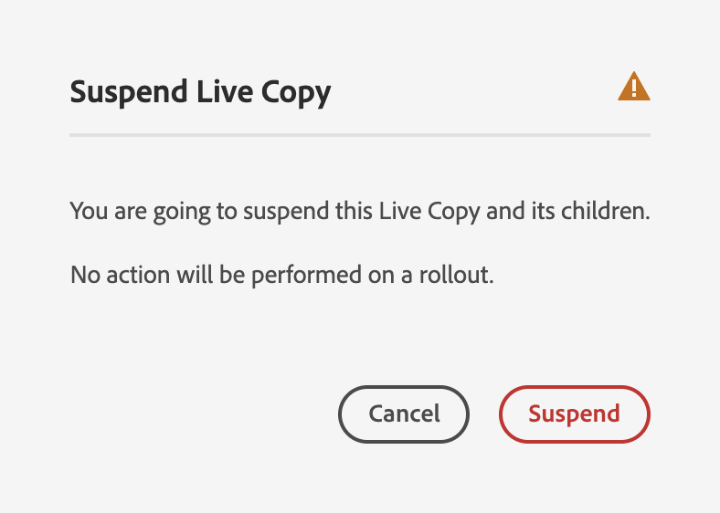

### Återupptar arv för en sida {#resuming-inheritance-for-a-page}

Att skjuta upp Live Copy-arv för en sida är en tillfällig åtgärd. När åtgärden **Återuppta** har inaktiverats blir åtgärden tillgänglig, vilket gör att du kan återskapa den aktiva relationen.

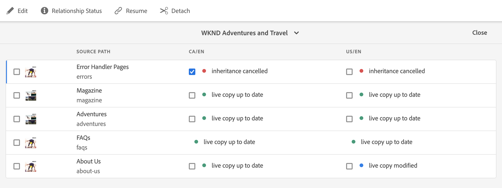

När du återaktiverar arv synkroniseras inte sidan automatiskt med källan. Du kan begära en synkronisering, om detta krävs, antingen:

* I dialogrutan **Fortsätt**/**Återgå**: till exempel:

   

* I ett senare skede, genom att manuellt välja synkroniseringsåtgärden.

>[!NOTE]
>
>När du återaktiverar arv synkroniseras inte sidan automatiskt med källan. Om det är nödvändigt kan du begära en synkronisering manuellt, antingen när du återupptar eller senare.

#### Återupptar arv från Sidegenskaper {#resuming-inheritance-from-page-properties}

När [pausats](#suspending-inheritance-from-page-properties) ändras åtgärden **Fortsätt** i verktygsfältet för sidegenskaperna:

När du väljer det här alternativet visas dialogrutan. Du kan välja en synkronisering, om det behövs, och sedan bekräfta åtgärden.

#### Återuppta en Live Copy-sida från Live Copy-översikten {#resume-a-live-copy-page-from-the-live-copy-overview}

Åtgärden [Återuppta är också tillgänglig från Live-kopieringsöversikten](live-copy-overview.md#using-the-live-copy-overview) när en Live-kopieringssida är markerad.

1. Öppna [Live Copy Overview](live-copy-overview.md#using-the-live-copy-overview) och välj en Live Copy-sida som har pausats. Sidan visas som **ARV AVBRUTEN**.
1. Välj **Fortsätt** i verktygsfältet.
1. Ange om du vill synkronisera sidan efter att du har återställt arvet och bekräfta sedan åtgärden **Återuppta** i dialogrutan **Återuppta Live-kopia**.

### Ändra arvsdjup (grund/djup) {#changing-inheritance-depth-shallow-deep}

I en befintlig Live-kopia kan du ändra siddjupet, dvs. om underordnade sidor ska tas med.

* Byt till en ytlig Live Copy:

   * Kommer att ha omedelbar effekt och är icke-reversibel.

   * Frigör underordnade sidor explicit från Live Copy. Ytterligare ändringar av underordnade kan inte bevaras om de ångras.

   * Tar bort alla underordnade `LiveRelationships` även om det finns kapslade `LiveCopies`.

* Byt till en djup Live Copy:

   * Lämnar underordnade sidor orörda.
   * Om du vill se effekten av switchen kan du göra en utrullning, så tillämpas alla innehållsändringar enligt utrullningskonfigurationen.

* Byt till en ytlig Live Copy och gå sedan tillbaka till:

   * Hanterar alla underordnade objekt i (tidigare) Grund Live Copy som om de skapats manuellt och därför flyttas bort med `[oldname]_msm_moved name`.

Så här anger eller ändrar du djup:

1. Öppna egenskaperna för Live Copy-sidan antingen med kommandot **Visa egenskaper** i konsolen **Platser** eller med **Sidinformation** i verktygsfältet för sidan.
1. Klicka på eller tryck på fliken **Live Copy**.
1. I avsnittet **Konfiguration** anger eller avmarkerar du alternativet **Live Copy-arv** beroende på om underordnade sidor är inkluderade:

   * Markerad - en djup Live-kopia (de underordnade sidorna inkluderas)
   * Avmarkerad - en tunn Live-kopia (underordnade sidor exkluderas)

   >[!CAUTION]
   >
   >Om du växlar till en ytlig Live-kopia får den omedelbar effekt och går inte att ångra.
   >
   >Mer information finns i [Live-kopior - Disposition](overview.md#live-copies-composition).

1. Klicka eller tryck på **Spara** för att behålla uppdateringarna.

### Avbryter arv för en komponent {#cancelling-inheritance-for-a-component}

Avbryt Live-kopiarv för en komponent så att komponenten inte längre är synkroniserad med källkomponenten. Du kan aktivera arv vid ett senare tillfälle om det behövs.

>[!NOTE]
>
>När du återaktiverar arv synkroniseras inte komponenten automatiskt med källan. Du kan begära en synkronisering manuellt om det behövs.

Avbryt arv för att ändra komponentinnehållet eller ta bort komponenten:

1. Klicka på eller tryck på den komponent som du vill avbryta arvet för.

   

1. Klicka eller tryck på ikonen **Avbryt arv** i komponentens verktygsfält.

   

1. Bekräfta åtgärden med **Ja** i dialogrutan Avbryt arv.

   Komponentverktygsfältet uppdateras med alla (lämpliga) redigeringskommandon.

### Återaktiverar arv för en komponent {#re-enabling-inheritance-for-a-component}

Om du vill aktivera arv för en komponent klickar eller trycker du på ikonen **Återaktivera arv** i komponentens verktygsfält.

### Ändra ordning på komponenter på en Live Copy-sida {#changing-the-order-of-components-on-a-live-copy-page}

Om en Live-kopia innehåller komponenter som är en del av ett styckesystem, kommer arvet av det styckesystemet att följa följande regler:

* Komponenternas ordning i ett ärvt styckesystem kan ändras, även om arv är etablerat.
* Vid utrullning återställs komponenternas ordning från ritningen. Om nya komponenter lades till i Live Copy innan de lanserades kommer de att ordnas om tillsammans med de komponenter ovanför vilka de lades till.
* Om arvet av styckesystemet avbryts återställs inte komponenternas ordning vid utrullning och förblir som i Live Copy.

>[!NOTE]
>
>När du återställer ett annullerat arv i ett styckesystem återställs inte ordningen på komponenterna **automatiskt** från ritningen. Du kan begära en synkronisering manuellt om det behövs.

Använd följande procedur för att avbryta arv av styckesystemet.

1. Öppna sidan Live Copy.
1. Dra en befintlig komponent till en ny plats på sidan.
1. I dialogrutan **Avbryt arv** bekräftar du åtgärden med **Ja**.

### Åsidosätta egenskaper för en Live Copy-sida {#overriding-properties-of-a-live-copy-page}

Sidegenskaperna för en Live-kopia-sida ärvs som standard från källsidan och kan inte redigeras.

Du kan avbryta arv av en egenskap när du behöver ändra egenskapsvärdet för Live-kopian. En länkikon anger att arv är aktiverat för egenskapen.

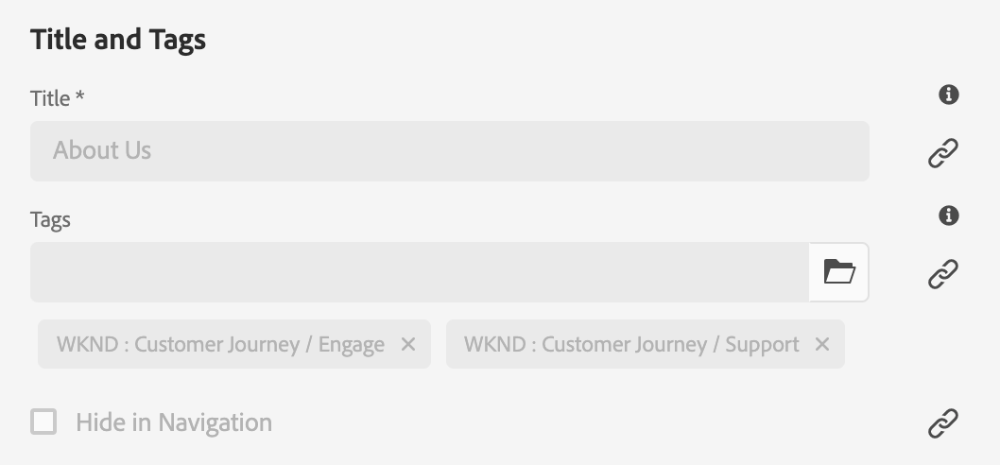

När du avbryter arv kan du ändra egenskapsvärdet. En ikon med en bruten länk anger att arvet har avbrutits.

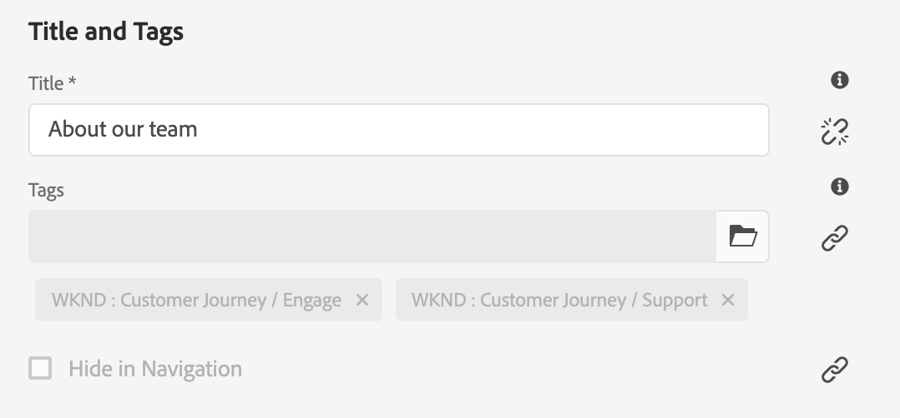

Du kan senare återaktivera arv för en egenskap om det behövs.

>[!NOTE]
>
>När du återaktiverar arv synkroniseras inte sidegenskapen Live Copy automatiskt med källegenskapen. Du kan begära en synkronisering manuellt om det behövs.

1. Öppna egenskaperna för Live Copy-sidan med antingen alternativet **Visa egenskaper** i konsolen **Platser** eller **Sidinformation** i verktygsfältet för sidan.
1. Om du vill avbryta arvet av en egenskap klickar eller trycker du på länkikonen som visas till höger om egenskapen.

   

1. I bekräftelsedialogrutan **Avbryt arv** klickar eller trycker du på **Yes**.

### Återställa egenskaper för en Live Copy-sida {#revert-properties-of-a-live-copy-page}

Om du vill aktivera arv för en egenskap klickar eller trycker du på ikonen **Återställ arv** som visas bredvid egenskapen.

### Återställa en Live Copy-sida {#resetting-a-live-copy-page}

Du kan återställa en Live Copy-sida om du vill:

* Ta bort alla annulleringar av arv och
* Returnera sidan till samma läge som källsidan.

Återställningen påverkar ändringar som du har gjort i sidegenskaper, styckesystem och komponenter.

#### Återställ en Live Copy-sida från Sidegenskaperna {#reset-a-live-copy-page-from-the-page-properties}

1. I konsolen **Platser** markerar du sidan Live-kopia och väljer **Visa egenskaper**.
1. Öppna fliken **Live Copy**.
1. Välj **Återställ** i verktygsfältet.

   

1. I dialogrutan **Återställ Live Copy** bekräftar du med **Återställ**.

#### Återställ en Live Copy-sida från Live Copy-översikten {#reset-a-live-copy-page-from-the-live-copy-overview}

Åtgärden [**Återställ** är även tillgänglig från Live-kopieringsöversikten](live-copy-overview.md#using-the-live-copy-overview) när en Live-kopieringssida är markerad.

1. Öppna [Live Copy Overview](live-copy-overview.md#using-the-live-copy-overview) och välj en Live Copy-sida.
1. Välj **Återställ** i verktygsfältet.
1. Bekräfta åtgärden **Återställ** i dialogrutan **Återställ Live Copy**:

   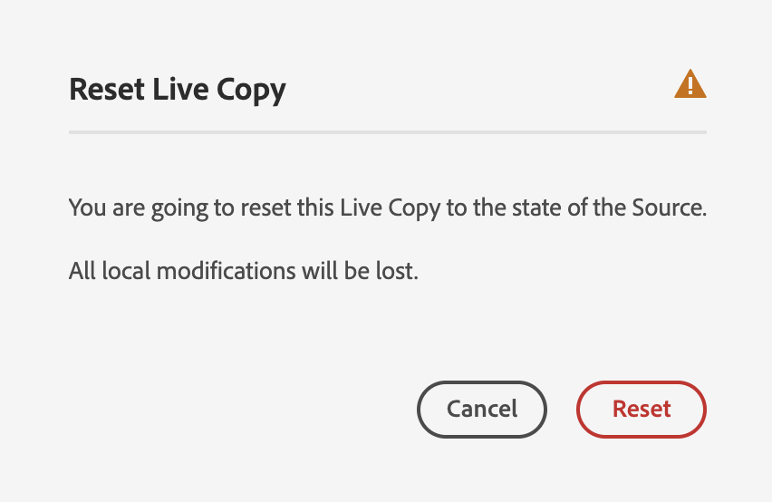

## Jämföra en Live Copy-sida med en blå sida {#comparing-a-live-copy-page-with-a-blueprint-page}

Om du vill spåra de ändringar du har gjort kan du visa sidan med utkast i **Referenser** och jämföra den med sidan med Live Copy:

1. I konsolen **Platser**, [navigerar du till en plan- eller Live Copy-sida och markerar den.](/help/sites-cloud/authoring/getting-started/basic-handling.md#viewing-and-selecting-resources)
1. Öppna panelen **[Referenser](/help/sites-cloud/authoring/getting-started/basic-handling.md#references)** och välj något av följande alternativ beroende på sammanhanget:

   * **Blueprint**
   * **Live-kopior**

1. Välj en specifik Live Copy beroende på sammanhanget:

   * **Jämför med skiss**
   * **Jämför med Live Copy**

   Till exempel:

   

1. Live Copy- och designsidorna öppnas sida vid sida.

   Mer information om hur du använder jämförelsefunktionen finns i [Sidskillnad](/help/sites-cloud/authoring/features/page-diff.md).

## Koppla loss en Live-kopia {#detaching-a-live-copy}

Kopplingsåtgärden tar permanent bort den aktiva relationen mellan en Live-kopia och dess käll-/ritningssida. Alla MSM-relevanta egenskaper tas bort från Live Copy och Live Copy-sidorna blir en fristående kopia.

>[!CAUTION]
>
>Du kan inte återskapa direktrelationen när du har kopplat loss Live-kopian.
>
>Om du vill ta bort den aktiva relationen med alternativet att återinföra den senare kan du [avbryta arv av Live-kopia](#suspending-inheritance-for-a-page) för sidan.

Det påverkar var i trädet du använder **Koppla loss**:

* **Frigör på en rotsida i en Live-kopia**

   När den här åtgärden utförs på rotsidan för en Live-kopia tas den aktiva relationen mellan alla sidor i planen och dess Live-kopia bort.

   Ytterligare ändringar av sidor i utkastet **påverkar inte Live-kopian.**

* **Frigöra på en undersida till en Live-kopia**

   När den här åtgärden utförs på en undersida (eller en gren) i en Live-kopia:

   * Den aktiva relationen tas bort för den undersidan (eller grenen) och
   * (under)sidorna i Live Copy-grenen behandlas som om de skapats manuellt.

   Undersidorna är dock fortfarande beroende av den överordnade grenens aktiva relation, så en ytterligare utrullning av ritningssidan/-sidorna kommer att göra båda:

   1. Byt namn på den eller de frånkopplade sidorna:

      * Detta beror på att MSM betraktar dem som manuellt skapade sidor som orsakar en konflikt eftersom de har samma namn som de Live Copy-sidor som de försöker skapa.
   1. Skapa en ny Live Copy-sida med det ursprungliga namnet som innehåller ändringarna från utrullningen.

   >[!NOTE]
   >
   >Mer information om sådana situationer finns i [MSM-utrullningskonflikter](rollout-conflicts.md).

### Frigör en Live Copy-sida från Sidegenskaperna {#detach-a-live-copy-page-from-the-page-properties}

Så här frigör du en Live-kopia:

1. I konsolen **Platser** väljer du sidan Live-kopia och klickar eller trycker på **Visa egenskaper**.
1. Öppna fliken **Live Copy**.
1. Välj **Koppla loss** i verktygsfältet.

   

1. En bekräftelsedialogruta visas. Välj **Koppla loss** för att slutföra åtgärden.

### Koppla loss en Live Copy-sida från Live Copy-översikten {#detach-a-live-copy-page-from-the-live-copy-overview}

Åtgärden [Koppla loss är även tillgänglig från Live-kopieringsöversikten](live-copy-overview.md#using-the-live-copy-overview) när en Live-kopieringssida är markerad.

1. Öppna [Live Copy Overview](live-copy-overview.md#using-the-live-copy-overview) och välj en Live Copy-sida.
1. Välj **Koppla loss** från verktygsfältet.
1. Bekräfta åtgärden **Koppla loss** i dialogrutan **Koppla loss Live Copy**:

   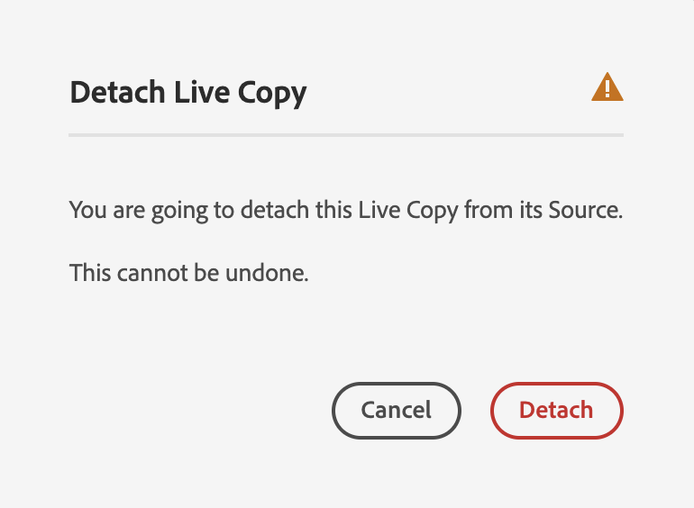
