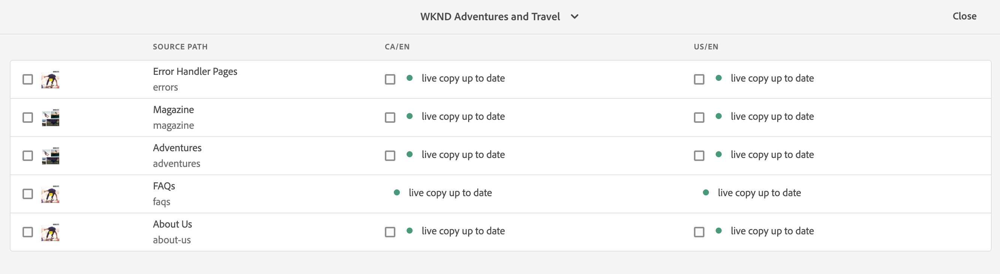
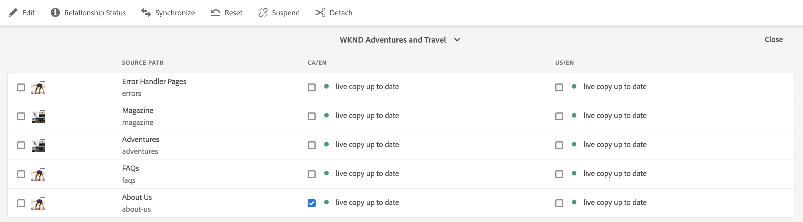
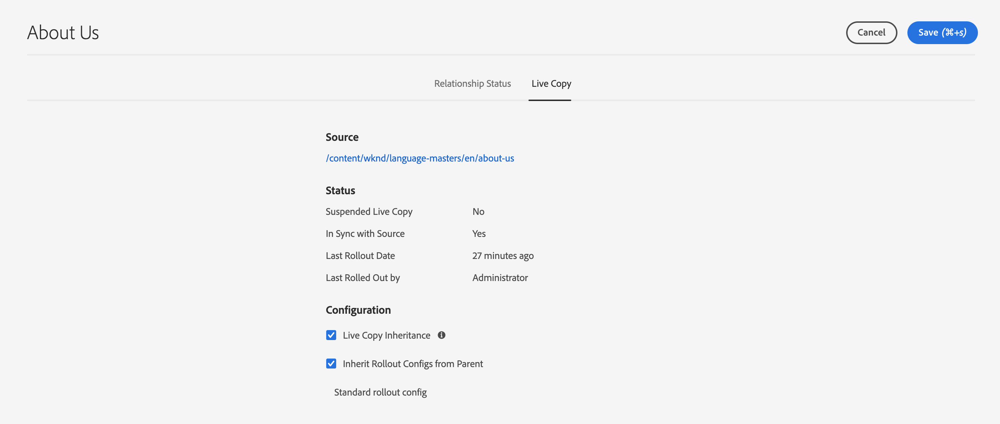

# Översiktskonsol för Live Copy {#live-copy-overview-console}

The **Live Copy - översikt** konsolen gör att du kan:

* Visa/hantera arv på en webbplats.
   * Visa det blå trädet och motsvarande Live Copy-struktur, tillsammans med deras arvsstatus
   * Ändra arvsstatus, till exempel att avbryta och återuppta
   * Visa egenskaper för utkast och Live Copy
* Utför utrullningsåtgärder.

## Öppna Live Copy-översikt {#opening-the-live-copy-overview}

Du kan öppna Live-kopieringsöversikt från:

* [Panelen Referenser till en översiktssida (Sites console)](#opening-live-copy-overview-references-for-a-blueprint-page)
* [Egenskaper för en ritningssida](#opening-live-copy-overview-properties-of-a-blueprint-page)

### Referenser till en designsida {#references-to-a-blueprint-page}

The **Live Copy - översikt** kan öppnas från **Referenser** sidpanelen på **Webbplatser** konsol:

1. I **Webbplatser** konsol, [navigera till din ritningssida och markera den.](/help/sites-cloud/authoring/getting-started/basic-handling.md#viewing-and-selecting-resources)
1. Öppna **[Referenser](/help/sites-cloud/authoring/getting-started/basic-handling.md#references)** markera **Live-kopior**.

   

   >[!TIP]
   >
   >Du kan också öppna referenser först och sedan välja en plan.

1. Välj **Live Copy - översikt** om du vill visa och använda översikten över alla Live-kopior som hör till den valda planen.
1. Använd **Stäng** för att avsluta och återgå till **Webbplatser** konsol.

### Egenskaper för en blå sida {#properties-of-a-blueprint-page}

The **Live Copy - översikt** kan öppnas när du visar egenskaper för en ritningssida:

1. Öppna **Egenskaper** för lämplig ritningssida.
1. Öppna **Blueprint** -fliken - **Live Copy - översikt** visas i det övre verktygsfältet:

   

1. Välj **Live Copy - översikt** om du vill visa och använda översikten över alla Live-kopior som hör till den aktuella planen.

1. Använd **Stäng** för att avsluta och återgå till **Webbplatser** konsol.

## Använda Live Copy-översikt {#using-the-live-copy-overview}

The **Live Copy - översikt** I visas och visas en översikt över statusen för de Live-kopior som hör till den markerade sidan.

En utrullning beror på de synkroniseringsåtgärder som har definierats i den specifika utrullningskonfigurationen. Vissa åtgärder är beroende av ändringar i innehållet. Men det finns också många åtgärder som inte är beroende av ändringar i innehållet, men som är beroende av händelser som till exempel sidaktivering. Sådana händelser ändrar inte innehållet, men ändrar de interna egenskaperna som är relaterade till innehållet.

Statusfälten är också beroende av de synkroniseringsåtgärder som har definierats i den specifika rollout-konfigurationen och anger om det finns några sådana åtgärder för antingen utkast eller Live Copy sedan den senaste lyckade utrullningen. Ett statusfält återspeglar bara åtgärderna i den specifika utrullningskonfigurationen. Om ingen lyckad utrullning har utförts på en Live-kopia visas alltid statusen aktuell.

En utrullningskonfiguration definieras som `targetActivate`. Därför är en utrullning endast beroende av aktiveringshändelser. Statusfältet anger bara om några aktiveringshändelser har inträffat sedan den senaste utrullningen.

The **Live Copy - översikt** kan även användas för att utföra åtgärder på Live Copy:

1. Öppna **Live Copy - översikt**.
1. Välj önskad plan- eller Live Copy-sida så uppdateras verktygsfältet så att de tillgängliga åtgärderna visas. The [funktionsmakron](overview.md#terms-used) beroende på om du väljer [skiss](#actions-for-a-blueprint-page) eller [Live Copy](#actions-for-a-live-copy-page) sida.

### Åtgärder för en designsida {#actions-for-a-blueprint-page}

När du väljer en ritningssida är följande åtgärder tillgängliga:

* **Redigera** - Öppna ritningssidan för redigering.
* **[Utrullning](overview.md#rollout-and-synchronize)** - Utför en utrullning för att föra över ändringar från källan till Live Copy.

### Åtgärder för en Live Copy-sida {#actions-for-a-live-copy-page}

När du väljer en Live Copy-sida är följande åtgärder tillgängliga:

* **Redigera** - Öppna sidan Live Copy för redigering.
* **[Relationsstatus](#relationship-status)** - Visa information om status och arv.
* **[Synkronisera](overview.md#rollout-and-synchronize)** - Synkronisera en Live-kopia för att dra ändringar från källan till Live-kopian.
* **[Återställ](creating-live-copies.md#resetting-a-live-copy-page)** - Återställ en Live Copy-sida om du vill ta bort alla arvsannulleringar och återställa sidan till samma läge som källsidan.
* **[Gör uppehåll](overview.md#suspending-and-cancelling-inheritance-and-synchronization)** - Inaktiverar tillfälligt relationen mellan en Live-kopia och dess designsida.
* **[Återuppta](creating-live-copies.md#resuming-inheritance-for-a-page)** - Med Återuppta kan du återskapa en pausad relation.
* **[Koppla loss](overview.md#detaching-a-live-copy)** - Tar permanent bort den aktiva relationen mellan en Live Copy och dess designsida.

## Relationsstatus {#relationship-status}

The **Relationsstatus** konsolen har två flikar med en rad funktioner.

* [Relationsstatus](#relationship-status-tab)
* [Live Copy](#live-copy-tab)

### Relationsstatus {#relationship-status-tab}

Fliken innehåller detaljerad information om statusen för relationen mellan ritningen och Live Copy.

### Live Copy {#live-copy-tab}

På den här fliken kan du visa och redigera Live Copy-konfigurationen.

