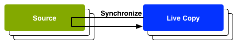

# Återanvända innehåll: Multi Site Manager och Live Copy {#multi-site-manager-and-live-copy}

Med Multi Site Manager (MSM) kan du använda samma platsinnehåll på flera platser. MSM använder sin Live Copy-funktion för att uppnå detta.

* Med MSM kan man
   * Skapa innehåll en gång och sedan
   * Återanvänd det här innehållet i andra områden (via [Live-kopior](#live-copies)) på samma eller andra platser.
* MSM upprätthåller sedan Live-relationerna mellan källinnehållet och dess Live-kopior så att:
   * När du ändrar källinnehållet synkroniseras källan och Live-kopior.
   * Du kan bara justera innehållet i Live-kopior genom att koppla från direktrelationen för enskilda undersidor och/eller komponenter.

Den här sidan ger en översikt över återanvändning av innehåll med MSM. Följande sidor handlar om relaterade frågor i detalj.

* [Skapa och synkronisera Live-kopior](creating-live-copies.md)
* [Översiktskonsol för Live Copy](live-copy-overview.md)
* [Konfigurera Live Copy-synkronisering](live-copy-sync-config.md)
* [MSM-utrullningskonflikter](rollout-conflicts.md)
* [MSM Best Practices](best-practices.md)

>[!NOTE]
>
>MSM kan även användas för Assets, inklusive innehållsfragment. Se [Återanvända innehållsfragment med MSM för Assets](/help/assets/reuse-assets-using-msm.md) (endast tillgängligt via Assets-konsolen).

## Möjliga scenarier {#possible-scenarios}

Det finns många användningsområden för MSM och Live-kopior. Exempel:

* **Multinationals - Global till lokalt företag**

  Ett typiskt användningsfall som MSM stöder är att återanvända innehåll på flera multinationella webbplatser på samma språk. Detta gör det möjligt att återanvända kärninnehållet, samtidigt som nationella variationer tillåts.

  Den engelska delen av [WKND-självstudieexemplet](/help/implementing/developing/introduction/develop-wknd-tutorial.md) skapas till exempel för kunder i USA. Det mesta av innehållet på denna webbplats kan också användas för andra WKND-webbplatser som passar för engelsktalande kunder i olika länder och kulturer. Kärninnehållet är detsamma på alla webbplatser, och regionala justeringar kan göras.

  Följande struktur kan användas för webbplatser för USA och Kanada. Observera hur noden `language-masters` underhåller huvudkopian av inte bara engelskt utan även annat språkinnehåll. Innehållet kan användas som bas för ytterligare regionalt språkinnehåll vid sidan av engelska.

  ```xml
  /content
      |- wknd
          |- language-masters
              |- en
              |- es
              |- fr
          |- us
              |- en
              |- es
          |- ca
              |- en
              |- fr
  ```

  >[!NOTE]
  >
  >MSM översätter inte innehållet. Den används för att skapa den struktur som krävs och distribuera innehållet.
  >
  >
  >Ett sådant exempel finns i [Översätta innehåll för flerspråkiga platser](/help/sites-cloud/administering/translation/overview.md).

* **Nationell - chef för de regionala avdelningarna**

  Ett företag med ett nätverk av återförsäljare kan också vilja ha separata webbplatser för sina enskilda återförsäljare, vilket var och en är en variation av huvudwebbplatsen som huvudkontoret tillhandahåller. Detta kan gälla ett enskilt företag med flera regionala kontor eller ett nationellt franchisystem som består av en central franchisor och flera lokala franchisetagare.

  Huvudkontoret kan tillhandahålla viktig information, medan de regionala enheterna kan lägga till lokal information, som kontaktuppgifter, öppettider och händelser.

  ```xml
  /content
      |- head-office-berlin
      |- branch-hamburg
      |- branch-stuttgart
      |- branch-munich
      |- branch-frankfurt
  ```

* **Flera versioner**

  MSM kan skapa versioner av en viss underavdelning. En supportunderwebbplats kan t.ex. innehålla information om olika versioner av en viss produkt, där basinformationen är konstant och endast de uppdaterade funktionerna behöver ändras:

  ```xml
  /content
      |- game-support
          |- polybius
              |- v5.0
              |- v4.0
              |- v3.0
              |- v2.0
              |- v1.0
  ```

  >[!TIP]
  >
  >I ett sådant scenario är detta frågan om huruvida en enkel kopia ska skapas eller om Live-kopior ska användas, vilket är en balans mellan:
  >
  >* Hur mycket av det centrala innehållet behöver uppdateras över flera versioner.
  >
  >Mot:
  >
  >* Hur mycket av de enskilda kopiorna måste justeras.

## MSM från användargränssnittet {#msm-from-the-ui}

MSM är direkt tillgängligt i användargränssnittet med hjälp av olika alternativ från rätt konsol.

* **Skapa plats** (**platser**)

   * Med MSM kan du hantera flera webbplatser som delar gemensamt innehåll. Till exempel tillhandahålls webbplatser ofta för internationella målgrupper så att det mesta av innehållet är gemensamt i alla länder, med en delmängd av innehållet som är specifikt för det enskilda landet. Med MSM kan du [skapa Live-kopior som automatiskt uppdaterar en eller flera webbplatser baserat på källplatsen](creating-live-copies.md#creating-a-live-copy-of-a-site-from-a-blueprint-configuration). Detta hjälper er också att genomdriva en gemensam basstruktur, använda det gemensamma innehållet på flera webbplatser, bibehålla en gemensam design och känsla och fokusera på att hantera det innehåll som faktiskt skiljer sig åt mellan webbplatserna. Skapa en plats på det här sättet:
      * Kräver en fördefinierad ritningskonfiguration för att ange källan.
      * Skapar en Live-kopia av (fördefinierad) källan.
      * Ger användaren knappen **Rollout**.

* **Skapa Live-kopia** (**Webbplatser**)

   * Med MSM kan du [skapa en tillfällig (engångs) Live-kopia av en enskild sida eller underavdelning till en webbplats](creating-live-copies.md#creating-a-live-copy-of-a-page). Du kan till exempel duplicera en underavdelning för att få information om en ny/uppdaterad version av en produkt. Skapa en Live-kopia på följande sätt:
      * Skapar en tillfällig Live Copy (ingen plantryckskonfiguration krävs).
      * Kan användas för att (omedelbart) skapa en Live-kopia av valfri sida/gren.
      * Kräver **Synkronisera** (knappen **Utrullning** finns inte).

* **Visa egenskaper** (**Webbplatser**)

   * Om det är lämpligt kan du med det här alternativet [övervaka din Live-kopia](creating-live-copies.md#monitoring-your-live-copy) genom att ange information om relaterade **Live-kopior** eller **utkast**.

* **Referenser** (**Webbplatser**)

   * Ratten [Referenser](/help/sites-cloud/authoring/basic-handling.md#references) innehåller information om **Live-kopior** tillsammans med tillgång till lämpliga åtgärder.

* **Översikt över Live-kopia** (**Webbplatser**)

   * Med den här konsolen kan du [visa och hantera din plan och dess Live-kopior](live-copy-overview.md).

* **Utskrifter** (**Verktyg** - **Webbplatser**)

   * Med den här konsolen kan du [skapa och hantera dina ritningskonfigurationer](creating-live-copies.md#creating-a-blueprint-configuration).

>[!NOTE]
>
>MSM kan användas med båda sidorna och [Experience Fragments](/help/sites-cloud/authoring/fragments/experience-fragments.md) eftersom dessa fragment är en del av en upplevelse (sida).

>[!NOTE]
>
>Aspekter på MSM-funktioner används i flera andra AEM-funktioner, som Launches. I dessa fall hanteras Live-kopian av den funktionen.

### Använda termer {#terms-used}

Som en introduktion ger följande tabell en översikt över de viktigaste termerna som används med MSM. Dessa beskrivs mer ingående i de efterföljande avsnitten och sidorna.

| Term | Definition | Ytterligare information |
|---|---|---|
| Source | Originalsidorna används som bas för Live-kopior | Synonyma med utkast och/eller dekorsidor |
| Live Copy | Kopian (av källan), som underhålls av synkroniseringsåtgärder som definieras av rollout-konfigurationerna |  |
| Konfiguration av Live Copy | Definition av konfigurationsinformation för en Live-kopia |  |
| Live-relation | Effektiv definition av arvet för en given resurs, det vill säga anslutningen/anslutningarna mellan källan och Live-kopior | Ser till att ändringar i källan kan synkroniseras med Live Copy |
| Blueprint | Synonymt med Source | Kan definieras med en ritningskonfiguration |
| Konfiguration av utkast | Fördefinierad konfiguration som anger en källsökväg | När en ritningssida refereras i en ritningskonfiguration blir kommandot Överrullning tillgängligt |
| Kapitel | De avsnitt i planen som ska ingå i Live Copy | Dessa är vanligtvis undersidor till roten |
| Synkronisering | Den generiska termen för synkronisering av innehåll mellan källan och Live-kopior (av alternativen **Rollout** och **Synkronisera**) |  |
| Utrullning | Synkroniserar från källan till Live Copy | Kan utlösas av en författare (på en ritningssida) eller av en systemhändelse (som definieras av utrullningskonfigurationen) |
| Konfiguration av utrullning | Regler som bestämmer vilka egenskaper som ska synkroniseras, hur och när |  |
| Synkronisera | Manuell begäran om synkronisering, gjord från Live Copy-sidorna |  |
| Arv | En Live Copy-sida/-komponent ärver innehåll från sin källsida/källkomponent när synkronisering sker |  |
| Gör uppehåll | Tar tillfälligt bort den aktiva relationen mellan en Live Copy och dess designsida |  |
| Koppla loss | Tar permanent bort den aktiva relationen mellan en Live Copy och dess designsida |  |
| Återställ | Återställ en Live Copy-sida om du vill ta bort alla arvsannulleringar och återställa sidan till samma läge som källsidan | Återställ påverkar alla ändringar som du har gjort i sidegenskaperna, styckesystemet och komponenterna. |
| Grund | A Live Copy of a single page |  |
| Djup | En Live-kopia av en sida, tillsammans med dess underordnade sidor |  |

>[!TIP]
>
>Mer information om objektnamnen finns i [Utöka Multi Site Manager](/help/implementing/developing/extending/msm.md#overview-of-the-java-api).

## Live-kopior {#live-copies}

En MSM Live Copy är en kopia av specifikt webbplatsinnehåll som har en aktiv relation till den ursprungliga källan:

* Live-kopian ärver innehåll från sin källa.
* Synkroniseringen utför den faktiska överföringen av innehåll när ändringar görs i källan.
* En Live-kopia kan betraktas som antingen:
   * Grund: en sida
   * Djup: sidan tillsammans med de underordnade sidorna
* Synkroniseringsregler, som kallas rollout-konfigurationer, avgör vilka egenskaper som synkroniseras och när synkroniseringen görs.

I föregående exempel är `/content/wknd/language-masters/en` den globala huvudwebbplatsen på engelska. MSM Live-kopior skapas för att återanvända innehållet på den här webbplatsen:

* Innehållet under `/content/wknd/language-masters/en` är källan.
* Innehållet under `/content/wknd/language-masters/en` kopieras under noderna `/content/wknd/us/en/` och `/content/wknd/ca/en`. Det här är Live-kopior.
* Författare ändrar sidor under `/content/wknd/language-masters/en`.
* När MSM aktiveras synkroniseras dessa ändringar med Live-kopior.

### Live-kopior - komposition {#live-copies-composition}

>[!NOTE]
>
>Diagrammen och beskrivningarna i det här avsnittet representerar ögonblicksbilder av potentiella Live-kopior. De är inte heltäckande, men ger en översikt som framhäver specifika egenskaper.

När du först skapar en Live-kopia återspeglas de valda källsidorna på :1-basis i Live-kopian. Därefter kan nya resurser (sidor och/eller stycken) också skapas direkt i Live-kopian, så det är praktiskt att vara medveten om dessa variationer och hur de påverkar synkroniseringen. Möjliga kompositioner:

* [Live Copy med icke-Live-Copy-sidor](#live-copy-with-non-live-copy-pages)
* [Kapslade Live-kopior](#nested-live-copies)

Det grundläggande formuläret i Live Copy har:

* Live Copy-sidor som återspeglar de valda källsidorna på 1:1-basis.
* En konfigurationsdefinition.
* En liverelation definierad för varje resurs:
   * Länka Live Copy-resursen med dess plan/källa.
   * Används vid arv och utrullning.

Ändringar kan [synkroniseras](creating-live-copies.md#synchronizing-your-live-copy) enligt krav.


#### Live-kopia med icke-Live-Copy-sidor {#live-copy-with-non-live-copy-pages}

När du skapar en Live-kopia i AEM kan du se och navigera genom Live Copy-grenen och använda de vanliga AEM-funktionerna i Live Copy-grenen. Det innebär att du (eller en process) kan skapa nya resurser (sidor och/eller stycken) inuti Live-kopian. Exempel: en produkt för ett visst område eller land.

* Sådana resurser har ingen aktiv relation till käll-/ritningssidorna och är inte synkroniserade.
* Scenarier kan inträffa som MSM hanterar som specialfall. När du till exempel (eller en process) skapar en sida med samma position och namn i både käll-/ritytan och Live-kopieringsgrenarna. Mer information finns i [MSM-utrullningskonflikter](rollout-conflicts.md).


#### Kapslade Live-kopior {#nested-live-copies}

När du (eller en process) skapar en [ny sida i en befintlig Live-kopia](#live-copy-with-non-live-copy-pages) kan den nya sidan också skapas som en Live-kopia av en annan plan. Detta kallas en kapslad Live Copy. I kapslade Live-kopior påverkas beteendet för den andra eller inre Live-kopian av den första eller yttre Live-kopian på följande sätt:

* En djup utrullning som utlöses för Live Copy på den översta nivån kan fortsätta till den kapslade Live Copy.
* Alla länkar mellan källorna skrivs om i Live-kopior.

Till exempel skrivs länkar som pekar från den andra till den första utkast om som länkar som pekar från den kapslade/andra Live-kopian till den första Live-kopian.


>[!NOTE]
>
>Om du flyttar eller byter namn på en sida i Live Copy-grenen behandlas den som en kapslad Live Copy så att AEM kan spåra relationerna.

#### Skiktade Live-kopior {#stacked-live-copies}

En Live-kopia kallas för en staplad Live-kopia när den skapas som underordnad till en ytlig Live-kopia. Det fungerar på samma sätt som en [kapslad Live-kopia](#nested-live-copies).

### Source, skiss- och designkonfigurationer {#source-blueprints-and-blueprint-configurations}

Alla sidor och sidgrenar kan användas som källa för en Live-kopia. Med MSM kan du dock även definiera en ritningskonfiguration som anger en källsökväg. Fördelarna med att använda en designkonfiguration är att de

* Tillåt författaren att använda alternativet **Rollout** i en plan. Det vill säga att uttryckligen skicka ändringar till Live-kopior som ärver från den här ritningen.
* Tillåt författaren att använda **Skapa plats**. På så sätt kan användaren enkelt välja språk och konfigurera strukturen för Live-kopian.
* Definiera en standardkonfiguration för utrullning för Live-kopior som har en relation till ritningen.

Källan för en Live-kopia kan vara antingen vanliga sidor eller sidor som omfattas av en designkonfiguration. Båda är giltiga användningsfall.

Källan utgör utkast för Live Copy. Planen definieras när du antingen:

* [Skapa en utkast](creating-live-copies.md#creating-a-blueprint-configuration) - I konfigurationen definieras de sidor som ska användas för att skapa Live-kopian i förväg.
* [Skapa en Live-kopia av en sida](creating-live-copies.md#creating-a-live-copy-of-a-page) - De sidor som används för att skapa Live-kopian (källsidorna) är de blå sidorna. Källsidan kan refereras till av en ritningskonfiguration eller inte.

### Utrullning och synkronisering {#rollout-and-synchronize}

En utrullning är den centrala MSM-åtgärden som synkroniserar Live-kopior med sina källor. Du kan utföra rollouts manuellt eller så kan de utföras automatiskt.

* En [utrullningskonfiguration](#rollout-configurations) kan definieras så att specifika [händelser](live-copy-sync-config.md#rollout-triggers) kan orsaka en automatisk utrullning.
* När du redigerar en ritningssida kan du använda kommandot **[Rollout](creating-live-copies.md#rolling-out-a-blueprint)** för att skicka ändringar till Live-kopian.
   * Kommandot **Rollout** är tillgängligt på en ritningssida som refereras av en ritningskonfiguration.

  

* När du skapar en Live Copy-sida kan du använda kommandot **[Synkronisera](creating-live-copies.md#synchronizing-a-live-copy)** för att dra ändringar från källan till Live-kopian.
   * Kommandot **Synkronisera** är alltid tillgängligt på Live-kopieringssidan oavsett om käll-/plantryckssidan omfattas av en plankonfiguration eller inte.

  

### Utrullningskonfigurationer {#rollout-configurations}

En utrullningskonfiguration definierar när och hur en Live Copy synkroniseras med källinnehållet. En utrullningskonfiguration består av en utlösare och en eller flera synkroniseringsåtgärder:

* **Utlösare** - En utlösare är en händelse som gör att synkroniseringen av aktiva åtgärder utförs, till exempel aktiveringen av en källsida. MSM definierar de utlösare som du kan använda.
* **Synkroniseringsåtgärder** - Synkroniseringsåtgärder utförs på Live-kopian för att synkronisera den med källan. Exempelåtgärder är att kopiera innehåll, ordna underordnade noder och aktivera sidan Live Copy. MSM erbjuder flera synkroniseringsåtgärder.

>[!NOTE]
>
>Du kan skapa anpassade åtgärder för instansen med Java API.

Utrullningskonfigurationer kan återanvändas så att fler än en Live Copy kan använda samma utrullningskonfiguration. Flera [utrullningskonfigurationer](live-copy-sync-config.md#installed-rollout-configurations) ingår i en standardinstallation.

### utrullningskonflikter {#rollout-conflicts}

Utrullningar kan bli komplicerade, särskilt när författare redigerar innehåll i både källan och Live-kopian. Det är därför användbart att vara medveten om hur AEM hanterar eventuella [konflikter som kan uppstå under utrullning](rollout-conflicts.md).

### Inaktivera och avbryta arv och synkronisering {#suspending-and-cancelling-inheritance-and-synchronization}

Varje sida och komponent i en Live Copy kopplas till sin källsida och komponent via en live-relation. Live-relationen konfigurerar synkroniseringen av Live Copy-innehåll från källan.

Du kan **pausa** arvet av Live-kopia för en Live-kopia-sida så att du kan ändra sidegenskaper och komponenter. När du gör uppehåll i arv synkroniseras inte längre sidegenskaperna och komponenterna med källan.

När en enskild sida redigeras kan författare **avbryta arv** för en komponent. När arvet avbryts pausas direktrelationen och synkronisering sker inte för den komponenten. Att avbryta arv och synkronisering är användbart när underavsnitt av innehållet måste anpassas.

### Koppla loss en Live-kopia {#detaching-a-live-copy}

Du kan också [koppla loss en Live-kopia](creating-live-copies.md#detaching-a-live-copy) från dess utkast om du vill ta bort alla anslutningar.

>[!CAUTION]
>
>Frigör är permanent och icke-reversibel.

Frigör-åtgärden tar permanent bort den aktiva relationen mellan en Live-kopia och dess designsida. Alla MSM-relevanta egenskaper tas bort från Live Copy och Live Copy-sidorna blir en fristående kopia.

>[!TIP]
>
>Mer information finns i [Koppla loss en Live-kopia](creating-live-copies.md#detaching-a-live-copy), inklusive relaterad påverkan på underordnade och överordnade sidor.

## Standardsteg för att använda MSM {#standard-steps-for-using-msm}

Följande steg beskriver standardproceduren för att använda MSM för att återanvända innehåll och synkronisera ändringar i Live-kopior.

1. Utveckla innehållet på källwebbplatsen.
1. Bestäm vilken utrullningskonfiguration som ska användas.

   1. MSM [installerar flera utrullningskonfigurationer](live-copy-sync-config.md#installed-rollout-configurations) som kan uppfylla flera användningsfall.
   1. Du kan också [skapa en utrullningskonfiguration](live-copy-sync-config.md#creating-a-rollout-configuration) om det behövs.

1. Bestäm var du behöver [ange de rollout-konfigurationer som ska användas](live-copy-sync-config.md#specifying-the-rollout-configurations-to-use) och konfigurera efter behov.
1. Om det behövs kan du [skapa en designkonfiguration](creating-live-copies.md#creating-a-blueprint-configuration) som identifierar källinnehållet i Live-kopian.
1. [Skapa en Live-kopia](creating-live-copies.md#creating-a-live-copy).
1. Ändra källinnehållet efter behov. Ni bör använda den normala process för granskning och godkännande av innehåll som er organisation har etablerat.
1. [Rulla ut](creating-live-copies.md#rolling-out-a-blueprint) ritningen eller [synkronisera Live-kopian](creating-live-copies.md#synchronizing-a-live-copy) med ändringarna.

## Anpassa MSM {#customizing-msm}

MSM tillhandahåller verktyg så att implementeringen kan anpassas till de stora svårigheter som kan uppstå när du delar innehåll.

* **Anpassade utrullningskonfigurationer** - [Skapa en utrullningskonfiguration](live-copy-sync-config.md#creating-a-rollout-configuration) när de installerade utrullningskonfigurationerna inte uppfyller dina krav. Du kan använda alla tillgängliga utlösare och synkroniseringsåtgärder.

<!--
* **Custom Synchronization Actions** - [Create a custom synchronization action](/help/sites-developing/extending-msm.md#creating-a-new-synchronization-action) when the installed actions do not meet your specific application requirements. MSM provides a Java API for creating custom synchronization actions.
-->

## Bästa praxis {#best-practices}

Sidan [MSM Best Practices](best-practices.md) innehåller viktig information om implementeringen.
