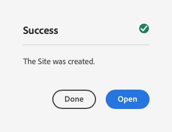

# Skapa en plats {#creating-site}

Lär dig hur du använder AEM skapa en webbplats med hjälp av webbplatsmallar för att definiera webbplatsens format och struktur.

>[!CAUTION]
>
>Verktyget Skapa snabbwebbplats är för närvarande en förhandsgranskning av teknik. Den tillhandahålls för testning och utvärdering och är inte avsedd för användning i produktionen om inte Adobe Support har kommit överens om det.

## Översikt {#overview}

Innan innehållsförfattare kan skapa sidor med innehåll måste webbplatsen först skapas. Detta utförs vanligtvis av en AEM som definierar platsens ursprungliga struktur. Med hjälp av webbplatsmallar kan du snabbt och flexibelt skapa webbplatser.

Med AEM snabbverktyg kan andra användare snabbt skapa en ny webbplats från grunden med hjälp av webbplatsmallar.

Med verktyget Skapa snabbwebbplats kan du snabbt anpassa temat och formatet för den AEM webbplatsen (JavaScript, CSS och statiska resurser). Detta gör att gränssnittsutvecklaren, som inte behöver ha någon kunskap om AEM, kan arbeta separat och parallellt med innehållsskaparna. Den AEM administratören laddar ned webbplatstemat och skickar det till den frontendutvecklare som anpassar det med sina favoritverktyg och sedan implementerar ändringarna i den AEM koddatabasen, som sedan distribueras.

Det här dokumentet fokuserar på att skapa webbplatser med verktyget Skapa snabbwebbplats. Om du vill ha en översikt över arbetsflödet för att skapa och anpassa webbplatser kan du läsa [AEM för att skapa webbplatser snabbt](/help/journey-sites/quick-site/overview.md)

## Struktur för planeringswebbplats {#structure}

Ta tid till att fundera över webbplatsens syfte och planerade innehåll långt i förväg. Detta styr hur du utformar webbplatsens struktur. En bra webbplatsstruktur har stöd för enkel navigering och innehållsidentifiering för webbplatsens besökare, liksom för olika AEM funktioner som [hantering och översättning av flera webbplatser.](/help/sites-cloud/administering/msm-and-translation.md)

>[!TIP]
>
>[WKND-referensplatsen](https://wknd.site) innehåller en implementering av bästa praxis för en fullt fungerande varumärkeswebbplats för upplevelser utomhus. Se hur en välbyggd AEM är strukturerad.

## Webbplatsmallar {#site-templates}

Eftersom webbplatsstrukturen är så viktig för att en webbplats ska lyckas är det bekvämt att ha fördefinierade strukturer tillgängliga för att snabbt kunna driftsätta en ny webbplats baserat på en uppsättning befintliga standarder. Webbplatsmallar är ett sätt att kombinera grundläggande webbplatsinnehåll i ett bekvämt och återanvändbart paket.

Webbplatsmallar innehåller i allmänhet baswebbplatsinnehåll och -struktur samt information om webbplatsens format så att du snabbt kan komma igång med den nya webbplatsen. Mallarna är kraftfulla eftersom de både kan återanvändas och anpassas. Och eftersom du kan ha flera mallar tillgängliga i AEM kan du skapa olika webbplatser som passar olika affärsbehov.

>[!TIP]
>
>Mer information om webbplatsmallar finns i [Webbplatsmallar](site-templates.md) artikel.

>[!NOTE]
>
>Webbplatsmallen ska inte blandas ihop med sidmallar. Platsmallar definierar den övergripande strukturen för en plats. En sidmall definierar strukturen och det ursprungliga innehållet för en enskild sida.

## Skapa en plats {#create-site}

Det är enkelt att använda en mall för att skapa en plats.

1. Logga in i AEM redigeringsmiljö och navigera till webbplatskonsolen

   * `https://<your-author-environment>.adobeaemcloud.com/sites.html/content`

1. Tryck eller klicka **Skapa** längst upp till höger på skärmen och i listrutan väljer **Plats från mall**.

   

1. Tryck eller klicka på en befintlig mall i den vänstra panelen eller på **Importera** längst upp i den vänstra kolumnen om du vill importera en ny mall.

   

   1. Om du väljer att importera letar du i filläsaren reda på mallen som du vill använda och trycker eller klickar på **Överför**.

   1. När den har överförts visas den i listan med tillgängliga mallar.

1. När du väljer en mall visas information om mallen i den högra kolumnen. Välj önskad mall och tryck eller klicka **Nästa**.

   

1. Ange en titel för din webbplats. Ett platsnamn kan anges eller genereras från titeln om det utelämnas.

   * Platsens titel visas i webbläsarens namnlist.
   * Webbplatsnamnet blir en del av webbadressen.
   * Platsnamnet måste uppfylla [AEM sidnamnkonventioner.](/help/sites-cloud/authoring/fundamentals/organizing-pages.md#page-name-restrictions-and-best-practices)

1. Tryck eller klicka **Skapa** och webbplatsen skapas från webbplatsmallen.

   

1. I bekräftelsedialogrutan som visas trycker du på eller klickar på **Klar**.

   

1. I webbplatskonsolen är den nya platsen synlig och kan navigeras för att utforska dess grundläggande struktur enligt mallen.

   

Nu kan författare av innehåll börja skriva!

## Webbplatsanpassning {#site-customization}

Om sajten behöver anpassas utöver de tillgängliga mallarna finns det ett antal alternativ.

* Om webbplatsens struktur eller det ursprungliga innehållet behöver justeras, [webbplatsmallen kan anpassas efter dina behov.](site-templates.md)
* Om webbplatsens format behöver justeras [kan du hämta och anpassa webbplatstemat.](/help/journey-sites/quick-site/overview.md)
* Om platsens funktionalitet behöver justeras, [sajten kan anpassas helt.](/help/implementing/developing/introduction/develop-wknd-tutorial.md)

Alla anpassningar bör göras med stöd av en utvecklingsteam.
