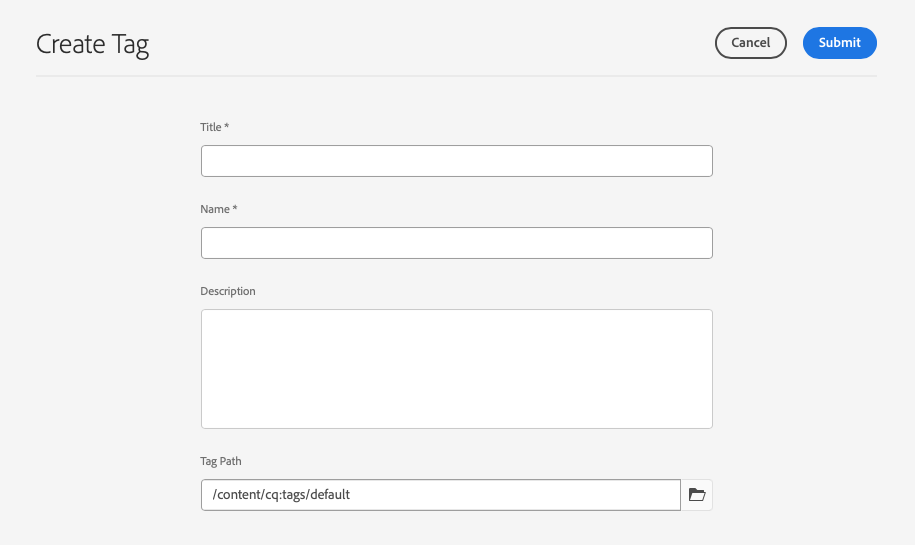

# Administrera taggar {#administering-tags}

Taggar är ett intuitivt sätt att klassificera innehåll. De kan ses som nyckelord eller etiketter (metadata) som gör att innehållet kan hittas snabbare.

I Adobe Experience Manager (AEM) kan en tagg vara en egenskap för:

* En innehållsnod för en sida
   * Mer information finns i dokumentet [Använda taggar](/help/sites-cloud/authoring/sites-console/tags.md).
* En metadatanod för en resurs
   * Mer information finns i dokumentet [Hantera metadata för Digital Assets](/help/assets/manage-metadata.md).

>[!TIP]
>
>Det är bäst att minimera antalet taggar som relaterar till samma idéer. Om du till exempel hanterar innehåll för en utomhusbutik behöver du förmodligen inte ha någon tagg för både **skodon** och **skor**.

## Märkordsfunktioner {#tag-features}

Taggar har robusta funktioner för att ordna och hantera innehåll.

* Taggar kan grupperas i olika namnutrymmen.
   * Namnutrymmen kan tolkas som hierarkier som tillåter att taxonomier skapas.
   * Dessa taxonomier är globala i hela AEM.
* Taggar kan användas av författare och av webbplatsbesökare.
* Oavsett vem som skapat dem blir alla typer av taggar tillgängliga för markering, både när du tilldelar till en sida och när du söker.
* Taggar används av [List Component](https://experienceleague.adobe.com/docs/experience-manager-core-components/using/wcm-components/list.html) för att generera dynamiska listor baserat på de markerade taggarna.

## Märkordskrav {#requirements}

Det finns några tekniska detaljer att tänka på när du skapar och hanterar taggar.

* Taggar måste vara unika inom ett specifikt namnutrymme.
* Namnet på en tagg får inte innehålla taggavgränsare:
   * Kolon (`:`) - Avgränsar namnområdestaggen
   * Snedstreck (`/`) - avgränsar undertaggar
* Om en taggs titel innehåller taggavgränsare kommer de inte att visas i användargränssnittet.
* Taggar kan skapas och deras taxonomi kan ändras av medlemmar i gruppen `tag-administrators` och medlemmar som har ändringsbehörighet till `/content/cq:tags`.
   * En tagg som innehåller underordnade taggar kallas behållartagg.
   * En tagg som inte är en behållartagg kallas för en lövtagg.
   * Ett taggnamnutrymme kan vara antingen en lövtagg eller en behållartagg.

Mer teknisk information om hur taggar fungerar finns i [AEM Tagging Framework](/help/implementing/developing/introduction/tagging-framework.md).

## Taggningskonsolen {#tagging-console}

Taggningskonsolen används för att skapa och hantera taggar och deras taxonomier. Du kan använda taggningskonsolen för att hantera dina taggar genom att:

* Gruppera dem i namnutrymmen.
* Granska användningen av befintliga taggar innan du skapar nya.
* Organisera om taggarna utan att koppla bort taggen från det aktuella innehållet.

Så här kommer du åt taggningskonsolen:

1. Logga in i en redigeringsmiljö med administratörsbehörighet.
1. Välj **`Tools`** > **`General`** >
   **`Tagging`**.

## Skapa nya taggar {#creating-new-tags}

Det finns flera steg för att skapa och använda taggar för att ordna ditt innehåll.

1. [Skapa ett namnutrymme för taggarna](#creating-namespaces) (eller välj ett befintligt som du vill återanvända).
1. [Skapa en ny tagg](#creating-tags).
1. [Publicera taggen](#publishing-tags).

### Skapa namnutrymmen {#creating-namespaces}

Ett namnutrymme används för att ordna andra taggar. Den kan ses som den lägsta nivån av taggen och används vanligtvis för att gruppera andra taggar.

1. Om du vill skapa ett namnområde öppnar du [taggningskonsolen](#tagging-console) och väljer knappen **Skapa** i verktygsfältet och sedan **Skapa namnområde**.

   

1. Tillhandahåll nödvändig information.

   * **Titel** - En rubrik för namnutrymmet som visas för användaren i användargränssnittet (valfritt)
   * **Namn** - Om inget namn anges skapas ett giltigt nodnamn från **Titel**. Mer information finns i dokumentet [AEM Tagging Framework](/help/implementing/developing/introduction/tagging-framework.md#tagid).
   * **Beskrivning** - En beskrivning av namnutrymmet (valfritt)

1. Välj **Skapa** när den obligatoriska informationen har angetts.

Namnutrymmet skapas. I taggningskonsolen finns namnutrymmena på den lägsta nivån (längst till vänster i konsolen) och representeras av mappikoner, som visar deras karaktär som en&quot;behållare&quot; eller gruppering av andra taggar.

Du kan nu [skapa nya taggar](#creating-tags) i det här namnutrymmet eller [hantera befintliga taggar](#managing-tags).

Ett namnutrymme får inte innehålla några undertaggar. Eftersom ett namnutrymme i sig är en tagg kan det användas för att ordna ditt innehåll som vilken annan tagg som helst. Om du vill fortsätta att skapa en strukturerad taggningstaxonomi kan du [skapa undertaggar](#creating-tags) i det namnutrymmet baserat på dina projektkrav.

### Skapa taggar {#creating-tags}

Taggar läggs vanligtvis till i namnutrymmen.

1. Om du vill skapa en tagg öppnar du [taggningskonsolen](#tagging-console).

1. Markera det namnutrymme där du vill skapa taggen. Du kan också markera en annan tagg och skapa en undertagg under den.

1. Markera knappen **Skapa** i verktygsfältet och **Skapa tagg**.

1. Dialogrutan **Skapa tagg** öppnas. Ange nödvändig information för den nya taggen.

   * **Titel** - En visningsrubrik för taggen (krävs)
   * **Namn** - Ett namn för taggen (krävs). Om inget anges skapas ett giltigt nodnamn från **titeln**. Se [TaggID](/help/implementing/developing/introduction/tagging-framework.md#tagid).
   * **Beskrivning** - En beskrivning av taggen
   * **Taggsökväg** - Standardvärdet är det namnutrymme (eller den tagg) som du valde i taggningskonsolen. Du kan uppdatera detta manuellt genom att trycka eller klicka på banväljarikonen.

   

1. Välj **Skicka**.

Taggen skapas och konsolen uppdateras för att visa den nya taggen.

Taggar gör det möjligt att skapa en egen taxonomi som är anpassad efter organisationens behov.

* Du kan skapa underordnade taggar för befintliga taggar genom att markera den överordnade taggen i konsolen innan du skapar den nya taggen.
* Om du skapar en tagg utan att markera ett namnutrymme eller en annan tagg, skapar du effektivt ett namnutrymme.

### Publiceringstaggar {#publishing-tags}

Precis som när du skapar annat innehåll i AEM finns det bara i redigeringsmiljön när du har skapat en tagg (eller namnutrymme). För att dina taggar ska vara tillgängliga för användarna måste du publicera taggarna.

1. Om du vill publicera en tagg öppnar du [taggningskonsolen](#tagging-console).

1. Markera taggen eller taggarna som du vill publicera och välj **Publicera** i verktygsfältet.

   

1. Dialogrutan **Publiceringstagg** innehåller en uppmaning om att bekräfta publiceringen av de markerade taggarna. Välj **Publicera**.

   

1. Publiceringsåtgärden har bekräftats med en **lyckad**-dialogruta.

   

De markerade taggarna står i kö för publicering. Precis som sidinnehåll publiceras bara de markerade taggarna, oavsett om de har undertaggar eller inte.

Om du vill publicera en hel taxonomi (ett namnutrymme och undertaggar) är det bästa sättet att skapa ett [paket](/help/implementing/developing/tools/package-manager.md) av namnutrymmet (se [Taxonomirotnod](/help/implementing/developing/introduction/tagging-framework.md#taxonomy-root-node)).

<!--
Be sure to [apply permissions](#setting-tag-permissions) to the namespace before creating the package.
-->

## Hantera taggar {#managing-tags}

Det finns flera åtgärder som du kan vidta för befintliga taggar och namnutrymmen för att hantera och ordna dem. Välj bara en tagg eller ett namnutrymme i [taggningskonsolen](#tagging-console) för att visa tillgängliga åtgärder i verktygsfältet.

* [Visa egenskaper](#viewing-tag-properties)
* [Redigera](#editing-tags)
* [Avpublicera](#unpublishing-tags)
* [Referenser](#viewing-tag-references)
* [Flytta](#moving-tags)
* [Sammanfoga](#merging-tags)
* [Ta bort](#deleting-tags)

Om det finns tillräckligt med utrymme i verktygsfältet finns det ytterligare alternativ bakom ellipsikonen.

### Visa taggegenskaper {#viewing-tag-properties}

När en enskild tagg, ett namnutrymme eller en annan tagg markeras i taggningskonsolen visas grundläggande information om den markerade taggen, t.ex. tidpunkten för den senaste redigeringen och det senaste dokumentet i kolumnen till vänster om taggkolumnen.

Du kan visa mer information om taggen, inklusive vem som senast publicerade den och när, genom att växla konsolen till vyn **Egenskaper** .

1. Om du vill visa egenskaperna för en tagg öppnar du [taggningskonsolen](#tagging-console).

1. Markera taggen vars egenskaper du vill visa och välj **Egenskaper** i den vänstra listen.

   

1. De detaljerade egenskaperna för den markerade taggen visas i den vänstra listen.

   

Mer information om hur du väljer visningslägen och skenor finns i [Grundläggande hantering](/help/sites-cloud/authoring/basic-handling.md#rail-selector).

### Redigera taggar {#editing-tags}

Taggar och namnutrymmen kan redigeras när de har skapats.

1. Om du vill redigera en tagg öppnar du [taggningskonsolen](#tagging-console).

1. Markera taggen som du vill redigera och välj **Redigera** i verktygsfältet.

1. Gör önskade ändringar. Det går att ändra följande:

   * **Titel**
   * **Beskrivning**
   * [**Lokalisering**](#managing-tags-in-different-languages)

1. När du har redigerat väljer du **Skicka**.

Mer information om hur du lägger till språköversättningar finns i avsnittet [Hantera taggar på olika språk](#managing-tags-in-different-languages).

Om de ändringar du gjorde gällde en redan publicerad tagg kanske du vill [publicera den igen](#publishing-tags).

### Avpublicerar taggar {#unpublishing-tags}

Om du vill inaktivera taggen på författarinstansen och ta bort den från publiceringsinstansen kan du avpublicera den.

1. Om du vill avpublicera en tagg öppnar du [taggningskonsolen](#tagging-console).

1. Markera taggen eller taggarna som du vill avpublicera och välj **Avpublicera** i verktygsfältet.

   

1. Dialogrutan **Avpublicera tagg** innehåller en uppmaning om att bekräfta publiceringen av de markerade taggarna. Välj **Publicera**.

   

1. Avpubliceringsåtgärden har bekräftats med en **lyckad**-dialogruta.

   

De markerade taggarna är köade för borttagning av publicering. Om den markerade taggen är en behållartagg inaktiveras alla dess underordnade taggar i redigeringsmiljön och tas bort från publiceringsmiljön.

### Visa taggreferenser {#viewing-tag-references}

Det kan vara praktiskt att se vilket innehåll en viss tagg används på. Du kan göra detta med vyn **Referenser** i taggningskonsolen.

1. Om du vill visa referenserna för en tagg öppnar du [taggningskonsolen](#tagging-console).

1. Markera taggen vars referenser du vill visa och välj **Referenser** i den vänstra listen.

   

1. Det totala antalet referenser för den markerade taggen visas i den vänstra listen.

   

1. Välj antalet taggreferenser för att visa den detaljerade listan med innehåll som är tilldelat taggen.

   

Hovra musen eller markera ett referensinnehåll i listan för att visa hela sökvägen för innehållet.

Mer information om hur du väljer visningslägen och skenor finns i [Grundläggande hantering](/help/sites-cloud/authoring/basic-handling.md#rail-selector).

### Flytta taggar {#moving-tags}

Du kan behöva rensa upp eller på annat sätt ordna om taggningen genom att flytta en tagg till en ny plats eller byta namn på den.

>[!TIP]
>
>Det är god praxis att endast administratörer får flytta och byta namn på taggar.

1. Om du vill flytta eller byta namn på en tagg öppnar du [taggningskonsolen](#tagging-console).

1. Markera taggen som du vill flytta eller byta namn på och välj **Flytta** i verktygsfältet.

1. Ange vilken egenskap du vill ändra i dialogrutan **Flytta tagg**.

   * **Byt namn till** - Det nya namn du vill ge taggen
      * Det här fältet är förifyllt med taggens aktuella namn.
      * Ändra inte om du bara vill flytta taggen och inte byta namn på den.
   * **Flytta till** - där du vill flytta taggen
      * Det här fältet är förifyllt med taggens aktuella plats.
      * Ändra inte om du bara vill byta namn på taggen och inte flytta den.

   

1. Välj **Skicka**.

Taggens namn ändras och/eller flyttas till den nya platsen. När den markerade taggen är en behållartagg flyttas även alla underordnade taggar om du flyttar taggen.

### Sammanfoga taggar {#merging-tags}

Om taggningstaxonomin innehåller dubbletter eller liknande taggar kan det vara bra att sammanfoga de taggarna. När taggen `A` sammanfogas med taggen `B` blir alla sidor som taggats med taggen `A` taggade med taggen `B` och taggen `A` inte längre tillgängliga för författare.

1. Om du vill sammanfoga två taggar öppnar du [taggningskonsolen](#tagging-console).

1. Markera taggen som du vill sammanfoga i en annan tagg och välj sedan **Sammanfoga** i verktygsfältet.

1. I dialogrutan **Sammanfoga tagg** väljer du ikonen **Bläddra** i fältet **Sammanfoga i** för att ange i vilken tagg du vill sammanfoga den markerade taggen.

   

1. Välj **Skicka**.

Den tagg som valts i konsolen sammanfogas med taggen som anges i dialogrutan. När en refererad tagg flyttas eller sammanfogas tas taggen inte bort fysiskt så att det går att behålla referenser. Mer information finns i [AEM Tagging Framework](/help/implementing/developing/introduction/tagging-framework.md#moving-and-merging-tags).

### Ta bort taggar {#deleting-tags}

Om taxonomin för taggning ändras och en tagg eller ett namnutrymme inte behövs kan den tas bort.

1. Om du vill ta bort en tagg öppnar du [taggningskonsolen](#tagging-console).

1. Markera taggen som du vill ta bort och välj sedan **Ta bort** i verktygsfältet.

1. Dialogrutan **Ta bort tagg** ber om en bekräftelse för att ta bort de markerade taggarna. Välj **Ta bort**.

   

1. AEM kontrollerar att taggen inte refereras.

   1. Om inga referenser hittas ber AEM om en slutgiltig bekräftelse att radera. Välj **Ta bort**

      

   1. Om referenser hittas visas de i AEM och en slutgiltig bekräftelse krävs för att de ska tas bort.

      

De markerade taggarna tas bort permanent från redigeringsmiljön. Om taggen publicerades tas den även bort från publiceringsmiljön. Om den markerade taggen är en behållartagg tas även alla dess underordnade taggar bort.

<!--

## Setting Tag Permissions {#setting-tag-permissions}

Tag permissions are ['secure (by default)'](/help/sites-administering/production-ready.md); a best practice for the publish environment that requires read permission to be explicitly allowed for tags. Bascially, this is done by creating a package of the Tag Namespace after permissions have been set on author, and installing the package on all publish instances.

* on author instance

    * sign in with administrative privileges
    * access the [Security Console](/help/sites-administering/security.md#accessing-user-administration-with-the-security-console),

        * for example, browse to http://localhost:4502/useradmin

    * in the left pane, select the group (or user) for which [read permission](/help/sites-administering/security.md#permissions) is to be granted
    * in the right pane, locate the **Path **to the Tag Namespace

        * for example, `/content/cq:tags/mycommunity`

    * select the `checkbox`in the **Read** column
    * select **Save**

* ensure all publish instances have same permissions

    * one approach is to [create a package](/help/sites-administering/package-manager.md#package-manager) of the namespace on author

        * on `Advanced` tab, for `AC Handling` select `Overwrite`

    * replicate the package

        * choose `Replicate` from package manager

-->

## Hantera taggar på olika språk {#managing-tags-in-different-languages}

Egenskapen `title` för en tagg kan översättas till flera språk. När taggtiteln har översatts kan den visas enligt användar- eller innehållsspråk.

Låt oss anta att vi har en tagg med namnet `Animals` som vi vill översätta till tyska och franska.

1. Öppna [taggningskonsolen](#tagging-console).

1. Markera taggen som du vill översätta och välj sedan **Redigera** i verktygsfältet.

1. I dialogrutan **Redigera tagg** i kolumnen **Lokalisering** väljer du målspråk, till exempel tyska.

1. Ange den översatta titeln i fältet **Tyska** som visas.

1. Upprepa de två föregående stegen för franska.

   

1. Välj **Skicka**.

För innehållssidor hämtas det språk som valts för taggen från sidspråket, om tillgängligt.

I redigeringsmiljön använder AEM dock språkinställningen för användare. I taggningskonsolen för taggen `Animals` visas `Animaux` för en användare som anger språket till franska i sina användaregenskaper.

Om du vill lägga till ett nytt språk i dialogrutan läser du dokumentet [Bygger taggar i AEM-program](/help/implementing/developing/introduction/tagging-applications.md#adding-a-new-language-to-the-edit-tag-dialog)

>[!TIP]
>
>Om du vill veta mer om AEM lokaliseringsfunktioner kan du läsa [Översätta ditt innehåll för flerspråkiga webbplatser](/help/sites-cloud/administering/translation/overview.md).
