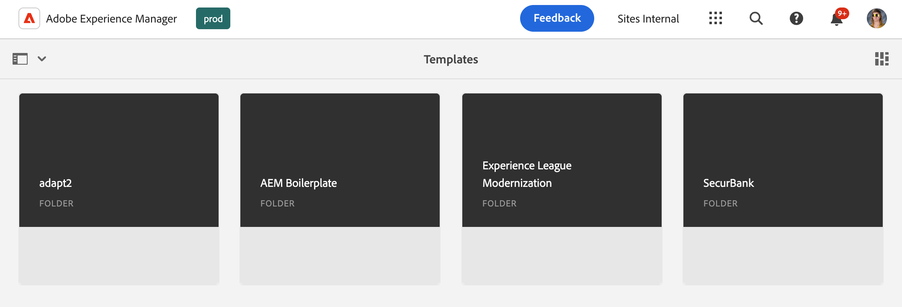

# Mallkonsolen {#templates-console}

Lär dig hur mallkonsolen fungerar som en central plats för att visa och hantera sidmallar.

## Ökning {#overview}

När du skapar en sida måste du välja en mall. Sidmallen används som bas för den nya sidan. [AEM redigerbara mallar](/help/implementing/developing/components/templates.md) kan definiera strukturen för den resulterande sidan, allt ursprungligt innehåll och de komponenter som kan användas (designegenskaper).

Innehållsförfattare får ett urval av tillgängliga mallar när de [skapar nya sidor i webbplatskonsolen](/help/sites-cloud/authoring/sites-console/creating-pages.md). Mallar kan användas för att skapa sidor som kan redigeras med:

* [Sidredigeraren](/help/sites-cloud/authoring/page-editor/templates.md) eller
* [Universell redigerare](/help/sites-cloud/authoring/universal-editor/templates.md)

På mallkonsolen kan en administratör visa och hantera alla sidmallar på en central plats.

## Åtkomst till mallkonsolen {#accessing}

1. Logga in på AEM as a Cloud Service.
1. Öppna den globala navigeringen och välj panelen **Verktyg** och sedan **Allmänt** -> **Mallar**.

## Orientering {#orientation}

Mallkonsolen ordnas i mappar med en mapp per [konfiguration](/help/implementing/developing/introduction/configurations.md) där redigerbara mallar har aktiverats för konfigurationen.

[Konsolens standardvy ](/help/sites-cloud/authoring/quick-start.md) är kortvyn. Tryck eller klicka på en mapp för att utforska dess innehåll.

Välj en mall för att visa de alternativ som är tillgängliga i verktygsfältet.

* [Redigera](#edit-edit)
* [Egenskaper](#properties)
* [Inaktivera/aktivera](#enable-disable)
* [Publicera](#publish)
* [Kopiera](#copy)
* [Ta bort](#delete)

## Redigera {#edit}

När du redigerar en mall öppnas den redigerare som användes för att skapa mallen. Antingen:

* [Mallredigeraren](/help/sites-cloud/authoring/page-editor/templates.md)
* [Universell redigerare](/help/sites-cloud/authoring/universal-editor/templates.md)

Du kan göra nödvändiga ändringar i mallen med valfri redigerare. Observera att redigering av en mall som används kan påverka författarna.

* För mallar som skapats med mallredigeraren kan ändringar påverka aktiva sidor som är baserade på den valda mallen.
* För mallar som har skapats med den universella redigeraren påverkar ändringar endast nya sidor som författarna skapar baserat på den valda mallen.

Om en författare startar en mall som har skapats med mallredigeraren och som redan har aktiverats visas en varning.

>[!TIP]
>
>När du har valt en mall i konsolen använder du snabbtangenten `e` för att redigera den valda mallen.

## Egenskaper {#properties}

Du kan redigera [egenskaperna för mallen](/help/sites-cloud/authoring/page-editor/templates.md) ungefär på samma sätt som du kan [redigera sidegenskaper.Mallegenskaperna för ](/help/sites-cloud/authoring/sites-console/edit-page-properties.md) innehåller:

* Malltitel
* Beskrivning
* Bild

>[!TIP]
>
>När du har valt en mall i konsolen använder du snabbtangenten `p` för att öppna egenskaperna för den valda mallen.

## Aktivera och inaktivera {#enable-disable}

En mall kan ha ett av tre lägen:

* **Utkast** - Mallen skapas fortfarande och är inte tillgänglig för att skapa nya sidor.
* **Aktiverad** - Mallen är färdig och tillgänglig för att skapa nya sidor.
* **Inaktiverad** - Mallen är klar men inte tillgänglig för att skapa nya sidor.

När en mall skapas är den som standard antingen i läget **Utkast** (för mallar som har skapats med [mallredigeraren](/help/sites-cloud/authoring/page-editor/templates.md)) eller i läget **Aktiverad** (för mallar som har skapats med [Universell redigerare](/help/sites-cloud/authoring/universal-editor/templates.md)).

En mall måste aktiveras innan den kan användas av innehållsförfattare för att skapa sidor. Om en mall inte längre behövs kan den inaktiveras så att den inte längre visas i guiden Skapa sida.

* Markera mallen och klicka på **Inaktivera** för att inaktivera mallen.
* Markera mallen och klicka på **Aktivera** för att aktivera mallen.

## Publicering {#publish}

En mall som skapas med mallredigeraren kan bara användas när den har publicerats. Markera mallen och klicka på **Publicera** för att publicera.

Mallar som skapats med Universal Editor behöver inte publiceras för att kunna användas.

## Kopierar {#copy}

Om du har ett antal sidor med liknande struktur kan du använda knappen **Kopiera** för att skapa ett mallomfång och sedan variera kopian utifrån dina behov. Detta är också användbart om du vill använda en mall på en annan plats.

1. Markera mallen och tryck eller klicka sedan på **Kopiera** för att skapa en kopia.
1. Navigera till den plats där du vill skapa kopian.
1. Tryck eller klicka på **Klistra in** i verktygsfältet.

När du har klistrat in kan du:

* [Redigera mallen](#edit) och justera den efter behov.
* [Använd egenskapsfönstret](#properties) för att uppdatera malltiteln.
* [Aktivera mallen](#enable-disable) så att den kan användas för att skapa sidan.
* [Publicera mallen](#publish) om det behövs.

>[!TIP]
>
>När du har valt en mall i konsolen använder du snabbtangenten `Command+c` eller `ctrl+c` för att kopiera den valda mallen.

## Tar bort {#delete}

Om en mall inte längre behövs kan den tas bort, förutsatt att inga sidor refererar till den.

Markera mallen och tryck eller klicka på **Ta bort** för att ta bort den.

>[!TIP]
>
>När du har valt en mall i konsolen använder du snabbtangenten `Backspace` för att ta bort den valda mallen.

## Skapa mallar {#create}

Använd knappen **Skapa** i konsolen för att skapa en ny mall på den aktuella platsen. Mer information om hur du skapar en mall finns i dokumentet [Mallar för att skapa sidor som kan redigeras med sidredigeraren](/help/sites-cloud/authoring/page-editor/templates.md).

Knappen **Skapa** används bara för att skapa mallar som kan redigeras med sidredigeraren. Gå till dokumentet [Mallar för att skapa sidor som är redigerbara med den universella redigeraren](/help/sites-cloud/authoring/universal-editor/templates.md) om du vill veta mer om hur du skapar mallar baserat på sidor som skapats med den universella redigeraren.
