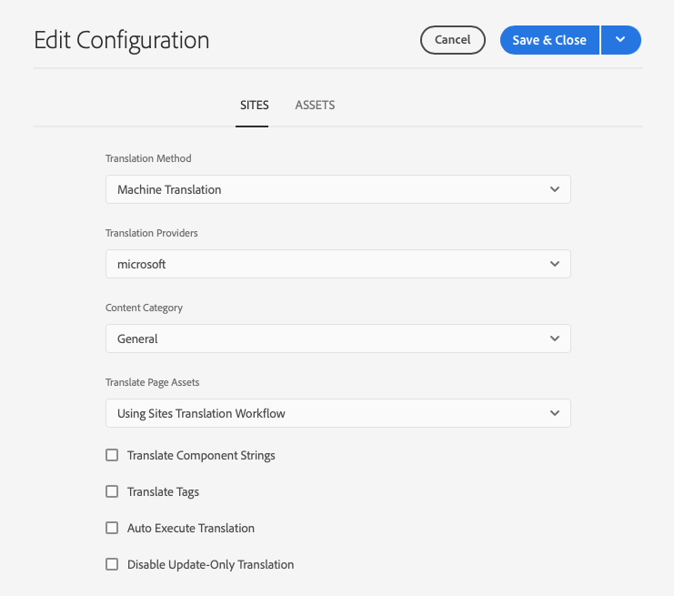

# Konfigurerar översättningsintegreringsramverket {#configuring-the-translation-integration-framework}

Översättningsintegreringsramverket integreras med översättningstjänster från tredje part för att samordna översättningen av AEM. Det handlar om tre grundläggande steg.

1. [Anslut till översättningstjänsten.](#connecting-to-a-translation-service-provider)
1. [Skapa en konfiguration för Translation Integration Framework.](#creating-a-translation-integration-configuration)
1. [Associera molnkonfigurationerna med sidorna.](#configuring-pages-for-translation)

En översikt över funktionerna för översättning av innehåll i AEM finns i [Översätta innehåll för flerspråkiga platser](overview.md).

## Ansluta till en översättningstjänstleverantör {#connecting-to-a-translation-service-provider}

Skapa en molnkonfiguration som ansluter AEM till översättningstjänstleverantören. AEM innehåller möjligheten att [ansluta till Microsoft Translator](connect-ms-translator.md) som standard.

Följande översättningsleverantörer tillhandahåller en implementering av AEM API för översättningsprojekt.

* [Microsoft Translator](connect-ms-translator.md)
* [Translations.com](https://exchange.adobe.com/experiencecloud.details.90104.globallink-connect-plus-for-aem.html)  (Adobe Exchange Premier Partner)
* [Clay Tablet Technologies](https://exchange.adobe.com/experiencecloud.details.90064.clay-tablet-translation-for-experience-manager.html)
* [Lionbridge](https://exchange.adobe.com/experiencecloud.details.100064.lionbridge-connector-for-experience-manager-63.html)
* [Memsource](https://exchange.adobe.com/experiencecloud.details.103166.memsource-connector-for-adobe-experience-manager.html)
* [Molnord](https://exchange.adobe.com/experiencecloud.details.90019.html)
* [CrossLang NV](https://exchange.adobe.com/experiencecloud.details.90049.crosslang-xtm-for-adobe-experience-manager.html)
* [Lingotek](https://exchange.adobe.com/experiencecloud.details.90088.lingotek-collaborative-translation-platform.html)
* [Smartling](https://exchange.adobe.com/experiencecloud.details.90101.smartling-connector-for-adobe-experience-manager.html)
* [SDL](https://exchange.adobe.com/experiencecloud.details.100110.sdl-translation-management.html)
* [Systran](https://exchange.adobe.com/experiencecloud.details.90233.systran-for-adobe-experience-manager.html)

När du har installerat ett anslutningspaket kan du skapa en molnkonfiguration för anslutaren. Vanligtvis måste du ange dina autentiseringsuppgifter för autentisering med översättningstjänsten. Mer information om hur du lägger till en molnkonfiguration för Microsoft Translator-anslutningen finns i [Integrera med Microsoft Translator](connect-ms-translator.md).

Du kan skapa flera molnkonfigurationer för samma anslutning om det behövs. Skapa till exempel en konfiguration för varje konto eller projekt som du har med samma leverantör.

När du har konfigurerat en anslutning kan du skapa den konfiguration av översättningsintegreringsramverket som använder den.

## Skapar en konfiguration för översättningsintegrering {#creating-a-translation-integration-configuration}

Skapa en konfiguration för ramverk för översättningsintegrering som anger hur ditt innehåll ska översättas. Konfigurationen innehåller följande information:

* Vilken översättningstjänstleverantör som ska användas
* Om översättning till människa eller dator ska utföras
* Om annat innehåll som är associerat med en sida eller resurs ska översättas, till exempel taggar

När du har skapat en ramverkskonfiguration associerar du molnkonfigurationen med de sidor som du vill översätta enligt konfigurationen. När översättningsprocessen startas fortsätter översättningsarbetsflödet enligt den associerade ramverkskonfigurationen.

Om olika delar av webbplatsen har olika översättningskrav skapar du flera ramverkskonfigurationer utifrån detta. En flerspråkig webbplats kan till exempel innehålla engelska, spanska och japanska språkkopior. Webbplatsägaren använder två olika översättningstjänstleverantörer för spanska och japanska översättningar. Därför är två konfigurationer av ramverket konfigurerade. Varje konfiguration använder en annan översättningstjänstleverantör.

När du har konfigurerat ett ramverk för översättningsintegrering kan du [associera det med de sidor](preparation.md) som använder det.

>[!TIP]
>
>En översikt över funktionerna för översättning av innehåll i AEM finns i [Översätta innehåll för flerspråkiga platser](overview.md).

En enda konfiguration av ramverket styr hur sidinnehåll och resurser ska översättas.

Så här skapar du en ny översättningskonfiguration:

1. Klicka eller tryck på **Verktyg -> Cloud Services - och översättnings-Cloud Services** på den globala navigeringsmenyn [.](/help/sites-cloud/authoring/getting-started/basic-handling.md#global-navigation)
1. Navigera till den plats där du vill skapa konfigurationen i innehållsstrukturen. Detta baseras ofta på en viss webbplats eller kan vara globalt.
1. Ange följande information i fälten och klicka eller tryck sedan på **Skapa**:
   1. Välj **Konfigurationstyp** i listrutan.
   1. Ange en **titel** för din konfiguration. **Titel** identifierar konfigurationen i **Cloud Servicens**-konsolen samt i listrutan för sidegenskaper.
   1. Du kan också skriva ett **namn** som ska användas för databasnoden som lagrar konfigurationen.
1. Konfigurera egenskaperna på flikarna **Platser** och **Resurser** i fönstret **Redigera konfiguration** och klicka eller tryck på **Spara och stäng**.

### Egenskaper för platskonfiguration {#sites-configuration-properties}

Fliken **Platser** styr hur översättning av sidinnehåll utförs.

| Egenskap | Beskrivning |
|---|---|
| Översättningsarbetsflöde | Den här egenskapen definierar översättningsmetoden som utförs i ramverket för webbplatsinnehåll: - Maskinöversättning: Översättningsprovidern utför översättningen med maskinöversättning i realtid. - mänsklig översättning: Innehållet skickas till översättningsleverantören för översättning av översättare. - Översätt inte: Innehållet skickas inte för översättning. Detta är för att hoppa över vissa innehållsgrenar som inte skulle översättas, men som skulle kunna uppdateras med det senaste innehållet. |
| Översättningsprovider | This property define the translation provider to perform the translation. En provider visas i listan när dess motsvarande koppling är installerad. |
| Innehållskategori | (Endast maskinöversättning) Den här egenskapen är en kategori som beskriver innehållet som du översätter. Kategorin kan påverka valet av terminologi och fraser när innehåll översätts. |
| Översätt taggar | Det här alternativet aktiverar översättning av taggar som är kopplade till sidan. |
| Översätt sidresurser | Den här egenskapen definierar hur resurser som läggs till i komponenter från filsystemet eller som refereras från resurser ska översättas: - Översätt inte: Sidresurser översätts inte. - Använda arbetsflöde för översättning av webbplatser: Resurser hanteras enligt konfigurationsegenskaperna på  **** fliken Platsetestab. - Använda arbetsflöde för översättning av resurser: Resurser hanteras enligt de egenskaper som har konfigurerats på  **** fliken Resurser. |
| Automatisk översättning | Aktivera den här egenskapen för att köra översättningsjobb automatiskt efter att översättningsprojekt har skapats. Du har inte möjlighet att granska och omsluta översättningsjobbet när du väljer det här alternativet. |

### Egenskaper för resurskonfiguration {#assets-configuration-properties}

Resursegenskaperna styr hur resurser konfigureras. Mer information om översättning av resurser finns i [Skapa språkkopior för resurser](/help/assets/translate-assets.md).

| Egenskap | Beskrivning |
|---|---|
| Översättningsarbetsflöde | Den här egenskapen väljer typen av översättning som ramverket utför för resurser: - Maskinöversättning: Översättningsprovidern utför översättningen omedelbart med maskinöversättning. - mänsklig översättning: Innehållet skickas automatiskt till översättningsleverantören för manuell översättning. -Do Not Translate: Resurser skickas inte för översättning. |
| Översättningsprovider | This property define the translation provider to perform the translation. En provider visas i listan när dess motsvarande koppling är installerad. |
| Innehållskategori | (Endast maskinöversättning) Den här egenskapen beskriver innehållet som du översätter. Kategorin kan påverka valet av terminologi och fraser när innehåll översätts. |
| Översätt resurser | Aktivera den här egenskapen för att inkludera resurser i översättningsprojektet. |
| Översätt metadata | Aktivera den här egenskapen för att översätta metadata för resurser. |
| Översätt taggar | Aktivera den här egenskapen för att översätta taggar som är kopplade till resursen. |
| Automatisk översättning | Välj den här egenskapen om du vill köra översättningsjobb automatiskt efter att översättningsprojekt har skapats. Du har inte möjlighet att granska eller omsluta översättningsjobbet när du väljer det här alternativet. |

## Konfigurerar sidor för översättning {#configuring-pages-for-translation}

Om du vill konfigurera översättning av källsidor till andra språk associerar du sidorna med följande molnkonfigurationer:

* Den molnkonfiguration som ansluter AEM till översättningsleverantören.
* Översättningsintegrationsramverket som konfigurerar informationen för översättningen.

Observera att molnkonfigurationen för översättningsintegreringsramverket identifierar den molnkonfiguration som ska användas för att ansluta till tjänstleverantören. När du associerar en källsida med en ramverkets molnkonfiguration måste sidan associeras med tjänstleverantörens molnkonfiguration som används i ramverkets molnkonfiguration.

När du associerar en sida med en molnkonfiguration ärver de underordnade sidorna kopplingen. Om du till exempel associerar sidan `/content/wknd/language-masters/en/magazine` med ett Translation Integration Framework, översätts sidan `magazine` och de underordnade sidorna under den enligt ramverket.

Vid behov kan du åsidosätta associationen på en underordnad sida. Innehållet på en webbplats handlar till exempel mest om resor och livsstil. En av sidorna beskriver dock företaget. I så fall kan webbplatsens rotsida vara kopplad till ett Translation Integration Framework som anger maskinöversättning med kategorin Livsstil, medan den gren som beskriver företaget använder ett ramverk som utför maskinöversättning med kategorin Allmänt.

### Koppla en sida till en översättningsprovider {#associating-a-page-with-a-translation-provider}

Koppla en sida till översättningsleverantören som du använder för att översätta sidan och underordnade sidor.

1. På webbplatskonsolen markerar du sidan som du vill konfigurera och klickar eller trycker på **Visa egenskaper**.
1. Klicka eller tryck på fliken **Cloud Services**.
1. Välj konfigurationen i listrutan **Lägg till konfiguration**.
1. Klicka eller tryck på **Spara och stäng**.

### Associera sidor med ett Translation Integration Framework {#associating-pages-with-a-translation-integration-framework}

Koppla en sida till översättningsintegreringsramverket som definierar hur du vill översätta sidan och underordnade sidor.

1. På webbplatskonsolen markerar du sidan som du vill konfigurera och klickar eller trycker på **Visa egenskaper**.
1. Klicka eller tryck på fliken **Cloud Services**.
1. Välj konfigurationen i listrutan **Lägg till konfiguration**.
1. Klicka eller tryck på **Spara och stäng**.
