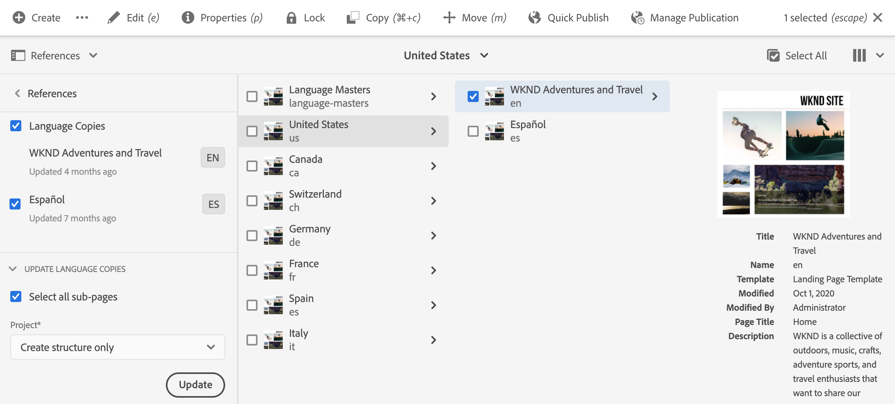
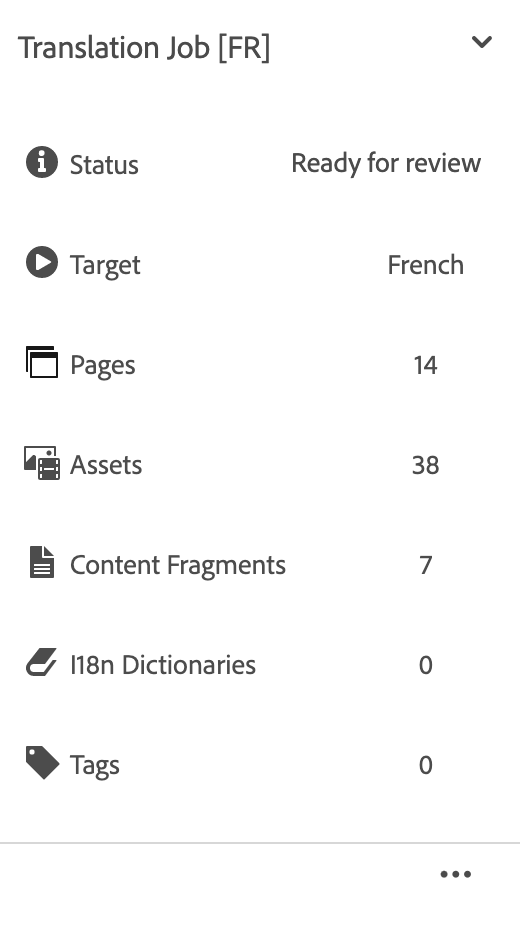

# Hantera översättningsprojekt {#managing-translation-projects}

Med översättningsprojekt kan du hantera översättning av AEM. Ett översättningsprojekt är en typ av AEM [projekt](/help/sites-cloud/authoring/projects/overview.md) som innehåller resurser som ska översättas till andra språk. Dessa resurser är de sidor och resurser i [språkkopiorna](preparation.md) som skapas från överordnad.

När resurser läggs till i ett översättningsprojekt skapas ett översättningsjobb för dem. Jobb innehåller kommandon och statusinformation som du använder för att hantera de mänskliga översättnings- och maskinöversättningsarbetsflödena som körs på resurserna.

Översättningsprojekt är långvariga objekt som definieras av språk och översättningsmetod/leverantör för att anpassas till organisationsstyrning för globalisering. De bör initieras en gång, antingen under den inledande översättningen eller manuellt, och förbli i kraft under innehålls- och översättningsuppdateringen.

Översättningsprojekt och jobb skapas med arbetsflöden för översättningsförberedelser. Dessa arbetsflöden har tre alternativ, både för inledande översättning (Skapa och översätt) och uppdateringar (Uppdatera översättning):

1. [Skapa nytt projekt](#creating-translation-projects-using-the-references-panel)
1. [Lägg till i befintligt projekt](#adding-pages-to-a-translation-project)
1. [Endast innehållsstruktur](#creating-the-structure-of-a-language-copy)

AEM identifierar om ett översättningsprojekt skapas för den inledande översättningen av innehåll eller för att uppdatera redan översatta språkkopior. När du skapar ett översättningsprojekt för en sida och anger vilka språkkopior du översätter för, identifierar AEM om källsidan redan finns i målspråkskopiorna:

* **Språkkopian innehåller inte sidan:** AEM behandlar den här situationen som den inledande översättningen. Sidan kopieras omedelbart till språkkopian och inkluderas i projektet. När den översatta sidan importeras till AEM kopieras AEM den direkt till språkkopian.
* **Språkkopian innehåller redan sidan:** AEM behandlar den här situationen som en uppdaterad översättning. En startsida skapas och en kopia av sidan läggs till i startprogrammet och ingår i projektet. Med det här programmet kan du granska uppdaterade översättningar innan du implementerar dem i språkkopian:

   * När den översatta sidan importeras till AEM, skrivs sidan över vid start.
   * Den översatta sidan skriver bara över språkkopian när startsidan höjs.

Språkroten `/content/wknd/fr` skapas till exempel för den franska översättningen av det överordnad språket `/content/wknd/en`. Det finns inga andra sidor i den franska språkversionen.

* Ett översättningsprojekt skapas för `/content/wknd/en/products`-sidan och alla underordnade sidor med den franska språkkopian som mål. Eftersom språkkopian inte innehåller sidan `/content/wknd/fr/products` kopierar AEM omedelbart `/content/wknd/en/products`-sidan och alla underordnade sidor till den franska språkkopian. Kopiorna ingår också i översättningsprojektet.
* Ett översättningsprojekt skapas för `/content/wknd/en`-sidan och alla underordnade sidor med den franska språkkopian som mål. Eftersom språkkopian innehåller den sida som motsvarar `/content/wknd/en`-sidan (språkroten), AEM kopierar `/content/wknd/en`-sidan och alla underordnade sidor och lägger till dem i en start. Kopiorna ingår också i översättningsprojektet.

## Översättning från platskonsolen {#performing-initial-translations-and-updating-existing-translations}

Översättningsprojekt kan skapas eller uppdateras direkt från webbplatskonsolen.

### Skapa översättningsprojekt med referenspanelen {#creating-translation-projects-using-the-references-panel}

Skapa översättningsprojekt så att du kan köra och hantera arbetsflödet för översättning av språkresurserna på din överordnad. När du skapar projekt anger du sidan på det språk-överordnad som du översätter och de språkkopior som du utför översättningen för:

* Molnkonfigurationen för översättningsintegreringsramverket som är associerat med den valda sidan avgör många egenskaper för översättningsprojekten, till exempel översättningsarbetsflödet som ska användas.
* Ett projekt skapas för varje vald språkkopia.
* En kopia av den valda sidan och associerade resurser skapas och läggs till i varje projekt. Dessa kopior skickas senare till översättningsleverantören för översättning.

Du kan ange att de underordnade sidorna för den markerade sidan också ska vara markerade. I det här fallet läggs kopior av de underordnade sidorna också till i varje projekt så att de översätts. När underordnade sidor är kopplade till olika konfigurationer för översättningsintegreringsramverk skapar AEM ytterligare projekt.

Du kan även [skapa översättningsprojekt](#creating-a-translation-project-using-the-projects-console) manuellt.

### Initiala översättningar och uppdatering av översättningar {#initial-and-updating}

Referenspanelen anger om du uppdaterar befintliga språkkopior eller skapar den första versionen av språkkopiorna. När det finns en språkkopia för den valda sidan visas fliken Uppdatera språkkopior för att ge åtkomst till projektrelaterade kommandon.

Efter översättning kan du [granska översättningen](#reviewing-and-promoting-updated-content) innan du skriver över språkkopian med den. Om det inte finns någon språkkopia för den valda sidan visas fliken Skapa och översätt för att ge åtkomst till projektrelaterade kommandon.

### Skapa översättningsprojekt för en ny språkkopia {#create-translation-projects-for-a-new-language-copy}

1. Använd webbplatskonsolen för att välja sidan som du lägger till i översättningsprojekt.

1. Öppna **Referenser**-listen med verktygsfältet.

   

1. Välj **Språkkopior** och välj sedan de språkkopior som du översätter källsidorna för.
1. Klicka eller tryck på **Skapa och översätt** och konfigurera sedan översättningsjobbet:

   * Använd listrutan **Språk** för att välja en språkkopia som du vill översätta. Välj ytterligare språk efter behov. Språk som visas i listan motsvarar de [språkrötter som du har skapat](preparation.md#creating-a-language-root).
      * Om du väljer flera språk skapas ett projekt med ett översättningsjobb för varje språk.
   * Om du vill översätta den markerade sidan och alla underordnade sidor väljer du **Markera alla underordnade sidor**. Om du bara vill översätta den markerade sidan avmarkerar du alternativet.
   * För **Project** väljer du **Skapa översättningsprojekt**.
   * Om du vill kan du välja **Project Överordnad** välja ett projekt som du vill ärva användarroller och behörigheter från.
   * I **Titel** anger du ett namn för projektet.

   

1. Klicka eller tryck på **Skapa**.

### Skapa översättningsprojekt för en befintlig språkkopia {#create-translation-projects-for-an-existing-language-copy}

1. Använd webbplatskonsolen för att välja sidan som du lägger till i översättningsprojekten.

1. Öppna **Referenser**-listen med verktygsfältet.

   

1. Välj **Språkkopior** och välj sedan de språkkopior som du översätter källsidorna för.
1. Klicka eller tryck på **Uppdatera språkkopior** och konfigurera sedan översättningsjobbet:

   * Om du vill översätta den markerade sidan och alla underordnade sidor väljer du **Markera alla underordnade sidor**. Om du bara vill översätta den markerade sidan avmarkerar du alternativet.
   * För **Project** väljer du **Skapa översättningsprojekt**.
   * Om du vill kan du välja **Project Överordnad** välja ett projekt som du vill ärva användarroller och behörigheter från.
   * I **Titel** anger du ett namn för projektet.

   

1. Klicka eller tryck på **Skapa**.

### Lägga till sidor i ett översättningsprojekt {#adding-pages-to-a-translation-project}

När du har skapat ett översättningsprojekt kan du använda spåret **Resurser** för att lägga till sidor i projektet. Det är praktiskt att lägga till sidor när du inkluderar sidor från olika grenar i samma projekt.

När du lägger till sidor i ett översättningsprojekt inkluderas sidorna i ett nytt översättningsjobb. Du kan också [lägga till sidor i ett befintligt jobb](#adding-pages-assets-to-a-translation-job).

Precis som när du skapar ett nytt projekt läggs kopior av sidorna till i en programstart när det behövs för att undvika att befintliga språkkopior skrivs över. (Se [Skapa översättningsprojekt för befintliga språkkopior](#performing-initial-translations-and-updating-existing-translations).)

1. Använd webbplatskonsolen för att välja sidan som du lägger till i översättningsprojektet.

1. Öppna **Referenser**-listen med verktygsfältet.

   

1. Välj **Språkkopior** och välj sedan de språkkopior som du översätter källsidorna för.

   

1. Klicka eller tryck på **Uppdatera språkkopior** och konfigurera sedan egenskaperna:

   * Om du vill översätta den markerade sidan och alla underordnade sidor väljer du **Markera alla underordnade sidor**. Om du bara vill översätta den markerade sidan avmarkerar du alternativet.
   * För **Projekt** väljer du **Lägg till i befintligt översättningsprojekt**.
   * Välj projektet i **Befintligt översättningsprojekt**.

   >[!NOTE]
   >
   >Målspråket som anges i översättningsprojektet ska matcha sökvägen för språkkopian enligt referenspunkterna.

1. Klicka eller tryck på **Uppdatera**.

### Skapa strukturen för en språkkopia {#creating-the-structure-of-a-language-copy}

Det går bara att skapa strukturen för språkkopian, så att du kan kopiera innehåll och strukturella ändringar på det överordnad språket till (oöversatta) språkversioner. Detta har ingenting med översättningsjobb eller -projekt att göra. Du kan använda detta för att synkronisera dina språkmallsidor, även utan översättning.

Fyll i din språkkopia så att den innehåller innehåll från det överordnad språk som du översätter. Innan du fyller i din språkkopia måste du ha [skapat språkroten](preparation.md#creating-a-language-root) för språkkopian.

1. Använd webbplatskonsolen för att välja språkroten för det överordnad språk som du använder som källa.
1. Öppna referenslisten genom att klicka eller trycka på **Referenser** i verktygsfältet.

   

1. Välj **Språkkopior** och välj sedan de språkkopior som du vill fylla i.

   

1. Klicka eller tryck på **Uppdatera språkkopior** för att visa översättningsverktygen och konfigurera egenskaperna:

   * Välj alternativet **Markera alla undersidor**.
   * För **Projekt** väljer du **Skapa endast struktur**.

   

1. Klicka eller tryck på **Uppdatera**.

### Uppdaterar översättningsminnet {#updating-translation-memory}

Manuella redigeringar av översatt innehåll kan synkroniseras tillbaka till översättningshanteringssystemet (TMS) för att utbilda översättningsminnet.

1. Välj **Uppdatera översättningsminne** i webbplatskonsolen när du har uppdaterat textinnehåll på en översatt sida.
1. I en listvy visas en jämförelse sida vid sida av källan och översättningen för alla textkomponenter som redigerades. Välj vilka översättningsuppdateringar som ska synkroniseras med översättningsminnet och välj **Uppdatera minne**.

AEM skickar tillbaka de markerade strängarna till översättningshanteringssystemet.

### Kontrollerar översättningsstatus för en sida {#check-translation-status}

En egenskap kan väljas i listvyn i webbplatskonsolen som visar om en sida har översatts, är i översättning eller ännu inte har översatts.

1. Växla till listvyn [i platskonsolen.](/help/sites-cloud/authoring/getting-started/basic-handling.md#viewing-and-selecting-resources)
1. Tryck eller klicka på **Visa inställningar** i listrutan för vyn.
1. I dialogrutan kontrollerar du egenskapen **Translated** och trycker eller klickar på **Update**.

Platskonsolen visar nu kolumnen **Översatt** som visar översättningsstatusen för de listade sidorna.

## Hantera översättningsprojekt från projektkonsolen

Många översättningsuppgifter och avancerade alternativ finns i projektkonsolen.

### Om projektkonsolen

Översättningsprojekt i AEM använder standardprojektkonsolen [AEM.](/help/sites-cloud/authoring/projects/overview.md) Om du inte är van vid AEM kan du läsa den dokumentationen.

Som alla andra projekt består ett översättningsprojekt av plattor som ger en översikt över projektuppgifterna.

* **Sammanfattning**  - En översikt över projektet
* **Uppgifter**  - en eller flera översättningsuppgifter
* **Team**  - Användare som samarbetar i översättningsprojektet
* **Uppgifter**  - Objekt som måste slutföras som en del av översättningsarbetet

Använd kommandona och ellipsknapparna längst upp och längst ned på plattorna (respektive) för att komma åt kontroller och alternativ för de olika plattorna.

### Skapa ett översättningsprojekt med projektkonsolen {#creating-a-translation-project-using-the-projects-console}

Du kan skapa ett översättningsprojekt manuellt om du föredrar att använda projektkonsolen i stället för platskonsolen.

När du skapar ett översättningsprojekt manuellt måste du ange värden för följande översättningsrelaterade egenskaper utöver de [grundläggande egenskaperna](/help/sites-cloud/authoring/projects/managing.md#creating-a-project):

* **Namn:** Projektnamn
* **Källspråk:** Källinnehållets språk
* **Målspråk:** Det eller de språk som innehållet översätts till
   * Om du väljer flera språk skapas ett jobb för varje språk i projektet.
* **Översättningsmetod:** Välj  **mänsklig** översättning för att ange att översättningen ska utföras manuellt.

1. Klicka eller tryck på **Create** i verktygsfältet i projektkonsolen.
1. Välj mallen **Översättningsprojekt** och klicka eller tryck sedan på **Nästa**.
1. Ange värden för fliken **Grundläggande**-egenskaper.
1. Klicka eller tryck på **Avancerat** och ange värden för översättningsrelaterade egenskaper.
1. Klicka eller tryck på **Skapa**. Klicka eller tryck på **Klar** i bekräftelserutan för att återgå till projektkonsolen, eller klicka eller tryck på **Öppna projekt** för att öppna och börja hantera projektet.

### Lägga till sidor och resurser i ett översättningsjobb {#adding-pages-assets-to-a-translation-job}

Du kan lägga till sidor, resurser eller taggar i översättningsjobbet för översättningsprojektet. Så här lägger du till sidor eller resurser:

1. Klicka eller tryck på ellipsen längst ned i översättningsjobbpanelen i översättningsprojektet.

   

1. I nästa fönster klickar eller trycker du på knappen **Lägg till** i verktygsfältet och väljer sedan **Resurser/Sidor**.

   

1. I det modala fönstret markerar du det översta objektet i grenen som du vill lägga till och klickar eller trycker sedan på bockmarkeringsikonen. Flerval är aktiverat i det här fönstret.

   

1. Du kan också välja sökikonen för att enkelt söka efter sidor eller resurser som du vill lägga till i översättningsjobbet.

   

1. Tryck eller klicka på **Välj** när du har markerat. Dina sidor och/eller resurser läggs till i översättningsjobbet.

>[!TIP]
>
>Den här metoden lägger till sidor/resurser och deras underordnade sidor i projektet. Välj **Resurs/sida (utan underordnade)** om du bara vill lägga till överordnade objekt.

### Lägga till taggar i ett översättningsjobb {#adding-tags-to-a-translation-job}

Du kan lägga till taggar i ett översättningsprojekt som liknar [hur du lägger till resurser och sidor i ett projekt.](#adding-pages-assets-to-a-translation-job) Välj bara  **** Taggar under  **** menyn Lägg till och följ sedan samma steg.

### Information om visningsprojekt {#seeing-translation-project-details}

Översättningsprojektegenskaperna är tillgängliga via ellipsknappen i sammanfattningsrutan för projektet. Förutom den allmänna [projektinformationen](/help/sites-cloud/authoring/projects/overview.md#project-info) innehåller översättningsprojektegenskaperna översättningsspecifika.

Klicka eller tryck på ellipsen längst ned i översättningssammanfattningsrutan i översättningsprojektet. De flesta projektspecifika egenskaper finns på fliken **Avancerat**.

* **Källspråk:** Språket för de sidor som översätts
* **Målspråk:** Det eller de språk som sidorna översätts till
* **molnkonfiguration:** Molnkonfigurationen för översättningstjänstkopplingen som används för projektet
* **Översättningsmetod:** Översättningsarbetsflödet, antingen  **mänsklig** översättning eller  **maskinöversättning**
* **Översättningsprovider:** Översättningstjänstleverantören som utför översättningen
* **Innehållskategori:** (Maskinöversättning) Innehållskategorin som används för översättning
* **Autentiseringsuppgifter för översättningsprovider:** De autentiseringsuppgifter som ska loggas in i providern
* **Befordra översättningsstarter automatiskt:** När översatt innehåll har tagits emot befordras översättningsstarter automatiskt
   * **Ta bort Starta efter erbjudande:** Om översättningsstarter befordras automatiskt tar du bort starten efter befordran
* **Godkänn översättningar automatiskt:** När översatt innehåll har tagits emot godkänns översättningsjobb automatiskt
* **Upprepa översättning:** Konfigurera återkommande körning av ett översättningsprojekt genom att välja den frekvens som projektet automatiskt skapar och kör översättningsjobb

När ett projekt skapas med referenslinjen för en sida, konfigureras dessa egenskaper automatiskt baserat på källsidans egenskaper.

### Övervaka status för ett översättningsjobb {#monitoring-the-status-of-a-translation-job}

Översättningsjobbpanelen i ett översättningsprojekt anger status för ett översättningsjobb samt antalet sidor och resurser i jobbet.

I följande tabell beskrivs varje status som ett jobb eller ett objekt i jobbet kan ha:

| Status | Beskrivning |
|---|---|
| **Utkast** | Översättningsjobbet har inte startats. Översättningsjobb har statusen **Utkast**** när de skapas. |
| **Skickat** | Filer i översättningsjobbet har den här statusen när de har skickats till översättningstjänsten. Den här statusen kan inträffa efter att kommandot **Begär scope** eller kommandot **Start** har utfärdats. |
| **Begärt omfång** | Filerna i jobbet har skickats till översättningsleverantören för omfång för det mänskliga översättningsarbetsflödet. Den här statusen visas efter att kommandot **Begäransomfång** har utfärdats. |
| **Omfånget har slutförts** | Leverantören har omfattat översättningsjobbet. |
| **Bekräftat för översättning** | Projektägaren har accepterat omfattningen. Den här statusen anger att översättningsleverantören ska börja översätta filerna i jobbet. |
| **Översättning pågår** | För ett jobb är översättningen av en eller flera filer i jobbet inte slutförd än. För ett objekt i jobbet översätts objektet. |
| **Översatt** | För ett jobb är översättningen av alla filer i jobbet slutförd. För ett objekt i jobbet översätts objektet. |
| **Klar för granskning** | Objektet i jobbet översätts och filen har importerats till AEM. |
| **Slutförd** | Projektägaren har angett att översättningskontraktet är slutfört. |
| **Avbryt** | Anger att översättningsleverantören ska sluta arbeta med ett översättningsjobb. |
| **Feluppdatering** | Ett fel uppstod när filer överfördes mellan AEM och översättningstjänsten. |
| **Okänt läge** | Ett okänt fel har inträffat. |

Om du vill visa status för varje fil i jobbet klickar eller trycker du på ellipsen längst ned i rutan.

### Ange förfallodatum för översättningsjobb {#setting-the-due-date-of-translation-jobs}

Ange det datum före vilket översättningsleverantören måste returnera översatta filer. Inställningen av förfallodatumet fungerar bara korrekt när översättningsleverantören som du använder har stöd för den här funktionen.

1. Klicka eller tryck på ellipsen längst ned i översättningssammanfattningsrutan.

   

1. På fliken **Grundläggande** använder du datumväljaren för egenskapen **Förfallodatum** för att välja förfallodatum.

   

1. Klicka eller tryck på **Spara och stäng**.

### Omfång för ett översättningsjobb {#scoping-a-translation-job}

Använd ett översättningsjobb för att få en uppskattning av översättningskostnaden från din översättningstjänstleverantör. När du omsluter ett jobb skickas källfiler till översättningsleverantören som jämför texten med deras pool med lagrade översättningar (översättningsminne). Vanligtvis är omfattningen antalet ord som måste översättas.

Kontakta översättningsleverantören om du vill ha mer information om omfångsresultat.

>[!NOTE]
>
>Omfattningen är valfri och gäller endast för mänsklig översättning. Du kan starta ett översättningsjobb utan omfång.

När du omsluter ett översättningsjobb är jobbets status **Begärt scope**. När översättningsleverantören returnerar omfånget ändras statusen till **Omfånget slutfört**. När omfånget är klart kan du använda kommandot **Visa omfång** för att granska omfångsresultaten.

Omfånget fungerar bara korrekt när den översättningsleverantör som du använder har stöd för den här funktionen.

1. Öppna översättningsprojektet i projektkonsolen.
1. Tryck eller klicka på kommandomenyn på översättningsjobbets titel och tryck eller klicka sedan på **Begär scope**.
1. När jobbstatusen ändras till **Scope Completed** klickar eller trycker du på kommandomenyn och sedan på eller trycker på **Visa scope**.

### Startar översättningsjobb {#starting-translation-jobs}

Starta ett översättningsjobb för att översätta källsidorna till målspråket. Översättningen utförs enligt egenskapsvärdena för översättningssammanfattningsrutan.

Du kan starta ett enskilt jobb inifrån projektet.

1. Öppna översättningsprojektet i projektkonsolen.
1. Klicka eller tryck på kommandomenyn på översättningsjobbpanelen och klicka eller tryck sedan på **Start**.
1. Klicka eller tryck på **Stäng** i åtgärdsdialogrutan som bekräftar början av översättningen.

När du har startat översättningsjobbet visas översättningsjobbpanelen med statusen **Pågår**.

Du kan också starta alla översättningsjobb för ett projekt.

1. Välj översättningsprojektet i projektkonsolen.
1. Tryck eller klicka på **Starta översättningsjobb** i verktygsfältet.
1. Granska listan över jobb som ska startas i dialogrutan och bekräfta sedan med **Start** eller avbryt med **Avbryt**.

### Avbryter ett översättningsjobb {#canceling-a-translation-job}

Avbryt ett översättningsjobb om du vill stoppa översättningsprocessen och förhindra att översättningsleverantören utför fler översättningar. Du kan avbryta ett jobb när jobbet har statusen **Bekräftat för översättning** eller **Pågående översättning**.

1. Öppna översättningsprojektet i projektkonsolen.
1. Klicka eller tryck på kommandomenyn på översättningsjobbpanelen och klicka eller tryck sedan på **Avbryt**.
1. Klicka eller tryck på **OK** i åtgärdsdialogrutan som bekräftar att översättningen har avbrutits.

### Acceptera och ignorera arbetsflöde {#accept-reject-workflow}

När innehållet kommer tillbaka efter översättning och har statusen **Klart för granskning** kan du gå in i översättningsjobbet och acceptera/avvisa innehåll.

Om du väljer **Avvisa översättning** kan du lägga till en kommentar.

Om du avvisar innehåll skickas det tillbaka till översättningsleverantören där de kan se kommentaren.

### Slutför och arkiverar översättningsjobb {#completing-and-archiving-translation-jobs}

Slutför ett översättningsjobb när du har granskat de översatta filerna från leverantören.

1. Öppna översättningsprojektet i projektkonsolen.
1. Klicka eller tryck på kommandomenyn på översättningsjobbpanelen och klicka eller tryck sedan på **Complete**.
1. Jobbet har nu statusen **Fullständigt**.

För mänskliga översättningsarbetsflöden anger en översättning för leverantören att översättningsavtalet har uppfyllts och att de bör spara översättningen till sitt översättningsminne.

Arkivera ett översättningsjobb när det är klart och du behöver inte längre se jobbstatusinformation.

1. Öppna översättningsprojektet i projektkonsolen.
1. Klicka eller tryck på kommandomenyn på översättningsjobbpanelen och klicka eller tryck sedan på **Arkiv**.

När du arkiverar jobbet tas översättningsjobbpanelen bort från projektet.

## Granska och använda översatt innehåll {#reviewing-and-promoting-updated-content}

Du kan använda webbplatskonsolen för att granska innehåll, jämföra språkkopior och aktivera innehållet.

### Befordrar uppdaterat innehåll {#promoting-updated-content}

När innehåll översätts för en befintlig språkkopia granskar du översättningarna, gör ändringar om det behövs och höjer sedan översättningarna så att de flyttas till språkkopian. Du kan granska översatta filer när översättningsjobbet visar statusen **Klar för granskning**.

1. Markera sidan på överordnad, klicka eller tryck på **Referenser** och klicka eller tryck sedan på **Språkkopior**.
1. Klicka på eller tryck på den språkkopia som du vill granska.

   

1. Klicka eller tryck på **Starta** för att visa startrelaterade kommandon.

   

1. Klicka på **Öppna sidan** för att öppna startkopian av sidan för att granska och redigera innehållet.
1. När du har granskat innehållet och gjort nödvändiga ändringar kan du befordra startkopian genom att klicka på **Befordra**.
1. På sidan **Promote Launch** anger du vilka sidor som ska befordras och klickar eller trycker sedan på **Promote**.

### Jämför språkkopior {#comparing-language-copies}

Så här jämför du språkkopior med överordnad:

1. Gå till den språkkopia som du vill jämföra i webbplatskonsolen.
1. Öppna [Referenslisten.](/help/sites-cloud/authoring/getting-started/basic-handling.md#references)
1. Under rubriken **Kopior** väljer du **Språkkopior.**
1. Markera den specifika språkkopian och klicka sedan på **Jämför med Överordnad** eller **Jämför med föregående** om tillämpligt.

   

1. De två sidorna (start och källa) öppnas sida vid sida.
   * Mer information om hur du använder den här funktionen finns i [Sidskillnad](/help/sites-cloud/authoring/features/page-diff.md).

## Importera och exportera översättningsjobb {#import-export}

Även om AEM erbjuder ett antal översättningslösningar och gränssnitt går det också att importera och exportera översättningsjobbinformation manuellt.

### Exportera ett översättningsjobb {#exporting-a-translation-job}

Du kan hämta innehållet i ett översättningsjobb, till exempel för att skicka till en översättningsleverantör som inte är integrerad med AEM via en koppling, eller för att granska innehållet.

1. Klicka på eller tryck på **Exportera** i den nedrullningsbara menyn för översättningsjobbpanelen.
1. Klicka eller tryck på **Hämta exporterad fil** i dialogrutan och använd vid behov webbläsardialogrutan för att spara filen.
1. Klicka eller tryck på **Stäng** i dialogrutan.

### Importerar ett översättningsjobb {#importing-a-translation-job}

Du kan importera översatt innehåll till AEM, till exempel när översättningsleverantören skickar det till dig eftersom de inte är integrerade med AEM via en koppling.

1. Klicka eller tryck på **Importera** i översättningsjobbpanelens nedrullningsbara meny.
1. Använd webbläsarens dialogruta för att markera filen som ska importeras.
1. Klicka eller tryck på **Stäng** i dialogrutan.
