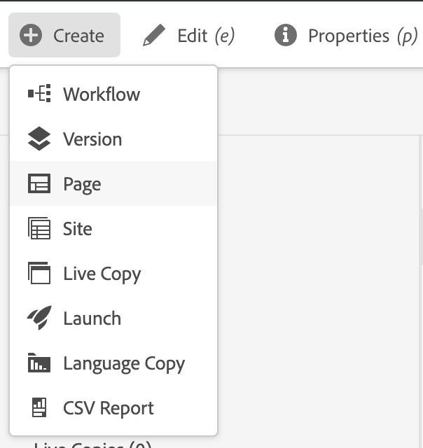

# Förbereder innehåll för översättning {#preparing-content-for-translation}

Flerspråkiga webbplatser har i allmänhet en viss mängd innehåll på flera språk. Webbplatsen är skriven på ett språk och sedan översatt till andra språk. Vanligtvis består flerspråkiga webbplatser av sidgrenar, där varje gren innehåller webbplatsens sidor på ett annat språk.

[WKND-självstudiewebbplatsen](/help/implementing/developing/introduction/develop-wknd-tutorial.md) innehåller flera språkgrenar och använder följande struktur:

```text
/content
    |- wknd
        |- language-masters
            |- en
            |- de
            |- es
            |- fr
            |- it
        |- us
            |- en
            |- es
        |- ca
            |- en
            |- fr
        |- ch
            |- de
            |- fr
            |- it
        |- de
            |- de
        |- fr
            |- fr
        |- es
            |- es
        |- it
            |- it
```

Den språkkopia som du ursprungligen skapade webbplatsinnehållet för är överordnad. Överordnad språk är källan som översätts till andra språk.

Varje språkgren på en webbplats kallas för en språkkopia. Rotsidan för en språkkopia, som kallas språkroten, identifierar språket för innehållet i språkkopian. `/content/wknd/fr` är t.ex. språkroten för den franska språkkopian. Språkkopior måste använda en [korrekt konfigurerad språkrot](preparation.md#creating-a-language-root) så att rätt språk används när översättningar av en källplats utförs.

Gör så här för att förbereda webbplatsen för översättning:

1. Skapa språkroten för din överordnad. Exempelvis är språkroten för den engelska demowebbplatsen WKND `/content/wknd/language-masters/en`. Kontrollera att språkroten är korrekt konfigurerad enligt informationen i [Skapa en språkrot](preparation.md#creating-a-language-root).
1. Skriv innehåll på ditt språk överordnad.
1. Skapa språkroten för varje språkkopia för webbplatsen. Den franska språkkopian av WKND-exempelwebbplatsen är till exempel `/content/wknd/language-masters/fr`.

När du har förberett innehållet för översättning kan du automatiskt skapa saknade sidor i dina språkkopior och tillhörande översättningsprojekt. (Se [Skapa ett översättningsprojekt](managing-projects.md).) En översikt över innehållsöversättningsprocessen i AEM finns i [Översätta innehåll för flerspråkiga webbplatser](overview.md).

## Skapar en språkrot {#creating-a-language-root}

Skapa en språkrot som rotsida för en språkkopia som identifierar språket i innehållet. När du har skapat språkroten kan du skapa översättningsprojekt som innehåller språkkopian.

Om du vill skapa språkroten skapar du en sida och använder en ISO-språkkod som värde för egenskapen **Namn**. Språkkoden måste ha något av följande format:

* `<language-code>` - Den språkkod som stöds är en kod med två bokstäver som definieras av ISO-639-1, till exempel  `en`.
* `<language-code>_<country-code>` eller  `<language-code>-<country-code>` - Den landskod som stöds är en gemen- eller versal tvåbokstavskod enligt definitionen i ISO 3166, till exempel  `en_US`,  `en_us`,  `en_GB`,  `en-gb`.

Du kan använda båda formaten enligt den struktur som du har valt för den globala platsen.  Rotsidan för den franska språkkopian av WKND-webbplatsen har till exempel `fr` som egenskapen **Namn**. Observera att egenskapen **Namn** används som namn på sidnoden i databasen och därför bestämmer sökvägen till sidan (`http://<host>:<4502>/content/wknd/language-masters/fr.html`).

1. Navigera till webbplatser.
1. Klicka på eller tryck på den webbplats där du vill skapa en språkkopia.
1. Klicka eller tryck på **Skapa** och sedan på **Sida**.

   

1. Markera sidmallen och klicka eller tryck sedan på **Nästa**.
1. I fältet **Namn** skriver du landskoden i formatet `<language-code>` eller `<language-code>_<country-code>`, till exempel `en`, `en_US`, `en_us`, `en_GB`, `en_gb`. Skriv en rubrik för sidan.

   

1. Klicka eller tryck på **Skapa**. I bekräftelsedialogrutan klickar eller trycker du på **Done** för att gå tillbaka till Sites console eller **Open** för att öppna språkkopian.

## Se språkrotens status {#seeing-the-status-of-language-roots}

AEM innehåller en **referens**-räl som visar en lista över språkrötter som har skapats.


Använd följande procedur för att visa språkkopiorna för en sida med [spårväljaren.](/help/sites-cloud/authoring/getting-started/basic-handling.md#rail-selector)

1. På webbplatskonsolen markerar du en sida på webbplatsen och klickar eller trycker på **References**.

   

1. Klicka eller tryck på **Språkkopior** i referensfältet. Rälsen visar webbplatsens språkkopior.

## Språkkopior på flera nivåer {#multiple-levels}

Språkrötter kan också grupperas under noder, till exempel efter region, samtidigt som de fortfarande identifieras som rötter i språkkopior.

```text
/content
    |- wknd
        |- language-masters
            |- europe
                |- de
                |- fr
                |- it
                |- es
                ]- pt
            |- americas
                |- en
                |- es
                |- fr
                |- pt
            |- asia
                |- ...
            |- africa
                |- ...
            |- oceania
                |- ...
        |- europe
        |- americas
        |- asia
        |- africa
        |- oceania            
```

>[!NOTE]
>
>Endast en nivå tillåts. Följande tillåter till exempel inte att sidan `es` tolkas som en språkkopia:
>
>* `/content/wknd/language-masters/en`
>* `/content/wknd/language-masters/americas/central-america/es`

>
> 
Denna `es`-språkkopia kommer inte att identifieras eftersom den ligger två nivåer (`americas/central-america`) utanför `en`-noden.

>[!TIP]
>
>I sådana fall kan språkrörelser ha vilket sidnamn som helst, i stället för bara språkets ISO-kod. AEM kontrollerar alltid sökvägen och namnet först, men om sidnamnet inte identifierar något språk AEM egenskapen `cq:language` på sidan för att se om det finns en språkidentifiering.
