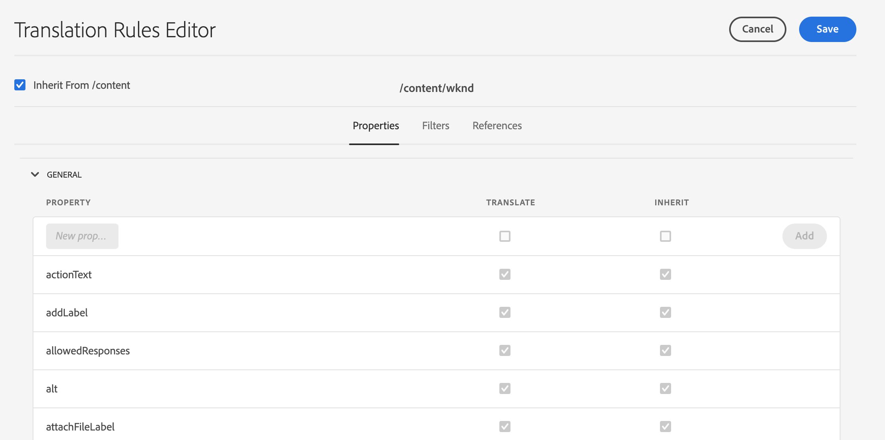

# Identifiera innehåll som ska översättas {#identifying-content-to-translate}

Översättningsregler identifierar innehållet som ska översättas för sidor, komponenter och resurser som ingår i, eller utesluts från, översättningsprojekt. När en sida eller resurs översätts extraherar AEM innehållet så att det kan skickas till översättningstjänsten.

Sidor och resurser representeras som noder i JCR-databasen. Innehållet som extraheras är ett eller flera egenskapsvärden för noderna. Översättningsregler identifierar de egenskaper som innehåller innehållet som ska extraheras.

Översättningsreglerna uttrycks i XML-format och lagras på följande platser:

* `/libs/settings/translation/rules/translation_rules.xml`
* `/apps/settings/translation/rules/translation_rules.xml`
* `/conf/global/settings/translation/rules/translation_rules.xml`

Filen gäller för alla översättningsprojekt.

Reglerna innehåller följande information:

* Sökvägen till noden som regeln gäller för
   * Regeln gäller även för nodens underordnade noder.
* Namnen på nodegenskaperna som innehåller innehållet som ska översättas
   * Egenskapen kan vara specifik för en viss resurstyp eller för alla resurstyper.

Du kan till exempel skapa en regel som översätter innehållet som författare lägger till i alla textkomponenter på sidorna. Regeln kan identifiera noden `/content` och egenskapen `text` för komponenten `core/wcm/components/text/v2/text`.

Det finns en [konsol](#translation-rules-ui) som har lagts till för att konfigurera översättningsregler. Definitionerna i användargränssnittet fyller i filen åt dig.

En översikt över funktionerna för översättning av innehåll i AEM finns i [Översätta innehåll för flerspråkiga platser](overview.md).

>[!NOTE]
>
>AEM har stöd för 1:1-mappning mellan resurstyper och referensattribut för översättning av refererat innehåll på en sida.

## Regelsyntax för sidor, komponenter och resurser {#rule-syntax-for-pages-components-and-assets}

En regel är ett `node`-element med ett eller flera underordnade `property`-element och noll eller flera underordnade `node`-element:

```xml
<node path="content path">
          <property name="property name" [translate="false"]/>
          <node resourceType="component path" >
               <property name="property name" [translate="false"]/>
          </node>
</node>
```

Var och en av dessa `node`-element har följande egenskaper:

* Attributet `path` innehåller sökvägen till rotnoden för grenen som reglerna gäller för.
* Underordnade `property`-element identifierar de nodegenskaper som ska översättas för alla resurstyper:
   * Attributet `name` innehåller egenskapsnamnet.
   * Det valfria attributet `translate` är lika med `false` om egenskapen inte är översatt. Som standard är värdet `true`. Det här attributet är användbart när du åsidosätter tidigare regler.
* Underordnade `node`-element identifierar de nodegenskaper som ska översättas för specifika resurstyper:
   * Attributet `resourceType` innehåller sökvägen som matchar komponenten som implementerar resurstypen.
   * Underordnade `property`-element identifierar nodegenskapen som ska översättas. Använd den här noden på samma sätt som de underordnade `property`-elementen för nodregler.

Följande exempelregel gör att innehållet i alla `text`-egenskaper översätts för alla sidor under noden `/content`. Regeln gäller för alla komponenter som lagrar innehåll i en `text`-egenskap, till exempel textkomponenten.

```xml
<node path="/content">
          <property name="text"/>
</node>
```

I följande exempel översätts innehållet i alla `text`-egenskaper och även andra egenskaper i bildkomponenten översätts. Om andra komponenter har egenskaper med samma namn gäller regeln inte för dem.

```xml
<node path="/content">
      <property name="text"/>
      <node resourceType="core/wcm/components/image/v2/image">
         <property name="image/alt"/>
         <property name="image/jcr:description"/>
         <property name="image/jcr:title"/>
      </node>
</node>
```

## Regelsyntax för att extrahera resurser från sidor {#rule-syntax-for-extracting-assets-from-pages}

Använd följande regelsyntax för att inkludera resurser som är inbäddade i eller refererade från komponenter:

```xml
<assetNode resourceType="path to component" assetReferenceAttribute="property that stores asset"/>
```

Varje `assetNode`-element har följande egenskaper:

* Ett `resourceType`-attribut som är lika med sökvägen som matchar komponenten
* Ett `assetReferenceAttribute`-attribut som är lika med namnet på egenskapen som lagrar resursens binära (för inbäddade resurser) eller sökvägen till den refererade resursen

I följande exempel extraheras bilder från bildkomponenten:

```xml
<assetNode resourceType="core/wcm/components/image/v2/image" assetReferenceAttribute="fileReference"/>
```

## Åsidosätter regler {#overriding-rules}

Filen `translation_rules.xml` består av ett `nodelist`-element med flera underordnade `node`-element. AEM läser nodlistan uppifrån och ned. När flera regler har samma nod som mål används den regel som är lägre i filen. Följande regler gör till exempel att allt innehåll i `text`-egenskaper översätts förutom för grenen `/content/mysite/en` sidor:

```xml
<nodelist>
     <node path="/content”>
           <property name="text" />
     </node>
     <node path=“/content/mysite/en”>
          <property name=“text” translate=“false" />
     </node>
<nodelist>
```

## Filteregenskaper {#filtering-properties}

Du kan filtrera noder som har en viss egenskap med ett `filter`-element.

Följande regler gör till exempel att allt innehåll i `text`-egenskaper översätts förutom de noder som har egenskapen `draft` inställd på `true`.

```xml
<nodelist>
    <node path="/content”>
     <filter>
   <node containsProperty="draft" propertyValue="true" />
     </filter>
        <property name="text" />
    </node>
<nodelist>
```

## Gränssnitt för översättningsregler {#translation-rules-ui}

Det finns även en konsol för att konfigurera översättningsregler.

Så här kommer du åt den:

1. Navigera till **Verktyg** och **Allmänt**.

1. Välj **Översättningskonfiguration**.

I översättningsregelgränssnittet kan du:

1. **Lägg till kontext**, så att du kan lägga till en bana.

   

1. Använd sökvägsläsaren för att välja önskad kontext och tryck eller klicka på knappen **Bekräfta** för att spara.

   

1. Sedan måste du markera kontexten och sedan klicka på **Redigera**. Då öppnas redigeraren för översättningsregler.

   

Det finns fyra attribut som du kan ändra via gränssnittet:

* `isDeep`
* `inherit`
* `translate`
* `updateDestinationLanguage`

### isDeep {#isdeep}

**`isDeep`**  används på nodfilter och är true som standard. Den kontrollerar om noden (eller dess överordnade noder) innehåller den egenskapen med det angivna egenskapsvärdet i filtret. Om värdet är false kontrolleras endast den aktuella noden.

Underordnade noder läggs till i ett översättningsjobb även om den överordnade noden har egenskapen `draftOnly` inställd på true för att flagga utkastinnehåll. Här visas `isDeep` och kontrollerar om de överordnade noderna har egenskapen `draftOnly` som true och inte de underordnade noderna.

I redigeraren kan du kontrollera/avmarkera **Är lång** på fliken **Filter**.


Här är ett exempel på den resulterande XML-filen när **är djup** inte är markerat i gränssnittet:

```xml
 <filter>
    <node containsProperty="draftOnly" isDeep="false" propertyValue="true"/>
</filter>
```

### ärv {#inherit}

**`inherit`** används för egenskaper. Som standard ärvs alla egenskaper, men om du vill att vissa egenskaper inte ska ärvas av den underordnade kan du markera den här egenskapen som false så att den bara tillämpas på den specifika noden.

I användargränssnittet kan du kontrollera/avmarkera **Inherit** på fliken **Egenskaper**.

### translate {#translate}

**`translate`** används bara för att ange om en egenskap ska översättas eller inte.

I användargränssnittet kan du kontrollera/avmarkera **Translate** på fliken **Properties**.

### updateDestinationLanguage {#updatedestinationlanguage}

**`updateDestinationLanguage`** används för egenskaper som t.ex. inte har text utan språkkoder  `jcr:language`. Användaren översätter inte text utan språkinställningen från källan till målet. Sådana egenskaper skickas inte för översättning.

I användargränssnittet kan du kontrollera/avmarkera **Översätt** på fliken **Egenskaper** om du vill ändra det här värdet, men för de specifika egenskaper som har språkkoder som värde.

För att förtydliga skillnaden mellan `updateDestinationLanguage` och `translate` är det här ett enkelt exempel på en kontext med bara två regler:


Resultatet i xml kommer att se ut så här:

```xml
<property inherit="true" name="text" translate="true" updateDestinationLanguage="false"/>
<property inherit="true" name="jcr:language" translate="false" updateDestinationLanguage="true"/>
```

## Redigera regelfilen manuellt {#editing-the-rules-file-manually}

Filen `translation_rules.xml` som installeras med AEM innehåller en standarduppsättning med översättningsregler. Du kan redigera filen så att den uppfyller översättningsprojektens krav. Du kan till exempel lägga till regler så att innehållet i dina anpassade komponenter översätts.

Om du redigerar filen `translation_rules.xml` ska du spara en säkerhetskopia i ett innehållspaket. Om du installerar om vissa AEM kan den aktuella `translation_rules.xml`-filen ersättas med originalfilen. Om du vill återställa reglerna i den här situationen kan du installera det paket som innehåller säkerhetskopian.

>[!NOTE]
>
>När du har skapat innehållspaketet återskapar du paketet varje gång du redigerar filen.

## Exempel på översättningsregelfil {#example-translation-rules-file}

```xml
<?xml version="1.0" encoding="UTF-8"?><nodelist>
  <node path="/content">
    <property name="addLabel"/>
    <property name="allowedResponses"/>
    <property name="alt"/>
    <property name="attachFileLabel"/>
    <property name="benefits"/>
    <property name="buttonLabel"/>
    <property name="chartAlt"/>
    <property name="confirmationMessageToggle"/>
    <property name="confirmationMessageUntoggle"/>
    <property name="constraintMessage"/>
    <property name="contentLabel"/>
    <property name="denyText"/>
    <property name="detailDescription"/>
    <property name="emptyText"/>
    <property name="helpMessage"/>
    <property name="image/alt"/>
    <property name="image/jcr:description"/>
    <property name="image/jcr:title"/>
    <property name="jcr:description"/>
    <property name="jcr:title"/>
    <property name="heading"/>
    <property name="label"/>
    <property name="main"/>
    <property name="listLabel"/>
    <property name="moreText"/>
    <property name="pageTitle"/>
    <property name="placeholder"/>
    <property name="requiredMessage"/>
    <property name="resetTitle"/>
    <property name="subjectLabel"/>
    <property name="subtitle"/>
    <property name="tableData"/>
    <property name="text"/>
    <property name="title"/>
    <property name="navTitle"/>
    <property name="titleDivContent"/>
    <property name="toggleLabel"/>
    <property name="transitionLabel"/>
    <property name="untoggleLabel"/>
    <property name="name"/>
    <property name="occupations"/>
    <property name="greetingLabel"/>
    <property name="signInLabel"/>
    <property name="signOutLabel"/>
    <property name="pretitle"/>
    <property name="cq:panelTitle"/>
    <property name="actionText"/>
    <property name="cq:language" updateDestinationLanguage="true"/>
    <node pathContains="/cq:annotations">
      <property name="text" translate="false"/>
    </node>
    <node path="/content/wknd"/>
  </node>
  <node path="/content/forms">
    <property name="text" translate="false"/>
  </node>
  <node path="/content/dam">
    <property name="dc:description"/>
    <property name="dc:rights"/>
    <property name="dc:subject"/>
    <property name="dc:title"/>
    <property name="defaultContent"/>
    <property name="jcr:description"/>
    <property name="jcr:title"/>
    <property name="pdf:Title"/>
    <property name="xmpRights:UsageTerms"/>
    <property name="main"/>
    <property name="adventureActivity"/>
    <property name="adventureDescription"/>
    <property name="adventureDifficulty"/>
    <property name="adventureGearList"/>
    <property name="adventureGroupSize"/>
    <property name="adventureItinerary"/>
    <property name="adventurePrice"/>
    <property name="adventureTitle"/>
    <property name="adventureTripLength"/>
    <property name="adventureType"/>
    <node pathContains="/jcr:content/metadata/predictedTags">
      <property name="name"/>
    </node>
  </node>
  <assetNode assetReferenceAttribute="fragmentPath" resourceType="cq/experience-fragments/editor/components/experiencefragment"/>
  <assetNode assetReferenceAttribute="fragmentVariationPath" resourceType="core/wcm/components/experiencefragment/v1/experiencefragment"/>
  <assetNode assetReferenceAttribute="fileReference" resourceType="dam/cfm/components/contentfragment"/>
  <assetNode resourceType="docs/components/download"/>
  <assetNode resourceType="docs/components/image"/>
  <assetNode assetReferenceAttribute="fileReference" resourceType="foundation/components/image"/>
  <assetNode assetReferenceAttribute="asset" resourceType="foundation/components/video"/>
  <assetNode assetReferenceAttribute="fileReference" resourceType="foundation/components/download"/>
  <assetNode assetReferenceAttribute="fileReference" resourceType="core/wcm/components/download/v1/download"/>
  <assetNode assetReferenceAttribute="fileReference" resourceType="wcm/foundation/components/image"/>
  <assetNode assetReferenceAttribute="fragmentPath" resourceType="core/wcm/components/contentfragment/v1/contentfragment"/>
  <assetNode assetReferenceAttribute="fileReference" resourceType="core/wcm/components/image/v2/image"/>
</nodelist>
```
