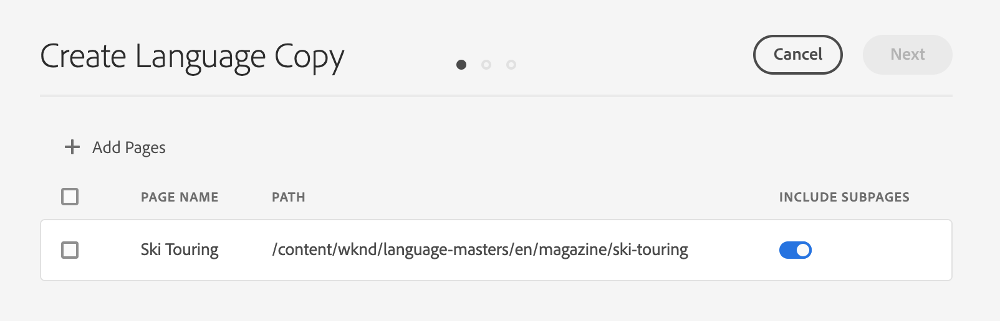
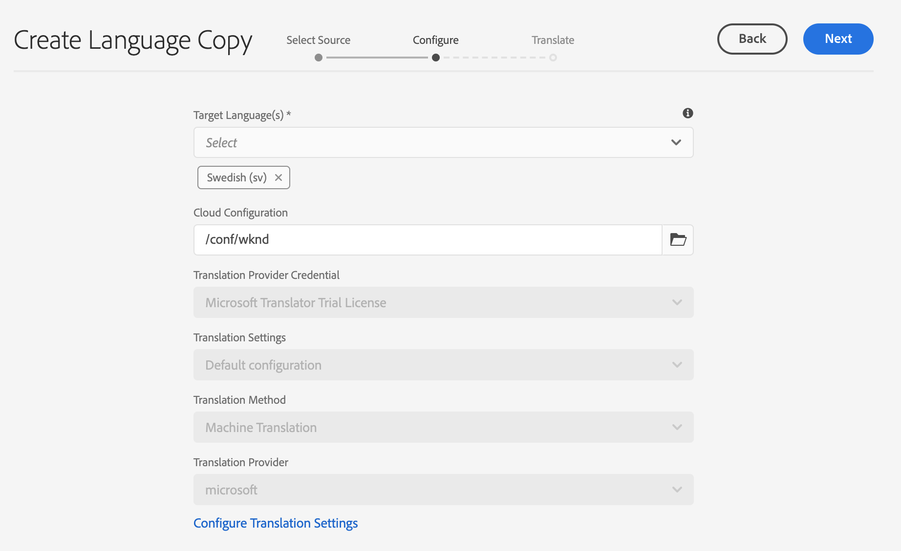

# Guiden för språkkopiering {#language-copy-wizard}

Guiden för språkkopiering är en guidad upplevelse för att skapa och instrumentera en struktur med flerspråkigt innehåll. Guiden gör det enkelt och snabbt att skapa en språkkopia.

>[!NOTE]
>
>Användaren måste vara medlem i `project-administrators`-gruppen för att kunna skapa en språkkopia av en plats.

Så här öppnar du guiden:

1. I webbplatskonsolen markerar du en sida och trycker eller klickar på **Create** och väljer **Language Copy**.

   

1. Guiden öppnas i steget **Välj källa** där du kan lägga till/ta bort sidor. Du kan också välja att ta med eller utesluta undersidor. Markera de sidor som du vill inkludera och tryck eller klicka på **Nästa**.

   

1. Med steget **Konfigurera** i guiden kan du lägga till/ta bort språk och välja översättningsmetod. Tryck eller klicka på **Nästa**.

   

   >[!NOTE]
   >
   >Som standard finns det bara en översättningsinställning. Om du vill kunna välja andra inställningar måste du först konfigurera molnkonfigurationer. Se [Konfigurera översättningsintegreringsramverket](integration-framework.md).

1. I steget **Översätt** i guiden kan du välja mellan att skapa enbart strukturen, skapa ett nytt översättningsprojekt eller lägga till i ett befintligt översättningsprojekt.

   >[!NOTE]
   >
   >Om du valde flera språk i föregående steg skapas flera översättningsprojekt.

   

1. Knappen **Skapa** avslutar guiden. Tryck eller klicka på **Klar** för att stänga guiden eller **Öppna** för att visa det resulterande översättningsprojektet.

   
